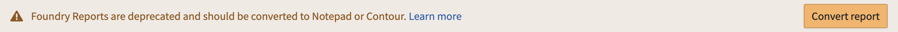
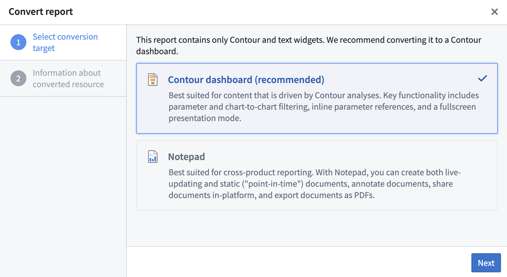
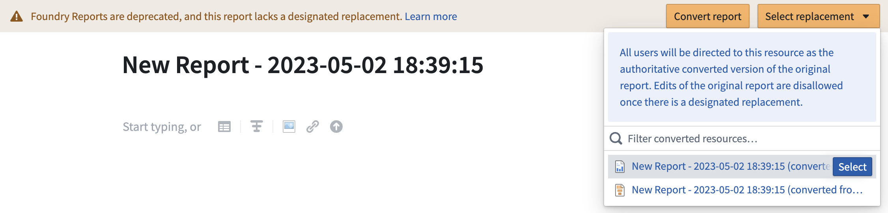
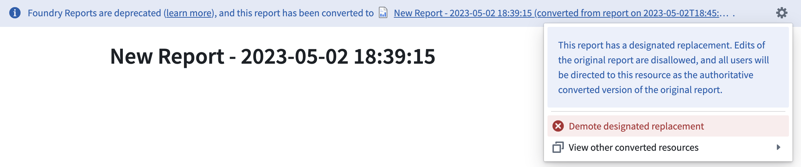

<!-- source: https://palantir.com/docs/foundry/reports/report-conversion/ · mirrored 2026-08-26 from Palantir Foundry docs -->

# Convert legacy Foundry Reports to Contour or Notepad

Legacy Foundry Reports can be converted either to Contour dashboards or Notepad documents.

During the conversion process, the original report will not be deleted, and you can convert the same report multiple times. Legacy reports do not need to be converted unless they require editing.

Once your report has been converted, you have the option to select one of the converted resources as the "designated replacement," which makes it the authoritative converted version of the original report.

## Choosing Contour or Notepad

Foundry Reports will suggest the best tool based on the contents of your report, but you can choose to convert to either Contour dashboards or Notepad documents as described below.

* [**Contour dashboards**](/docs/foundry/contour/dashboards-overview/) are best suited for content that is driven by a Contour analysis. Contour dashboards provide improved interactivity over Reports, with features like chart-to-chart filtering, and an easy drag-and-drop interface to build the dashboard while iterating on the analysis. Contour dashboards also support a fullscreen presentation view and PDF exports. Choose a Contour dashboard if:
  * Your report contains only Contour embeds.
  * Your report uses parameters.
* [**Notepad documents**](/docs/foundry/notepad/overview/) are best suited for cross-product reporting. With Notepad, you can create both live-updating and static ("point-in-time") documents, annotate documents, share documents in-platform, and export documents as PDFs. Choose a Notepad document if:
  * You do not require the interactivity provided by parameters or chart-to-chart filtering.
  * Your report contains embeds that are not supported by Contour dashboards, such as Quiver charts, Code Workbook visualizations, or Object Views. Such reports can still be converted to Contour dashboards, but these widgets will be replaced with links back to their source resources in Foundry.

## Convert a report

Follow the steps below to convert a legacy report (all data used in example images is notional):

1. Open the report in Foundry Reports.

2. Select **Convert report** in the banner at the top of the report.   
      

3. Follow the steps in the report conversion dialog, where you will be guided to choose Contour or Notepad as the conversion target and review your selection.   
      

4. Choose a name and save location for the converted resource.

## Select a designated replacement

After a legacy Foundry Report has been converted to Contour or Notepad at least once, you can access the converted resources from the banner that appears at the top of the original report. You also have the option to select one of these resources to be the designated replacement for the original report.

When a designated replacement has been selected, anyone who opens the original report in the Reports application will see a link to the new Contour dashboard or Notepad document in the banner that appears at the top.

If you change your mind after selecting a designated replacement, you can demote this resource and select another in its place.

