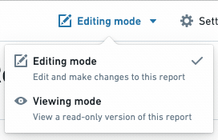

<!-- source: https://palantir.com/docs/foundry/reports/share/ · mirrored 2026-08-26 from Palantir Foundry docs -->

# Share a report with others

To share your report, click the **Share** button at the top right of your report:

Because Foundry is designed to keep any sensitive data secure, you will also need to share the assets inside your report if you want viewers to see them. For example:

* If your report contains **images** or links to **other Foundry files**, make sure your report viewers also have view permissions on those files.
* If your report shows information from a particular **dataset**, your report viewers need view permissions on that dataset.

## Previewing

To preview what others will see when you send them your report, you can switch to reader mode by toggling the **Editing/Viewing mode** button:

:::callout{theme="neutral"}
If your report viewers are unable to view the content of your report after sharing both the report and the underlying dataset/files, use the [Data Lineage](/docs/foundry/data-lineage/overview/) application to determine the user’s resource access and permissions.
:::
