<!-- source: https://palantir.com/docs/foundry/reports/show-and-hide-content/ · mirrored 2026-08-26 from Palantir Foundry docs -->

# Show and hide content

:::callout{theme="neutral"}
This will affect how all editors and viewers see the report.
:::

## Show / hide the report creator

To show or hide the name of the user who created a report:

1. *(If needed)* Switch to Editing mode.

2. Click the **Settings** button in the application header.   
      

3. Click **Show creator name** in the settings menu.   
   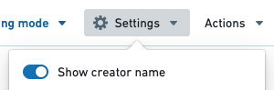   

As a report editor, you can opt to show or hide the creator name above the report title.   
   

## Show / hide the report outline

To show or hide the outline in a report:

1. *(If needed)* Switch to Editing mode.

2. Click the **Actions** button in the application header.   
   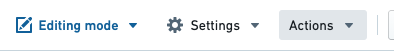   

3. Click **Show outline** in the actions menu.   
   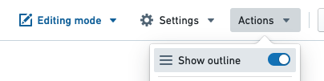   

This will toggle the outline button in the top-right of the report:

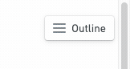

## Show / hide a piece of content's title

To show or hide the title of a piece of content:

1. *(If needed)* Switch to Editing mode.

2. Click the **Settings** cog in top right corner of a piece of content   
   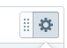   

3. Click **Show title** in the settings menu.   
   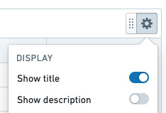   

This will toggle the title above the widget.

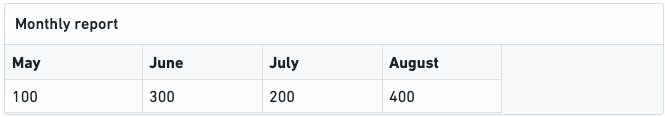

:::callout{theme="neutral"}
Content titles are displayed in the report outline in order to improve navigability.
:::

## Show / hide a piece of content's description

To show or hide the title of a piece of content:

1. *(If needed)* Switch to Editing mode.

2. Click the Settings cog in top right corner of a piece of content   
      

3. Click **Show description** in the settings menu.   
   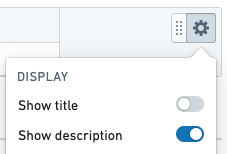   

This will toggle the description below the widget.

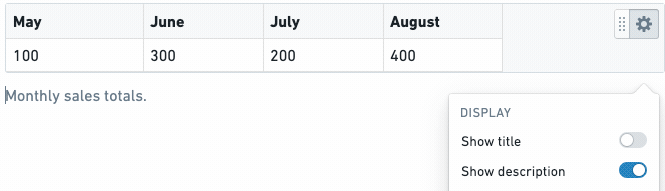

## Display parameters in a toolbar or sidebar

Reports lets you control how report parameters are displayed:

Display parameters in a *sidebar* if you have many parameters and want to display them in a scrollable list.

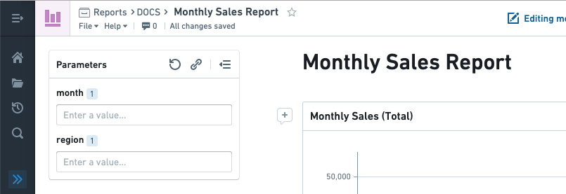

Display parameters in a *toolbar* (along the top) if you only have a few parameters and/or if the report content needs more width to display optimally.

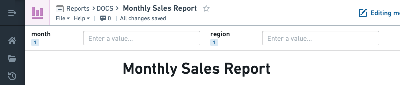

To change how the list of parameters is displayed:

1. Click **Settings** in the application header.   
      

2. Under "Parameters Display", click **Sidebar** or **Toolbar** as needed.   
   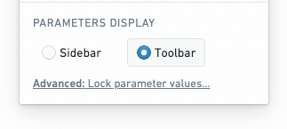   
