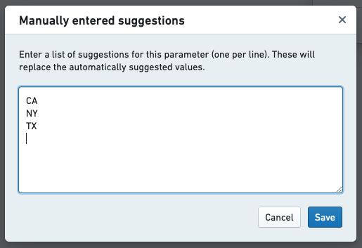
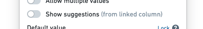

<!-- source: https://palantir.com/docs/foundry/reports/show-suggested-values/ · mirrored 2026-08-26 from Palantir Foundry docs -->

# Show suggested values

Once you have added a parameter to a report (see [Add a parameter from another Foundry application](/docs/foundry/reports/add-parameter/#add-a-parameter-from-another-foundry-application)), you can link it to a dataset to show **suggested values** from a particular column. You can also manually input a list of suggestions to display.

Displaying suggested values makes it easier for report editors and viewers alike to select valid parameter values and learn the range of values that the parameter will understand.

:::callout{theme="neutral"}
Suggested values can be shown for String- and Number-type parameters, but not Date-type parameters.
:::

## Adding suggested values from a dataset

1. *(If needed)* Switch to Editing mode.
2. Click the gear icon next to a parameter to open its Parameter Settings menu.
3. Click **Show suggestions (from linked column)**.
4. Click **Link to values of a column…**, and select a dataset column (if you do not see any columns here, see the [troubleshooting section](#troubleshooting) below). If there are multiple input datasets to the widgets added to the report, scroll down to see columns from all input datasets.
5. Click **Save**.

You should now see a list of suggested values from the dataset column when you click inside the parameter's input field.

## Adding suggested values manually

To add a list of suggested values for a particular parameter without linking it to a dataset, add **Manual Suggestions**.

1. *(If needed)* Switch to Editing mode.

2. **Click the gear icon** next to a parameter to open its Parameter Settings menu.

3. Click **Show suggestions (from linked column)**.

4. Click **Link to values of a column…**, and select a dataset column (if you do not see any columns here, see the [troubleshooting section](#troubleshooting) below).

5. Click **Or enter values manually**.

6. **Enter a list of suggestions**, one suggestion per line.   
      

7. Click **Save** in the Manually entered suggestions dialog.

8. Click **Save** in the Parameter Settings dialog.

You should now see the list of suggested values that you just inputted when you click inside the parameter's input field.

## Removing suggested values

To completely remove suggested values for a particular parameter:

1. *(If needed)* Switch to Editing mode.

2. Click the gear icon next to a parameter to open its Parameter Settings menu.

3. Click **Show suggestions (from linked column)** to disable suggestions:   
      

4. Click **Save**.

You will no longer see a list of suggested values when you click inside the parameter's input field. Instead, you will need to input values manually.

## Troubleshooting

### Not seeing a suggested value that exists in the linked column

You may see a warning sign on your parameter with the error message `Due to a high number of distinct values, the list of suggestions is incomplete. Please choose from the list of precomputed values or enter a new value.`

Reports uses the Foundry Stats service to populate suggested values. For performance reasons, if the linked column has a high number of distinct values, Reports may not show all distinct values in the column. If a particular value does not appear in the list of suggestions, **you can type any value into the parameter dropdown** to use the value anyway. You can contact your Palantir representative to learn more about the Foundry Stats computation limits.

### Not seeing any suggested values after linking to a column

You may experience a delay before seeing suggested values if the backing dataset was recently added or updated. These values are populated via the Foundry Stats service. This problem typically resolves itself after a few minutes.

If you are still experiencing issues, as a next step navigate to the backing dataset and see if statistics are calculated for this dataset. In dataset-app, look at the "Size" field. If there is a link saying **Calculate to view all stats**, click the link, wait for the statistics to calculate and see if suggested values appear in your report. If you continue to experience issues, contact your Palantir representative.

### Not seeing any dataset columns that can be linked

You will need to add at least one data-backed widget to a report before you see suggested dataset columns in Parameter Settings menus. For instance, adding a Contour board to a report (from Contour) will show all columns from all datasets upstream of the Contour board.

### Not seeing columns from a different dataset that can be linked

In the columns dropdown, columns from datasets that back widgets in your report will appear. Imagine you add a chart based on Dataset A to a Report. In a different path, you use Dataset B, but no descendants of Dataset B are added to the report. **Only columns from Dataset A will appear in the suggested values dropdown**. To link the parameter to Dataset B, you can make Dataset B an input into your chart through a join or union. Alternately, you could add a widget that uses Dataset B as an input.

### Dataset uses Row-Level Policy Service but cannot link parameter to a column

If the dataset uses Row-level Policy Service, you cannot link a parameter to a column in that dataset. You can add suggested values manually.

### Linking a parameter to a column with Restricted View

If you are building on a Restricted View, you cannot link a parameter to a column. You can add suggested values manually.
