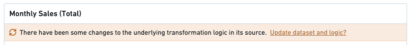
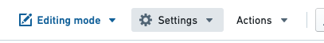
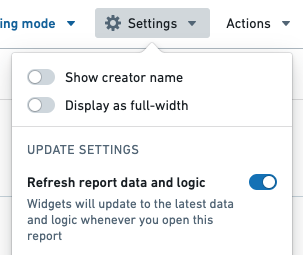
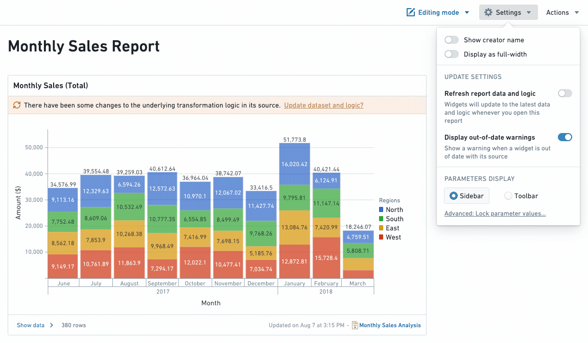
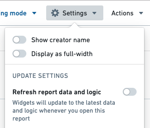

<!-- source: https://palantir.com/docs/foundry/reports/update-data-automatically/ · mirrored 2026-08-26 from Palantir Foundry docs -->

# Update data automatically

## Auto-update data when a report is opened

Reports are live by default, which means that whenever a report is opened, all the charts inside will load the latest data reflected in the underlying Foundry resources.

In order for underlying Contour analyses to automatically update to the latest available data, ensure that the **Refresh analysis data on open** setting is enabled for any Contour analyses used in the Report.

### Refresh a specific widget

If a chart’s data updates while you are viewing or editing the report, or auto-refreshing is turned off, you will see an out-of-date warning on the chart along with an option to refresh the data. Click **Update dataset and logic** to update that specific widget:

### Enable refresh report data and logic

1. *(If needed)* Switch to Editing mode.

2. Click the **Settings** button in the application header.   
      

3. Click **Refresh report data and logic** in the settings menu to toggle refreshing on.   
      

Your report will now refresh all widgets within the report that have updates each time you open your report.

## Disable data updating in a report

To make your report static and show data from a specific point in time, change the **Update settings** of your report:

* When **Display out-of-date warnings** is turned off, you (and viewers of this report) will not see the out of date warning on individual widgets.
* When **Refresh report data and logic** is turned off, the report will not auto update to the latest data whenever the report is opened. You can manually refresh the data for a particular widget by clicking on the "Update dataset and logic" text inside a widget's out-of-date warning.

## Disable out-of-date warnings

1. *(If needed)* Switch to Editing mode.

2. Click the **Settings** button in the application header.   
      

3. Click **Display out-of-date warnings** in the settings menu to toggle warnings off. You should see any update warnings disappear.   
      

### Disable refresh report data and logic

1. *(If needed)* Switch to Editing mode.

2. Click the Settings button in the application header.   
      

3. Toggle **Refresh report data and logic** in the settings menu to turn refreshing on or off.   
      
