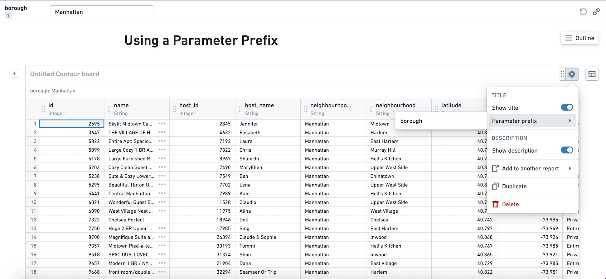
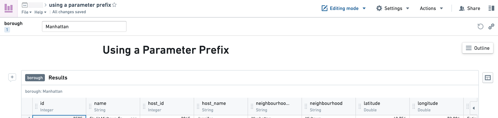
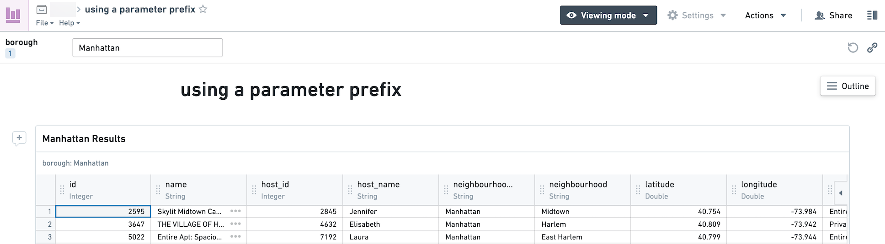

<!-- source: https://palantir.com/docs/foundry/reports/use-a-parameter-as-widget-title-prefix/ · mirrored 2026-08-26 from Palantir Foundry docs -->

# Use a parameter as a widget title prefix

You can use a parameter as the prefix to a widget title.

**The parameter will always appear as a prefix. There is currently no way to use the parameter value in the middle of the widget title.**

1. In editing mode, click on the cog at the top right of the widget.
2. Select an existing parameter to prefix the widget title. The parameter must be a string parameter.

In editing mode, you will see the name of the parameter in the widget header.

In viewing mode and any exports of the report, the value of the parameter will be populated.

*These screenshots use open source data from [Inside Airbnb ↗](https://insideairbnb.com/get-the-data).*
