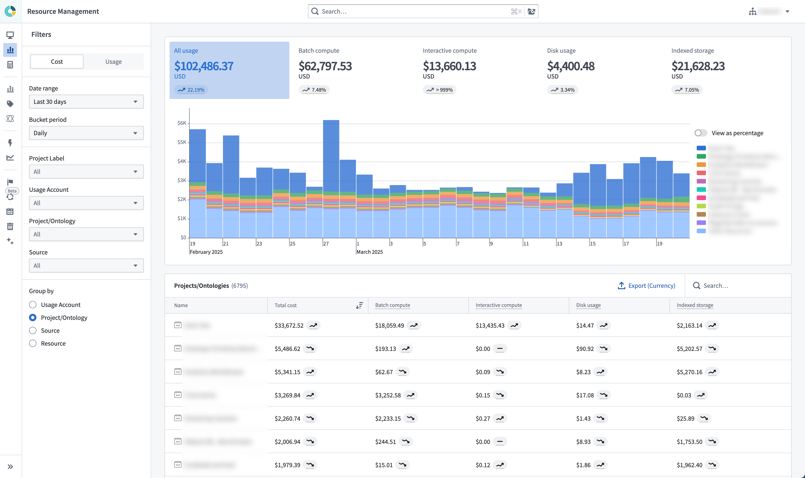

<!-- source: https://palantir.com/docs/foundry/resource-management/analysis/ · mirrored 2026-08-16 from Palantir Foundry docs -->

# Analysis

Analyze usage, cost, and billing with the Analysis tab.

The **Analysis** tab in Resource Management gives users the opportunity to explore their usage data in more depth. Here, users can explore their usage by [usage accounts](/docs/foundry/resource-management/ecosystem/), [Project labels](/docs/foundry/resource-management/ecosystem/), [Projects](/docs/foundry/getting-started/projects-and-resources/), [Ontologies](/docs/foundry/ontologies/ontologies-overview/), sources, and more. Usage can be grouped together and explored in aggregate.

* **Date range:** The date range scopes the data displayed in the analysis to the specified date period. All dates and times are in UTC.
* **Bucket period:** How data is bucketed for display in the usage chart.
  * Only complete buckets will be returned. Therefore, weekly or monthly bucket periods should only be used with aligned date ranges to ensure that the total usage values are correct.
  * Data loading will be slower for daily bucket periods than for weekly or monthly bucket periods.
* **Source:** Specifying a source scopes the data displayed in the analysis to the specified source type. For example, if a user would like to see only usage coming from streaming, they could select [Streaming](/docs/foundry/data-integration/streaming-guide/).
* **Filtering:** Specifying a usage account, project label, Project, or Ontology scopes the data displayed in the analysis to that area of the data hierarchy.
* **Group by:** Specifying a grouping allows users to group the data presented in the analysis by the selected criteria.

All of these selection mechanisms work in tandem to refine an analysis to a user's desired set of data.
