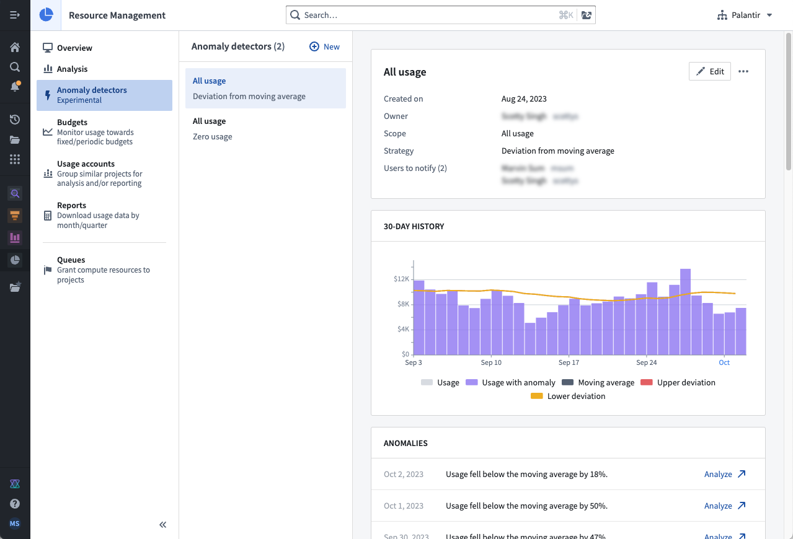
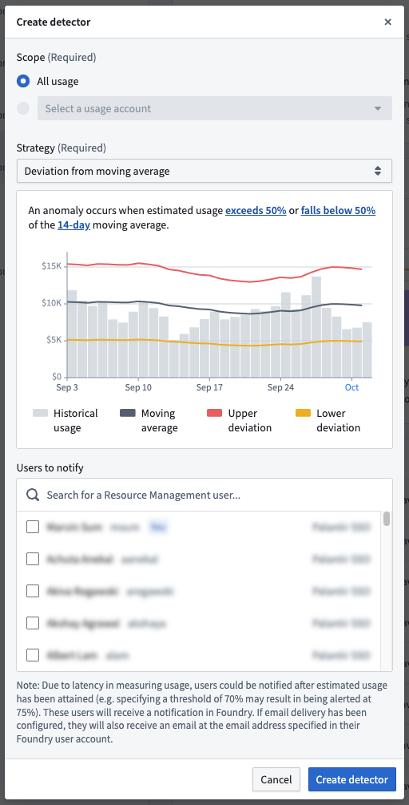

<!-- source: https://palantir.com/docs/foundry/resource-management/anomaly-detection/ · mirrored 2026-08-16 from Palantir Foundry docs -->

# Anomaly detection

:::callout{theme="neutral"}
The Resource Management anomaly detection functionality is only available for customers who have an **active usage-based contract** with Palantir.
:::

**Anomaly detection** in Resource Management proactively notifies users of anomalous resource usage patterns. An anomaly detector consists of the following:

* **Scope:** The entity to be monitored. See the [Scopes](#scopes) section below for more details.
* **Strategy:** A method of detecting anomalies. Each strategy has a unique configuration.
* **Anomalies:** Events that were considered anomalous by the selected strategy.
* **Subscribers** The groups/users who will be notified when an anomaly is detected.

Users create anomaly detectors; each anomaly detector relies on a **scope** and **strategy** to detect **anomalies** and notify its **subscribers**.

:::callout{theme="warning"}
Due to expected latency in measuring usage, an anomaly could be detected after it has occurred (for example, configuring a strategy that detects when usage exceeds 70% of the moving average may result in an anomaly detected at 75%). In some rare cases, this latency could take up to 26 hours.
:::

## Scopes

Anomaly detectors are currently designed to monitor **all usage** for an enrollment. In the future, they will also be equipped to work with **usage accounts**.

## Strategies

Anomaly detectors currently support 2 different strategies:

* **Deviation from the moving average:** Notifies subscribers when usage exceeds or falls below the moving average; this strategy can highlight temporal increases and decreases in usage.
* **Zero usage:** Notifies subscribers when usage is nearly zero for some extended period of time; this strategy can indicate a major issue, such as a data pipeline failure.

## Permissions

To use anomaly detection, one or more of the following roles are required:

* `Enrollment administrator`: View, create, edit, and delete anomaly detectors.
* `Resource management administrator`: View, create, edit, and delete anomaly detectors.
* `Resource management viewer`: View anomaly detectors.

Roles are granted through the [**Enrollment permissions** page](/docs/foundry/administration/enrollments-and-organizations-permissions/) in Control Panel.

## View all anomaly detectors

In Resource Management, select **Anomaly detectors** in the left sidebar. This will display a list of all anomaly detectors available in your enrollment. Select a single anomaly detector to view its anomalies and details. Regular observation can be helpful to learn how often anomalies are detected and whether the detector provides useful signal.

## Create an anomaly detector

To create an anomaly detector, select the **New** button while viewing all anomaly detectors. Select a scope, configure a strategy, and specify the subscribers. Then, select **Create detector**.

## Delete an anomaly detector

:::callout{theme="danger"}
Deleting an anomaly detector also deletes its anomalies and unsubscribes all subscribers. This action cannot be undone.
:::

While viewing a single anomaly detector, select the actions menu at the top right, and select **Delete**. When the warning dialog appears, select **Delete detector**.
