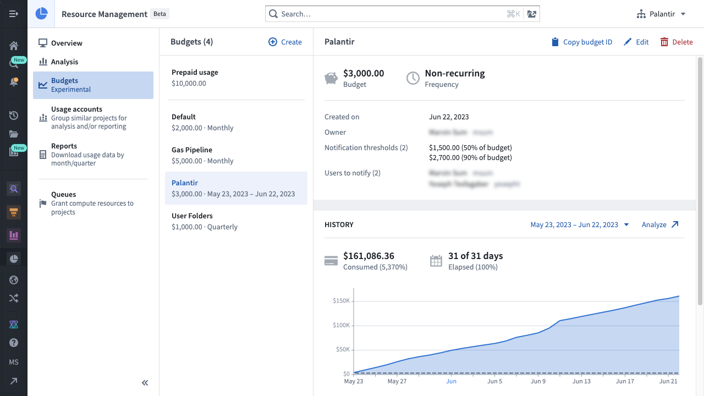
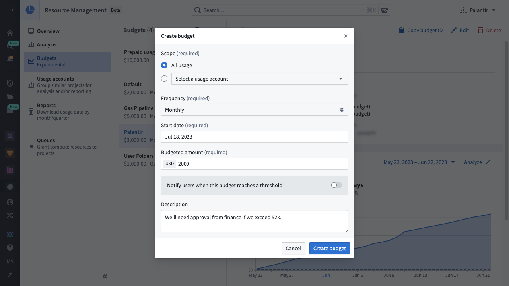
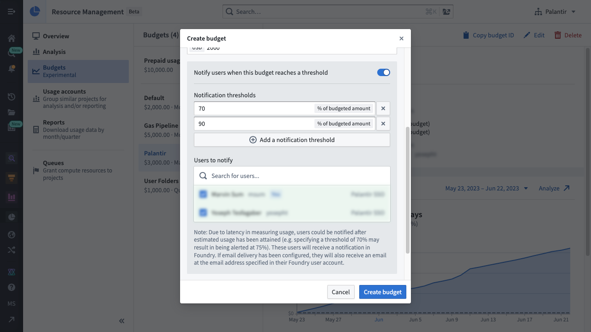

<!-- source: https://palantir.com/docs/foundry/resource-management/budgets/ · mirrored 2026-08-16 from Palantir Foundry docs -->

# Budgets

:::callout{theme="neutral"}
The Resource Management budget functionality is only available for customers who have an **active usage-based contract** with Palantir.
:::

Resource Management's budget functionality allows users to track usage spend over some period of time. Budgets can also be configured to notify users when usage exceeds some pre-determined amount.

## Budget properties

* **Budgeted amount:** The amount to be tracked, expressed in a currency; this typically represents a real-world estimate of expenses.
* **Frequency:** The rate at which this budget repeats; can be monthly, quarterly, yearly or non-recurring.
* **Notification threshold(s):** Expressed as a percentage of the budgeted amount; when the budget exceeds a notification threshold, the users will be notified.
* **Scope:** A set of resources (expressed as a specific Usage account or all usage) that this budget tracks; see [budget scope](#budget-scope) for more details.
* **Start date:** The date on which this budget starts; for non-recurring budgets, an end date must also be specified.
* **User(s) to notify:** The list of users who will be notified (in Foundry or through email) when the budget exceeds a notification threshold. Whenever the budget exceeds a notification threshold, a notification is sent to the list of users.

Whenever the budget exceeds a notification threshold, a notification is sent to the list of users.

:::callout{theme="warning"}
Budget notifications are sent after the budget has exceeded the threshold. Due to the process of measuring and calculating usage, there may be latency between the time that the budget passes the threshold and the time of notification (for example, specifying a notification threshold of 70% may result in a notification sent at 75%). In some rare cases, this latency could be up to 26 hours.
:::

## Budget scope

Budgets currently support two different scopes:

* **All usage:** The budget tracks all usage across all Usage accounts.
* **Usage account:** The budget tracks usage from projects within a specific Usage account.

## Budget permissions

To use budgets, one or more of the following roles are required:

* `Enrollment administrator`: View, create, edit, and delete budgets.
* `Resource management administrator`: View, create, edit, and delete budgets.

Roles are granted through the [**Enrollment permissions** page](/docs/foundry/administration/enrollments-and-organizations-permissions/) in Control Panel.

## View all budgets

In Resource Management, select **Budgets** in the left sidebar. This will display a list of budgets available in your enrollment. Select a single budget to view its details, history, and notifications.

## Create a budget

To create a budget, select the **Create** button above the list of budgets. You will then be able to specify the budget's scope, frequency, start date (and end date, for non-recurring budgets), budgeted amount, and description.

To notify users whenever a notification threshold is reached, select the notification toggle to reveal the notification options. Specify the notification thresholds and the list of users who should be notified. Then select **Create budget** to complete the process.

## Delete a budget

:::callout{theme="danger"}
Deleting a budget also deletes its existing notifications and prevents future notifications from being sent to the users. This action cannot be undone.
:::

While viewing a single budget, select the **Delete** button. When the warning dialog appears, select **Delete budget**.
