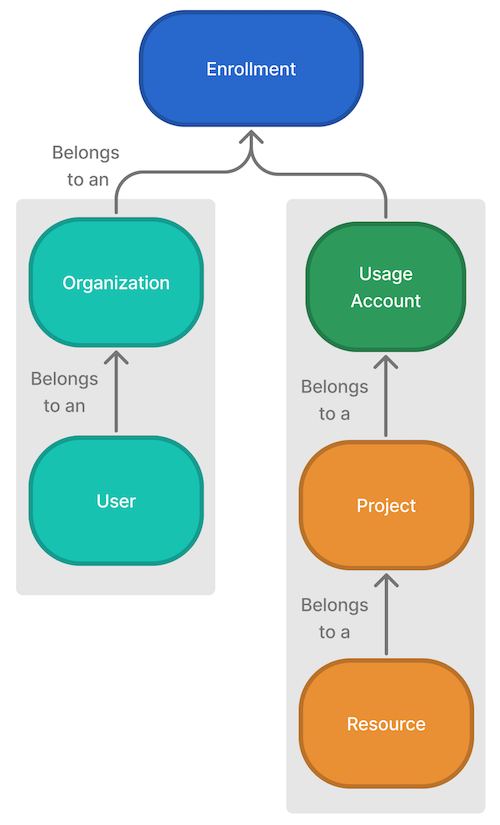

<!-- source: https://palantir.com/docs/foundry/resource-management/ecosystem/ · mirrored 2026-08-16 from Palantir Foundry docs -->

# Ecosystem

Before getting started with resource management in Foundry, review the following concepts to understand the ecosystem of resource access and user enrollments.

* **Enrollment:** An enrollment is the primary identity of your Organization and establishes your company's identity with Foundry services and the Foundry platform.
* **Organization:** Organizations are access requirements applied to Projects that enforce strict silos between groups of users and resources. Every user is a member of one Organization, but can be a guest member of multiple Organizations. [Learn more about Organizations](/docs/foundry/security/orgs-and-spaces/#organizations).
* **Project:** A Project is a collaborative space that brings together users, files, and folders for a particular purpose. Projects are the primary security boundary in Foundry and can be thought of as buckets of shared work. [Learn more about Projects](/docs/foundry/security/projects-and-roles/).
* **Resource:** There are two potential uses of the term "resource" when working with Foundry. Service-level resources like CPU cores, virtual machines, and databases power the computation and data processing on the Foundry platform. Foundry resources sit above the service-level resources and include data concepts and structures such as Projects, workbooks, ontologies, and datasets. Most Foundry resources incur some form of service-level resource usage when users interact with them (e.g. by rebuilding a dataset).
* **Ontology and Ontology resources:** The Foundry Ontology is an Organization’s digital twin; the Ontology integrates an Organization's digital assets into a coherent whole. Ontology resources, namely object types and link types, are the building blocks, or "primitives", of an Ontology. Ontology usage is attributed to the project of each object's input datasource. [Learn more about the Ontology.](/docs/foundry/ontology/overview/)
* **Usage account:** A usage account combines and reports the usage incurred in a group of one or more Projects, typically for accounting purposes.
  * A usage account is associated with exactly one Enrollment.
  * Usage accounts are *exclusive*: Every Project must belong to exactly one usage account.
  * Usage accounts can be marked with one or more Organizations. These Organizations must be a part of the same Enrollment.
  * Projects can be transferred between usage accounts.
  * Usage accounts with associated Projects cannot be deleted.
* **Project label:** A project label supports grouping Projects for ad-hoc usage analysis.
  * Project labels are not *exclusive*: a Project can be included in any number of project labels, and a project label can contain any number of Projects.
* **User:** A user is an individual who has been authenticated and has access to Foundry. As users interact with the platform, they incur usage that can be tracked within the Resource Management app. [Learn more about users](/docs/foundry/security/users-and-groups/#users).
