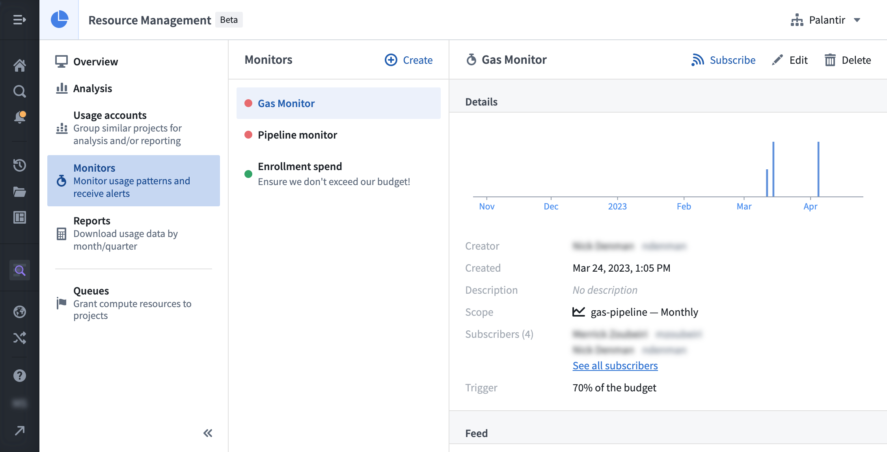
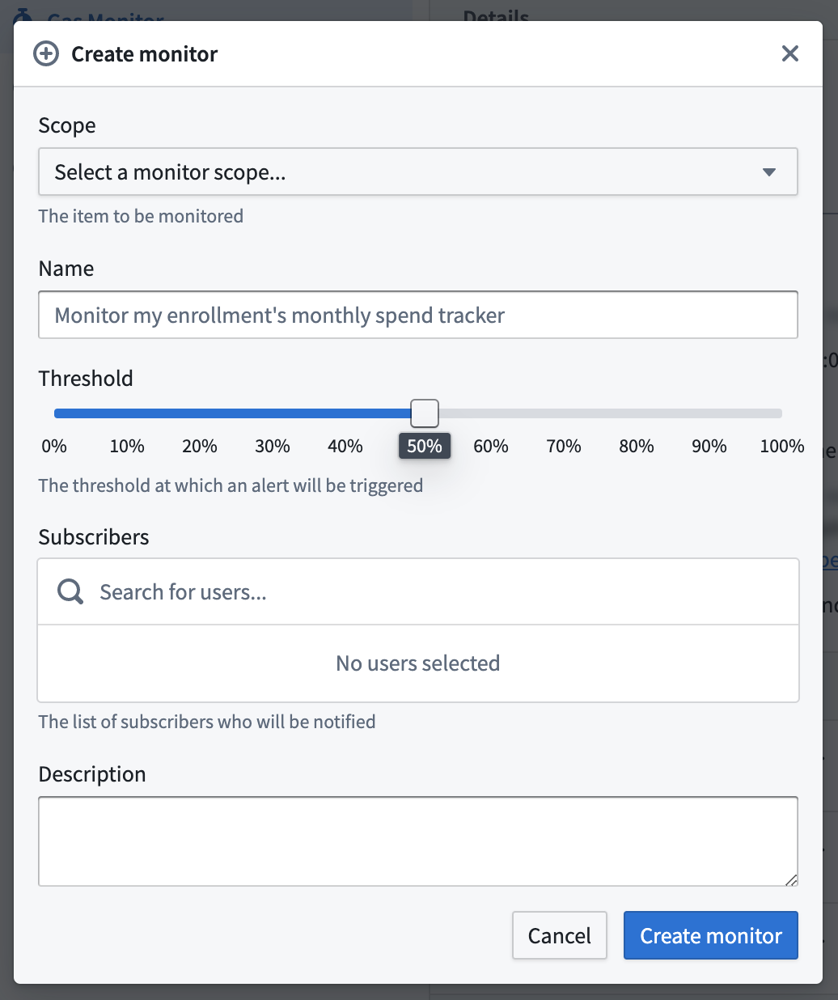
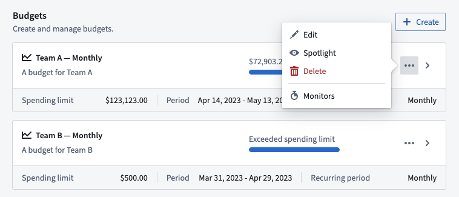

<!-- source: https://palantir.com/docs/foundry/resource-management/monitors/ · mirrored 2026-08-16 from Palantir Foundry docs -->

# Monitors

:::callout{theme="warning"}
Monitors have been deprecated in favor of [anomaly detection](/docs/foundry/resource-management/anomaly-detection/).
:::

**Monitors** in Resource Management allow users to track usage patterns and spend activity, without needing to monitor the application itself. Subscribers to monitors will receive notifications to take action when estimated usage approaches a budget.

A monitor has a **scope**, a **trigger**, **events**, and **subscriber(s)**.

* **Scope:** The entity to be monitored. See the [Monitor scopes](#monitor-scopes) section below for more details.
* **Trigger:** The condition required to prompt the monitor.
* **Event:** A time when the monitor was triggered.
* **Subscriber**(s): The user(s) who will be notified when the monitor is triggered.

If the **trigger** on the **scope** is fulfilled, an **event** is created and the **subscriber(s)** is/are notified.

:::callout{theme="warning"}
Due to expected latency in measuring usage, an event could be triggered after the trigger has been breached (for example, specifying a trigger of 70% may result in an event triggered at 75%). In some rare cases, this latency could take up to 26 hours.
:::

## Monitor scopes

Monitors are currently designed to track **budgets**. In the future, they will also be equipped to track **enrollments** and **usage accounts**.

* **Budgets:** An event is triggered when usage exceeds a percentage of the budget. For periodic budgets, events are triggered once every period (for example, once a month for a monthly budget). If the percentage is updated, it may cause another event to trigger in the same period.

## Permissions

To use monitors, one or more of the following roles are required:

* `Enrollment administrator`: View, create, edit, and delete monitors.
* `Resource management administrator`: View, create, edit, and delete monitors.
* `Resource management viewer`: View monitors.

Roles are granted through the [**Enrollment permissions** page](/docs/foundry/administration/enrollments-and-organizations-permissions/) in Control Panel.

## View all monitors

In Resource Management, select **Monitors** in the left sidebar. This will display a list of all monitors available in your enrollment. Select a single monitor to view its trend, details, and events. Regular observation can be helpful to learn how often a monitor is triggered and whether it provides useful signal.

## Create a monitor

You can create a monitor in two ways:

* While viewing all monitors, select the **Create** button.
* While viewing the list of budgets, select the **Actions** button, then select **Monitors**. Doing so displays the list of monitors for the chosen budget. Select **New monitor** to create a new monitor that tracks the chosen budget.

Enter the remaining information, then select **Create monitor**. The following details can be specified:

* **Scope:** The budget that this monitor will be tracking.
* **Name:** The name of this monitor.
* **Threshold:** The percentage of the budget at which the monitor will be triggered.
* **Subscribers:** The users who will be notified when the monitor is triggered.

## Delete a monitor

:::callout{theme="danger"}
Deleting a monitor also deletes its events and unsubscribes all subscribers. This action cannot be undone.
:::

While viewing a single monitor, select the **Delete** button. When the warning dialog appears, select **Confirm**.
