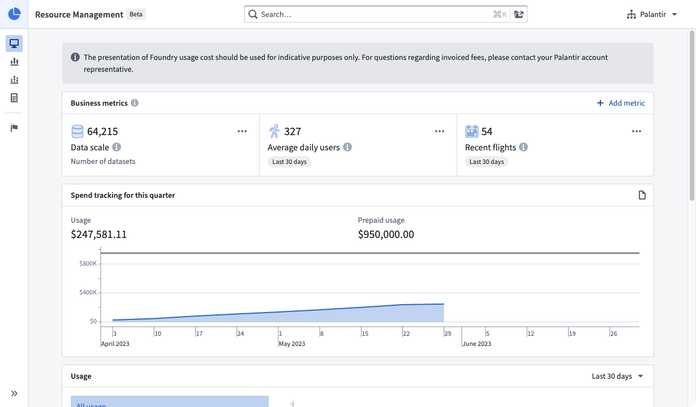
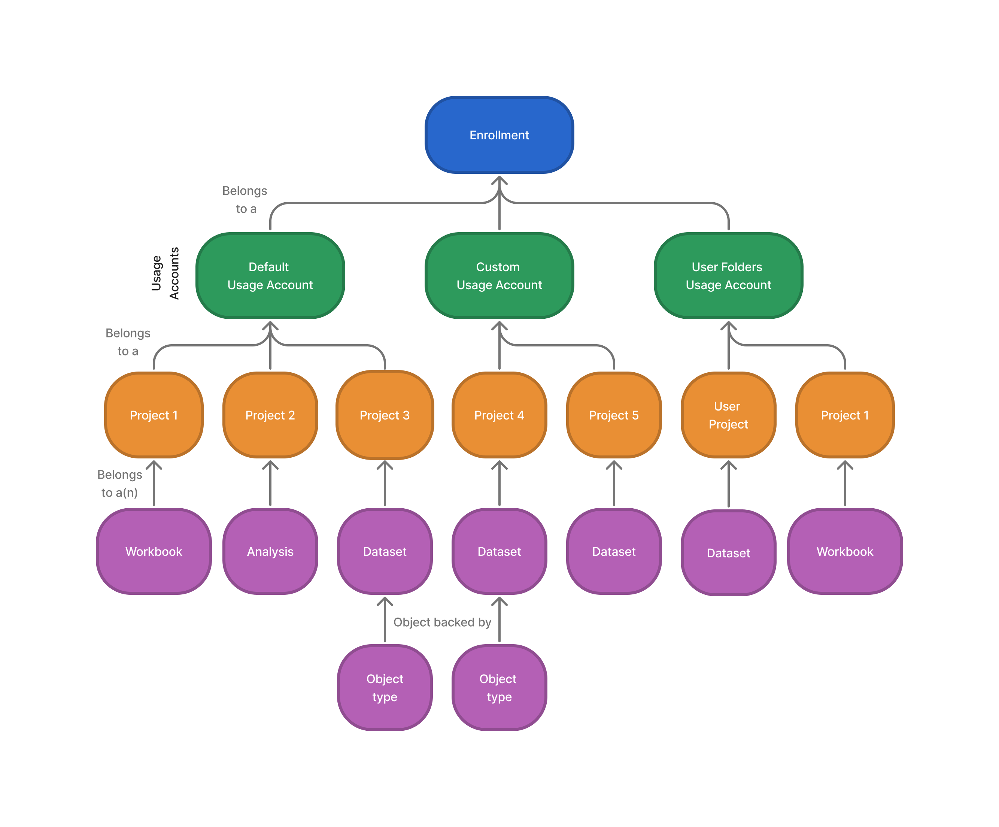

<!-- source: https://palantir.com/docs/foundry/resource-management/overview/ · mirrored 2026-08-16 from Palantir Foundry docs -->

# Resource Management

**Resource Management** helps users understand the following:

* Shared Foundry compute usage
* The cost of Foundry compute usage
* Billing

The application targets two primary workflows:

* [Usage visibility](#usage-visibility) workflows allow users to see an overview of how Foundry usage resources are spent across their Projects.
* Resource allocation workflows allow administrators to define how Projects should consume shared resources and, if desired, to place limits on that consumption.

## Usage visibility

Users can monitor and analyze resource usage using visibility tooling in Resource Management.

In Foundry, all items that can consume discretionary resources are created in a Project. Resource usage for each of these items is accrued to its parent Project. In turn, Projects belong to a usage account.

Usage accounts are a way of grouping related Projects into semantically meaningful groups for better analysis and usage monitoring. By default, enrollments have two usage accounts:

* The *default* account contains all regular Projects.
* The *user folders* account contains all user home folders and cannot be modified.

Administrators are free to create new usage accounts and triage Projects in any way that helps them reason about resource consumption. For example, it may be helpful to categorize Projects in terms of department, business unit, or Organization. The usage account of a Project is specified at Project creation time but can always be changed later by an administrator.

Foundry usage is accrued in different ways depending on the workload or application. For example, running a data transformation incurs a *compute* cost (the cost of servers doing a distributed computation) and a *storage* cost (the long-term storage cost for the resulting data).

### Conceptual hierarchy

