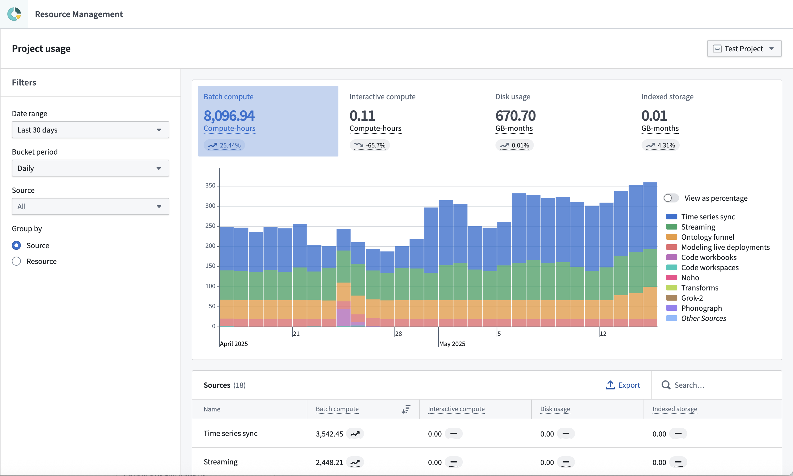
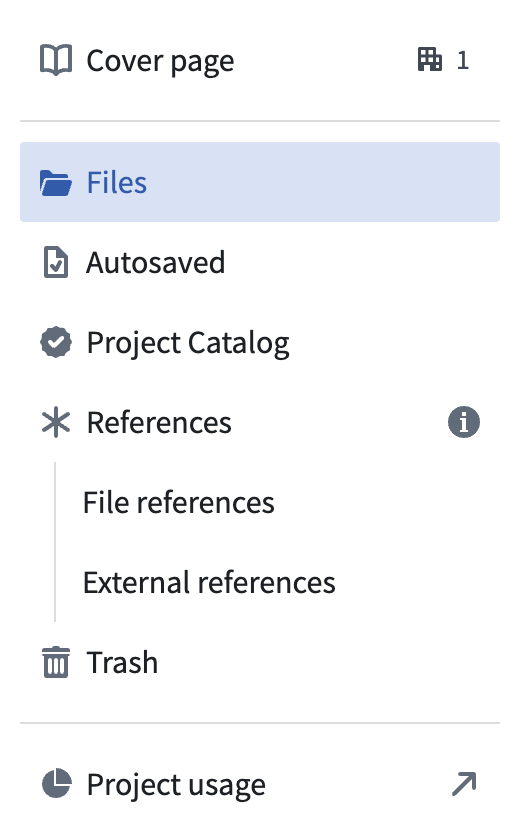

<!-- source: https://palantir.com/docs/foundry/resource-management/project-usage/ · mirrored 2026-08-16 from Palantir Foundry docs -->

# Project usage

Project usage can be analyzed in the **Project usage** page.

This page is similar to the [**Analysis**](/docs/foundry/resource-management/analysis/) tab in the full Resource Management view. The main differences include:

* Usage is displayed for a single project at a time.
* Users with the `Owner` role on a project have [access](/docs/foundry/resource-management/configure-access/#project-usage) to the project usage page by default.
* Cost and billing insights are not provided.

Navigate to the project usage page by following the link at the bottom of the [project navigation panel](/docs/foundry/compass/use-project-navigation-panel/).

