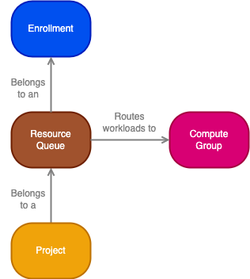
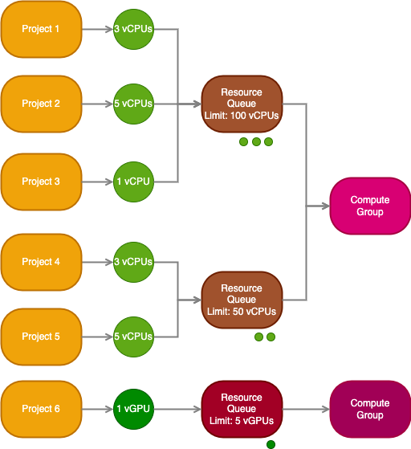
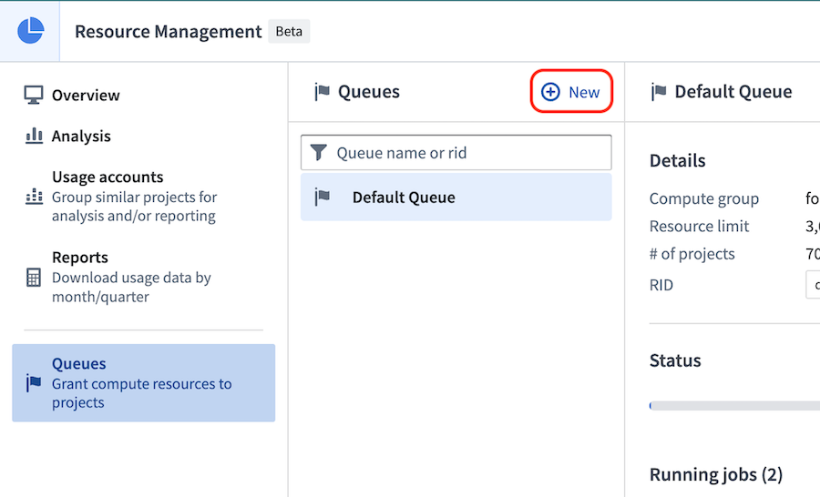
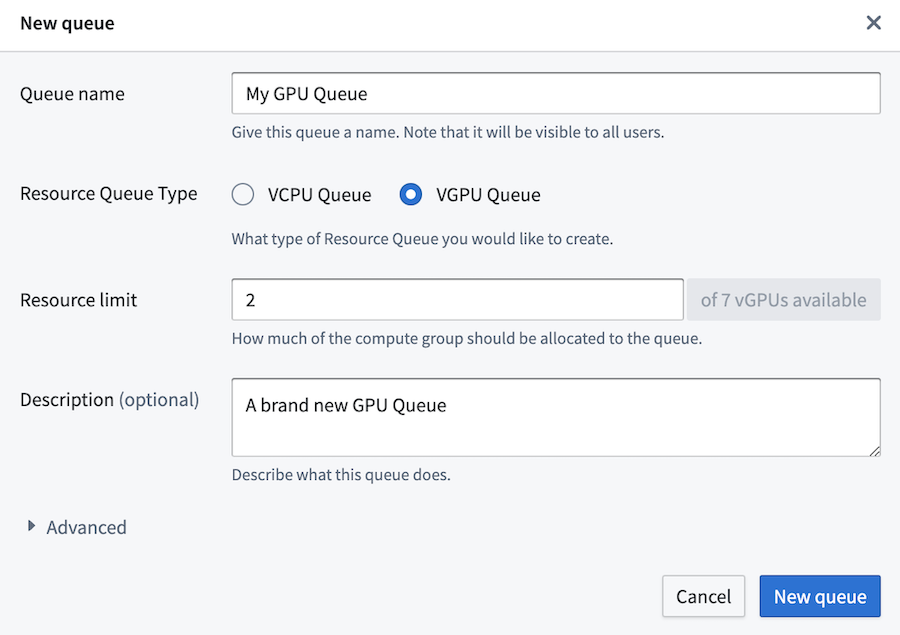
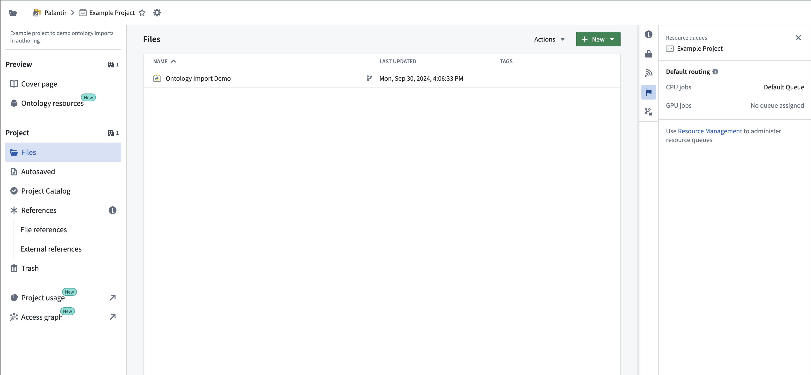
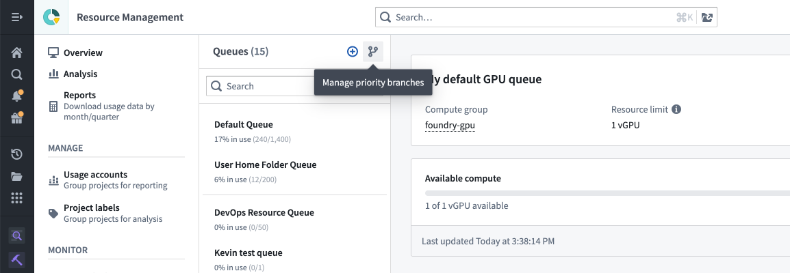
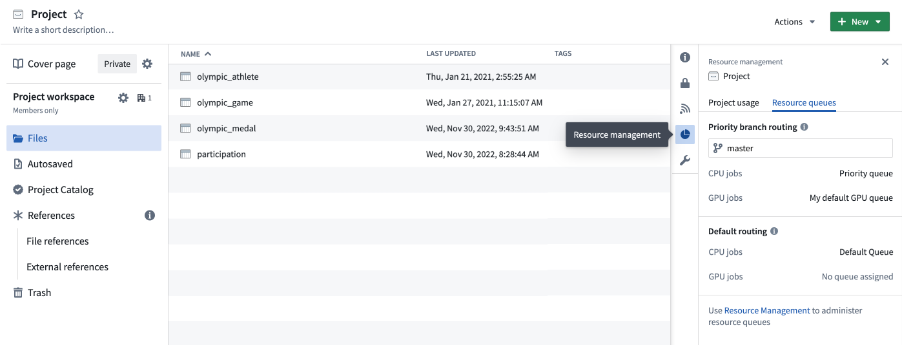
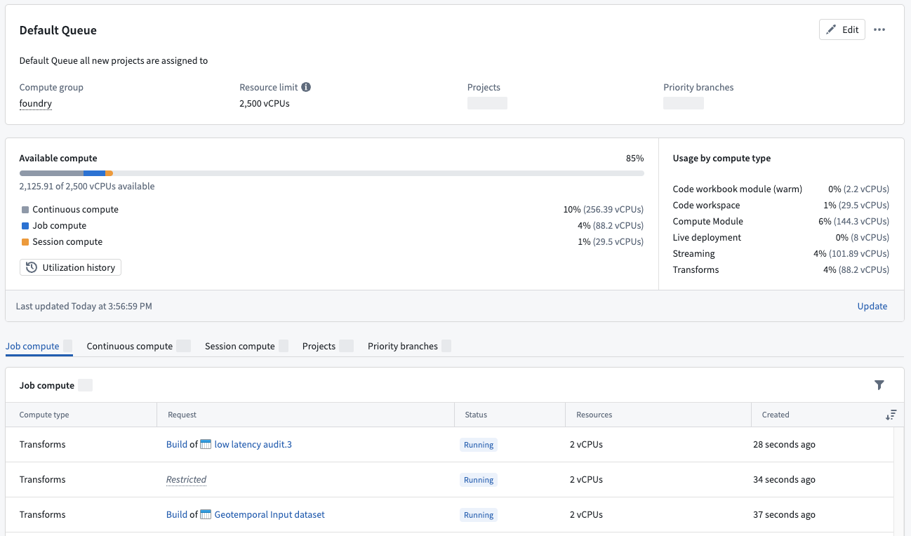
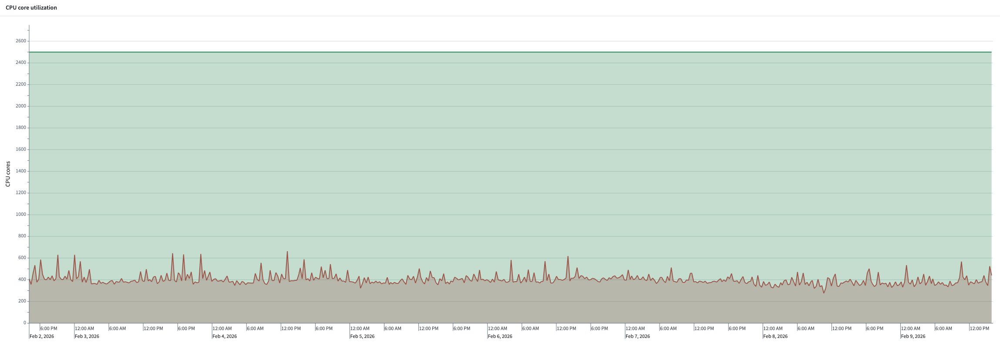

<!-- source: https://palantir.com/docs/foundry/resource-management/resource-queues/ · mirrored 2026-08-16 from Palantir Foundry docs -->

# Resource queues

Resource queues are used to limit the available compute resources that can be utilized concurrently. Examples of compute resources include virtual CPUs (vCPUs) and virtual GPUs (vGPUs).

* **Enrollment:** An [enrollment](/docs/foundry/resource-management/ecosystem/) is the primary identity of your Organization and establishes your company's identity with Foundry services and the Foundry platform.
* **Resource:** A resource queue resource is a compute resource, such as a virtual CPU (vCPU) or virtual GPU (vGPU), that is needed to run a workload in a project.
* **Resource queue:** A resource queue is a first in, first out (FIFO) queue for requesting service-level resources (such as vCPUs or vGPUs). See [resource queue details](/docs/foundry/resource-management/resource-queues/#resource-queue-details) below for more information.
* **Compute group:** A [compute group](#compute-group-details) is a group of machines (compute hardware of a specific type) on which Foundry workloads can be run. These machines provide the resources that are used by workloads.
* **Project:** A [project](/docs/foundry/security/projects-and-roles/) is a collaborative space that brings together users, files, and folders for a particular purpose. Projects are the primary security boundary in Foundry and can be thought of as buckets of shared work. Workloads that require resources run in projects.

:::callout{theme="warning"}
Resource queues for streaming resources may not be available in your enrollment. Contact Palantir Support for more information.
:::

## Enrollment details

Resource queues belong to an enrollment, and an enrollment has a vCPU and a vGPU limit, which limits the total amount of vCPUs and vGPUs allowed through resource queues. In other words, the sum of all vCPU limits of all resource queues in an enrollment must be less than or equal to the enrollment vCPU limit; the same rule applies to the queue vGPU limit and enrollment vGPU limit.

An enrollment also has a default queue to which all projects are automatically assigned unless otherwise specified. This default queue cannot be deleted.

Projects in a space are automatically assigned to the space's default resource queue. The space's default resource queue is the same as the enrollment default resource queue unless otherwise configured. Learn more about [Organizations and spaces](/docs/foundry/security/orgs-and-spaces/) and how they relate to [Organizations and enrollments](/docs/foundry/administration/enrollments-and-organizations/).

### Set enrollment limits

Contact Palantir Support to modify your enrollment limits.

## Resource queue details

A resource queue is a first in, first out (FIFO) queue used to limit the number of compute resources that can be used concurrently. A resource queue limits the use of service-level resources like virtual CPUs (vCPUs) and virtual GPUs (vGPUs) that are available in compute groups.

Resources are requested by workloads running in projects, and those requests are then queued in a resource queue. When a resource queue is full, requests must wait until space is available again in the queue. The queue is first in, first out; requests are processed in the order in which the requests were created.

Workloads are then sent to run in the compute group specified by the resource queue, and resources are released once the workload completes or is terminated.

### Create resource queues

To create a resource queue, navigate to the Resource Management application, select **Queues** on the left, then select **New**.

### Resource queue types

There are currently two resource queue types: vCPU resource queues and vGPU resource queues. Most workloads will only need CPUs, and so most projects will be backed by a vCPU resource queue. Workloads requiring GPUs must be sent to a vGPU resource queue, and so can only run in projects backed by a vGPU resource queue. The type of GPUs (for example, V100, T4) used by the workload in a project is determined by the compute group to which the workload will be routed. This compute group is associated with the resource queue that backs the project. Learn more about [compute groups](#compute-group-details).

#### Use GPUs

If you want to use a GPU in your project, you must create a GPU resource queue and assign your project to that queue. It may be useful to use a GPU when running workloads for training machine learning models, for example. Learn more about [model integration](/docs/foundry/model-integration/overview/). Learn more about how to use GPUs for model training in the [GPU training documentation](/docs/foundry/model-integration/gpu-training/).

:::callout{theme="warning"}
Be sure your enrollment level GPU limits are set to allow the creation of GPU resource queues.
:::

Once the resource queue is created and your project is assigned, import a GPU profile (such as DRIVER\_GPU\_ENABLED) into your project and use it in your code repository. Learn more about [importing spark profiles](/docs/foundry/code-repositories/spark-profiles/#importing-spark-profiles).

### Assign projects to resource queues

Each project is assigned to a vCPU resource queue; optionally, projects can also be assigned to a vGPU resource queue. If a project is not assigned to a vGPU queue, then it cannot execute workloads that require GPUs.

To view and manage the projects that are assigned to a resource queue, select the **Projects** tab while viewing the details for that queue. A project's resource queue assignments can also be viewed in the **Resource management** tab in the platform filesystem sidebar.

#### Priority branches

Priority branches are used to support critical workflows that require dedicated compute resources. For example, it may be acceptable for workloads to queue during development but not in production. Consider using a protected branch from [Code Repositories](/docs/foundry/code-repositories/branch-settings/#protected-branches) or [Pipeline Builder](/docs/foundry/pipeline-builder/branches-protected-branches/) as a priority branch.

When a priority branch is configured for a project, workloads on that branch use the resource queues that are assigned to the priority branch. All other workloads continue to use the resource queues that are assigned to the project. Like projects, each priority branch is assigned to a vCPU resource queue, and they can also optionally be assigned to a vGPU resource queue.

To view or manage the priority branch settings for a project, select the branching icon shown below:

A project's priority branch settings can also be viewed in the **Resource management** tab in the platform filesystem sidebar.

To view and manage the priority branches that are assigned to a resource queue, select the **Priority branches** tab while viewing the details for that queue.

## Compute group details

Compute groups are auto scaling groups of hardware resources of homogeneous type. For example, a compute group might have machines with 16GB of memory and 4 compute cores (CPUs) available; another compute group may have machines with a V100 GPU with 16 compute cores and 32GB of memory. Compute groups are available to Foundry users and limited by resource queues.

## Compute types

Each resource queue can guard **Job compute**, **Continuous compute**, and **Session compute**:

* Job compute includes batch transforms, such as the build of a Python transform.
* Continuous compute covers non-transform compute that is often long-lived, such as a compute module or streaming.
* Session compute covers interactive workloads where users are actively waiting for results, such as when coding in a code workspace.

The Resource Management application shows the granular split of your resource queue usage across different compute types.

## Utilization history

The **Utilization history** option on the resource queue page shows the utilization of the resource queue over the past 7 days. It shows the amount of used vCPU or vGPU cores compared to the maximum available cores on the queue. This can be used to determine whether a resource queue is close to capacity. If the queue is consistently close to being full, consider increasing the amount of cores in the resource queue.

### Set up utilization monitors

A resource queue that reaches capacity causes all new workloads to wait, resulting in delayed builds and poor user experience. To be alerted before this happens, select **Create monitor** to configure a utilization monitor in the Data Health application.
