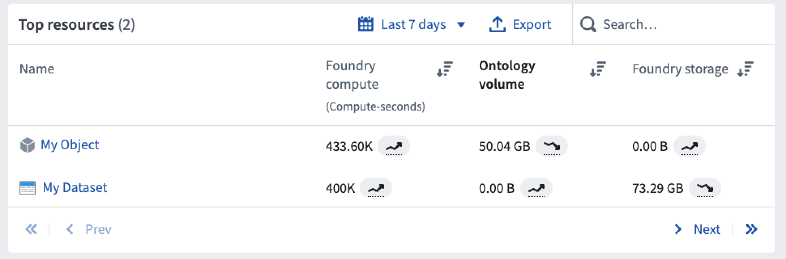
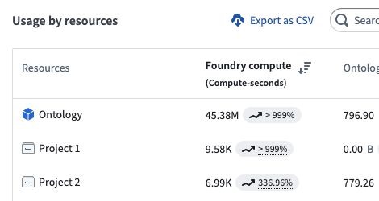

<!-- source: https://palantir.com/docs/foundry/resource-management/usage-types/ · mirrored 2026-08-16 from Palantir Foundry docs -->

# Usage types

Resource Transparency reports can be viewed in the Resource Management App, where users can see a breakdown of compute and storage resources consumed by Projects and Ontologies.

## Foundry compute

Foundry is a platform that runs computational work on top of data. This work is measured using Foundry [`compute-seconds`](#compute-second). Compute-seconds represent a unit of computational work in the platform and are used by both batch (long-running) and interactive (ad-hoc) applications. These compute-seconds can be driven by a variety of factors, including the number of parallelized compute executors, the size of the compute executors, the size of the data being worked on, and the complexity of the computational job.

Many compute frameworks in Foundry operate in a "parallel" manner, which means multiple executors are working on the same job at the same time. Parallelization significantly speeds up the execution of most jobs but uses more compute-seconds per unit time.

### Wall-clock time

An important term to define is *wall-clock time*. Wall-clock time, also known as elapsed real time, is the actual time taken for a process from start to point of measurement, as measured by a clock on the wall or a stopwatch. In other words, wall-clock time is the difference (in seconds) between the time at which a task started and the time at which the task finishes. It is important to note that many Foundry compute-seconds can be used per wall-clock second and that different job types use compute-seconds at different rates, depending on their configuration.

A useful analogy for wall-clock time versus Foundry compute-seconds is the concept of human hours. Two people who each work 8-hour work days produce 16 human-hours worth of work, even though the wall-clock time they worked was only 8 hours.

### Parallelized batch compute

Parallelized Batch compute represents queries or jobs that run in a "batch" capacity, meaning they are triggered to run in the background on a certain scheduled cadence or ad-hoc basis. Batch compute jobs do not consume any compute when they are not being run. Foundry will automatically allocate computational resources to these jobs as soon as they are triggered. Compute usage is metered as soon as the resources are provisioned and until they are relinquished from the job.

To provide insight into how compute resources are used across the platform, vCPU and memory usage is measured for individual jobs and reported on a dataset and object level.

Currently, the following batch compute jobs are monitored:

* All [Transforms](/docs/foundry/data-integration/overview/) jobs (Java, Python, SQL, Mesa, GPU)
* Pipeline Builder
* [Builds of datasets saved from Contour](/docs/foundry/contour/datasets-save/) (not Contour Previews, Analyses, or Reports)
* [Code Workbooks](/docs/foundry/code-workbook/overview/)
* Syncs to Ontology and indexed storage (e.g. [object storage](/docs/foundry/ontologies/ontologies-overview/) and [timeseries syncs](/docs/foundry/time-series/time-series-setup/))
* [Object Storage v1 (Phonograph) writeback jobs](/docs/foundry/object-databases/object-storage-v1/)
* [Data Health checks](/docs/foundry/health-checks/check-types/)

### Parallelized interactive compute

Interactive compute represents queries that are evaluated in real-time, usually as part of an interactive user session. To provide fast responses, interactive compute systems maintain always-on idle compute, which means interactive queries are more expensive than batch evaluation.

Interactive usage is reported for each query - a query consumes its fair share of the backend application where it was scheduled. That usage is then rolled up on the Project level, much like batch compute.

Currently, queries from the following applications are included in interactive compute usage:

* [Contour dashboards, analyses, and previews](/docs/foundry/contour/compute-usage/).
* [Ontology queries](/docs/foundry/ontologies/query-compute-usage/)
* [Timeseries queries](/docs/foundry/time-series/compute-usage/)
* [Code Workspaces](/docs/foundry/code-workspaces/compute-usage/)

### Parallelized continuous compute

Continuous compute is used by always-on processing jobs that are continuously available to receive messages and process them using arbitrary logic.

Continuous compute is measured for the length of time that the job is ready to receive messages and perform work.

Currently, usage from the following applications are included in continuous compute:

* [Streaming](/docs/foundry/building-pipelines/streaming-overview/)
* [Foundry Machine Learning](/docs/foundry/model-integration/overview/)

:::callout{theme="neutral"}
The ability to create a continuous compute job is not available on all Foundry environments. Contact your Palantir representative for more information if your use case requires it.
:::

### Units of measurement in parallelized compute

For parallel processing compute, we generate compute-seconds by measuring two metrics: [core-seconds](#parallelized-core-seconds) and [memory-to-core ratio](#memory-to-core-ratio).

#### Parallelized core-seconds

Core-seconds reflect the number of vCPU cores used for the duration of job. For example, 2 cores used for 3 seconds results in 6 core-seconds. The duration of a job is the time between submitting the job and the job reporting completion. This includes spin-up time and job cleanup time.

To determine how many cores a given job used, the properties of the job are inspected. Specifically, the number of executors, the number of vCPU cores for the executors, and the driver are taken into consideration.

A common parallelized compute engine in the platform is Spark. Some users may only interact with Spark Configuration Service profiles, which provide pre-determined Spark configurations in “sizes”. Usually, these properties are specified in the job’s Spark profile or are set to system defaults.

For example:

```
spark.driver.cores = 3
spark.executor.cores = 2
```

In this example, the total core-seconds can be calculated in the following way:

```
core_seconds = (num_driver_cores + num_executor_cores * num_executors) * job_duration_in_seconds
```

:::callout{theme="warning"}
Usage is based on *allocated* vCPU cores, not on the *utilization* of those cores. We recommend requesting only the necessary resources for your jobs to avoid over-allocation.
:::

#### Memory-to-core ratio

Given that live computation hosts have a fixed memory-to-core ratio, we must consider how many GiB of memory are used per core. Let's say we have a host with four cores and 32GiB of memory. On this host, we could schedule four jobs, each one of them requesting one core and 8GiB of memory. However, if one of these jobs request more memory, 16GiB, other jobs cannot take advantage of the additional cores as there is insufficient memory. This means that one of the remaining jobs will require additional capacity. As a result, the ratio of memory-to-cores is a key part of the compute-second computation.

In Foundry, the default memory-to-core ratio is `7.5 GiB per core` .

#### Parallelized core-seconds to compute-seconds

Foundry compute-seconds reflect both the number of vCPU cores and the amount of memory that was reserved for a job. Compute-seconds combine core-seconds with the amount of memory reserved.

In summary, we calculate compute-seconds by taking the maximum of two factors:

* Cores used per task, and the
* Memory-to-core ratio of the executor of the task.

This can be expressed with the following expression: `max(num_vpcu, gib_ram / 7.5)`

Consider the example below with the following characteristics:

* Two Executors, each with one core and 12GiB RAM
* Total wall-clock computation time is 5 seconds

```
vcpu_per_executor = 1
ram_per_executor = 12
num_executors = 2
num_seconds = 5

default_memory_to_core_ratio = 7.5
job_memory_multiplier = 12 / 7.5 = 1.6

job_core_seconds = num_vcpu * num_excutors * num_seconds
job_core_seconds = 1 * 2 * 5 = 10

job_compute_seconds = max(num_vcpu, job_memory_multiplier) * num_executors * num_seconds
job_compute_seconds = max(1vcpu, 1.6mem-to-core) * 2executors * 5sec
job_compute_seconds = 16 compute-seconds

```

We can see that while the job only used 10 core-seconds, it used 16 compute-seconds total due to the outsized memory request.

## Query compute-seconds

In Foundry, there are various indexed stores that can be queried in an on-demand manner. Each of these indexed stores uses compute-seconds when executing their queries. For documentation on how queries use compute-seconds, refer to the following documentation.

* [Foundry Ontology](/docs/foundry/ontologies/query-compute-usage/)
* [Foundry Timeseries](/docs/foundry/time-series/compute-usage/)

## Ontology volume

Foundry's Ontology and indexed data formats provide tools for fast, organization-centric queries and actions. These backing systems store the data in formats that are significantly more flexible for ad-hoc operational and analytical use cases. Ontology volume is measured in [`gigabyte-months`](#gigabyte-month).

Ontology Volume usage is tracked in the following systems:

* Ontology objects (v1 & v2)
* Postgate (Postgres interface, not available in all Foundry configurations)
* Lime (legacy document store without Ontology mappings)

:::callout{theme="neutral"}
The size of the synced dataset may be different than the size in Foundry. This is because each system uses different layouts or compression to store and serve data.
:::

## Foundry storage

Foundry storage measures the general purpose data stored in the non-Ontology transformation layers in Foundry. Disk usage is measured in [`gigabyte-months`](#gigabyte-month).

Each dataset’s storage usage is calculated individually. Dataset branches and previous transactions (and views) impact how much disk space a single dataset consumes. When files are removed from a view with a `DELETE` transaction, the files are not removed from the underlying storage and thus continue to accrue storage costs. The total disk usage is calculated in two steps:

* Looking at all the transactions that were ever committed or aborted on a dataset and summing up the size of the underlying files that were added.
* Subtracting all the transactions that were delete using Retention to get the live disk space used.

The only way to reduce size is to use **Retention** to clean up unnecessary transactions. Committing a `DELETE` transaction or updating branches does not reduce storage used.

## Ontology volume usage attribution

Ontology volume usage is primarily attributed to the project of each object's input datasource. Foundry resources and objects appear side-by-side when viewing the granular usage details for any project as shown below.

**Note:** When usage is attributed to a Workshop application with embedded modules, it will account for any usage that occurs in its embedded modules.



Some objects are unattributable to a single project; for example, an object may have multiple input datasources that span multiple projects. In these cases, usage is attributed to the Ontology itself as below.



In general, objects accrue the following types of usage:

* **Foundry Compute** captures compute used to index datasets to object types; in other words, the cost of syncing the Ontology.
* **Ontology Volume** captures the size of the indexes of all object types.
* **Foundry Storage** is empty for objects.

## Job attribution

All usage in the Resource Management application - including timestamps, date ranges, and usage aggregations - is recorded and displayed strictly in UTC.

Jobs are attributed based on their finish time. When a job completes, its usage is assigned to the UTC date on which it finished. For jobs that span multiple days, all usage is attributed to the date the job ended, not the date it started. This applies to all compute work, including batch, interactive, and continuous compute.

## Usage units

### Compute-second

All computational work done by all Foundry products is expressed as `compute-seconds`. In the Foundry platform, a `compute-second` is not a measurement of time, but rather a unit of work that the platform executes. The `compute-second` is the atomic unit of work in the platform, meaning it is the minimum granularity at which compute is measured in Foundry. See the table below for details on how each Foundry product type uses compute-seconds.

### Gigabyte-month

All storage usage by all Foundry products is expressed as `gigabyte-months`, which is a measure of allocated storage over time. A 1GB data file consumes 1 GB-month of usage per month.

The storage volume is calculated hourly, and the `gigabyte-months` value is calculated from the total hourly measurements in that monthly period. For example, for a month with 30 days:

```
Days 0-3      - 0GB volume
Day 4, 06:00  - 3GB volume (3GB added)
Days 5-10     - 3GB volume (no change from day 3)
Day 11, 00:00 - 6GB volume (3GB added)
Days 11-20    - 6GB volume (no change)
Day 21, 00:00 - 3GB volume (3GB deleted)
Days 21-30    - 3GB volume (no change)

Total:
(0GB * 4 days + 3GB * (18hrs/24) days + 3GB * 6 days + 6GB * 10 days + 3GB * 10 days) / 30 days
   = 3.675 gigabyte-months of usage
```

Since the number of days in a month varies, the `gigabyte-months` generated per day by the same volume of storage will change per month. For example:

```
90GB stored for 1 day in a month with 30 days will consume:
(90GB * 1 day) / 30 days = 3 gigabyte-months

90GB stored for 1 day in a month with 31 days will consume:
(90GB * 1 day) / 31 days = 2.90 gigabyte-months
```

This means that, when viewing storage usage for a dataset of unchanging size, the `gigabyte-months` consumed by day or week will have some fluctuation; the `gigabyte-months` consumed for the whole month will not fluctuate.

## List of Foundry applications and associated usage

### Data transformation

| Foundry application                              | Foundry compute | Foundry Ontology volume | Foundry storage |
| ------------------------------------------------ | --------------- | ----------------------- | --------------- |
| Code Repositories (Python, Java, SQL, GPU, Mesa) | Yes             | No                      | Yes             |
| Streaming repositories                           | Yes             | No                      | No              |
| Pipeline Builder                                 | Yes             | No                      | Yes             |
| Preparation                                      | Yes             | No                      | Yes             |
| Data Connection (Agent-based)                    | No              | No                      | Yes             |
| Data Connection (cloud ingest)                   | Yes             | No                      | Yes             |
| Data Health                                      | Yes             | No                      | No              |
| Dataset projections                              | Yes             | No                      | No              |
| Object indexing (Phonograph2)                    | Yes             | Yes                     | No              |
| Time series indexing                             | Yes             | No                      | No              |
| Recipes                                          | Yes             | No                      | No              |

### Analytics

| Foundry application           | Foundry compute               | Foundry Ontology volume | Foundry storage |
| ----------------------------- | ----------------------------- | ----------------------- | --------------- |
| Code Workbook: Spark          | Yes                           | No                      | Yes             |
| Code Workbook: GPU            | Yes                           | No                      | Yes             |
| Contour analysis              | Yes                           | No                      | No              |
| Contour builds and dashboards | Yes                           | No                      | Yes             |
| Reports                       | Yes (from other applications) | No                      | No              |
| Restricted Views              | Yes                           | No                      | No              |
| Notepad                       | Yes (from other applications) | No                      | No              |
| Fusion                        | No                            | Yes                     | Yes (writeback) |

### Model and AI integration

| Foundry application | Foundry compute | Foundry Ontology volume | Foundry storage |
| ------------------- | --------------- | ----------------------- | --------------- |
| Foundry ML batch    | Yes             | No                      | Yes             |
| Foundry ML live     | Yes             | No                      | No              |

### Ontology and application building

| Foundry application              | Foundry compute | Foundry Ontology volume | Foundry storage |
| -------------------------------- | --------------- | ----------------------- | --------------- |
| Ontology objects                 | Yes             | Yes                     | Yes (export)    |
| Ontology relationship tables     | Yes             | Yes                     | Yes (export)    |
| Ontology Actions                 | Yes             | Yes (writeback)         | No              |
| Direct Object Storage v1 indices | Yes             | Yes                     | Yes (export)    |
| Postgres indices                 | Yes             | Yes                     | No              |
| Direct Lime indices              | Yes             | Yes                     | No              |
| Foundry Rules                    | Yes             | Yes                     | Yes             |

**Notes:**

`Yes (writeback)` refers to the process of storing user edits or user created objects to the object set in Foundry.

`Yes (export)` refers to the process of storing user edits to the designated writeback dataset in Foundry.

`Yes (from other applications)` refers to the usage generated by other embedded Foundry applications, such as a Contour board embedded in a Notepad document.
