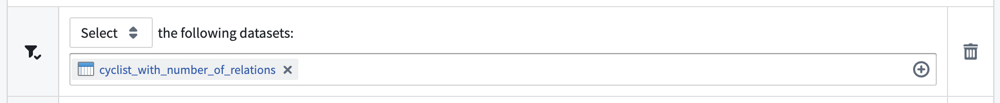
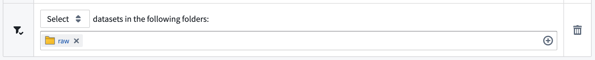
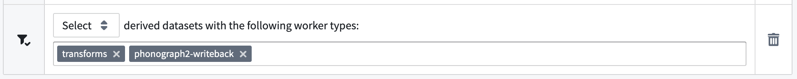
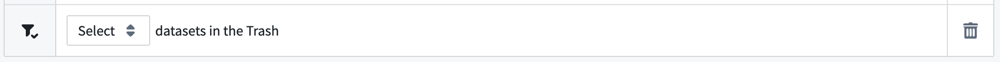
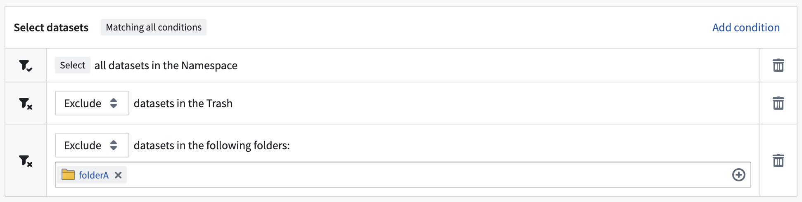
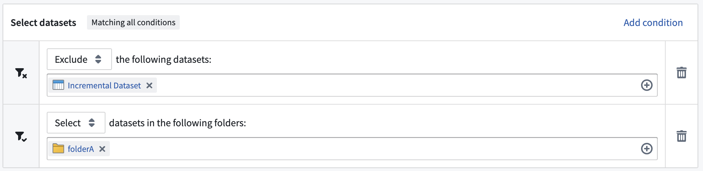

<!-- source: https://palantir.com/docs/foundry/retention/dataset-selectors/ · mirrored 2026-08-14 from Palantir Foundry docs -->

# Dataset selectors

Every dataset selector can be configured to either `Select` or `Exclude` the datasets that match the criteria in the selector. For example, `Select` derived datasets will narrow the funnel to include ONLY derived datasets. `Exclude` datasets in folder `/palantir/finance` will narrow the funnel by not including datasets in the given folder.

Some datasets selectors also include a second argument, for example the list of folders or worker types to include or exclude from the policy.

The following list describes the dataset selectors available for use when configuring retention policies in the Retention application.

## In the following datasets

Selects all datasets by their given RIDs. Note that the dataset RID will not change, even if you rename the dataset.

[Learn more about identifying a dataset's RID.](/docs/foundry/analytics-connectivity/identify-dataset-rid/)

**Takes 1 argument:** `list of datasets` (a list of datasets saved by their RIDs).

### Example

`Select` the following datasets: `<list of datasets>`

## Datasets in the following folders

Selects all datasets in the given folders or Projects identified by their given RID. Any future dataset created in these folders or Projects will also be subject to this policy.

**Takes 1 argument:** `list of folders` (a list of folders or Projects saved by their RIDs).

### Example

`Select` datasets in the following folders: `<list of folders>`

## Is derived dataset

A dataset is defined to be a derived dataset if, and only if, the following conditions are true:

* The dataset contains a [JobSpec](/docs/foundry/data-integration/builds/#jobs-and-jobspecs) in its master branch.
* The dataset has a non-zero number of dataset inputs.

Datasets that do not meet these conditions, including raw datasets, datasets ingested from an external source, and datasets that were never built on a master branch, will not be selected by this selector.

**Takes an optional `worker type` list as argument:** The `worker type` list is a set of worker types that are specified in the `workerType` field in the JobSpec (for example, `transforms` and  `phonograph2-writeback` in the image below). If this field is left empty, this selector will affect ALL derived datasets.

### Example

`Select` derived datasets with the following worker types: `transforms`, `phonograph2-writeback`

## Is in trash

Select datasets that are in the trash.

**Takes no arguments.**

### Example

`Select` datasets in the Trash

## Example of combined selectors

To demonstrate the dataset selectors and how they can work in combination, consider the following two examples:

### Apply a broad policy with exemptions in a specific folder

The following collection of dataset selectors will select all untrashed datasets in the [space](/docs/foundry/security/orgs-and-spaces/#spaces) which aren't contained in `folderA`:

* `Select` all datasets in the space
* `Exclude` datasets in the Trash
* `Exclude` datasets in the following folders: `folderA`

### Select all datasets in a project except one

The following collection of dataset selectors will select all datasets in `folderA` except for `Incremental dataset`:

* `Exclude` the following datasets: `Incremental Dataset`
* `Select` datasets in the following folders: `folderA`

## Protecting datasets from retention

You can protect specific datasets from **a given retention policy** by using the **Exclude** mode with the [**In the following datasets**](#in-the-following-datasets) selector. This excludes individual datasets from that policy by their RIDs.

Note that this exclusion applies only to the policy you are configuring. Other retention policies operating in the same [space](/docs/foundry/security/orgs-and-spaces/#spaces) — including recommended (platform-managed) policies and any other custom policies — may still mark transactions on the excluded datasets. To fully protect a dataset, review every policy that could apply to it.

## Deprecated selectors

### In compass name

We recommend using the [`Datasets in the following folders`](#datasets-in-the-following-folders) selector instead.

### In dataset paths

We recommend using the [`In the following datasets`](#in-the-following-datasets) selector instead.
