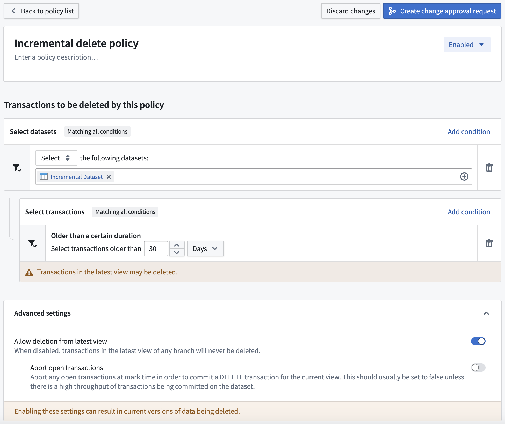

<!-- source: https://palantir.com/docs/foundry/retention/manage-retention-policies/ · mirrored 2026-08-14 from Palantir Foundry docs -->

# Managing retention policies

Retention policies are managed separately by each [space](/docs/foundry/security/orgs-and-spaces/#spaces) used in your Organization. Each policy is independently evaluated and applied in no particular order. When configuring policies, you can choose the datasets to include in the policy; when the policy runs, any selected dataset that runs the specified transaction type will be marked for deletion and will no longer be available for any user. **The full deletion of these marked transactions will occur periodically, completely removing the data from the platform**.

Each retention policy is built off of a set of dataset selectors that define which datasets need to be included or excluded from the policy, along with a set of transaction selectors that define the dataset transactions that should be marked for deletion.

A maximum of 50 custom policies are permitted per space.

:::callout{theme="warning" title="Excluding from a platform-managed retention policy"}
If you need to exclude a namespace or a project from a platform-managed retention policy, also known as a recommended policy, contact Palantir Support.
:::

:::callout{theme="warning" title="Revoking a retention policy"}
Revoking a retention policy does not automatically restore changes already made by the policy. Marked transactions can all be unmarked — see [Mark and sweep](/docs/foundry/retention/policy-execution/#mark-and-sweep) — but only until the sweep process starts for that transaction. Once a transaction has been swept, it is permanently deleted and cannot be recovered. Contact Palantir Support for assistance with unmarking transactions before they are swept.
:::

## Dataset selectors

By default, no datasets are selected at a policy's time of creation. Dataset selectors allow you to identify the datasets required for the policy by either selecting or excluding certain datasets cumulatively. The order of dataset selectors makes no difference to the end result. Each dataset selected by a policy will satisfy the constraints of all specified dataset selectors. At least one dataset selector should be configured in the **Select** mode, otherwise, no datasets will be selected.

Learn more about the [dataset selectors](/docs/foundry/retention/dataset-selectors/) available for retention policies.

## Transaction selectors

By default, each policy includes all closed transactions, for every selected dataset, on all branches (`OPEN` transactions are always ignored). Each transaction selector allows you to narrow that scope to identify the dataset transactions required for the policy. As transaction selectors always narrow the scope, the selectors can be specified in any order. Each transaction deleted by a policy will satisfy the constraints of all specified transaction selectors.

Learn more about the [transaction selectors](/docs/foundry/retention/transaction-selectors/) available for retention policies.

If all transactions across all branches in the selected datasets should be deleted, use the [Transaction count](/docs/foundry/retention/transaction-selectors/#transaction-count) selector, retain 0 transactions, and make sure to configure [Latest view transaction deletion](#latest-view-transaction-deletion) appropriately.

## Additional flags

:::callout{theme="danger" title="Warning"}
The following flags are only for advanced usage as misconfiguration may result in incorrect data deletion.
:::

### Latest view transaction deletion

By default, retention policies will never delete transactions that are in the latest view of any branch. This flag overrides this behavior by **allowing the deletion of current data, and should be considered very dangerous**.

If these policies end up deleting data from the current view, a `DELETE` transaction will be added by Foundry to signify that the current view does not contain the deleted files.

This flag can be further customized with the **Abort open transactions** option. This should only be used if a dataset selected by the policy has a high frequency of transactions being committed (such as every few minutes, for example).

## Example policy

As an example, we will describe a notional Foundry environment that has a recommended policy which deletes data if the data is outside the last 3 views and also older than 30 days.
In this instance, you may have a dataset which builds every 30 minutes incrementally (for example, with `APPEND` transactions). Since only `SNAPSHOT` transactions start a new view, all new transactions being committed will be in the same view, and none will ever be outside the last 3 views (until 2 `SNAPSHOT` transactions happen). Therefore, data in this dataset may never be deleted by the retention policy.

If you decide you want the data in this dataset to be deleted, you could create a policy like the following:

This would delete any transactions in the dataset that were committed more than 30 days ago, even if they are in the current view of any branch of the dataset.

Otherwise, if the selection was of the folder holding the dataset, the policy would apply to all datasets in that folder. This could be dangerous, for example, if you have a dataset with only a single transaction that was committed 31 days ago. That transaction would get deleted by this policy and its containing dataset would then have no data available, historical or current.

## Branch deletion

The Retention Policies application only allows for the configuration of retention policies on transactions, but the underlying infrastructure also supports deletion of entire dataset branches and their corresponding [JobSpecs](/docs/foundry/data-integration/builds/#jobs-and-jobspecs). However, the details of branch deletion behavior are not currently configurable. The current default branch deletion behavior is that branches that satisfy *all* of the following criteria will be deleted:

* There is no branch with the same name in the corresponding [code repository](/docs/foundry/code-repositories/overview/). The corresponding code repository is determined from the [JobSpec](/docs/foundry/data-integration/builds/#jobs-and-jobspecs) on the branch.
* The branch has no committed or open transactions from the last seven days.
* The branch was not created in the last seven days.
* For branches that have never been built, the dataset's JobSpec was not created in the last seven days.

:::callout{theme="neutral"}
The fact that a dataset branch can exist within the Foundry filesystem but not within Catalog is an implementation detail that users do not generally need to consider; we reference this fact in the above explanation in the interest of completeness and to aid debugging in the event that a branch is not being deleted as expected.
:::

Branch deletion behavior may not be enabled in some Palantir environments created before 2021. If you observe that branches that satisfy all of the above criteria are not being deleted, contact Palantir Support to confirm whether the `foundry-retention` service is configured with a `branch-deletion` policy for your environment.
