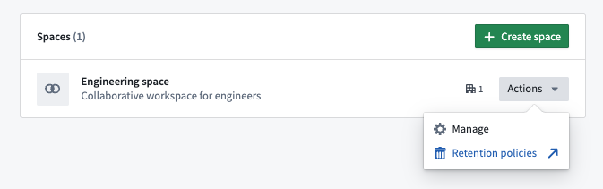
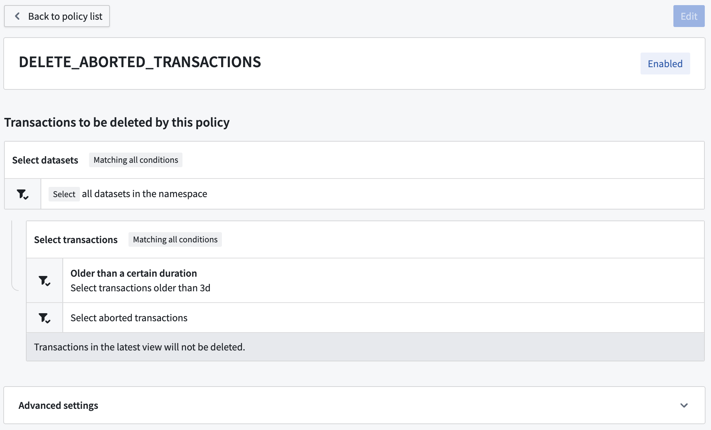
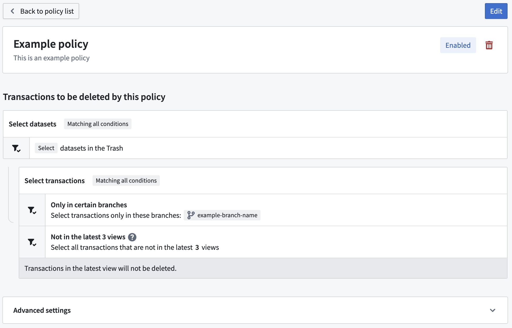
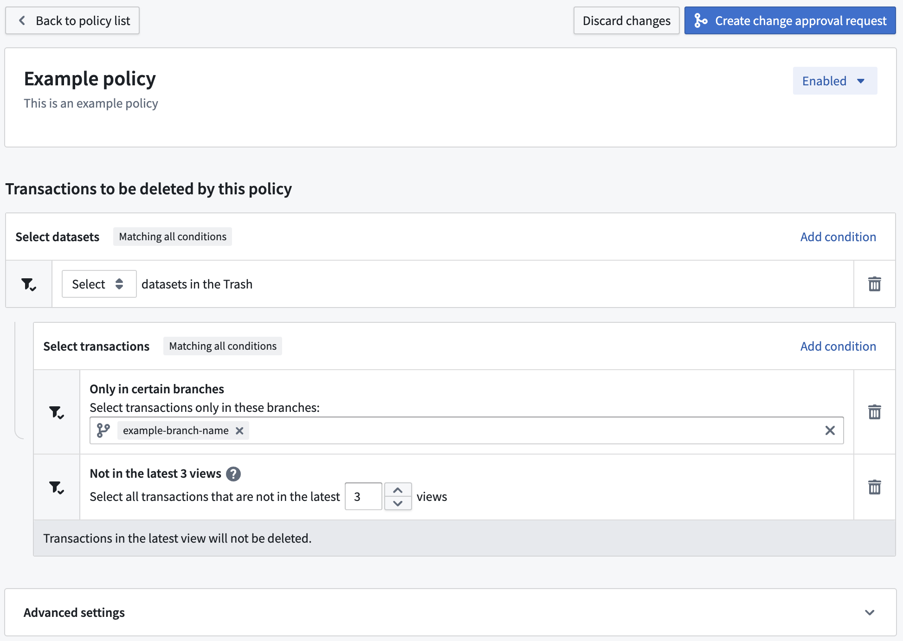
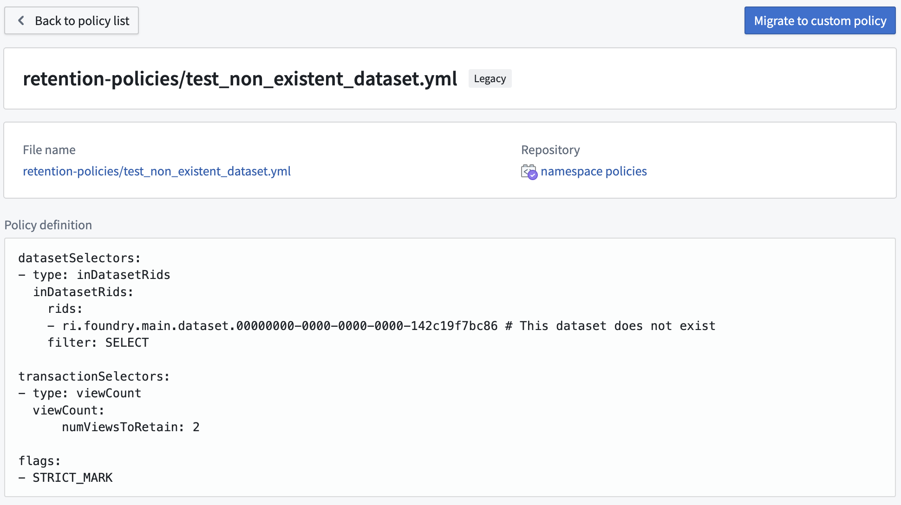

<!-- source: https://palantir.com/docs/foundry/retention/navigation/ · mirrored 2026-08-14 from Palantir Foundry docs -->

# Navigation

## Access Retention Policies application

The Retention Policies application is available on every [space](/docs/foundry/security/orgs-and-spaces/#spaces) in your Organization, when enabled for your Organization under Administration in [Application Access](/docs/foundry/administration/configure-application-access/) or Data Governance in [the Palantir platform](/docs/foundry/administration/configure-workspaces/). To access, navigate to the relevant space in [Control Panel](/docs/foundry/security/orgs-and-spaces/#organizations), then select **Retention policies**.

## Home

The Retention Policies home page lists the recommended, custom, and legacy policies that are applied on the selected space.

Use the filter bar on the right to filter policies by name.

Select the `>` icon on each line to view policy details.

### Recommended policy view

When viewing details of a specific recommended policy, you will see a list of datasets and transactions selected for use in the policy as shown in the image below:

The **Select datasets** section lists the datasets included in this policy, followed by the list of transaction selectors to determine the transactions that will be deleted. In the example, the policy selects all datasets in the space; for each dataset, the policy will delete all aborted transactions.

:::callout{theme="neutral"}
Recommended policies cannot be edited by the space administrator. Contact Palantir Support if you need to disable a recommended policy.
:::

### Custom policy view

Similar to recommended policies, you will see a list of datasets and transactions selected for use in the policy as shown in the image below:

Unlike with recommended policies, custom policies can be edited by clicking the **Edit** button and subsequently the **Create change approval request** button after making changes.

Policy additions, changes, or deletion may require approval requests rather than being saved directly. If so, after giving a title and a description to the approval request, you will be routed to the [Approvals](/docs/foundry/approvals/overview/) application. The request may invoke automatically (not requiring any other approvals) if it's possible due to your permissions, or require further approvals from other users from others depending on how your instance and [space](/docs/foundry/security/orgs-and-spaces/#spaces) are configured. If you would like to prevent approval requests from invoking automatically, file a support issue.

### Legacy policy view

Some Foundry instances contain a set of legacy policies expressed in a YAML format. These are considered deprecated.

:::callout{theme="neutral"}
You can only edit a legacy policy if you have `Edit` permissions to the repository where it is stored.
:::
