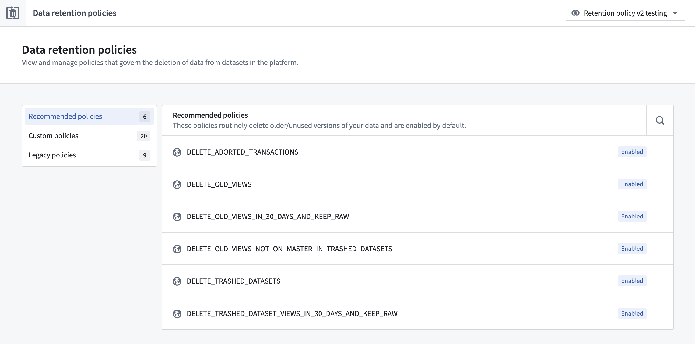

<!-- source: https://palantir.com/docs/foundry/retention/overview/ · mirrored 2026-08-14 from Palantir Foundry docs -->

# Retention

Retention in Foundry is the process that deletes data from datasets in the platform based on **retention policies**. The retention policy is applied for every dataset transaction that occurs. Learn more about [transaction types](/docs/foundry/data-integration/datasets/#transaction-types) in the platform.

The Retention Policies application is accessible from the [space settings page](/docs/foundry/retention/navigation/#access-retention-policies-application) and allows users to create and manage retention policies as part of other platform administration workflows.

The Retention Policies application supports three types of **retention policies**:

1. **Recommended policy:** Retention policies managed by the platform. These policies are not configurable and are designed to only target old versions of data. If your use case requires these policies to be removed, contact your Palantir representative.
2. **Custom policy:** Policies managed by the space administrator using the Retention Policies application.
3. **Legacy policy:** Retention policies managed by space administrators through Code Repositories. Legacy policies are considered deprecated.

## Policy execution

Learn more about how [retention policies are executed](/docs/foundry/retention/policy-execution/).

## Manage retention policies

Learn more about how [retention policies are managed](/docs/foundry/retention/manage-retention-policies/).
