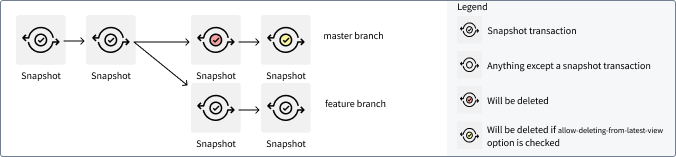
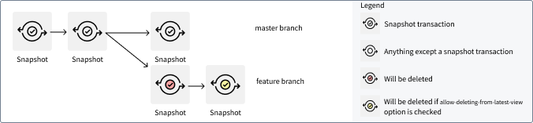
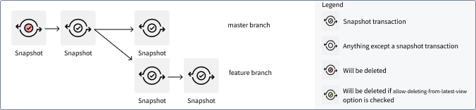
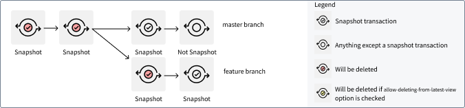

<!-- source: https://palantir.com/docs/foundry/retention/transaction-selectors/ · mirrored 2026-08-14 from Palantir Foundry docs -->

# Transaction selectors

The following list describes the transaction selectors available for use when configuring retention policies in the Retention application.

Text in `this format` represents a parameter that could be defined on each policy.

## Only in branch

Delete transactions that appear **only** in the given branch.

**Takes 1 argument:** `branch`

**Example:** "Only in branch `main`"

Setting "Only in branch `main`" will not delete the first two `SNAPSHOT` transactions as they are also the root transaction for the `SNAPSHOT` transaction on the feature branch.

## Not in branch

Delete all transactions except ones in the given branch.

**Takes 1 argument:** `branch`

**Example:** "Not in branch `main`"

## Transaction count

:::callout{theme="warning"}
The transaction count selector allows you to define the transactions to retain. It is not to indicate the transactions that will be deleted.
:::

Retains only the transactions that are among the `number of transaction to retain` most recent data-containing transactions data on any branch. A transaction is defined to be data-containing if, and only if, the following statements are true:

* The transactions is committed.
* The transaction is not a `DELETE` transaction.

All aborted transactions are not data-containing and will be deleted. As this selector does not differentiate between `SNAPSHOT`, `APPEND`, or `UPDATE` transactions, we recommend using the `viewCount` selector in incremental pipelines.

**Takes 1 argument:** `number of transactions to retain`

**Example:** "transaction count `2`"

This selector ensures that at least `2` `SNAPSHOT` transactions are available on each branch. The feature branch could have 3 transactions; the oldest transaction is also the 2nd transaction on branch `main`, so it is not deleted.

## View count

:::callout{theme="warning"}
The view count selector allows you to define the transactions in views to retain. It is not to indicate the transactions in views that will be deleted.
:::

The view count selector retains only transactions in the last `number of views to retain` [dataset views](/docs/foundry/data-integration/datasets/#dataset-views). As a view is defined to comprise of only committed transactions, any aborted transactions are also deleted. For example, `numViewsToRetain: 1` means that all transactions prior to the latest view (that is, all transactions prior to the latest `SNAPSHOT` transaction) and all aborted transactions are deleted.

**Takes 1 argument:** `number of views to retain`

**Example:** "view count `1`"

## Older than a certain duration

This selects transactions older than the given duration.

**Takes 1 argument:** `duration`

## Has been projected (advanced)

For datasets with [projections](/docs/foundry/building-pipelines/maintaining-incremental-performance/#dataset-projections), this selector selects the transactions that have been propagated to all projections.

## No files in active view (advanced)

This selector selects all transactions that are not in the latest view (as well as all transactions currently in views where all files have been superseded by files in newer transactions). This is useful for datasets which have many transactions in the latest view, and should only be used with the `Allow deletion from latest view` flag.

## Only present in views older than (advanced)

Selects transactions only present in views older than a given duration. A view age is defined as time between the close time of the latest transaction in the view and now. If a view has an open transaction, none of the transactions in that view will be deleted.

**Takes 1 argument:** `duration`

## Is derived (advanced)

Selects transactions which are derived. These are transactions generated from running a build. Transactions created from manually uploading data or through Data Connection are not considered derived.
