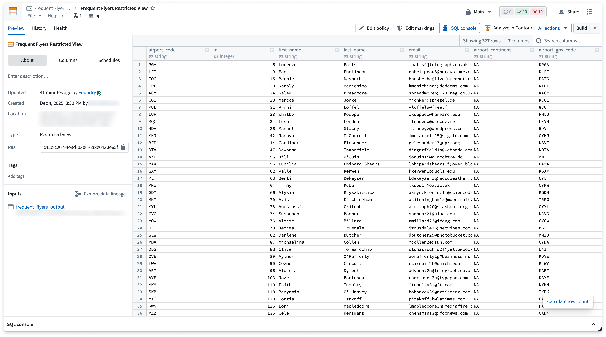
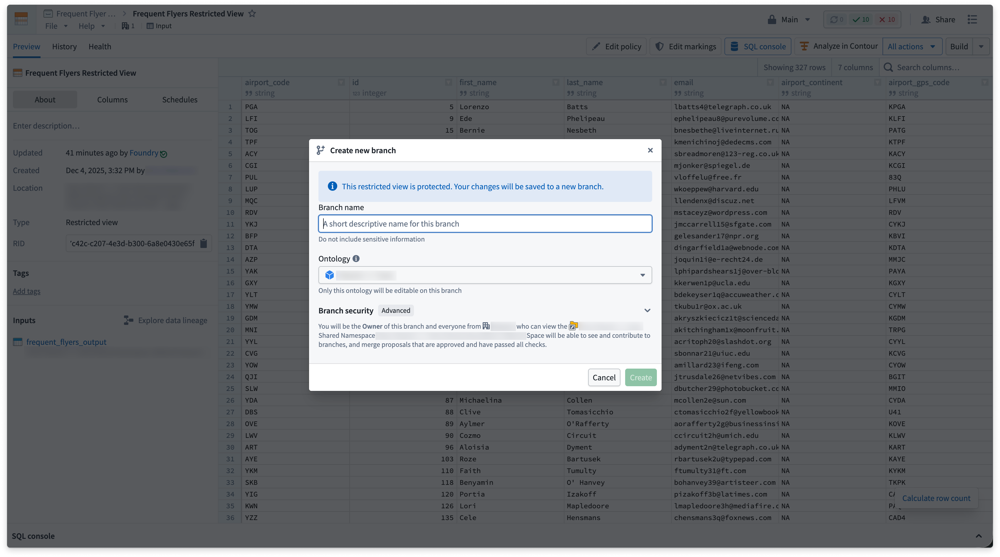
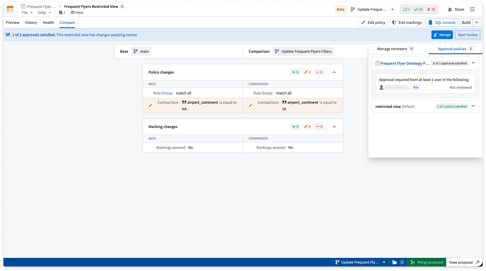
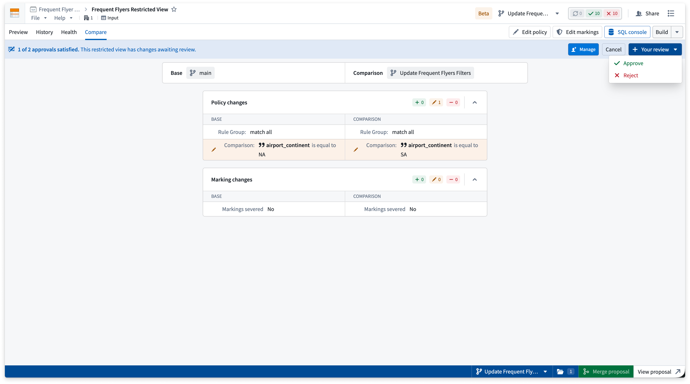
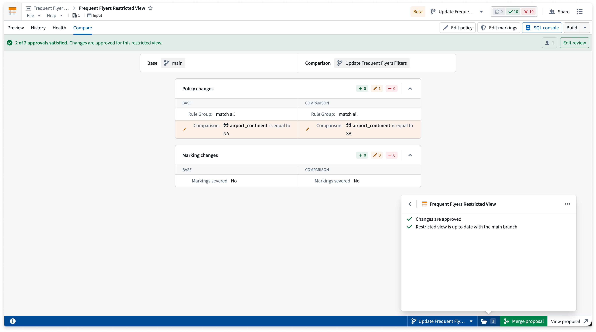
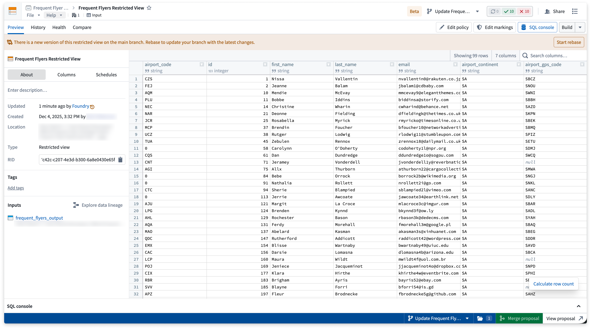
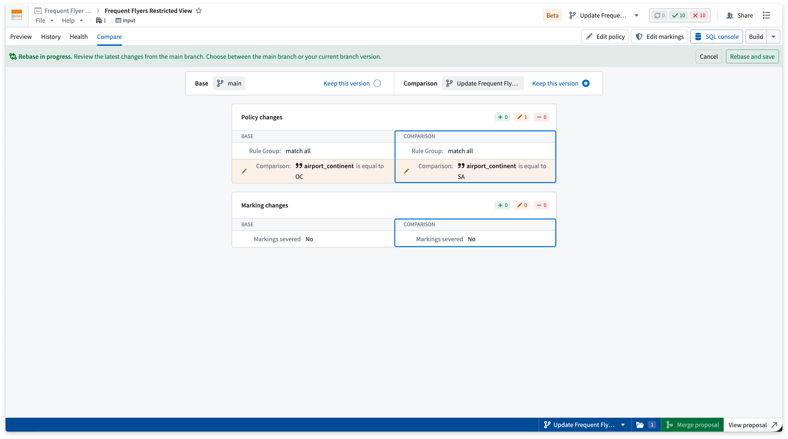

<!-- source: https://palantir.com/docs/foundry/security/branching-restricted-views/ · mirrored 2026-08-22 from Palantir Foundry docs -->

# Branching restricted views

[Restricted views](/docs/foundry/security/restricted-views/) integrate with Global Branching to enable safe, isolated development of granular permissioning policies. This documentation covers how to work with restricted views on branches, including adding, viewing, and removing branched resources, propagating changes downstream, merge requirements, rebasing, and known limitations.

For general information on Global Branching concepts and workflows, refer to the [Global Branching documentation](/docs/foundry/global-branching/overview/).

## Add, view, and remove resources

### Add a restricted view to a branch

To add a restricted view to a branch, select the branch from the branch selector, then select **Add resource** to add the restricted view to the branch. This allows you to build the restricted view or modify its policy and markings on your branch. The branch must already exist on the backing dataset, or you may receive an error.

By default, accessing a restricted view on a branch displays content from the `main` branch. If you are already on a branch and edit the restricted view's policy or markings, the restricted view is automatically added to the branch with those edits.

By default, owners and editors can add a restricted view to a branch. Owners can edit the policy and markings when adding the restricted view to the branch, while editors can only build the restricted view. This allows editors to add the restricted view to their branched workflow and test it without needing ownership of the restricted view.

:::callout{theme="neutral"}
Adding a restricted view to a branch automatically builds the restricted view on the branch. If the restricted view backs any object types, those object types are also automatically re-indexed on the branch to reflect the change.
:::

### View a branched restricted view

The permissions on a branched restricted view are the same as the parent restricted view. If you can view the original restricted view, you can view its branched versions.

:::callout{theme="warning"}
If the backing dataset on a branched restricted view has different markings than on `main`, a viewer may be able to see data that was previously restricted on `main`. Confirm that branch-level marking changes are appropriate before sharing the branch. See [Known limitations](#known-limitations).
:::

### Remove a restricted view from a branch

You can remove a restricted view from a branch when you no longer need it. Removing a restricted view from a branch discards any branch-only changes to its policy, markings, or build outputs, and reverts the branch to reading the restricted view from `main`. The restricted view on `main` is unaffected.

:::callout{theme="warning"}
Removing a restricted view from a branch cannot be undone. Any branch-only edits to the policy, markings, or build outputs are discarded.
:::

To remove a restricted view from a branch, open the branch taskbar and select the branch. Locate the restricted view in the list of modified resources and select **Remove from branch** in the action menu, then select **Confirm** to complete the removal.

## Propagate changes

If a restricted view is updated on a branch, object types backed by the restricted view need to be indexed on the branch to reflect these changes. In Ontology Manager, use the **Index object type** option on the top banner to index the object type on the branch. Once indexed, Workshop modules referencing these objects and Ontology Manager reflect the restricted view changes on the branch.

## Merge requirements

Before a restricted view can be merged to `main` from a branch, the following requirements must be met:

* **Approvals are satisfied:** All required [approvals](/docs/foundry/approvals/overview/) for the branched restricted view must be satisfied before the branch can be merged. See [Reviewer experience](#reviewer-experience) below.
* **Restricted view is rebased with `main`:** Before merging, if changes have been made on the `main` branch of the restricted view, rebase those changes onto your branch. See [Rebasing and conflict resolution](#rebasing-and-conflict-resolution) below.

### Protected restricted views

To guarantee that all edits to a restricted view go through the branching and review process, you can protect the `main` branch of that restricted view.

To protect the restricted view `main` branch, navigate to the resource in the file system and select **Branch protection > Protect with project policy**.

When the `main` branch of a restricted view is protected, editing its policy or markings on `main` requires users to go through a global branch on save.

### Reviewer experience

Editors can only build restricted views on a branch, while owners can build restricted views and modify their policies and markings on a branch.

Once a proposal is created, reviewers can be added to the restricted view in the Global Branching application or via the Approvals banner. Users added as reviewers receive an email requesting their review with a link to the proposal.

Select **Manage** to add reviewers and view the approval policies that must be satisfied before the proposal can be merged.

When a restricted view has changes awaiting review, a banner at the top of the page displays the number of approvals satisfied. Reviewers can select **Start review** to open the **Compare** tab and view a side-by-side comparison of `main` versus the branch changes. They can then approve or reject the changes by selecting the **Your review** option.

Once all required approvals are satisfied, the changes are approved and the proposal can be merged for this resource.

## Rebasing and conflict resolution

Rebasing is required when `main` has been modified since your branch was created or last rebased.

A banner appears at the top of the restricted view prompting you to rebase your branch with the latest changes.

To rebase your branch, select **Start rebase** in the banner. The **Compare** tab opens with the rebase in progress, showing a side-by-side comparison of the main branch and current branch versions. For each change, select **Keep this version** on either the **Base** (main branch) or **Comparison** (current branch) column, then select **Rebase and save** to apply your selections.

:::callout{theme="neutral"}
If both rebasing and approval are required, the rebase must be resolved before reviewers can review the changes.
:::

## Known limitations

* If the backing dataset on a branched restricted view has different markings than on `main`, a viewer may be able to see data that was previously restricted on `main`. See [View a branched restricted view](#view-a-branched-restricted-view).
* Rebasing requires you to choose either the changes from `main` or the changes on your branch. There is currently no way to resolve diffs at a finer granularity.
* Some backing datasets cannot be branched. Datasets backing edit-only workflows, datasets created by importing, or datasets built from a Fusion sheet cannot currently be added to a branch, so restricted views relying on such datasets cannot be built on a branch. Refer to the [Global Branching integrations documentation](/docs/foundry/global-branching/integrations/) for the full list.
