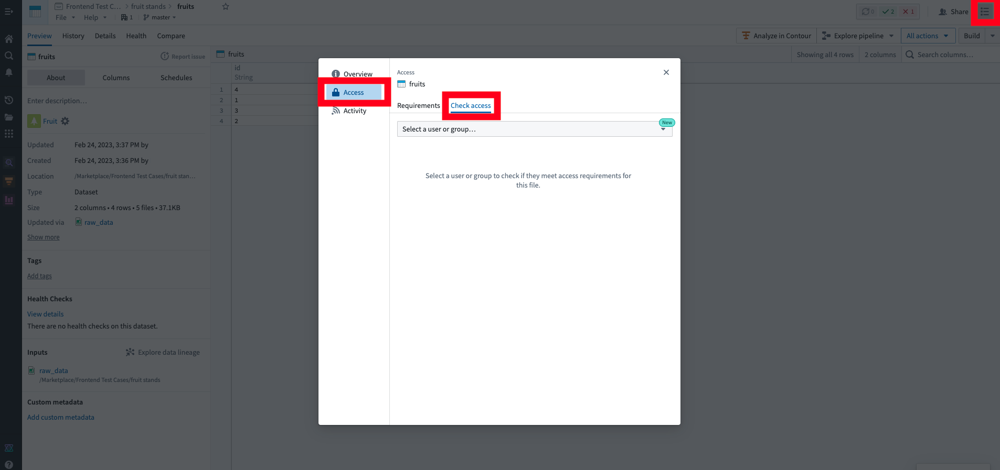
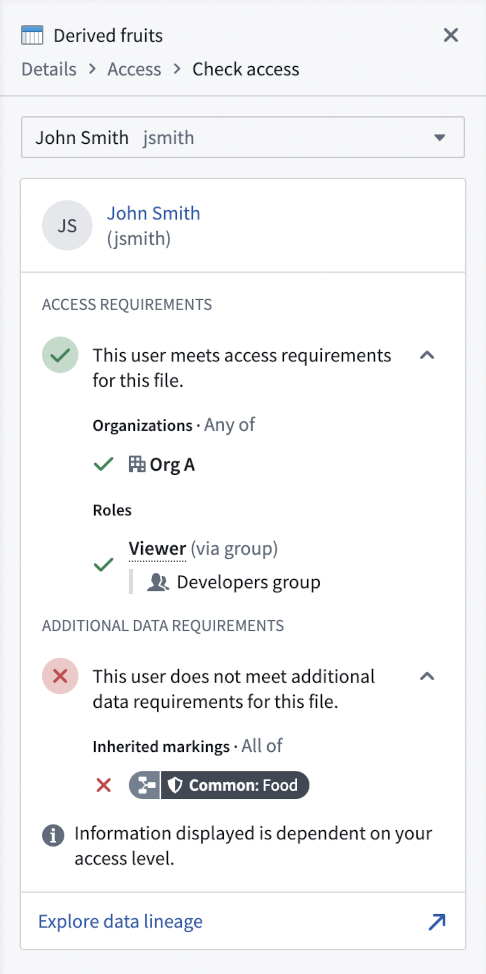
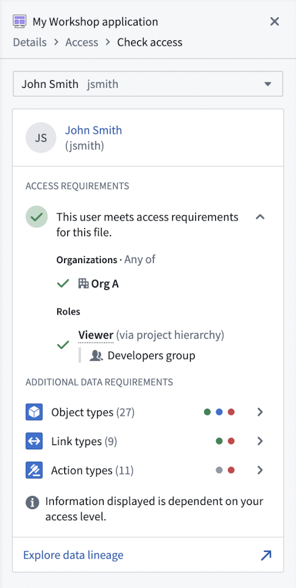
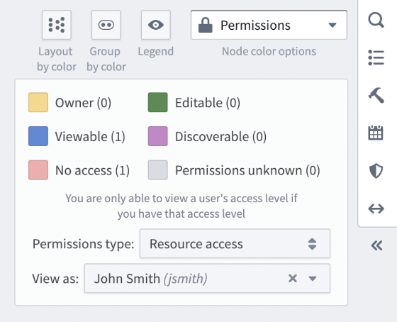
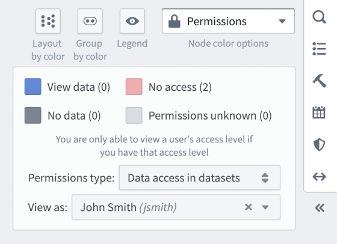
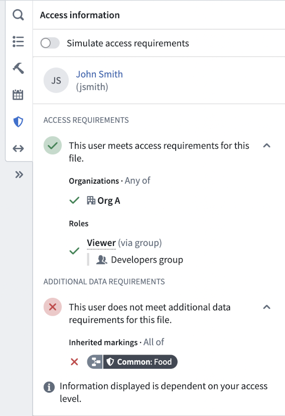
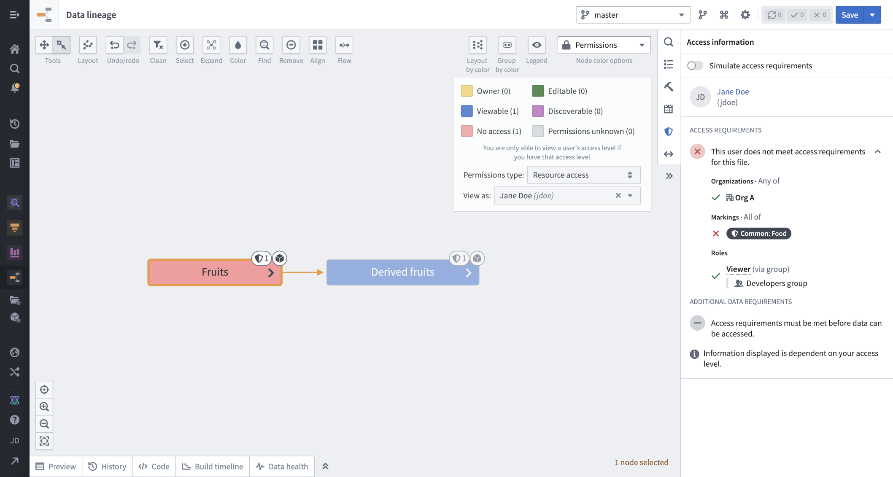
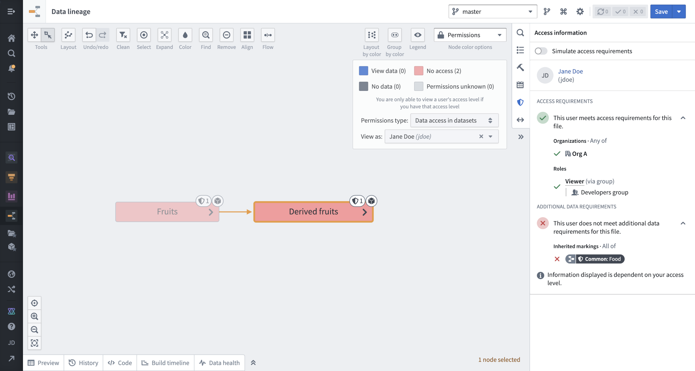
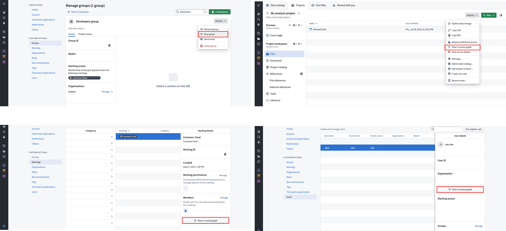
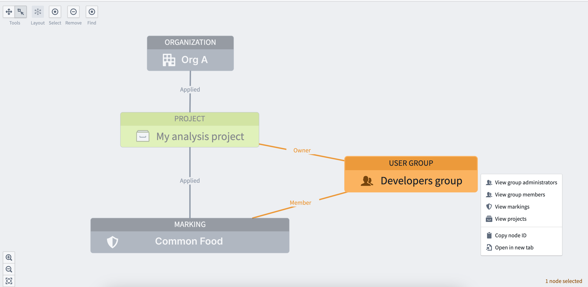

<!-- source: https://palantir.com/docs/foundry/security/checking-permissions/ · mirrored 2026-08-12 from Palantir Foundry docs -->

# Checking Permissions

You can check someone's permissions on a Project, folder, or file by using the **Check access** panel in the workspace sidebar or the Data Lineage tool.

## Check access panel

To explore a user's permissions in more detail, use the **Check access** panel in the sidebar. On a Project, folder, or file, open the sidebar, then select **Access > Check access**. This panel is sometimes referred to as the "Access checker".

### Access requirements and additional data requirements

The **Check access** panel can be used to confirm if a user meets the access requirement for the Project, folder, or file. Displayed under **Access requirements**, this includes:

1. Satisfying the Organization and Marking requirements.
2. Having one or more roles (directly, via a group, or a default role).

In addition to the access requirements described above, certain files may require additional permissions, which are listed under **Additional data requirements**. For example:

* A dataset that inherits Markings through lineage requires access to those Markings to see the dataset's data.
* A Workshop module that displays a table of objects requires access to the object type & its datasources.

### Check access examples

In this first example, notional user *John Smith* meets access requirements for this dataset, but doesn't meet the additional data requirements because of the `Common: Food` Marking inherited through lineage. This means that he can see the dataset and its metadata, but not its data.

In this second example, *John Smith* also meets the access requirements for this Workshop module. The Workshop module uses object types, link types, and action types that *John Smith* will need access to in order to use the module; these elements are listed under **Additional data requirements**. *John Smith* has access to some of these elements but not all (as indicated by the colored dots); clicking the right-arrow icon allows you to examine these more closely.

## Data Lineage

In addition to the **Check access** panel in the sidebar, you can visualize someone's access across complex data pipelines using the Data Lineage tool.

You can access this view by clicking on **Explore data lineage** from the **Check access** panel, or by selecting **Permissions** as the **Node coloring option** next to the right toolbar in the Data Lineage tool. This offers two sub-options:

* **Resource access:** Nodes in the graph are colored based on whether the user meets the access requirements.

* **Data access in datasets:** Nodes in the graph are colored based on whether the user meets the additional data requirements. This is only supported for datasets.

In addition, you can select a node in the graph and open **Access information** in the right sidebar to find the same information as in the **Check access** panel.

### Data Lineage example

In this example, the notional user *Jane Doe* meets the access requirements of one of the datasets in the pipeline, but not the other. In the **Access information** panel, we can see that Jane does not meet the access requirements of the `Fruit` dataset because she does not have access to the necessary Marking (`Common: Food`).

We can also see that Jane does not meet the additional data requirements for any of the datasets in the pipeline. When checking in the **Access information** panel, we can see that Jane does not meet the additional data requirements for the `Derived Fruit` dataset because she doesn't have access to the inherited Marking (`Common: Food`).

For more information, see the [Data Lineage documentation](/docs/foundry/data-lineage/overview/).

## Access graph

While Data Lineage can be used to visualize a user’s access to resources across complex data pipelines, access graph can be used to visualize relationships between entities like Projects, users, groups, and markings to aid in checking permissions.

You can access this view from any of the entry points shown below:

### Access graph example

In this example, we want to check what markings and groups are associated with the notional `My analysis project`. The access graph view shows this information below. Select any node in the graph to show a menu that allows a user to expand to related entities. For example, to know what users have membership in the `Developers` group, select that node and expand into the node's related entities.

