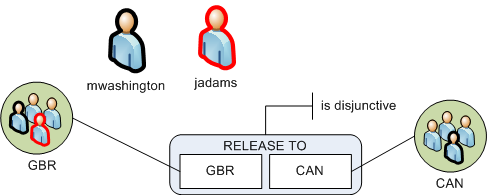
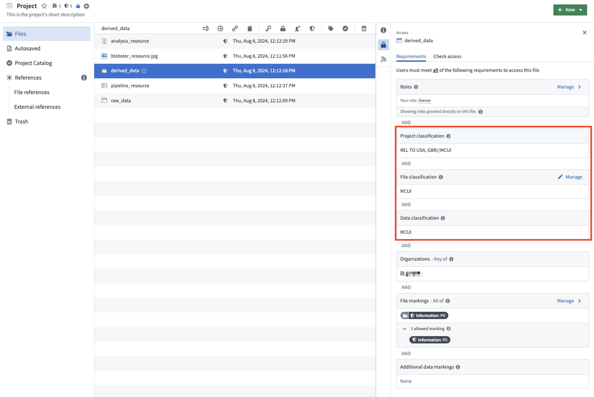
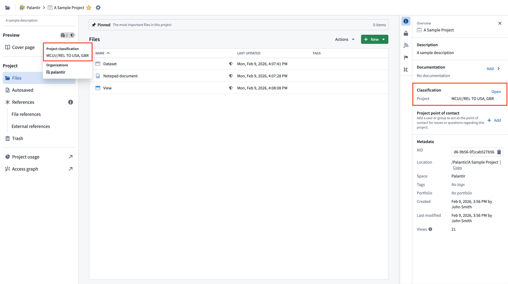
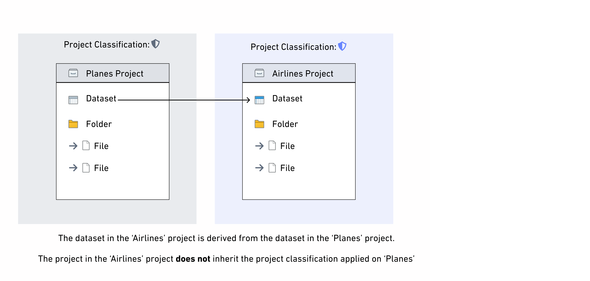
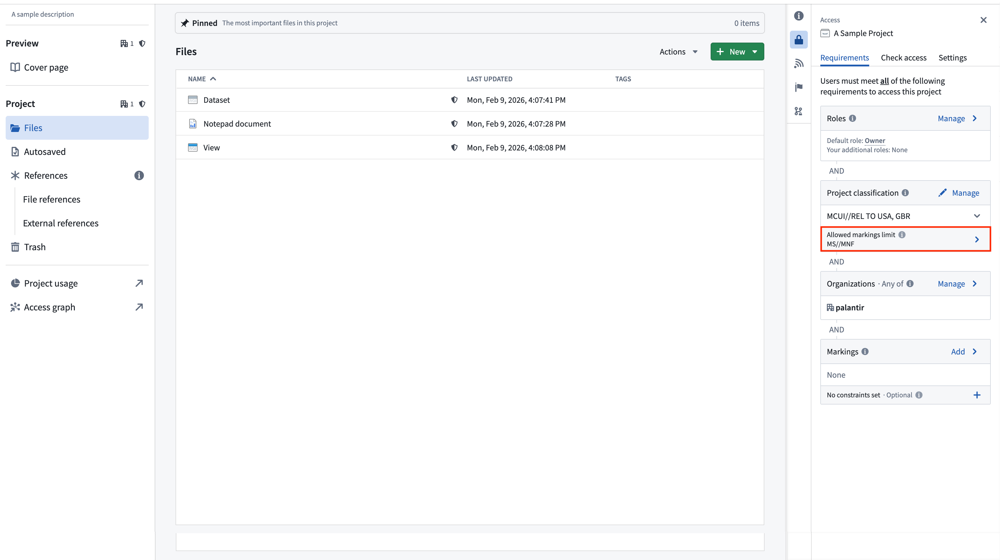

<!-- source: https://palantir.com/docs/foundry/security/classification-based-access-controls/ · mirrored 2026-08-12 from Palantir Foundry docs -->

# Classification-based Access Controls

:::callout{theme="neutral"}
Classification-based Access Controls are not enabled by default on Foundry. Classification markings can differ between institutions and can therefore be configured differently between Palantir environments. Configuration of classification markings requires Palantir involvement.
:::

Classification-based Access Controls (CBAC) are mandatory controls used to protect sensitive government information. CBAC markings, also known as classification markings, restrict access by requiring a user to have a particular classification marking in order to access information.

Access to classification markings may correlate with security clearance processes taking place outside the Palantir platform. As with mandatory controls generally, classification markings can be combined with other access requirements like [discretionary roles](/docs/foundry/security/projects-and-roles/#roles) and [mandatory markings](/docs/foundry/security/markings/) that may be applied to a resource.

## Key characteristics of classification markings

There are three notable characteristics that are specific to classification markings:

* **Hierarchy:** A common use case for classification markings is restricting access to sensitive information where sensitivity of information is defined in a hierarchical way. For example, you might have a group of users who are only eligible to access sensitive data marked as Secret or below. Another group of users can be eligible to access sensitive information marked as Top Secret or below, which can include Secret data.
* **Disjunctive elements in classification markings:** Non-classification markings work conjunctively - a user needs to have all markings applied to a resource for access. Classification markings can have disjunctive components, where users belonging to one of the groups in the classification marking's disjunctive components can satisfy the CBAC access condition. This is commonly used to define releasability, such as sharing between different organizations or countries. For example, users from either `country A` OR `country B` can satisfy the disjunctive element in a classification marking (see [below](#conjunctive-and-disjunctive-classification-marking-categories)).
* **Classification markings ubiquity:** Environments that use CBAC mandatory controls require all Projects to have a [Project classification](#project-classification) set. Additionally, all datasets are required to have a data classification which means raw datasets (that is, datasets with no inputs) are required to have a [file classification](#file-and-data-classification).

## Key concepts

### Classification markings

Classification markings are configured in categories. For example, one category might define the type of data, and another category might describe how that data should be disseminated (i.e. shared).

A classification can have multiple classification markings. A classification can be made up of classification markings from different categories. Rules on what constitutes valid combinations of classification markings can be configured by Palantir and enforced in platform.

#### Conjunctive and disjunctive classification marking categories

A defining feature of classification marking categories is that they can support disjunctive (`OR`) behavior. When a category is conjunctive (`AND`), a user must have access to all classification markings used from that category to access the classified data. When a category is disjunctive, a user can be authorized to access marked classified data by having any one marking of that category.

The components of an entire classification are combined conjunctively. This means that if a classification contains classification markings from multiple categories, a user must satisfy all components from each of the classification markings category to access the data.

Consider a simple configuration where there is a single category and two classification markings. The following simple configuration has two users: Martha Washington (`mwashington`) and John Adams (`jadams`).

The `mwashington` user belongs to both the `GBR` and `CAN` classification marking groups. The user `jadams` belongs to the `GBR` group only. The `RELEASE TO` category is disjunctive, meaning that users must have access at least one marking. In a disjunctive category, a user who has access to one marking from the classification marking can view data even if it is also labeled with other markings from the same category. This means that data classified with `GBR`, `CAN` can be viewed by either `mwashington` or `jadams` because both users have access to at least one of those markings.

The previous example is a single category in isolation. In practice, a classification marking can contain multiple categories of markings.

### File and data classification

File classification is the classification that users must satisfy to discover the file. This restriction is in addition to other requirements, such as the project's classification and project or file mandatory markings.

Data classifications apply to certain types of files, such as datasets. Data classification refers to the classification that users must satisfy to view the data in the file. Users must satisfy the data classification in order to view the data within the file, but it does not affect their ability to discover the existence of the dataset and view its metadata (such as name, description and schema). The data classification cannot be edited directly; instead, the data classification is formed by combining:

* The resource's file classification, if it has been set.
* The data classifications of all upstream [data dependencies](/docs/foundry/security/markings/#data-dependency).

This means the data classification is always at least as strict as the file classification and the data classifications of all of the upstream data dependencies.

File, data, and project classification are communicated in the Palantir platform alongside other applicable access requirements. Unlike data classification, which is automatically inherited, file classification can be edited in the resource sidebar as shown below.

A new non-derived dataset with no input upstream datasets requires the creating user to set a file classification.

### Project classification

Project classifications control who is able to discover a project and access the resources inside of it. In order to access a resource, a user must satisfy the resource's project classification and the resource's file and data classification. All projects in environments that use classification markings are required to have a project classification. A classification must be selected on project creation. Note that classifications can be updated, but not removed.

Project classifications do not affect the data classification of datasets in a project, so project classifications are not inherited along data dependencies. If there are derived downstream datasets in other projects, only the *data* classification is inherited. This is different from the behavior of project markings, which are inherited by downstream datasets.

### Project maximum classification

Project maximum classifications specify the maximum classification for all resources inside of a project. Project maximum classification is also referred to as the "allowed marking limit". Resources with a higher data or file classification cannot be created or moved into a project with a lower maximum classification. Resources with a classification that is lower than or equal to the project’s maximum classification can exist in the project, but these resources will only be visible to users who satisfy the overall project classification.

Project maximum classifications are equal to the project classification by default at project creation, but they can be edited or removed independently of the project classification.

Removing a project's max classification may be required to add object or link types to a project. Note though that if an object or link type is in a project, it will fail to materialize if it lacks a file classification.

If a higher classification is added as a file classification on an upstream dataset in a different project and inherited as a data marking by a dataset within that project, that data marking will violate the project maximum classification. If this happens, the data will continue to be protected by the higher classification, but a warning will be displayed and it will not be possible to build the dataset or any downstream resources in the project until the violation is resolved. This violation can be resolved by fixing the classification on the upstream dataset and removing that upstream dataset as an input and rebuilding the dataset, or by updating the project's maximum classification. This is the same behavior as [project constraint violations](/docs/foundry/platform-security-management/manage-project-constraints/#project-constraint-violations).
