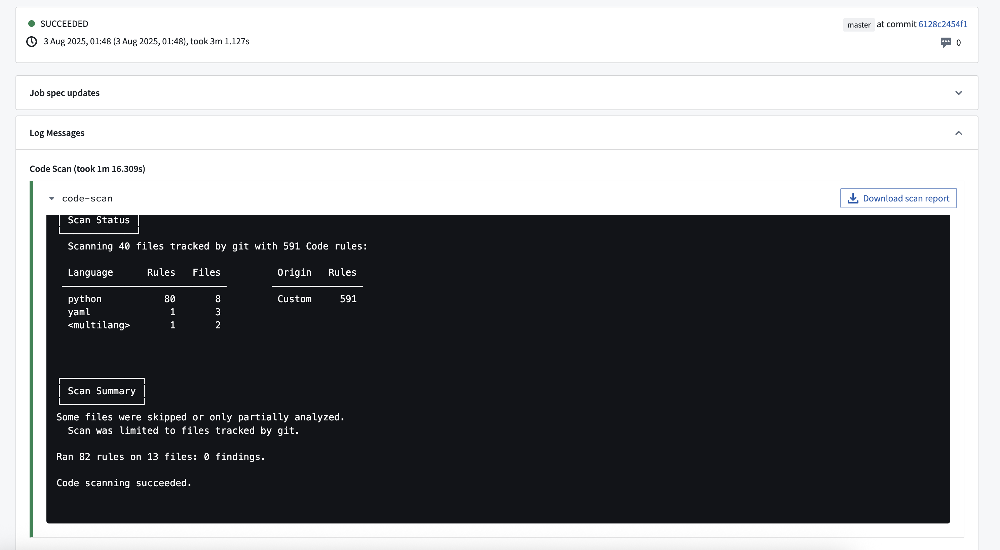

<!-- source: https://palantir.com/docs/foundry/security/code-scanning-overview/ · mirrored 2026-08-22 from Palantir Foundry docs -->

# Code scanning

Code scanning is a static analysis tool integrated into our continuous-integration system, Jemma, that automatically analyses code for vulnerabilities, code smells, and adherence to coding standards. This feature is designed to enhance code quality and security by providing actionable insights.

## Key features

* Triggered on every commit, before checks are run.
* Supports multiple programming languages and file types.
* Provides insights into detected issues with severity levels.
* Seamlessly integrated into Jemma for continuous feedback.

## How it works

If enabled by your enrollment administrator, every commit in a repository will trigger a code scan. This will analyze the codebase for potential vulnerabilities and code quality issues. Any findings will be displayed in Checks, and a downloadable report will be generated.

During a scan, a set of pre-configured rules is applied to the codebase and violations are flagged by the system. By default, [a set of SAST rules are applied ↗](https://gitlab.com/gitlab-org/security-products/sast-rules). An enrollment administrator can turn individual rules off and add custom rules for the enrollment. Learn more about [managing code scanning rules](/docs/foundry/security/manage-code-scanning-rules/).

After a scan is run, Jemma will continue running checks on the commit if no findings are detected; otherwise, the checks will fail. An enrollment administrator can change this behavior so that findings will result only in a warning, and checks will proceed.

## Access scan results

1. Navigate to **Checks**.
2. Select the relevant build.
3. Expand the **Code scan** tab to view the detailed report. A sample report is shown in the screenshot below. You can also **Download scan report** as a JSON file to your local machine.

