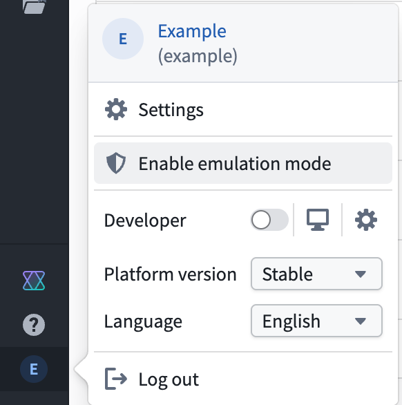
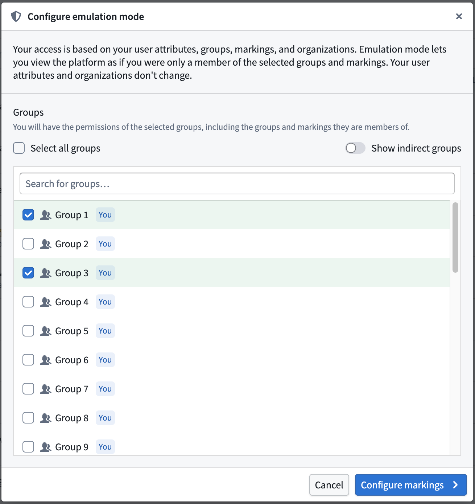
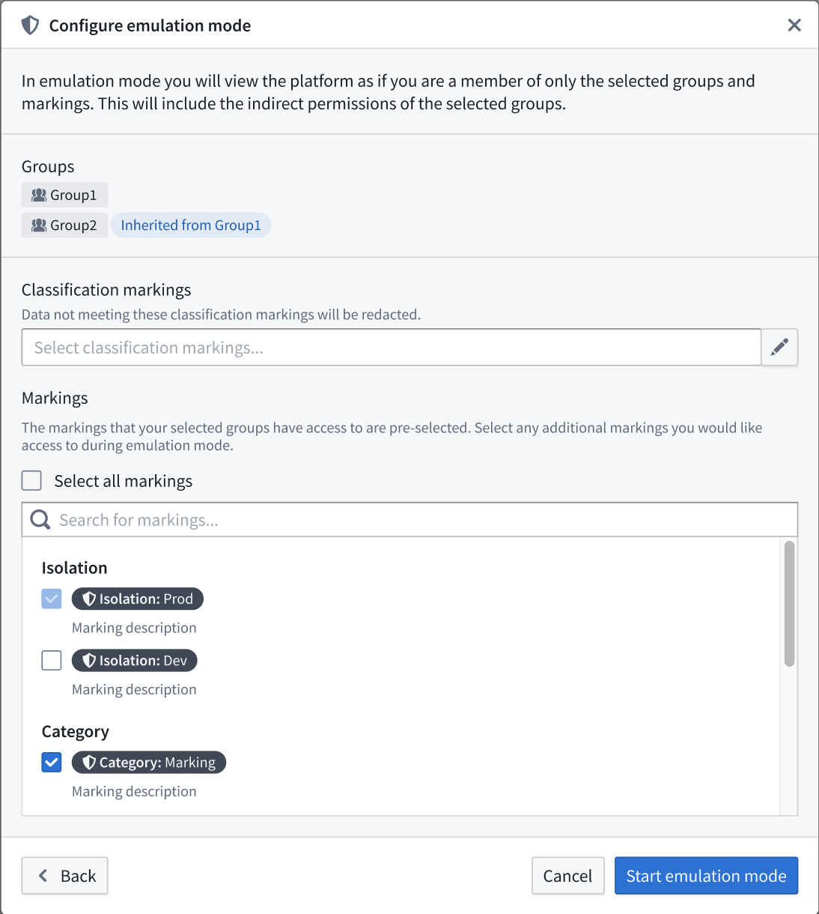
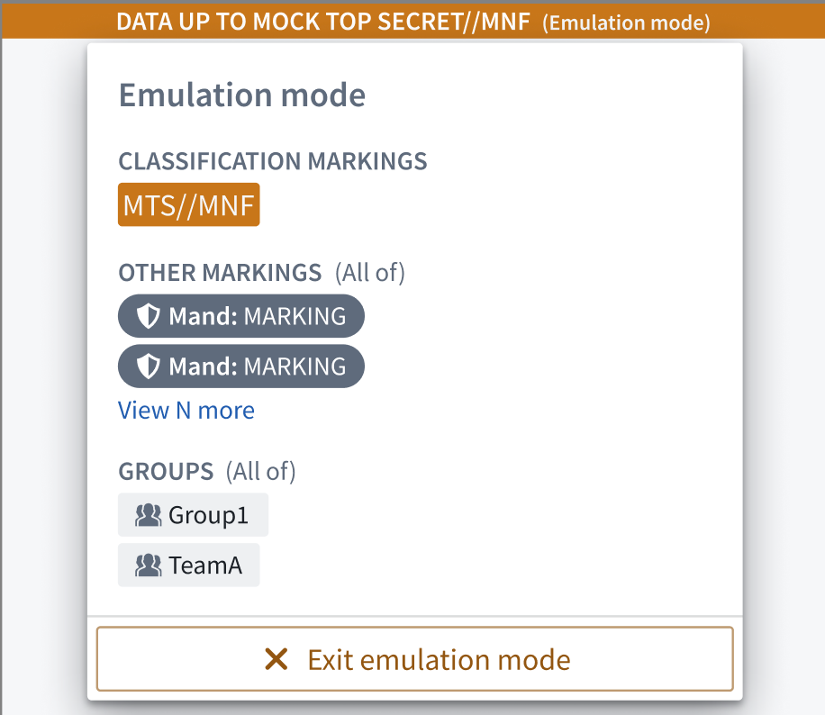
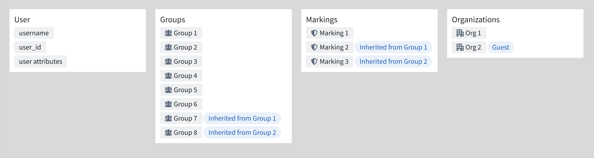
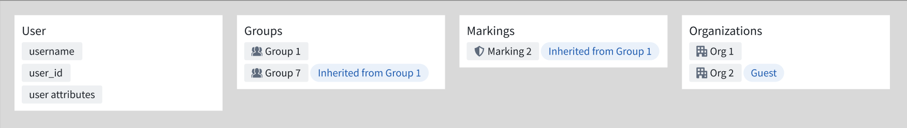

<!-- source: https://palantir.com/docs/foundry/security/emulation-mode/ · mirrored 2026-08-22 from Palantir Foundry docs -->

# Emulation mode

:::callout{theme="neutral" title="Beta"}
Emulation mode is in the [beta](/docs/foundry/platform-overview/development-life-cycle/) phase of development and may not be available on your enrollment. Functionality may change during active development.
:::

Use emulation mode to create a scoped Foundry session that allows you to test platform behavior based on a subset of your existing groups and markings. This can be very useful when testing workflows before releasing to end-users.

## Configuration

To enable emulation mode, select **Account > Enable emulation mode** from the bottom of the workspace navigation sidebar.

This will launch a dialog that allows you to start configuring your emulation mode session.

### Select groups

Search for and select the groups you want your session to retain, then select **Configure markings**.

:::callout{theme="neutral"}
Leaving your group selection empty is valid. If you do not select any groups, then your emulation mode scoped session will behave as if you are not a member of any groups.
:::

### Select markings

Review the **Inherited markings** based on the groups you configured in the previous step. Next, search for and select additional markings before choosing **Start emulation mode**.

## Experience while in emulation mode

Once you start emulation mode, Foundry displays a banner at the top of the page which you can select to see the groups and markings that are active as part of the scoped session.

Emulation mode persists across all resources in Foundry, so what you are able to see in all applications is limited to the permissions you have configured. This includes your [role](/docs/foundry/security/projects-and-roles/#roles) grants on files, the rows you can see in a [restricted view](/docs/foundry/security/restricted-views/), the objects within an object type governed by an [object security policy](/docs/foundry/object-permissioning/object-security-policies/), and the [actions](/docs/foundry/action-types/overview/) where you satisfy [their submission criteria](/docs/foundry/action-types/submission-criteria/).

## Exit emulation mode

To end your emulation mode session, select **Exit emulation mode** from either the banner popover or your user account menu.

If you have access to multiple [scoped sessions](/docs/foundry/security/markings/#use-scoped-sessions), Foundry prompts you to choose one. Otherwise, exiting emulation mode restores your full permissions.

## Example emulation mode configuration

Imagine your permission setup resembles the user attributes, groups, markings, and organizations depicted in the image below, where you are a member of eight distinct groups, have access to three markings, and belong to one organization with `Guest` access to another.

If you select only **Group 1** when configuring emulation mode, you will view the platform with the permissions depicted in the image below. Your user attributes and organizations remain the same, and you retain the group and marking access that comes with **Group 1** membership, such as inheriting **Group 7** membership and inheriting access to resources with **Marking 2**.

Foundry determines what resources you can access based on your [user attributes](/docs/foundry/authentication/saml-getting-started/#user-attributes), [groups](/docs/foundry/security/users-and-groups/#groups), [markings](/docs/foundry/security/markings/), and [organizations](/docs/foundry/security/orgs-and-spaces/). Emulation mode does not change your organizations or user attributes.
