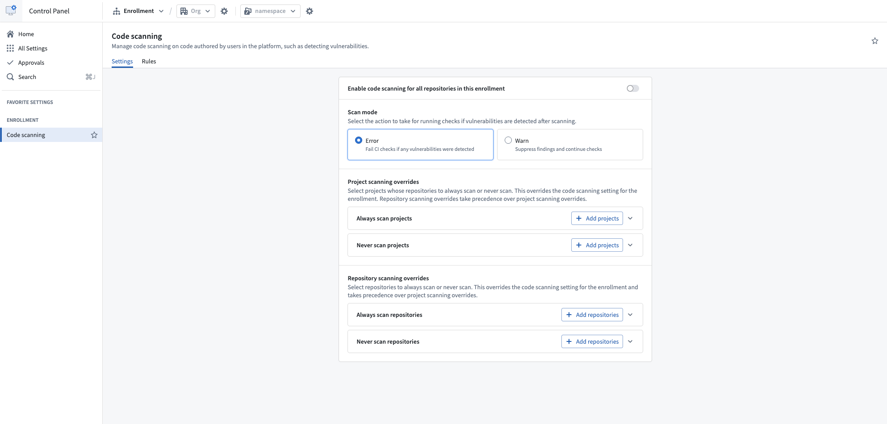
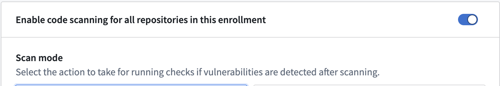
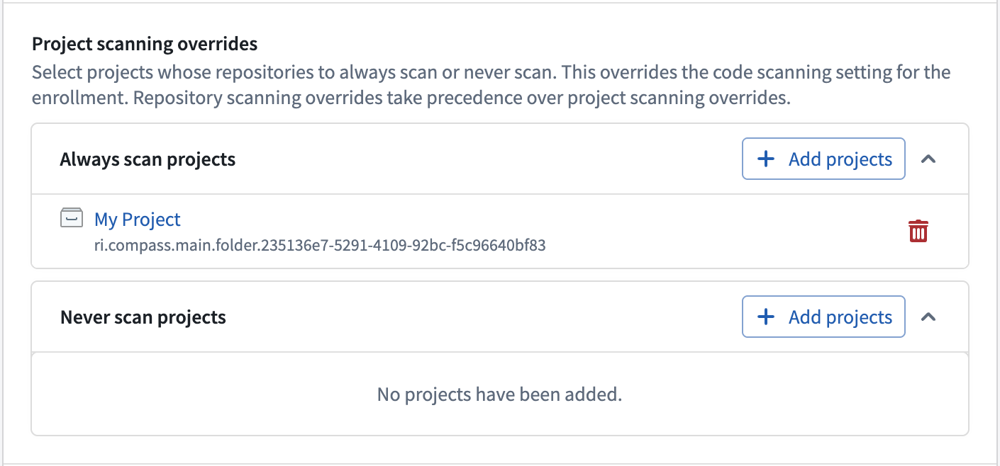
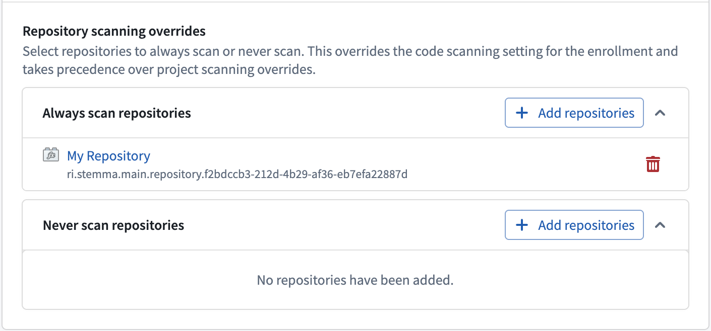
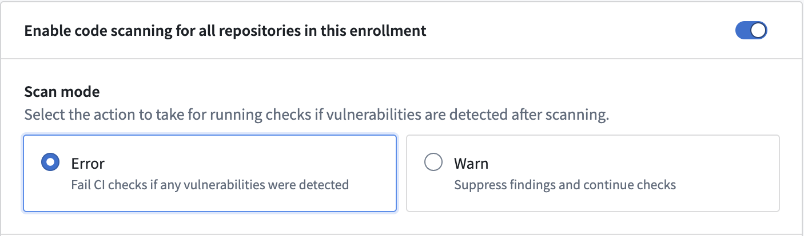

<!-- source: https://palantir.com/docs/foundry/security/enable-code-scanning/ · mirrored 2026-08-22 from Palantir Foundry docs -->

# Enable code scanning

As an enrollment admin, you can turn scanning on for repositories in your enrollment through Control Panel.

Find the **Code scanning** settings page by following the instructions below:

1. Navigate to **Control Panel** for your enrollment.
2. From the left sidebar, choose **All Settings**.
3. Scroll to **Security & Governance > Code scanning**.

To enable code scanning for all the repositories in your enrollment, toggle the option on.

To review or change the rules that scans apply, select the **Rules** tab. Learn more about [managing code scanning rules](/docs/foundry/security/manage-code-scanning-rules/).

## Scanning overrides

If you would rather enable or disable code scanning for a selected number of projects or repositories, use the override sections. Overrides apply regardless of the enrollment-wide setting, and are resolved from the most specific match to the least specific:

| Precedence | Setting | Description |
| --- | --- | --- |
| 1 | Repository scanning overrides | Applies to a single repository. Takes precedence over both the project override and the enrollment-wide setting. |
| 2 | Project scanning overrides | Applies to every repository in a project. Takes precedence over the enrollment-wide setting. |
| 3 | Enrollment-wide setting | Applies to every repository that no override covers. |

For example, if a project is added to **Never scan projects** and one repository in that project is added to **Always scan repositories**, only that repository is scanned.

### Project scanning overrides

To enable or disable code scanning for every repository in a project, add the project to the **Always scan projects** or **Never scan projects** sections.

Repositories in a project listed under **Always scan projects** are scanned for vulnerabilities, even if code scanning is not enabled for your enrollment. Conversely, repositories in a project listed under **Never scan projects** are not scanned, regardless of your enrollment’s code scanning status.

### Repository scanning overrides

If you would rather enable or disable code scanning for a selected number of repositories, add repositories to the **Always scan repositories** or **Never scan repositories** sections.

Repositories included in **Always scan repositories** will be scanned for vulnerabilities, even if code scanning is not enabled for your enrollment. Conversely, repositories listed under **Never scan repositories** will not be scanned for vulnerabilities, regardless of your enrollment’s code scanning status.

## Scan modes

Scan modes determine what happens to checks if vulnerabilities are detected after a code scan is completed.

* **Error:** In error mode, checks will fail if vulnerabilities are detected. The user is required to fix the issues and re-run checks.
* **Warn:** In warn mode, checks will proceed, and detected vulnerabilities will be ignored.

