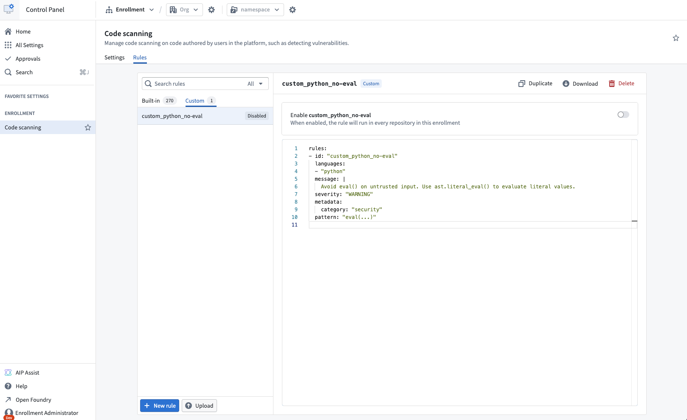

<!-- source: https://palantir.com/docs/foundry/security/manage-code-scanning-rules/ · mirrored 2026-08-16 from Palantir Foundry docs -->

# Manage code scanning rules

Every [code scan](/docs/foundry/security/code-scanning-overview/) applies a set of rules to your code. Each rule describes one pattern to look for, the message to show when that pattern is found, and how severe the finding is.

As an enrollment administrator, you can review the rules that apply to your enrollment, turn individual rules off, and add rules of your own. Rules are managed per enrollment, so a change applies to every repository that code scanning covers.

## Rule types

| Type | Description | Available actions |
| --- | --- | --- |
| Built-in | The default rule set that Palantir maintains and updates. | Enable, disable, duplicate, download |
| Custom | Rules that you add for your enrollment. | Enable, disable, duplicate, download, edit, delete |

Built-in rules cannot be edited or deleted. To change what a built-in rule reports, duplicate it and edit the copy, then disable the original.

## Find the rule list

1. Navigate to **Control Panel** for your enrollment.
2. From the left sidebar, choose **All Settings**.
3. Scroll to **Security & Governance > Code scanning**.
4. Select the **Rules** tab.

The **Built-in** and **Custom** tabs list the rules of each type. To narrow the list, enter a term in the search field or choose **All**, **Enabled**, or **Disabled** from the status filter. Select any rule to view its definition.



## Enable or disable a rule

Every rule carries an **Enabled** or **Disabled** label. Use the toggle in the rule view to change its state. You can toggle both built-in and custom rules.

Disabling a rule stops it from running in every repository in the enrollment, so you are asked to confirm before the change is applied. Enabling a rule takes effect immediately.

:::callout{theme="neutral"}
Disabling a rule does not remove earlier findings from completed scans. The rule is skipped from the next scan onward.
:::

## Add a custom rule

1. From the **Custom** tab, select **New rule**.
2. Replace the template in the editor with your rule definition.
3. Select **Save**.

A new custom rule is enabled as soon as it is saved, and applies from the next scan in every repository that code scanning covers. Disable the rule if you want to add it without running it yet.

Foundry validates the definition when you save and only accepts valid rules.

### Rule file requirements

Custom rules use the same format as the built-in rules, which follow the [Semgrep rule syntax ↗](https://semgrep.dev/docs/writing-rules/rule-syntax). Each definition must be a valid Semgrep rule and meet the following additional requirements:

* Contain exactly one rule.
* Specify an `id`, which becomes the name shown in the rule list. Use only letters, numbers, periods, underscores, and hyphens.
* Use an `id` that no other custom rule in the enrollment uses. A custom rule may reuse the name of a built-in rule.

The following example flags calls to `eval` in Python files:

```yaml
rules:
  - id: custom_python_no-eval
    languages:
      - python
    message: |
      Avoid eval() on untrusted input. Use ast.literal_eval() to evaluate literal values.
    severity: WARNING
    metadata:
      category: security
    pattern: eval(...)
```

## Duplicate a rule

Select **Duplicate** in the rule view to create an editable copy. The copy is always a custom rule, even when the original is built-in, and it is not linked to the rule you copied. Give the copy a new `id` before you save it.

## Edit a custom rule

1. Select the rule in the **Custom** tab.
2. Change the definition in the editor. The rule is marked **Unsaved** as soon as you make a change.
3. Select **Save** to apply the change, or **Cancel** to discard it.

To rename a rule, change its `id`. The name in the rule list is taken from the definition, so both stay consistent.

## Upload and download rule definitions

Select **Download** in the rule view to save a rule definition as a `.yml` file. Both built-in and custom rules can be downloaded.

To add a rule from a file, select **Upload** above the rule list and choose a `.yml` or `.yaml` file. The contents open in the editor as a new custom rule. Review the definition, then select **Save**.

## Delete a custom rule

Select **Delete** in the rule view, then confirm. Deletion is permanent, and the rule stops running on every repository in the enrollment. To stop a rule temporarily without losing it, disable it instead.

## Rules and scanning settings

Rules determine what a scan reports. They do not determine which repositories are scanned, which is controlled by the settings described in [Enable code scanning](/docs/foundry/security/enable-code-scanning/). A rule only produces findings in repositories that code scanning covers.

If every rule is disabled, scans still run and complete with no findings.
