<!-- source: https://palantir.com/docs/foundry/security/markings/ · mirrored 2026-08-12 from Palantir Foundry docs -->

# Markings

**Markings** provide an additional level of access control for files, folders, and Projects within Foundry. Markings define eligibility criteria that restrict visibility and actions to users who meet those criteria. To access a resource, a user must be a member of all Markings applied to a resource to access it. Platform administrators typically manage Markings within an Organization.

Access to a Marking is binary (all-or-nothing). Regardless of [role](/docs/foundry/security/projects-and-roles/#roles), a user cannot access a file in any way unless the user satisfies all Marking requirements.

Markings are intended to allow data protection officers to centrally manage and audit exactly who can access any given category of data. A common use case for Markings is restricting access to personally identifiable information (PII). For example, you might have a group of users who are only eligible to access sensitive PII data after completing a series of trainings. A platform administrator could create a `PII` Marking and apply it to the sensitive datasets. This Marking ensures that access to PII is restricted to the appropriate users and cannot be shared beyond that group.

Markings are a mandatory control, while roles are a discretionary control. Mandatory controls *restrict* access by requiring a user to have a particular Marking in order to access data. The Expand Access permission on the Marking itself, a centrally managed permission, is required to remove a Marking. For example, even if a user has the Owner role on a dataset that is marked with the `PII` marking, their Owner role does not allow them to remove the marking without also having the marking's Expand Access permission. In contrast, discretionary controls *expand* access and are granted through data sharing workflows without centralized restrictions. For example, any user with the Owner role on a resource can grant the Owner role to another user or group.

A user must be a member of all the Markings on a file, folder, or Project in order to have access, since Markings are conjunctive (boolean `AND`).

### Inheritance

Markings are **inherited** along both the file hierarchy and direct dependencies and propagate through transform and analysis logic. All resources derived from a marked file, folder, or Project will assume a Marking unless the Marking is explicitly removed. Unlike role-based access, which is based on where data lives in the platform, Markings travel with the data. A file may inherit a Marking in two ways: via the [file hierarchy](#file-hierarchy) and/or via [data dependencies](#data-dependency).

#### File hierarchy

A file may inherit a marking via a containing Project or folder. If a Project or folder has a Marking, every file or folder within it inherits the Marking. This means that restricting access to a Project or folder always restricts access to everything inside it.

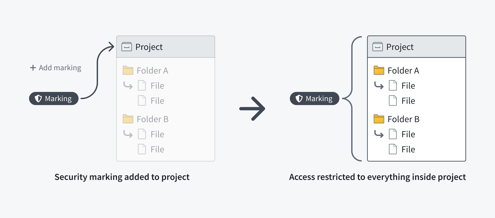

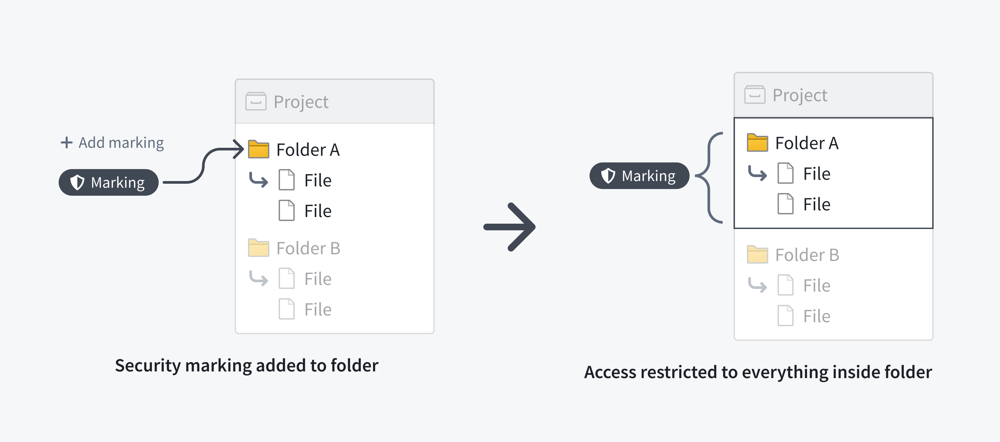

The following screenshot shows a `PII` Marking on a notional dataset that is inherited along the file hierarchy.

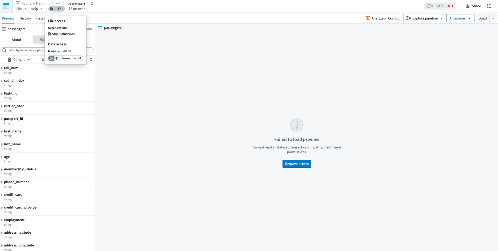

#### Data dependency

Restricting access to a dataset always restricts access to any data derived from it. This is because a dataset file may inherit a Marking from a dataset it depends on, like an upstream dataset. If a dataset has a file Marking, every dataset that depends on it inherits that Marking and the inherited Marking is known as a data marking.

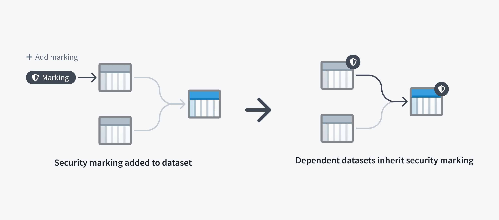

The following screenshot shows a `PII` Marking on a notional dataset that is inherited along a data dependency.

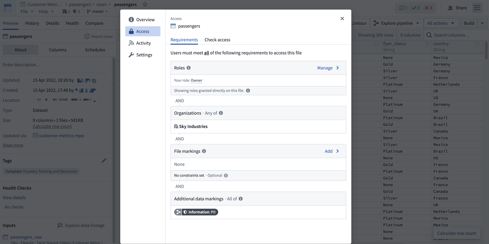

Note that a user may fulfill file access requirements without meeting the data access requirements inherited from upstream datasets. In this scenario, the user can detect the presence of the derived dataset and view the file metadata, but cannot access the data within the file dataset, as demonstrated in the screenshot below.
This is different from when a user cannot discover a resource because they do not meet the file marking requirements.

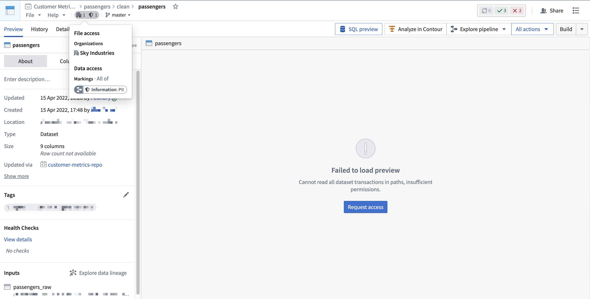

Applying a Marking is considered a sensitive action, since the Marking will **immediately** be inherited along all file and data dependencies. This could unintentionally lock out other users downstream. Review how to [apply markings](/docs/foundry/platform-security-management/manage-markings/#apply-markings) safely before using them.

Similarly, removing a Marking is considered a sensitive action. You can remove a Marking from the file, folder, or Project where it was originally applied, which will **immediately** remove the Marking from downstream files and data dependencies. Alternatively, a Marking can be removed in a transformation, which would only remove the Marking [along data dependencies](/docs/foundry/building-pipelines/remove-inherited-markings/). Learn how to [remove markings](/docs/foundry/platform-security-management/manage-markings/#remove-markings) safely before removing them.

## Use Markings

Markings are designed to *restrict* access to resources like files, folders, and Projects. Markings should not be used to *provision* access. When a user satisfies a set of Marking criteria, they receive access to the Marking and associated resources. However, a user *eligible* for access should not always *have* access. Users should be granted access to files based on role-based permissions on Projects.

For example, assume that a `PII` Marking is used to restrict access to all Foundry data that contains employee PII. This PII may be in financial records (like a Social Security number), health records (like information about age, gender, or diagnosis), or other personal data such as name or address.

To work with PII, users need to take proper training. Suppose a user from the financial department has completed the required training and is eligible for access to the `PII` Marking. As this user is from the financial department, the user is granted the `Viewer` role on a financial data Project. Even though this user is eligible to see other data containing employee PII, their role in the Project still governs their level of access.

Markings should be used to define access restrictions on sensitive data that requires additional protection. There are several ways to apply Markings related to data sensitivity:

* **One Marking per sensitive data category**
  * In the most commonly-used Marking structure, one Marking is created per sensitive data category. Each Marking restricts access to all resources that contain the data category. If data has multiple types of sensitivities, all corresponding Markings are applied to the resource; only users eligible to access all relevant sensitive categories can receive access to the resource.
  * You may find it useful to establish well-defined criteria for Marking requirements and sensitivity types. For example, you might mark any data containing personal attributes like gender, age, ethnicity, etc. with the `PII` Marking.
* **One Marking per sensitive data owner**
  * Under this structure, data owners can decide how to restrict access to data they own. With one Marking per sensitive data owner, the sensitive data owned by a team or group of users is marked and users are granted access to the Marking at the data owner’s discretion. For example, all data produced, consumed, and managed by the sales team could be marked with the `Sales Data` Marking by the data owner, who would only grant access to sales data to eligible users.
  * To provide data owners additional control over their data assets, Markings propagate. This means that if a user with access to the data tries to create derived resources from the data to share with another user, the data owner will need to grant the other user access to the Marking to unlock their access to the derived resources.
* **Markings for different pipeline stages**
  * Datasets may be ingested into Foundry in raw form and usually undergo processing and transformation before being ready for sharing with end users. Raw data may contain sensitive information that is unsuitable for downstream users, and an administrator may choose to apply a `Raw Data` marking to restrict access from unauthorized users. After processing to remove PII (such as hashing or encryption), an administrator can remove the `Raw Data` Marking and apply other relevant Markings to secure data further along the pipeline.
* **Use of Markings to restrict data discovery**
  * Since Markings restrict access in an all-or-nothing manner, you should use them if you must hide the existence of a resource like a file, folder, or Project. Markings can ensure that users who do not have access to the Marking will not see the marked data in search results or in the Project/folder view.

An implementation of Markings in Foundry may use a combination of strategies discussed above. For instance, you could have a `Raw Data` Marking at the beginning of the pipeline followed by one Marking per sensitive data category post-processing.

### Example: Protect healthcare data

Consider three tiers of sensitive patient data at a hypothetical healthcare organization:

* Synthetic data: This is the least sensitive data, created to mimic actual patient records. All synthetic data is marked by the `Synthetic Data` Marking.
* De-identified data: This type of data has some sensitive fields, but all direct identifiers have been removed. This data might be combined with other data files to identify patients. All such data is marked with the `De-identified Data` Marking.
* Data with identifiers: This type of data potentially contains identifiers which can be used to directly identify individual patients. This is the highest level of sensitivity for patient data. All such data is marked with the `Identifiable Data` Marking.

In this case, the data tiers are hierarchical, and users who have access to the `Identifiable Data` Marking also have access to the `De-identified Data` Marking and the `Synthetic Data` Marking. Similarly, users with access to the `De-identified Data` Marking also have access to `Synthetic Data` Marking.

Within Foundry, data with identifiers (marked with the `Identifiable Data` Marking) is transformed into de-identified data (marked with the `De-identified Data` Marking) by removing the identifier fields. The Marking manager or data owner reviews any changes in the transform logic to ensure that all identifiers are absent from the de-identified data. Additional complex transforms generate synthetic data which is marked with the `Synthetic Data` Marking. At each of these transformation stages, shown with notional data in the following screenshot, the previous Marking is removed and a Marking highlighting the updated state of the data is added.

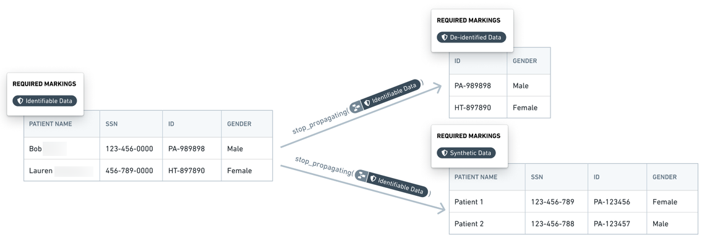

### Example: Protect investigation data

Case investigation data is particularly sensitive, as with anti-money laundering investigations. Data from one case must not mix with data from another case. Moreover, data from one case should not be visible to the investigator when that investigator is reviewing a different case. Markings enable these case access restrictions:

* Data pertaining to a particular case, including resources, images, datasets, other evidence, is marked with a unique `Case - xxxxxx` Marking where `xxxxxx` represents the case number.
* Only investigators who are investigators for a particular case are granted access to the case Marking. An investigator may have access to multiple cases at a given time, but such access would be distinguished by individual Markings.

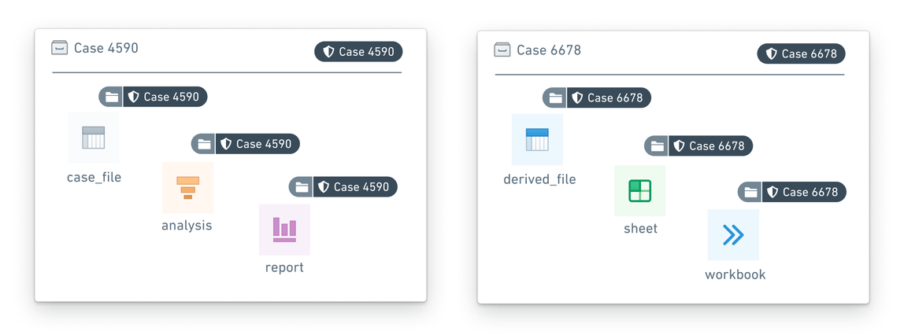

### Example: Protect banking data

In a hypothetical bank, each team or department exercises full control over the data that it produces or manages. That is, each team decides which other teams can access their data assets, whether in whole or in part. For this example, we simplify the organizational setup by considering teams with corresponding Markings: Consumer Finance, Internal Compliance, and Marketing.

* Assume that the Consumer Finance team and the Marketing team give the Internal Compliance team access to, respectively, the `Consumer Finance` and `Marketing` Markings. Then, the Internal Compliance team can verify that data is being used appropriately for pre-approved workflows and conduct a quarterly audit.
* The results of the quarterly audit are captured in a report with the `Internal Compliance` Marking, with the other two Markings removed. These audit results can only be accessed by the Internal Compliance team. If the Internal Compliance team wants to share the quarterly audit report with the DPO (Data Protection Office), the Internal Compliance team can grant the DPO access to the `Internal Compliance` Marking so that the DPO can review the compliance report.

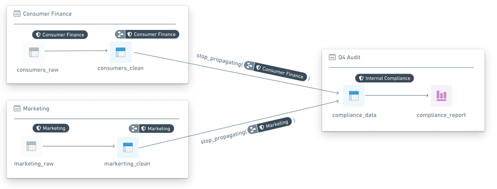

Review the [management documentation](/docs/foundry/platform-security-management/manage-markings/) on how to configure markings.

## Use scoped sessions

[Scoped sessions](/docs/foundry/administration/configure-scoped-sessions/) enable a user to pick a subset of pre-defined Markings to access during their Foundry session to create a visual separation between different types of work. If scoped sessions are enabled for your Organization, you might have to pick a scoped session after you log into Foundry, restricting your access in Foundry to only the subset of Markings in the scoped session.

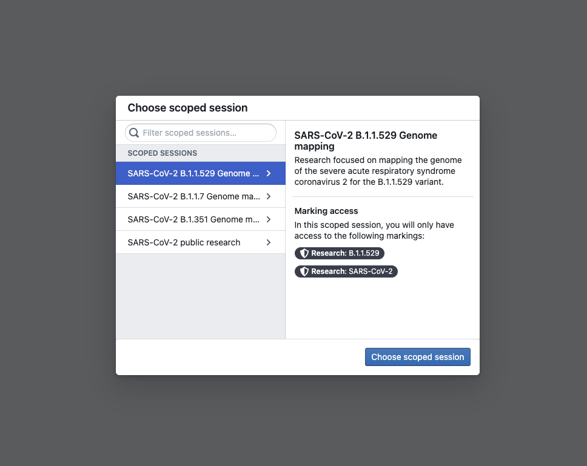

After you select a scoped session, there will be a workspace banner showing the name of the scoped session.

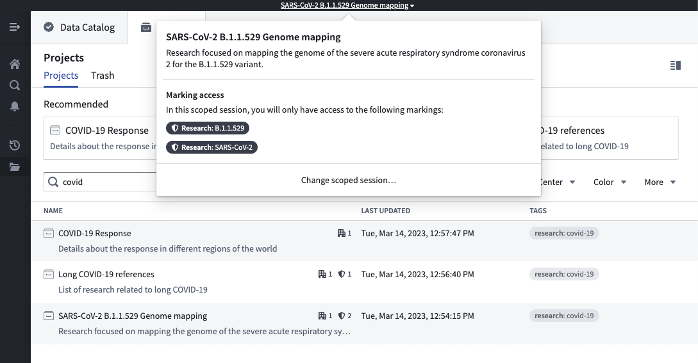

If you have access to multiple scoped sessions, you can hover over the workspace banner and select **Change scoped session**. This will bring up the scoped session dialog seen at login and allow you to choose a scoped session. If you pick a different scoped session than the current scoped session, the page will refresh, and you will be restricted to the new scoped session you picked.

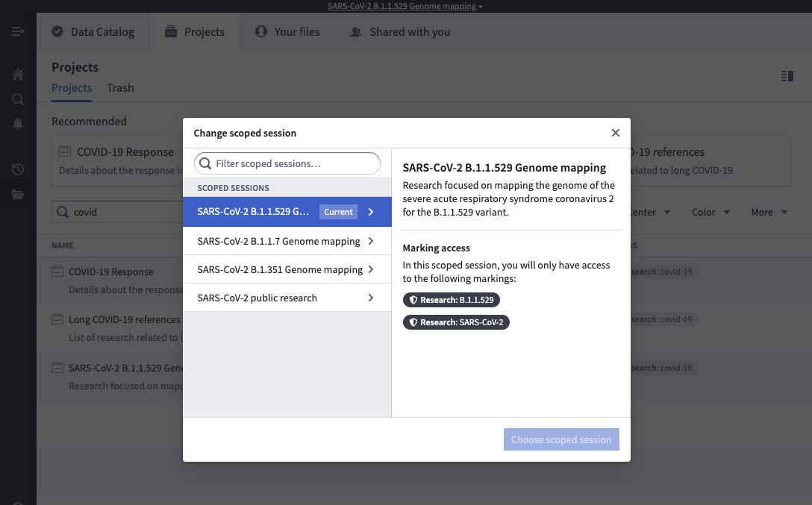

Some users might have access to the **No scoped session** option. This option allows a user to bypass the scoped session restriction and have access to all of their Markings.

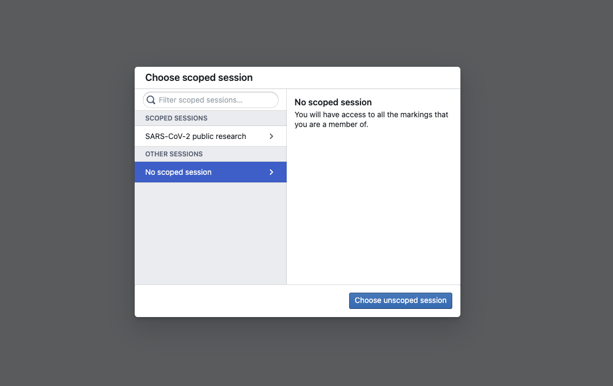
