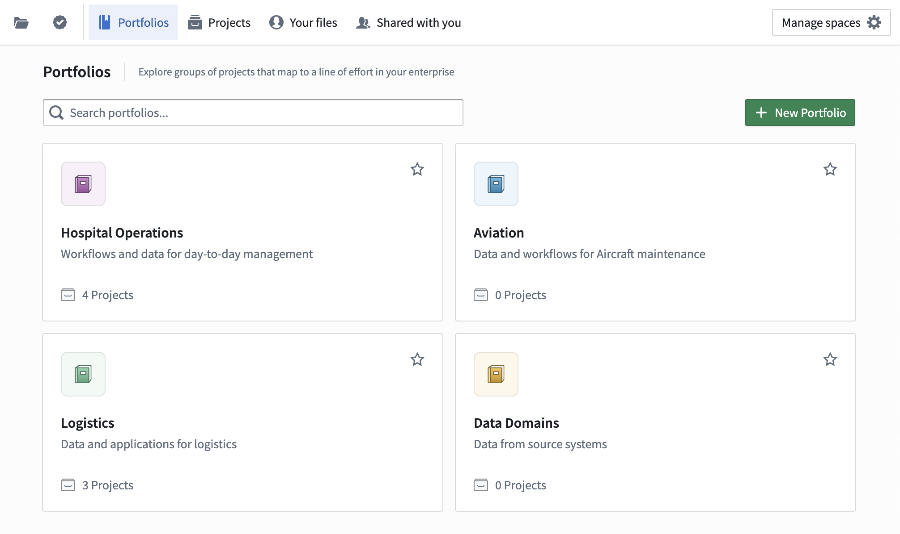
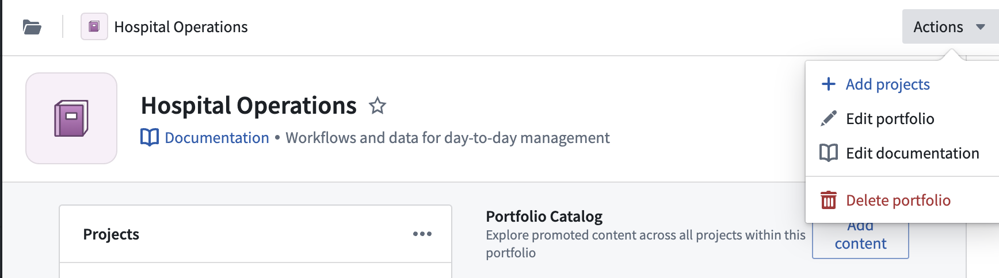
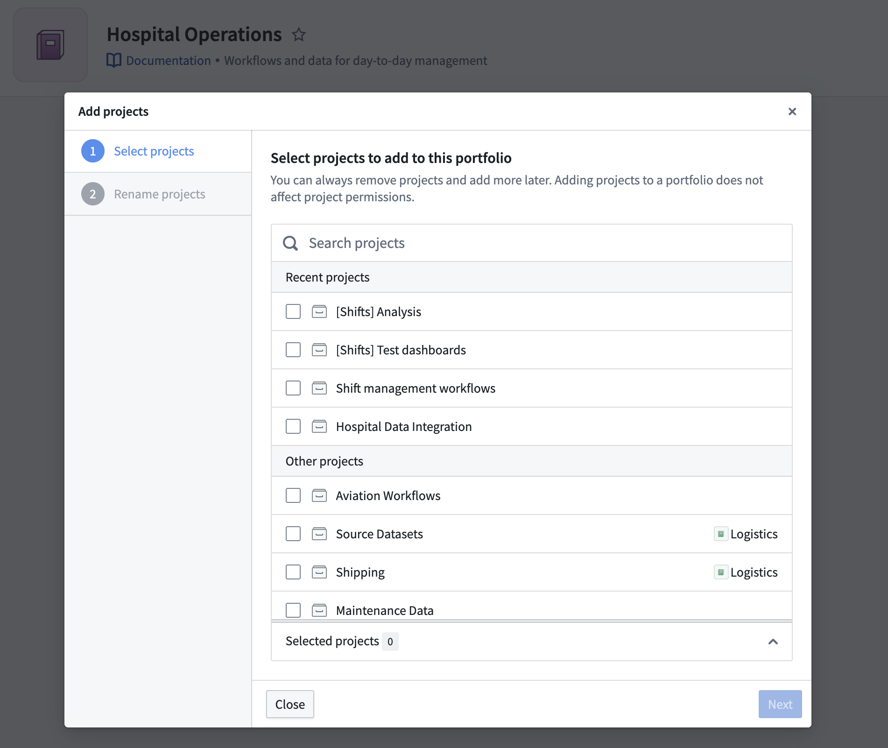
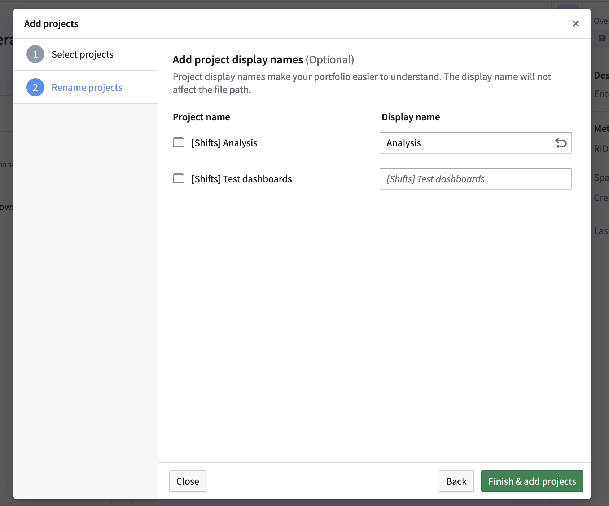
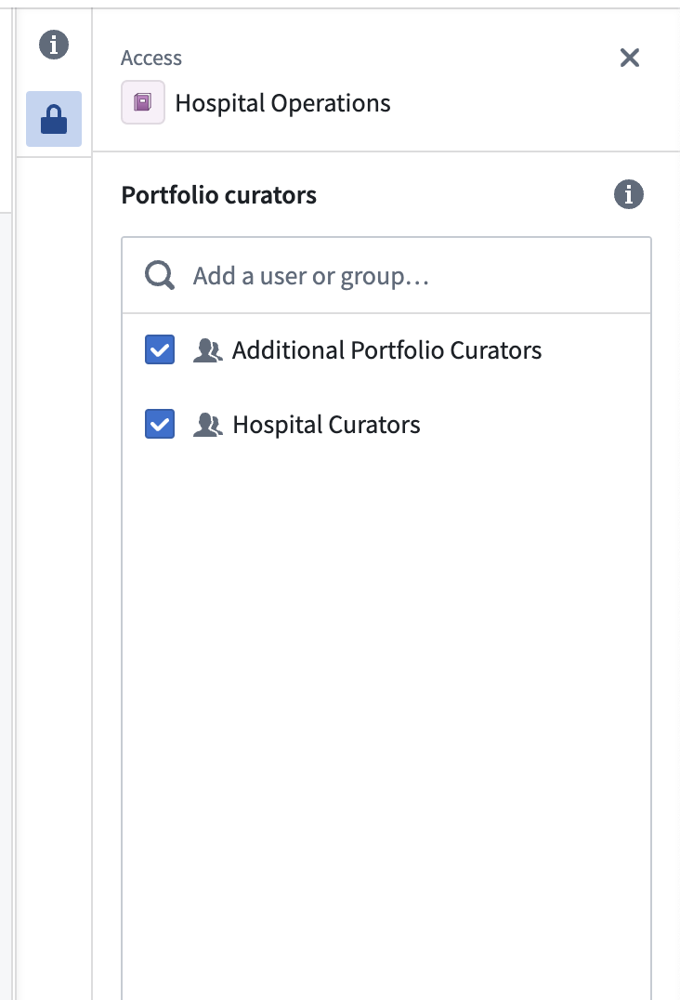
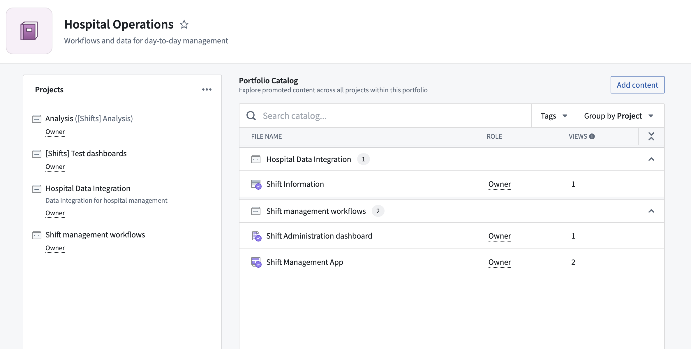

<!-- source: https://palantir.com/docs/foundry/security/portfolios/ · mirrored 2026-08-04 from Palantir Foundry docs -->

# Portfolios

Portfolios allow users to organize Projects within a Space. Each Portfolio contains many Projects, and each project belongs to a single Portfolio. Any user with access to a Space can view its Portfolios, but users still separately need permissions to view the Projects inside a Portfolio.

## Create Portfolios

Users with the Editor role on a Space can create a Portfolio from the Portfolios page. Each Portfolio must have a Space and a unique name. Portfolio creators can optionally provide a short text description and configure the Portfolio's thumbnail with an image or icon color. Thumbnail images should be square and will be compressed in size.

## Edit Portfolio metadata

Administrators and curators can edit a Portfolio's metadata from the Actions menu in the top right. Name, Description, and Logo are editable, but Portfolios cannot move between Spaces after creation.

Administrators and curators can also add Markdown documentation to a portfolio. All users who can view the Portfolio can view this documentation.

## Curate Portfolios

After creating a Portfolio, administrators can populate it with Projects from the same Space using the **Add Projects** dialog. This dialog displays all projects in the same Space as the Portfolio, including those that already belong to a separate Portfolio. Since Projects can only belong to a single Portfolio, moving a Project to another Portfolio will remove it from the first one.

After selecting Projects to include in this Portfolio, users have the option to change each Project's display name. This is an optional step.

### Additional Portfolio curators

Normally, only users with the `Editor` role on a Space can manage the contents of its Portfolios. To expand Portfolio curation permissions, users with management access can open the sidebar on a Portfolio and edit its list of **Curators**. These users will have the option to add or remove Projects from this Portfolio, as well as edit its description and documentation.

## Portfolio catalogs

Resources that have been pinned in a project appear in the catalog for a portfolio grouped by project or resource type. Administrators can promote resources from projects in the portfolio by searching for resources in the **Add Content** dialog.

## Project sidebar

The Project sidebar displays a list of Projects added to a Portfolio. From the Project sidebar, users can open individual Projects and Portfolio administrators can add or remove Projects.
