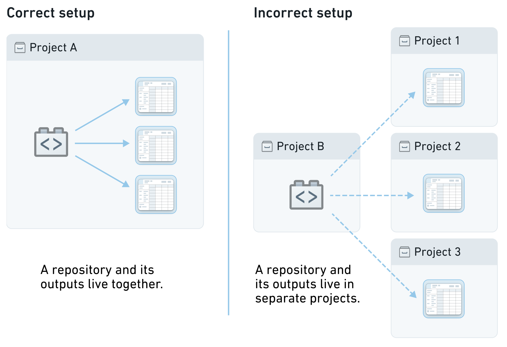
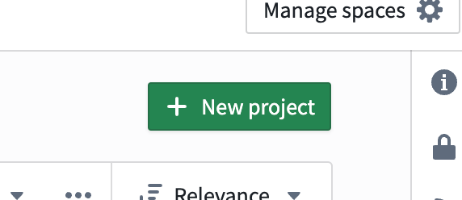
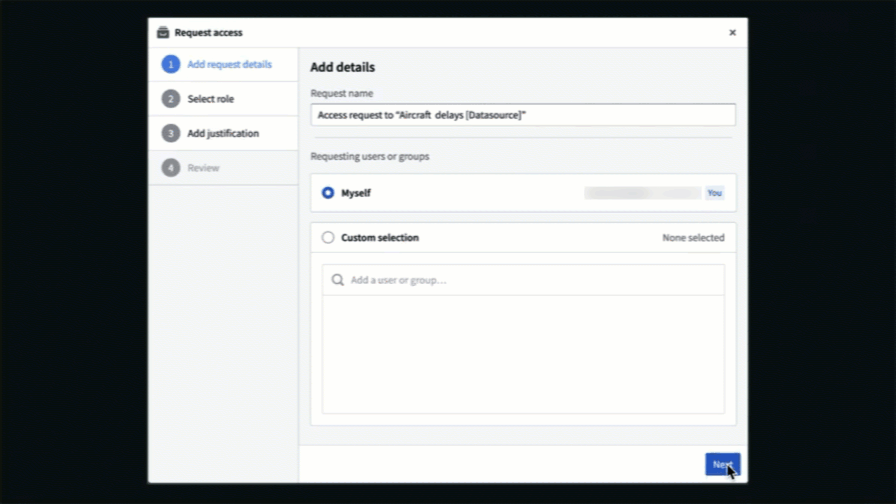
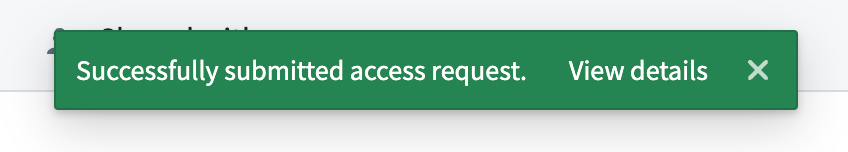
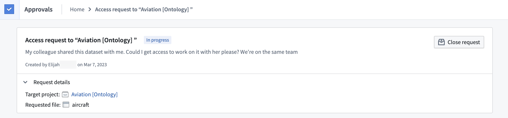
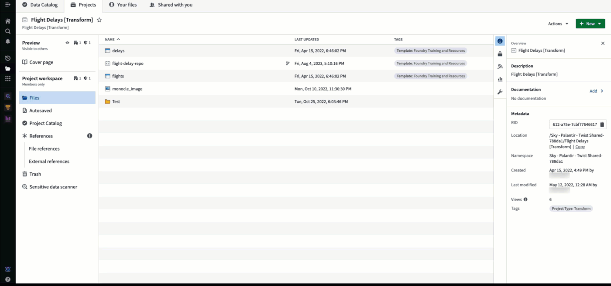
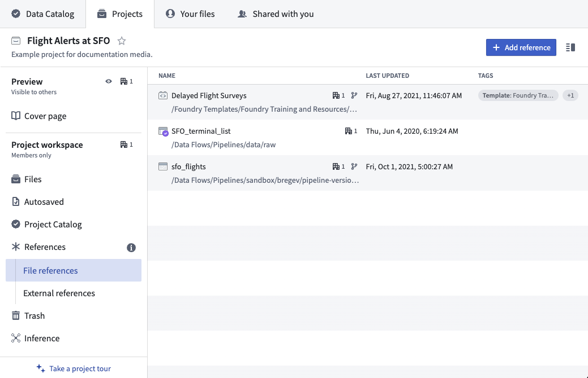
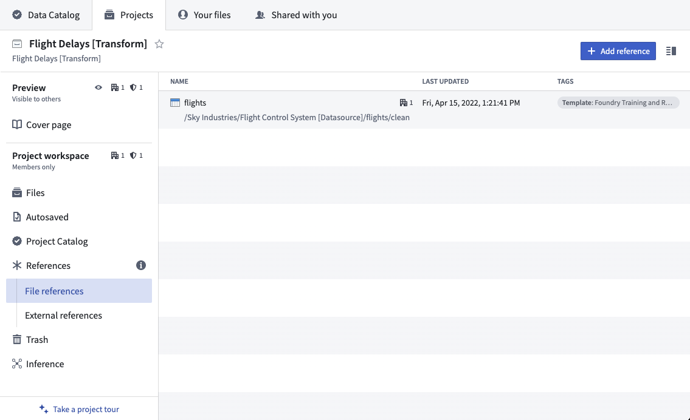
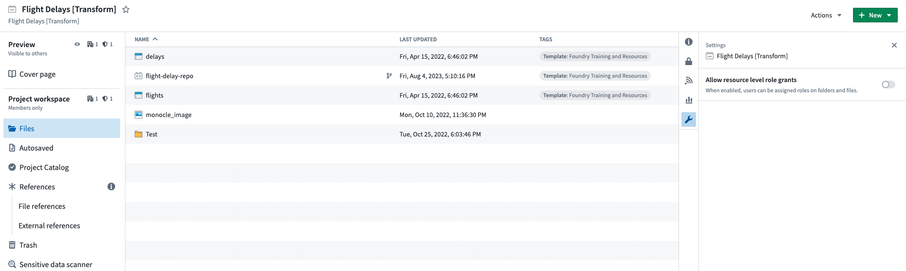
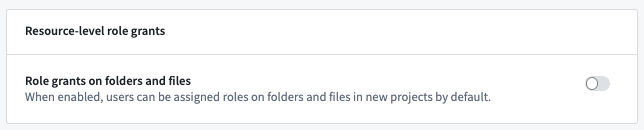

<!-- source: https://palantir.com/docs/foundry/security/projects-and-roles/ · mirrored 2026-08-04 from Palantir Foundry docs -->

# Projects & roles

**Projects** are the primary way to organize work in Foundry, and the primary security boundary. You will likely want to set your pipeline up as a series of Projects. To collaborate with others, you will grant various users and groups roles on each Project. Together, Projects and roles are how discretionary access control is managed across Foundry.

Learn more about [securing a data foundation](/docs/foundry/security/securing-a-data-foundation/) in Foundry.

## Projects and resources

[Projects](/docs/foundry/compass/move-and-share-resources/) are the primary security boundary in Foundry and can be thought of as buckets of shared work. Because their boundaries enforce security, Projects are a key means of organizing data and enabling open collaboration within a secure space.

Each Project is a collaborative space that organizes users, files, and folders for a particular purpose. Projects should be designed such that users collaborating within each Project have approximately uniform access to the content, but varied permissions on that content - for example, everyone in your Project may have default Viewer role but only one specific group may have Editor role on all Project resources. Projects enforce security boundaries, which enables work to be contained in a space. Work (transformation, analysis, etc.) is done in a Project, and the output of that work lives alongside its logic within the Project.

Since work and its output must live in the same Project, to reuse or build off of work in other Projects you must use [References](#references).

To make permission management easier, we recommend granting [group](/docs/foundry/security/users-and-groups/#groups) roles at the Project level. Managing Project permissions with groups allows a set of users with the same permissions to be managed together, reducing the clutter of individual role grants. Project contents will inherit the [roles](#roles) granted at the Project level, providing users uniform access to the content in the Project.

## Create Projects

Users need `Editor` or `Owner` permissions on a space to create Projects in that space.

Space permissions can be managed from the [space settings](/docs/foundry/platform-security-management/manage-orgs-and-spaces/#manage-a-space) page.

## Request access to a Project

Users can submit access requests for Projects they are not authorized to access. The access request will include all changes required to give the user access to a Project, including any required [Markings](/docs/foundry/security/markings/).

Project access requests can be submitted from multiple access points in the Foundry filesystem view:

* **Request access**
  * Located next to the Project name in the **Projects & files** view.
  * Appears when opening a resource that a user does not have permission to view (for example, a direct link).
* **Request project access**
  * Located in the Project view if a user only has the Discoverer role on the Project.
* **Request additional access**
  * Located in the **Actions** dropdown in the Project view if a user has access to the Project.

After selecting one of the above entry points, the user is presented with a **Request access** pop-up. They must provide a reason for access, the users and groups that should be granted access (if requesting on behalf of others), and how they should be granted access.

As mentioned [above](#projects-and-resources), we recommend managing permissions on Projects through groups. In the **Request access** pop-up, users can select to get access to a group with an appropriate role on the Project. For groups that are [managed internally to Foundry](/docs/foundry/platform-security-management/manage-groups/#group-internal-realms), users can pick a group to join, which will route the request to the group administrators for approval. Custom request flows for groups can be configured to help requesting users select the appropriate group to join. You can find more information regarding custom approval access request configuration in the [platform security management documentation](/docs/foundry/platform-security-management/manage-groups/#custom-approvals-access-request-form). Additionally, you can hide groups to prevent users from requesting access to them. Learn how in the [manage groups documentation](/docs/foundry/platform-security-management/manage-groups/#exclude-groups-from-access-request-form).

For groups that are managed externally to Foundry, users will be presented with a message and URL redirecting them to request access to the necessary group outside the Foundry platform. Learn how to configure this message and URL in the [external group documentation](/docs/foundry/platform-security-management/manage-groups/#group-external-realms).

If there are no groups assigned to the Project, a user can request to be added directly to the Project with a given role. This will create a Project access request task and require approval from users who have the Owner role on the Project.

Once users create a request, a message should appear indicating that the request succeeded. View the created request by selecting **View details** on the message, or navigate to the [Approvals inbox](/docs/foundry/approvals/overview/#approvals-inbox) in the Foundry workspace sidebar and select **My requests** from the filter on the left.

### File and folder access requests

When users select **Request access** on a file or folder inside a Project, the access request will be submitted on the Project itself (not the specific resource). When reviewing the request, the file or folder where the request was submitted is shown to provide additional context.

## Sharing and moving resources

To enforce Projects as a security boundary, we recommend moving resources into Projects that have been permissioned for your use case rather than sharing directly from **Your files**. This allows clarity of access and legibility of who has access to what. The users and groups who have access to your Project can be managed by clicking on the access panel:

## References

Projects are the central security boundary in Foundry, which extends to Foundry’s build system. A build takes in any number of input datasets and produces any number of output datasets. Those inputs and outputs *must* be in the same Project. However, to make a useful pipeline, you will likely want to use datasets from other Projects. When using datasets from other Projects, we recommend applying file references.

Adding a file reference allows you to use an upstream dataset in your project, as long as you have the required [role](#roles) for that use case. Once imported, your colleagues will not need access to the upstream project to see datasets derived in your project, as long as they satisfy any organizations and markings on the dataset.

In the image above, we referenced the flights dataset from the `Flight Control System [Datasource]` Project in our `Flight Delays [Transform]` Project. If we add a user to our transform Project, they will be able to view the `delays` dataset and build additional transforms on top of it. However, to view the raw `flights` dataset or build any additional transformations on top of it they would still require `Viewer` role on the upstream Project.

Projects and references help organize collaboration, as Project owners can easily add users to their own Projects and ensure the latter have the right permissions.

To add file references to a Project you usually must have the `Viewer` role on the source Project and `Editor` on the destination Project. For more information on permissions required to add references to a Project, see [Project references and permissions](/docs/foundry/code-repositories/use-project-references/#project-references-and-permissions).

References can be added from many places in Foundry, such as [Code Repositories](/docs/foundry/code-repositories/overview/), [Code Workbook](/docs/foundry/code-workbook/overview/), [Pipeline Builder](/docs/foundry/pipeline-builder/overview/), [Fusion](/docs/foundry/fusion/overview/), and [Contour](/docs/foundry/contour/overview/).

You cannot add references to files that live in **Your files** because it may cause permission issues. If you want to reference a file that lives in **Your files**, first [move the file](/docs/foundry/compass/move-and-share-resources/) into a Project so that it is visible to your colleagues.

### Central data governance via Markings

In some situations, we may want to more centrally control access to a category of data. Perhaps anyone with access to any kind of flight data should go through a mandatory training first. Applying a Marking to the raw `flights` dataset will require that users go through a central body to get access to `flights` and anything derived from it, e.g. the `delays` dataset. For more information on using Markings, see [Markings](/docs/foundry/security/markings/).

## Roles

Roles are sets of permissions that grant different levels of access to resources. Roles are a discretionary permission and generally granted at the Project level to provide uniform capabilities on all resources within the Project’s scope. However, mandatory controls, Organizations and Markings, will *always* prevent an ineligible user from accessing a resource, regardless of the user’s role.

From most powerful to least powerful, the default roles in Foundry are: Owner, Editor, Viewer, and Discoverer. Each role can assign other users the same or lesser role. For example, an Owner can grant any other user the Owner, Editor, Viewer, or Discoverer role, while the Discoverer can only grant other users the Discoverer role. These defaults can be customized to include completely [new roles](/docs/foundry/platform-security-management/manage-roles/#customizing-the-default-roles).

Importantly, like mandatory controls, role grants inherit to child resources. For example, granting a user Viewer on a Project or folder gives them Viewer on all resources contained by that Project or folder. And typically groups of users are granted roles on a Project.

Learn more about [configuring your Organization's roles](/docs/foundry/platform-security-management/manage-roles/).

### Role grants on folders and files

As mentioned above, we recommend that roles be granted only at the Project level to provide uniform capabilities on all resources within the Project's scope. To enforce this behavior, you can use the toggle to disable folder and file role grants in the **Settings** section in the Project view. When this setting is disabled, role grants can only be granted at the Project level, not at the folder or file level. This toggle can be set by users with the `Owner` role on the Project.

If the role grants setting is disabled for Projects already containing resources with role grants, role grants against these individual resources will be removed. Once an existing role grant is removed, it cannot be re-added until the setting is re-enabled. Similarly, if resources with role grants are moved to a Project where the role grants setting is disabled, resource-level role grants will be removed. Users are warned of this behavior when disabling the role grants setting and when moving resources to a Project with a disabled role grant setting.

Additionally, Project link sharing capability will also be removed as link sharing gives the receiver of the link a direct role grant on the individual folder or file.

Role grants on folders and files are disabled by default. Space administrators can change the default behavior at the space level. We recommend keeping role grants on folders and files disabled.

