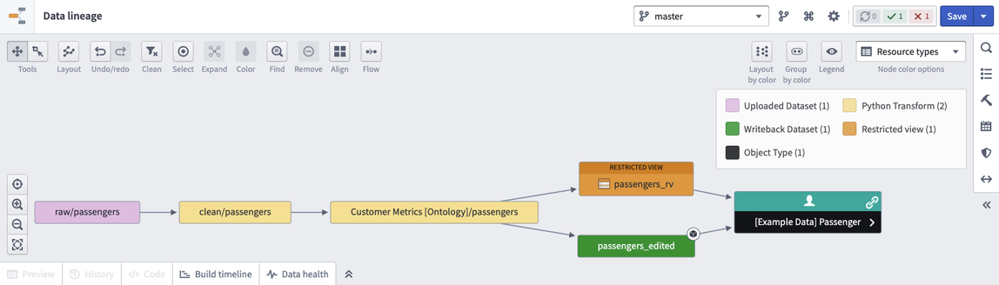
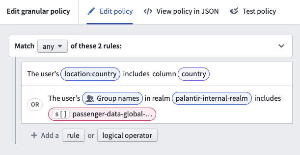
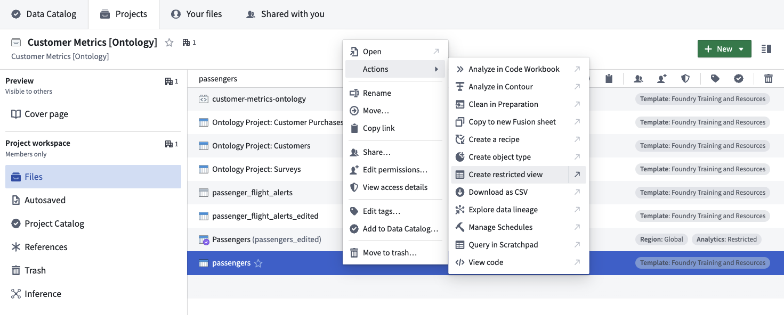
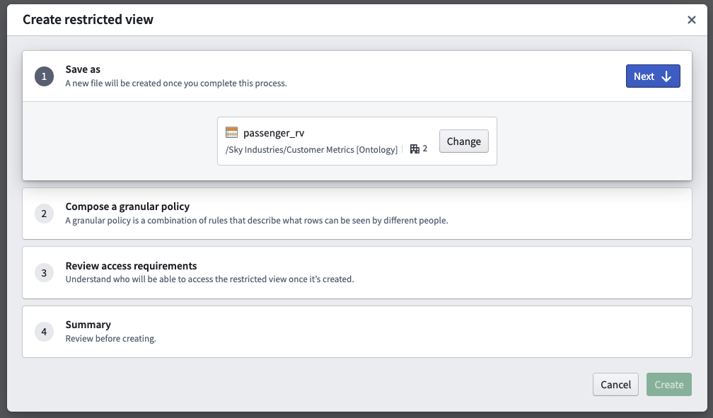
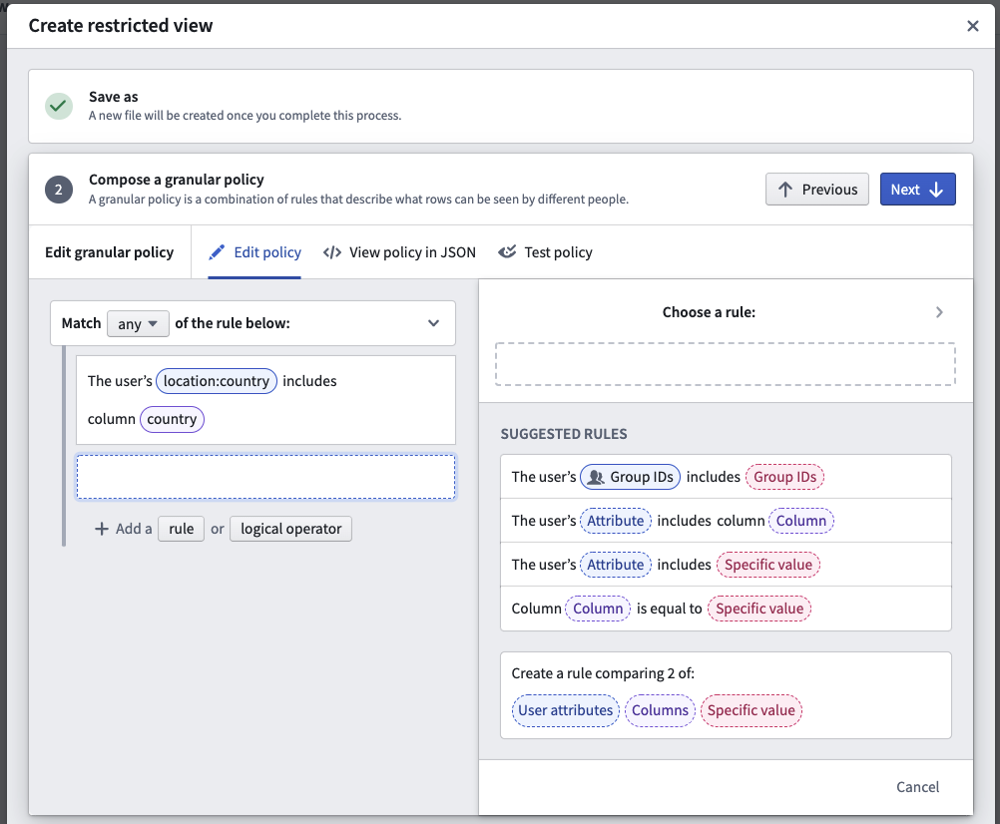
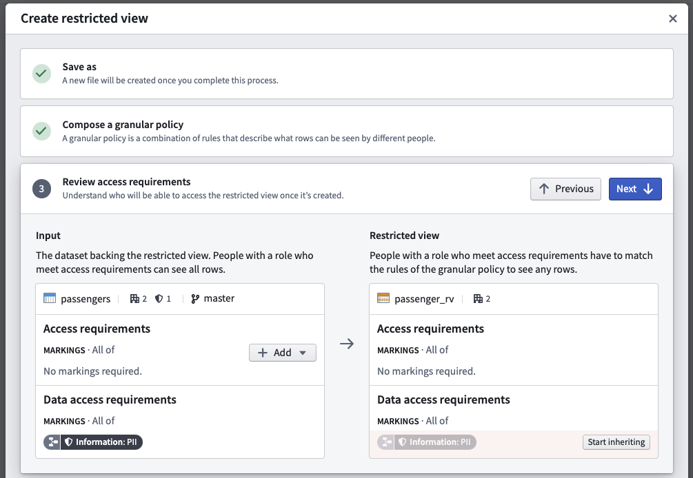
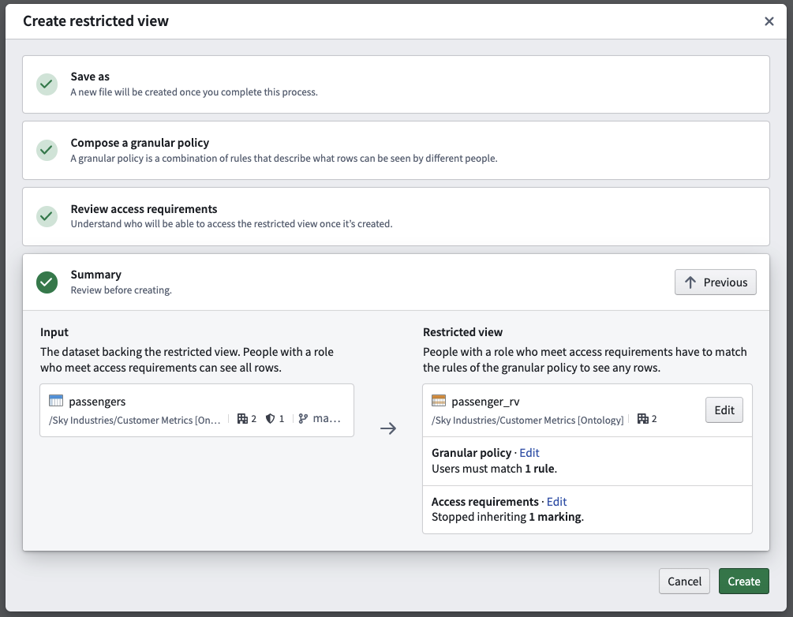
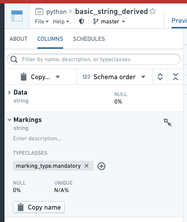
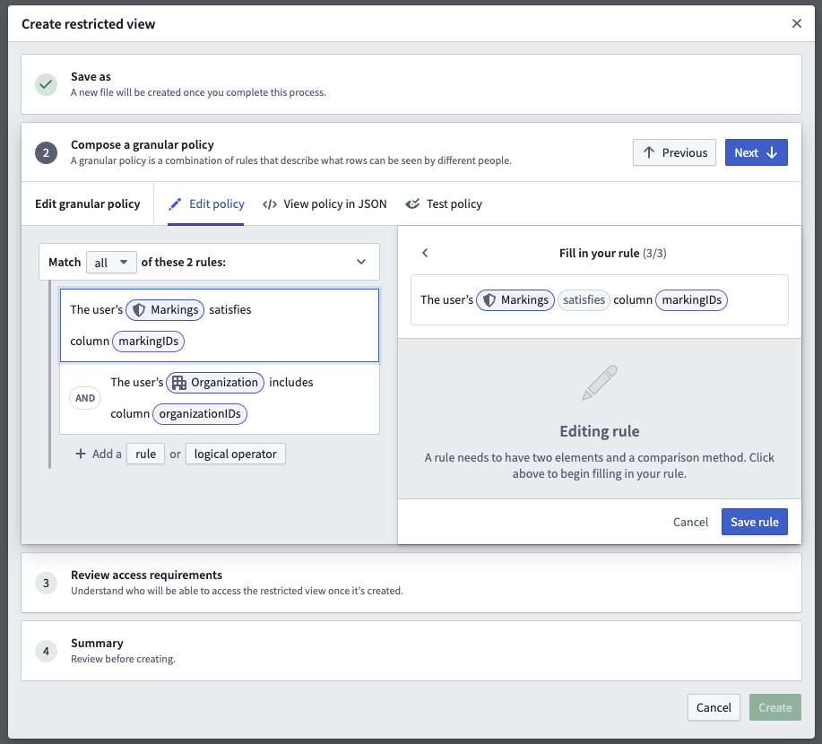

<!-- source: https://palantir.com/docs/foundry/security/restricted-views/ · mirrored 2026-08-12 from Palantir Foundry docs -->

# Restricted views

[Markings](/docs/foundry/security/markings/) and [roles](/docs/foundry/administration/enrollments-and-organizations-access/) provide powerful access controls. However, some situations require more granular permissioning. For example, it may be insufficient or inappropriate to grant access to all objects of a certain type. Some object types may need to surface different objects to different users, as when a company limits sales representatives to viewing customers at their assigned branch. **Restricted views** can provide this additional level of access control.

Users interact with restricted view resources in Foundry, and restricted views are powered by granular policies. Restricted views limit dataset access to only the rows that a user has permission to see. A restricted view is built on top of a backing dataset and cannot be used as an input for transforms. The *policy* for a restricted view determines the specific rows a user can see. It is typically defined by a user with the Owner role upon creation of the restricted view. After creation, the restricted view can be used as the backing data source for an object type in your Ontology. For example, if one row represents one object, the restricted view controls what objects users can see based on the object type it backs.

## Restricted view policies

The policy is the core of a restricted view. Restricted view policies use [granular policies](/docs/foundry/platform-security-management/manage-granular-policies/) to determine which rows a user can see. A granular policy is a set of rules and logical operators that compare user attributes, columns, and values.

* **User attributes:** Properties of the user viewing the data.
* **Column name:** A column in the restricted views backing dataset.
* **Specific value:** A string, Boolean, number, or array.

Most, if not all, policies will involve at least one term that is compared with a user attribute. At least one such term is necessary for user-based permissioning.

When referencing a user, group, or Organization, the policy requires the unique identifier (UUID) in both the policy column and the policy definition. Specifying names instead of IDs is not supported to prevent renaming-related issues.

In the example below, the restricted view policy includes two rules that can be applied:

Learn more about [designing granular policies](/docs/foundry/platform-security-management/manage-granular-policies/#design-granular-policies), including recommendations and best practices. You can also review information on [user attributes](/docs/foundry/platform-security-management/manage-granular-policies/#user-attributes), [policy comparisons](/docs/foundry/platform-security-management/manage-granular-policies/#policy-comparisons), and [policy limitations](/docs/foundry/platform-security-management/manage-granular-policies/#policy-limitations).

:::callout{theme="warning"}
Avoid using `NOT` conditions with group, marking, or organization memberships. Using a `NOT` condition in these circumstances is a misconfiguration. The platform supports scoped tokens, which carry only a subset of a user's permissions. These tokens may lack the attribute the `NOT` condition checks against, causing the condition to pass and grant more access than intended.
:::

After you've determined the design of your restricted view policy, make any pipeline and Project changes needed to power it. With a restricted view policy and pipeline in place, you can move on to creating your restricted view.

## Create restricted views

Users with an Owner role or the necessary permissions can create restricted views downstream of a dataset with a right-click contextual action:

The restricted view creation dialog has the following steps:

1. **Save as:** Choose a name and location where the restricted view will live in the file system.
2. **Compose a granular policy:** Define the policy statements that will determine which rows or objects users are able to see when accessing the restricted view or object.
3. **Review access requirements:** Review the existing file and transaction-level Markings on both the upstream dataset and downstream restricted view. With appropriate permissions, you can un-mark (remove) Markings from the restricted view.
4. **Summary:** Review your selections before the creation and initial build of the restricted view.

### Save as

Name your restricted view and select a save location. Typically, you will want to save your restricted view in a different Project from the input dataset. This ensures users consuming the restricted view can have View permissions on the downstream Project. Alternatively, you can save the restricted view in the same Project as the input dataset. Use [Markings](/docs/foundry/security/markings/) to protect the [input dataset](#review-access-requirements).

### Compose a granular policy

You can create rule-based policies using **user attributes**, **column names**, and **specific values**. See [restricted view policies](#restricted-view-policies) for more information.

### Review access requirements

Users that should only access sensitive data through a restricted view should not have access to the upstream dataset. In this step, you can review the access requirements for both the dataset and the restricted view you are creating. If you have appropriate Marking permissions, you can remove inherited Markings from the restricted view and/or apply Markings to the upstream dataset.

### Summary

The summary presents the final proposed access controls for both the dataset and the restricted view. If you are satisfied with the summary result, select **Create** to start an initial build of the restricted view.

When the restricted view is created, a build schedule will be automatically created in the background that will rebuild anytime the input dataset updates.

Review the [management documentation](/docs/foundry/platform-security-management/manage-restricted-views/) on how to use restricted views to back object types.

## Create marking-backed restricted views

You can create a restricted view based off of a dataset with a column of Markings. Each row will only be visible to users with the necessary Marking access. For example, in the restricted view below, a user needs both A1 and A2 to view the first row, and needs B1 to view the second row.

|Data   |Markings   |
|---    |---    |
|Row 1  |\[A1, A2]   |
|Row 2  |\[B1]   |

Follow these steps to create a Marking-backed restricted view:

1. Prepare a dataset with one or more Marking columns that will be secured as a restricted view. Each cell must contain a STRING ARRAY of Marking IDs. Learn more about the [expected format of the upstream dataset](#expected-format-of-the-upstream-dataset).
2. Annotate each Marking column by going to the COLUMNS tab of the Dataset Preview interface, selecting the column, selecting "Add typeclasses", and entering **marking\_type.mandatory**. This step is not necessary for granular permissions to work, but some interfaces in Foundry use this as a hint to render the column more appropriately.

3. Create the restricted view off of the dataset. The left side of the policy rule should be “user’s Markings”. For the right side, select “Columns” and select the Marking column. If you have multiple columns, create a rule for each one and combine them with AND or OR rules as desired.

### Expected format of the upstream dataset

The dataset from which a restricted view is created must contain a column of Marking IDs.

* These IDs are universally unique identifiers (UUIDs).
* The column must be of type STRING ARRAY (and contain a list of Marking IDs).
* You may have more than one column of Marking IDs.
* You may mix Markings and Organizations in the same column.

For example, this dataset contains lists of Markings. The sample CSV below can be uploaded directly to Foundry. However, you will need to manually modify the inferred schema. Go to **Details > Schema** and change "type": "STRING" to "type": "ARRAY, "arraySubtype": { "type": "STRING" }.

|Data   |Markings  |
|---    |---    |
|Row 1  |\[ab888888-7777-6666-5555-123456789012, gh111111-2222-3333-4444-555566667777]   |
|Row 2  |\[cd345678-1111-2222-3333-123456789102, jk765432-1111-2222-3333-345678912345]   |

## Add restricted view to a Marketplace product

Use [Foundry DevOps](/docs/foundry/devops/overview/) to include your restricted views in [Marketplace products](/docs/foundry/devops/core-concepts/#product) for other users to install and reuse. [Learn how to create your first product.](/docs/foundry/foundry-devops/create-products/)

### Supported features

Only `string` and `boolean` constants are supported. Constants can only be compared to fields (columns) or "the user’s groups" user property. Marketplace currently does not support multiple field-constant comparison conditions using the same field.

### Add restricted views to products

To add a restricted view to a product, first [create a product](/docs/foundry/foundry-devops/create-products/), then [add outputs](/docs/foundry/foundry-devops/create-products/#add-outputs). Choose the **Add files** option to navigate to the restricted view from within the [Compass](/docs/foundry/compass/overview/) filesystem and add it to your product.

Adding a restricted view to a product packages the restricted view's [policy](#compose-a-granular-policy), **not** the data.
