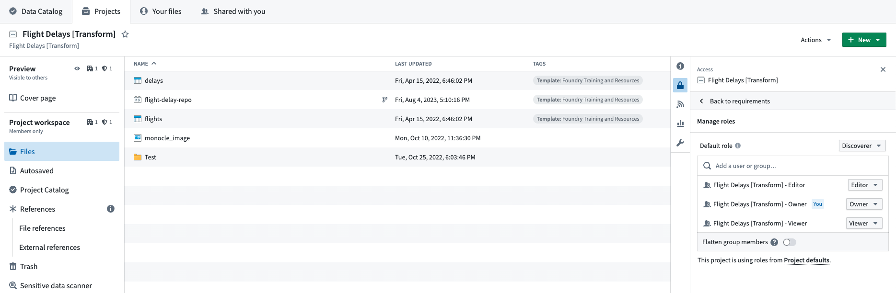
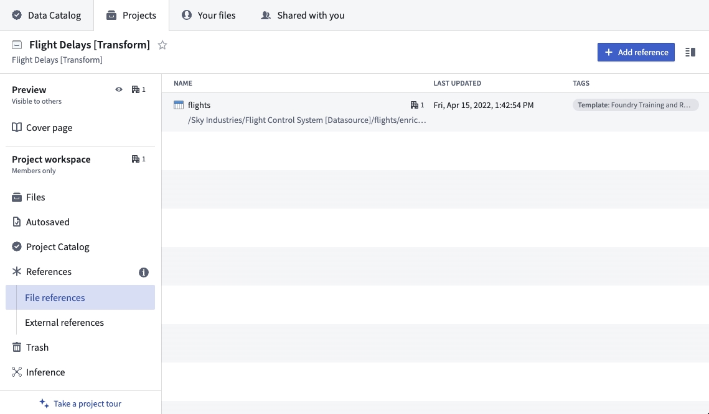
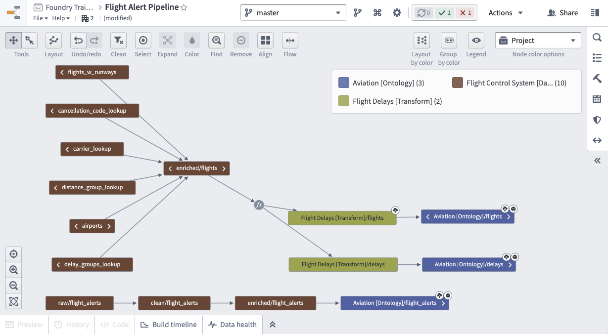
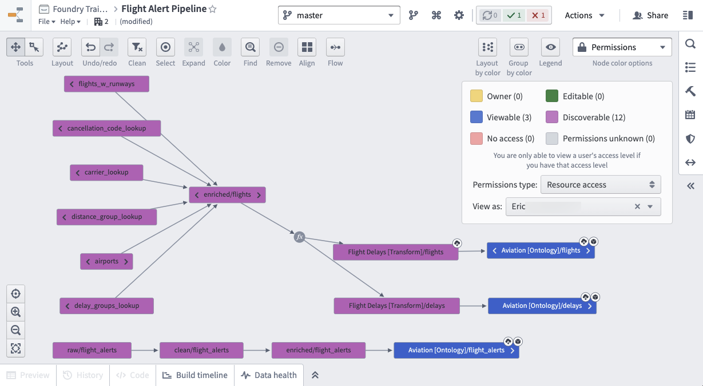
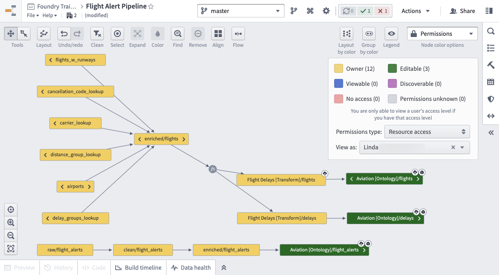

<!-- source: https://palantir.com/docs/foundry/security/securing-a-data-foundation/ · mirrored 2026-08-12 from Palantir Foundry docs -->

# Securing a data foundation

The overarching goal of Foundry is to provide a canonical view of the objective reality within your organization. The first step in building this reality is to build and permission your data foundation. To explain how to secure your data foundation, we will walk you through a notional example with an airplane manufacturer, called Sky Industries. We will represent a Sky Industries developer who is integrating raw Flight, Runway, Airport, Alert, Route, and Passenger data, preparing it for the ontology, and then making it available to the whole Sky Industries organization.

## Creating projects

A key part of designing a data foundation is deciding which projects need to be created for your production data pipelines, in order to enable future expansion and easy maintenance. In our example, we will use the [recommended project setup](/docs/foundry/building-pipelines/recommended-project-structure/) and have 3 [projects](/docs/foundry/compass/create-a-project/) that have distinct purposes:

* **Flight Control System \[Datasource]:** Raw data is ingested from Bureau of Transportation Statistics (BTS) and cleaned in this project.
* **Flight Delays \[Transform]:** Datasets are imported from the *Flight Control System \[Datasource]* project and transformed to produce re-usable datasets.
* **Aviation \[Ontology]:** Datasets are imported from *Flight Delays \[Transform]* project and transformed to represent discrete organizational objects.

Depending on your Foundry instance, you will be able create projects and/or groups at the same time. The goal is to have three groups per project, each mapped to a default role (for example, a `Viewer`). We want our projects to all be discoverable by other users in our Organization, so we will set the Projects’ default role to `Discoverer` and we will not add Markings to the Project. Also, in each Project we will create a code repository where our transformations will live. Below is our final setup for the **Flight Delays \[Transform]** Project.

## Project references

Now that we have a Project in which to build our pipeline, we can start using Foundry to author our business logic. For details on best practices, review the [Data integration documentation](/docs/foundry/building-pipelines/development-best-practices/).

Before we can use data from another Project we need to create a reference to it in our current Project. Once we do so, we can use that dataset in our builds and enable anyone in our Project to author transformations on that data, even without having access to the source Project themselves.

Below is what it will look like when we add Project references to the *flights* dataset in the **Flight Control System \[Datasource]** Project to our **Flight Delays \[Transform]** Project.

After writing all our transformations, below is what our final production pipeline looks like.

Since our pipeline covers 3 Projects, we can give users specific Role access separately for each Project.

For example, we will add our first operational user, Eric, to the *Aviation \[Ontology] - Viewer* group which will give them *Viewer* access on the **Aviation \[Ontology]** Project. Given the default role is *Discoverer*, these same users would only have *Discoverer* access on the **Flight Control System \[Datasource]** and **Flight Delays \[Transform]** Projects, but *Viewer* on the **Aviation \[Ontology]** project. Note that, having discoverer access to the Datasource Project **will not** preclude users from being granted access to downstream data, like in the Ontology Project.

Below is what the resource access for Eric looks like.

Eric’s colleague, Linda, is the one who will maintain the production pipeline. So Linda is added to the corresponding Owner and Editor groups for all 3 Projects. Breaking your pipeline into discrete Projects and groups is the easiest to maintain long term.

## Sharing data

We recommend sharing data and resources with a colleague by adding them to the correct Project group so they have uniform access to the Project. This method is more legible and easier to manage than sharing resources directly. In addition to providing the right roles through the correct Project group membership, you should check that other access requirements like Markings and Organization membership are met. Review the [checking permissions](/docs/foundry/security/checking-permissions/) section for more details.
