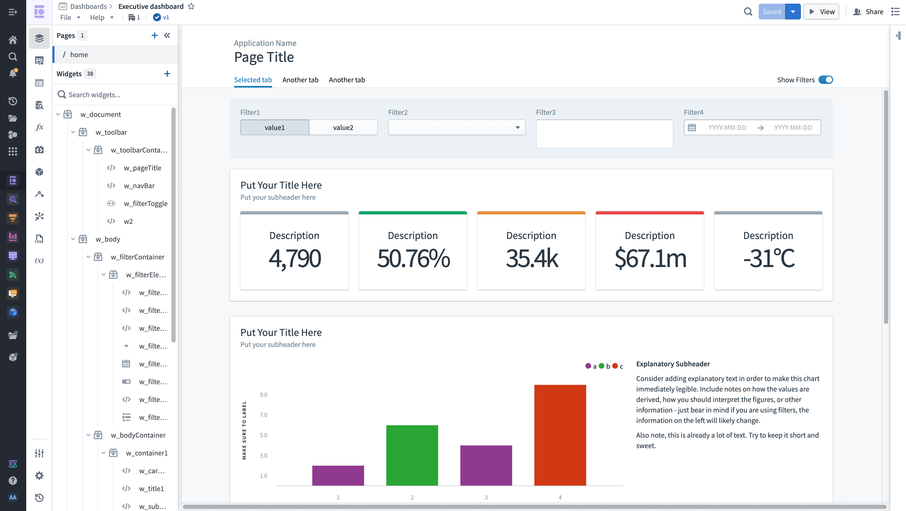

<!-- source: https://palantir.com/docs/foundry/slate/ · mirrored 2026-08-18 from Palantir Foundry docs -->

# Slate

**Slate** enables application developers (builders) to construct dynamic and responsive applications with a custom design using a drag-and-drop interface, reducing development time and cost. With minimal coding skills, developers can quickly create operational applications, interactive dashboards and custom landing pages with a custom style.

Customize the [style](/docs/foundry/slate/style-overview/) of your application using CSS, giving you the ability to create a unique experience for your users that aligns with your corporate identity or lets you experiment with new designs. With Slate, everything you see can be changed, from the background color of the canvas to the font and border radius of a button.

With Slate, builders can also build applications accessible to the [public Internet](/docs/foundry/slate/applications-types/#public-applications) without the need to configure servers, DNS, or authentication, allowing individuals without Foundry accounts to upload/submit data into Foundry, subject to validation logic and other safety measures.

Seamlessly leverage the [Ontology](/docs/foundry/ontology/overview/), using object data, [functions](/docs/foundry/functions/overview/) and [Actions](/docs/foundry/action-types/overview/) along with data from [sources external to Foundry](/docs/foundry/slate/read-write-overview/) (for example, databases and APIs).

If you're new to Slate, start by [familiarizing yourself with the interface](/docs/foundry/slate/navigation/) and learning about [managing Slate applications](/docs/foundry/slate/read-write-overview/).
