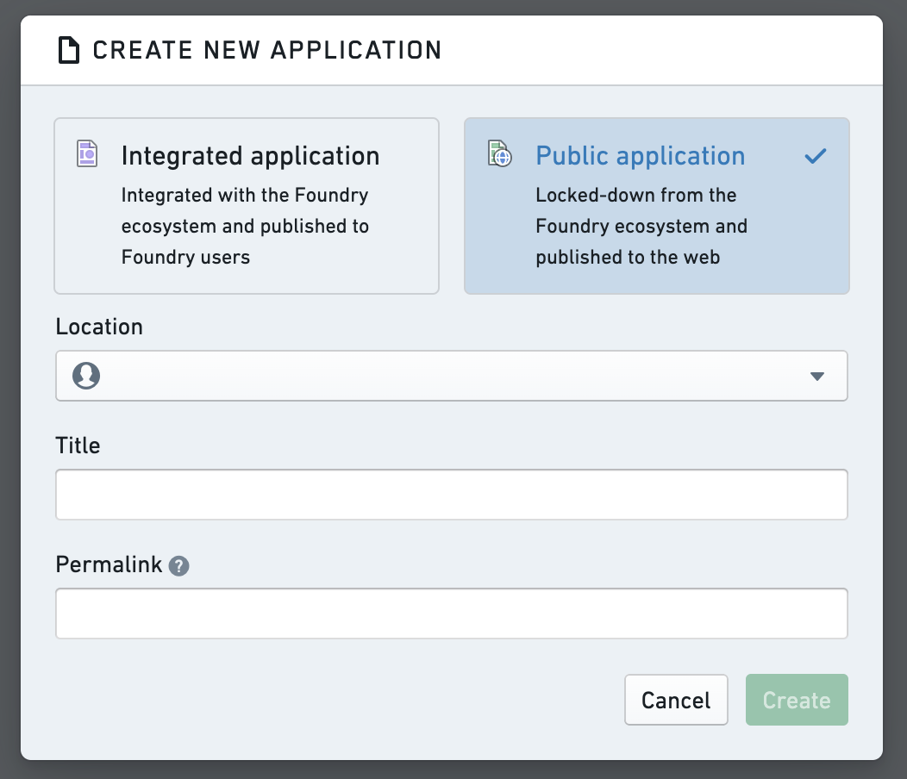
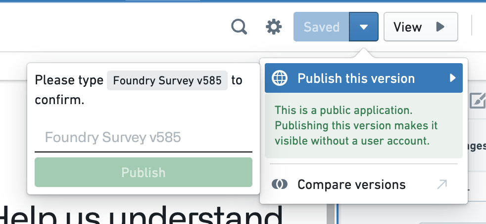
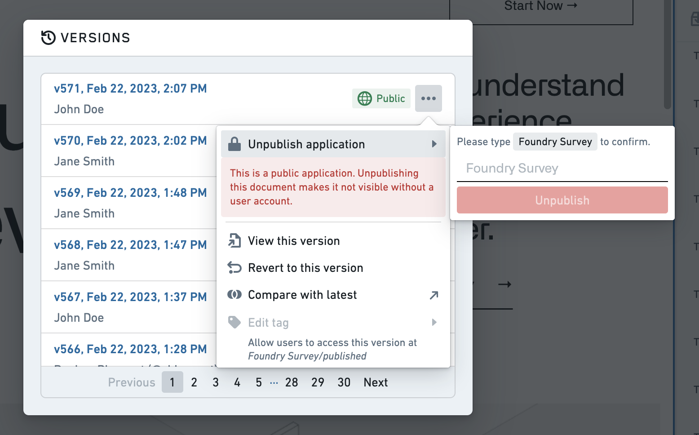

<!-- source: https://palantir.com/docs/foundry/slate/applications-create/ · mirrored 2026-08-22 from Palantir Foundry docs -->

# Create and publish an application

To create a new Slate application, navigate to a Project view and select **+New > Slate application**. You can also open Slate from the navigation side panel and select **+ New application**.

## Create an integrated application

To create an integrated application, choose the **Integrated application** option in the **Create new application** pop-up that appears. Add a location, title, and permalink to identify the application in a unique URL.

Next, learn how to structure your application into [pages](/docs/foundry/slate/applications-pages/) to optimize for scalability, maintainability, and performance.

## Create a public application

Creating and editing new public applications requires permissions as described in [Permissions](/docs/foundry/slate/applications-types/#permissions). To create a new public application, select the **Public application** option. Public applications can only be created in projects and cannot be stored in private folders. Templates are not available for public applications.

The public application must first be [published](#publish-a-public-application) before unauthenticated users can view it.

### Publish a public application

To make newly-created public applications available for use, it must be published via either the version dialog or the dropdown next to **Save** assuming all prior edits have been saved already. Compared to strictly internal applications, public applications cannot be automatically published and the version intended for publication needs to be confirmed every time to prevent accidental publication.

Only one version can be published at any time. Tags are also not accessible to unauthenticated users, and these users will be redirected to the published version or shown an error message where there is no published version.

### Unpublish a public application

A published application can be unpublished anytime when no longer needed. Unpublished applications can be accessed by authenticated users with the required resource permissions, but are inaccessible to unauthenticated users.

To unpublish, open the version dialog in edit mode and navigate to the published version in the list, indicated by the globe icon. Open the context menu and select **Unpublish** for on-screen guidance.

