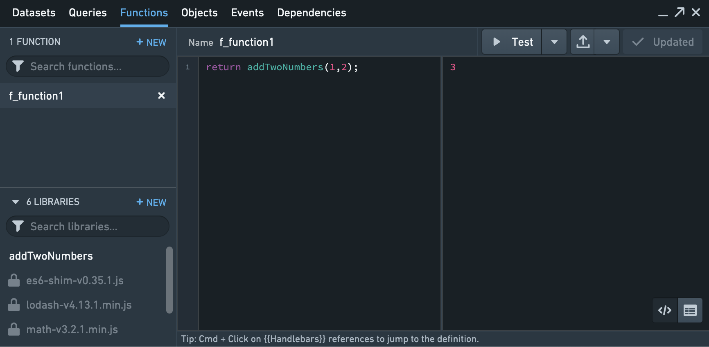
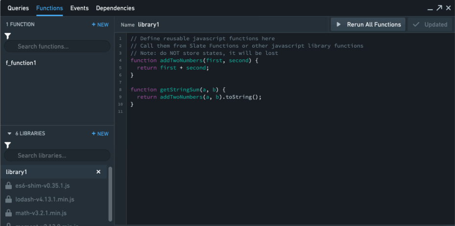
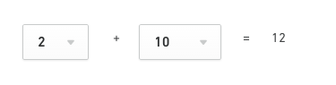

<!-- source: https://palantir.com/docs/foundry/slate/concepts-functions/ · mirrored 2026-08-22 from Palantir Foundry docs -->

# Define and run Slate functions

:::callout{theme="neutral"}
Slate Functions are only available in Slate and are distinct from Foundry Functions; Foundry Functions are accessible platform-wide. You can access Foundry Functions in Slate using the Slate Platform Editor. Refer to the [Functions documentation](/docs/foundry/functions/overview/) for more information.
:::

The **Functions Editor** lets you define and run JavaScript functions on Handlebars-accessible items such as query results, global variables, and widget properties.

Functions do not have access to the DOM or the Slate [space](/docs/foundry/security/orgs-and-spaces/#spaces) and no state is saved. They can be used for data transformation only.

Functions are typically used for lightweight data-processing tasks like string parsing. Functions support asynchronous syntax (including *async*, *await* keywords, and promise).

:::callout{theme="warning"}
Functions run sequentially, not in parallel. Slate executes functions one at a time from a queue, so each function must finish before the next one begins. This applies even when functions use asynchronous calls: a function that awaits a long-running operation will block the queue until it completes, delaying any functions that follow. Avoid relying on functions running concurrently.
:::



## Per-Document level function libraries

Users are able to write reusable JavaScript functions with parameters. This will assist in the refactoring of code and reducing the copying and pasting of code in functions. You can also re-run and update all the functions dependent on a function library using the `Re-run All Function` button.



## Default JavaScript libraries available

For enhanced use of functions, Slate ships by default with the following external JavaScript libraries: [Lodash ↗](https://lodash.com/), [Math.js ↗](https://mathjs.org/), [Moment ↗](https://momentjs.com/), [Numeral ↗](http://numeraljs.com/), and [es6-shim ↗](https://github.com/paulmillr/es6-shim). Feel free to use these libraries when writing your functions.

Do not use ES6 syntax features unless all users are mandated to use a browser supporting these features.

## Upload custom external libraries

You can upload external JavaScript libraries for use in Slate functions:

* **Application libraries:** Add libraries in the **Functions** panel. These libraries are available only in that Slate application.
* **Platform-wide libraries:** Use the **Admin Panel** to upload libraries for all users and applications across your Foundry instance.

## Examples

### Example 1: add two widget properties

This function adds the value of two dropdown widgets and displays the result in a text widget.



Open the Functions editor and add a function called `addNumbers`. Add the following JavaScript:

```js
return {{lhs.selectedValue}} + {{rhs.selectedValue}};
```

Then, in the text widget, display the return value by referencing the function’s name in Handlebars `{{addNumbers}}`.

:::callout{theme="neutral"}
The Functions editor does not accept [Helpers](/docs/foundry/slate/references-helpers/) of any kind.
:::

### Example 2: parse query results

This function parses each element in a query result. Assume there is a query named `asteroids` and it returns the following JSON:

```json
{"id": [6, 7, 8],"name": ["Hebe", "Iris", "Flora"],"diameter": [185.18, 199.83, 135.89]}
```

The following function returns a result that combines the name and id, and also adds a new circumference property.

```js
var asteroids = {{asteroids}};
var formattedNames = [];
var circumference = [];

for (var i = 0; i < asteroids.name.length; i++) {
  formattedNames.push(formatName(
    asteroids.name[i], asteroids.designation[i]));
  circumference.push(asteroids.diameter[i] * 3.14);
}

return {
  name: formattedNames,
  diameter: asteroids.diameter,
  circumference: circumference
};

function formatName(name, designation) {
  return name + " (" + designation + ")";
}
```

The resulting JSON looks like this:

```json
{
  "name": ["Hebe (6)", "Iris (7)", "Flora (8)"],
  "diameter": [185.18, 199.83, 135.89],
  "circumference": [581.4652,627.4662,426.6946]
}
```

### Example 3: Create pause using set timeout and promises

This function creates a *setTimeout* with a five second interval to pause the Slate function for five seconds before executing.

```js
return new Promise(resolve => {
  setTimeout(() => {
    resolve();
  }, 5000);
});
```

This function returns `undefined` after five seconds of pause.
