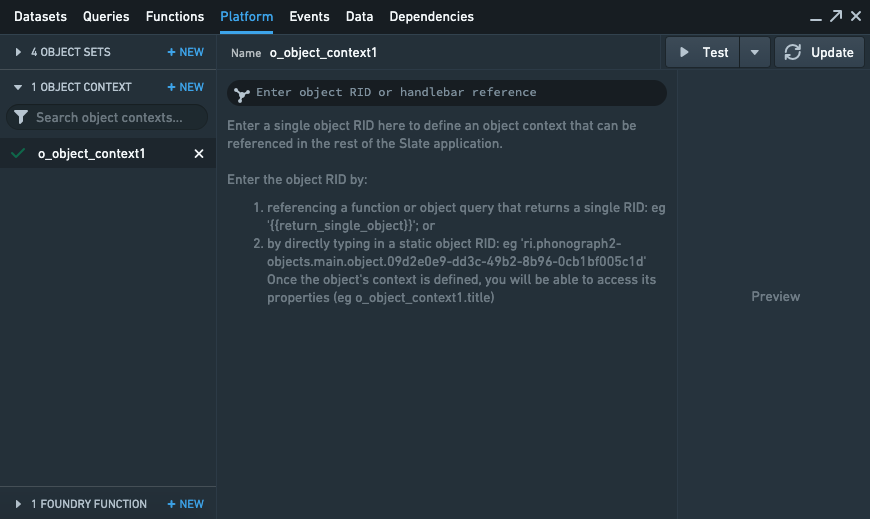

<!-- source: https://palantir.com/docs/foundry/slate/concepts-object-context/ · mirrored 2026-08-18 from Palantir Foundry docs -->

# Retrieve individual objects

The Object Context panel lets you:

* Access the properties of an object directly using `{{o_object_context1.property1}}` notation, instead of manipulating JSON.
* Create a Slate application that will be dependent on a single object, which is a common pattern when using Slate to build a tab or custom widget to embed in an Object View.

## Constructing an Object Context

To construct an Object Context `o_object_context1`, you need to enter a single object RID by:

* Referencing a function or object query that returns a single RID (like `{{return_single_object}}`), or by
* Directly entering a static object RID, like `ri.phonograph2-objects.main.object.09d2e0e9-dd3c-49b2-8b96-0cb1bf005c1d`.

Once the Object Context is defined, you will be able to:

* Access its properties (for example, `o_object_context1.title or o_object_context1.property1`) and
* Use this output in the rest of Slate’s functions, variables, events, or widget properties.
