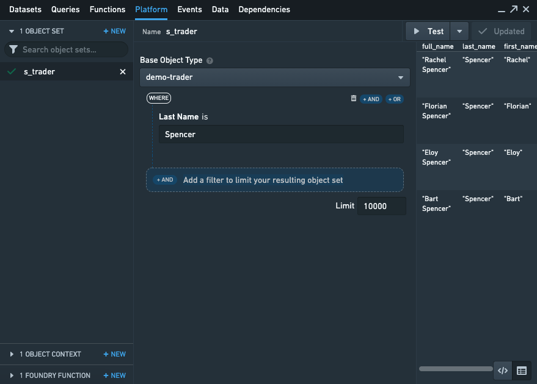
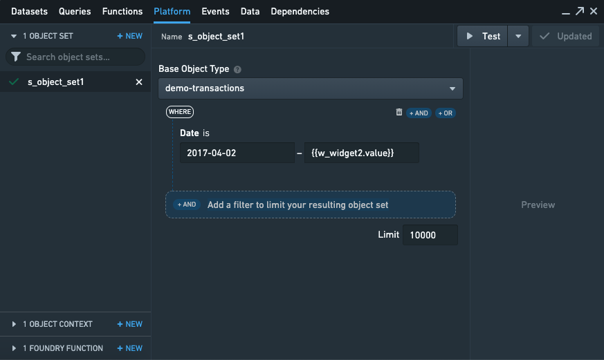
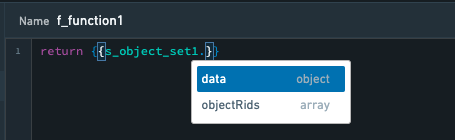

<!-- source: https://palantir.com/docs/foundry/slate/concepts-object-sets/ · mirrored 2026-08-22 from Palantir Foundry docs -->

# Create or retrieve object sets

The Object Set panel under the platform tab lets you:

* Create an object set, with or without filters, without any extra service configuration.
* Access objects of the object set directly by using the template dot notation (such as `{{s_object_set1.data.property1}}`).
* Access object RIDs using `{{s_object_set1.objectRids}}`.

There are two modes:

* `Builder` mode, which allows you to construct an object set using a GUI (graphical user interface), and
* `RID` mode, which allows you to construct an object set by referencing the `object set RID` or the `versioned object set RID`.

## Object set filter builder mode

To create an object set `s_object_set1`, select the base object type and then optionally add filters with AND/OR logic. The filter’s fields will account for the object’s property data type. For example, numeric properties will take a number range as the filter. You can further nest individual AND/OR filters in each filter level to limit the objects to specific results.

You can also use Slate’s handlebars in the filter fields so that you can parameterize an object set based on a dynamically changing input.

The filter fields also support templatizing using multi-term filters and wildcard filters:

* To templatize using the multi-term filter, you can pass in the multiple terms directly (for example, `["value1", "value2"]`).
* Alternatively, you can pass in a Handlebars template with direct reference to a function that outputs multiple terms.
  * For example, if `{{f_my_filters}}` returns `["value1", "value2"]`, you can use `{{f_my_filters}}` directly in the object set editor.

Object set results are returned in a tabular format under field `data` and also includes all object RIDs in field `objectRids`.

## Object set limit results

The Object Set filter also lets you set an upper limit on the number of objects returned. This is conceptually similar to SQL's `LIMIT` clause and enables quicker testing and iteration.

If the limit is smaller than the total number of results, the `getNextPage` and `getPreviousPage` events can be used to page through the results. This can boost performance when returning a large number of results.

## Aggregations

Simple aggregations on object sets can be calculated using the object set editor in the **Platform** tab. To create an aggregate, toggle on **Aggregation** under **Output options** and select **Add aggregation**. The aggregation is based on the resulting object set defined above.

Aggregations can use one of the following aggregation types: count, average, sum, max, min, or cardinality. When calculating an aggregation other than count, a numeric property has to be selected.

You can calculate multiple aggregations based on one object set by selecting **Add aggregation**. When using aggregations, the preview will only show the results of the aggregation. The granular objects, however, are still available when referencing the object set via handlebars in Functions, Widgets, and other parts of Slate.

### Multi-dimensional aggregation

To aggregate object set data over multiple dimensions (such as including a "group by" or segment), it is necessary to write a [Function](/docs/foundry/functions/api-object-sets/#computing-aggregations) to group and segment the data before calculating a metric for the resulting buckets.

These Functions return [aggregation types](/docs/foundry/functions/types-reference/#aggregation-types) that Slate will parse into the parallel list data structure used for configuring charts and other Slate widgets.

The [documentation on how to call Foundry Functions](/docs/foundry/slate/concepts-foundry-functions/) has further details on these interactions from Slate.

## Object set sort

The resulting object set can be sorted by any parameter in either ascending or descending order. Multiple properties can be configured for the sorting, and sorting properties are applied from top to bottom. The limit set will only take effect after the sorting.

## Object set RID mode

In the object set `RID` mode, Slate's object set panel is able to take in the `object set RID` as well as a `versioned object set RID` and resolve it back into Slate's data array format.

This means that you will have the flexibility of passing around RIDs in addition to using Slate's parameterized object set builder.
