<!-- source: https://palantir.com/docs/foundry/slate/concepts-queries/ · mirrored 2026-08-22 from Palantir Foundry docs -->

# Read and write to data systems

The **Queries** panel lets you query your data sources. The panel separates query template configuration from related events, schedules, and constraints. For JSON-based templates, the panel validates syntax and provides an integrated query preview for testing queries before deployment.

Depending on the type of data source, you can write different queries in the Queries panel. The below provides overviews and examples about how to write different types of queries, security considerations when using Handlebars in each type of query, and an introduction to query partials and conditional queries.

## Filtering queries by data source

If your application has multiple data sources, a filter icon appears next to the search input. Select the icon, then select or clear the checkboxes to display queries from specific data sources. You can also select or clear all data sources. Combine the data source filter with search terms to further narrow the query list.

## Query security overview

[Foundry queries](#foundry-queries) use the Foundry Synchronizer, which enforces read-only permissions on all synced tables; additionally, access to the individual tables respect the access granted at the dataset level in Foundry.

For datasources outside of Foundry, using Handlebars in queries raises security concerns because malicious users could perform injection attacks by replacing the contents of the template with harmful code. These queries therefore require additional security rules for Handlebars use - the rules are described in depth in the [SQL queries](#sql-queries) and [HTTP JSON queries](#http-json-queries) sections below.

Additionally, any template that references user variables (e.g. `{{user.firstName}}`) gets its value from the server rather than accepting the value passed to the browser on login.

An example of a SQL security error:

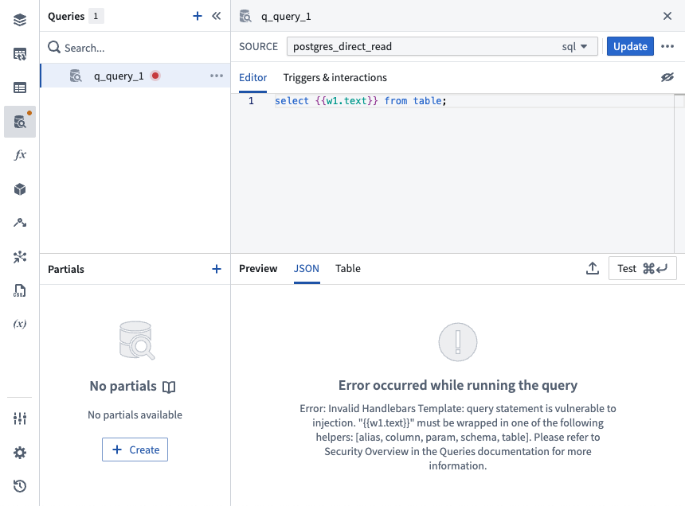

An example of a HTTP JSON security error:

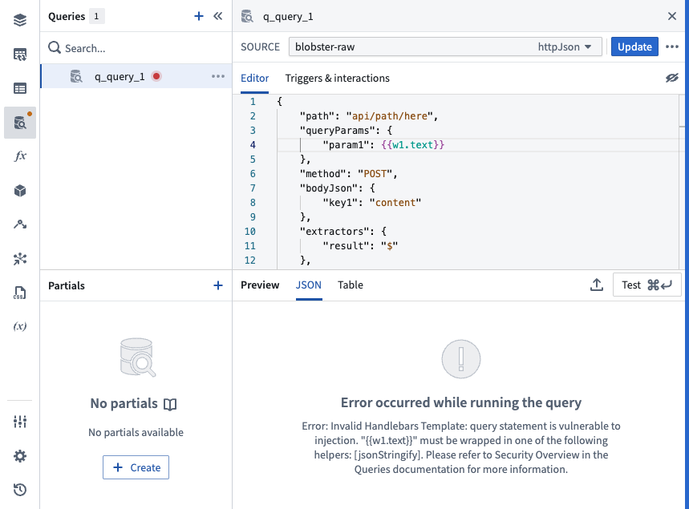

## API Gateway queries

The `API Gateway` data source can be used to interact with Foundry APIs. The documentation for each service and endpoint is displayed inline. Full documentation can be found in the [API reference](/docs/foundry/api/v2).

Specific examples for payload types can be found behind the **Show description** toggle next to the request input. These endpoints are secured differently than [HTTP JSON](#http-json-queries) datasource-type queries, so you do not need to [jsonStringify](/docs/foundry/slate/references-helpers/#jsonstringify) handlebar inputs.

### Discover available endpoints

The endpoints you can call are the subset of the Foundry API enabled for the data source, so the query editor lists only the services and endpoints available to you. To find an endpoint to call:

1. Create a new query in the **Queries** panel and select a data source with the `API Gateway` type from the **Source** dropdown.
2. Select a **Service**. Each service groups a set of related endpoints.
3. Select a **Method** to choose an endpoint within that service.
4. Select **Show description** to expand the inline documentation for the selected service, endpoint, or parameter. Descriptions are collapsed by default. The endpoint description states the HTTP method and path, and displays a warning when the endpoint is deprecated.

If an endpoint you expect is not listed, it is either not enabled for the data source or not available on your enrollment. Contact your Palantir representative to request access. For the complete catalog of endpoints, see the [API reference](/docs/foundry/api/v2).

For help resolving a query that fails, see [Troubleshoot API Gateway queries](#troubleshoot-api-gateway-queries).

### Common data endpoints

The `API Gateway` data source is frequently used to retrieve operational metadata about Foundry resources, such as when a dataset was last updated or whether its health checks are passing. The following endpoints cover the most common cases. Select an endpoint to view its full request and response documentation.

| Data you want | Endpoint | Notes |
| --- | --- | --- |
| Dataset metadata, such as the name and parent folder | [Get Dataset](/docs/foundry/api/v2/datasets-v2-resources/datasets/get-dataset/) | Takes the dataset RID. You can retrieve the RID from the [platform widget](/docs/foundry/slate/widgets-platform/) or from the resource URL in Foundry. |
| Dataset last update time | [Get Branch Transaction History](/docs/foundry/api/v2/datasets-v2-resources/branches/get-branch-transaction-history/) | |
| All transactions for a dataset, across branches | [List Transactions Of Dataset](/docs/foundry/api/v2/datasets-v2-resources/datasets/list-transactions-of-dataset/) | |
| A single transaction | [Get Transaction](/docs/foundry/api/v2/datasets-v2-resources/transactions/get-transaction/) | |
| Which health checks are configured on a dataset | [Get Dataset Health Checks](/docs/foundry/api/v2/datasets-v2-resources/datasets/get-dataset-health-checks/) | See [health checks](/docs/foundry/data-integration/health-checks/) for background on how checks are defined. |
| Current data health status of a dataset | [Get Dataset Health Check Reports](/docs/foundry/api/v2/datasets-v2-resources/datasets/get-dataset-health-check-reports/) | |
| Report history for one health check | [Get Latest Check Reports](/docs/foundry/api/v2/data-health-v2-resources/check-reports/get-latest-check-reports/) | |
| Schedules that target a dataset | [Get Dataset Schedules](/docs/foundry/api/v2/datasets-v2-resources/datasets/get-dataset-schedules/) | |
| Dataset schema | [Get Dataset Schema](/docs/foundry/api/v2/datasets-v2-resources/datasets/get-dataset-schema/) | |
| Ontology objects and metadata | [Ontology metadata](/docs/foundry/api/v2/ontologies-v2-resources/ontologies/get-ontology-full-metadata/) | For most Ontology read workflows, prefer the [object set panel](/docs/foundry/slate/concepts-object-sets/), [object context panel](/docs/foundry/slate/concepts-object-context/), or the [OSDK](/docs/foundry/slate/concepts-osdk/) over direct API Gateway queries. |

:::callout{theme="warning"}
Several of the endpoints above, including the transaction history and data health endpoints, are in public preview. A preview endpoint requires its `preview` parameter to be set to `true`. Without it, the request fails with an `ApiFeaturePreviewUsageOnly` error, which surfaces in Slate as a `400`. Check the release stage on the endpoint's reference page before you rely on it in a production application.
:::

### Configure the request

Slate builds the request from your selections in the query editor, so you do not assemble the HTTP request by hand. After you select a service and an endpoint, the editor displays one input for each parameter that the endpoint accepts, including path parameters, query parameters, headers, and the request body. Select **Show description** next to a parameter to view its expected type.

Each parameter input accepts a static value or a Handlebars reference to a widget, variable, or function. Because `API Gateway` queries are secured differently than [HTTP JSON queries](#http-json-queries), you can reference values directly without a security helper. For a request body, use the **Text** and **JSON** switch to control whether Slate sends the value as a string or as a JSON object.

To review the request that your selections produce, select **Preview rendered query** in the **Queries** panel. Slate displays the read-only request with Handlebars references resolved to their current values. Select **View query template** to return to the editor.

:::callout{theme="neutral"}
[Extractors](#writing-http-json-queries) are only available for HTTP JSON queries. An `API Gateway` query returns the full response, so reference the fields you need from the query result.
:::

## Foundry queries

The recommended method for querying Foundry data in Slate is to use the Ontology. Ontology objects can be used in Slate with the [OSDK](/docs/foundry/slate/concepts-osdk/), [the object set panel](/docs/foundry/slate/concepts-object-sets/), or [the object context panel](/docs/foundry/slate/concepts-object-context/). Alternatively, [API gateway queries](#api-gateway-queries) can be used.

The [legacy](/docs/foundry/platform-overview/development-life-cycle/#legacy) method for querying data in Slate uses SQL queries to retrieve data from datasets synced to a Postgres instance in Foundry. This method is only available when dataset syncs have been enabled for your enrollment. Note that this feature is still supported, but no longer in development. We encourage querying data with the Ontology to benefit from new features and ensure future support.

Note that you do not need to use any SQL security helpers.

To create a dataset sync:

1. Add a dataset in the **Dataset sync** panel and go to the **Sync to Postgres** section.
2. Enter a table name.
3. Select **Apply and sync**.

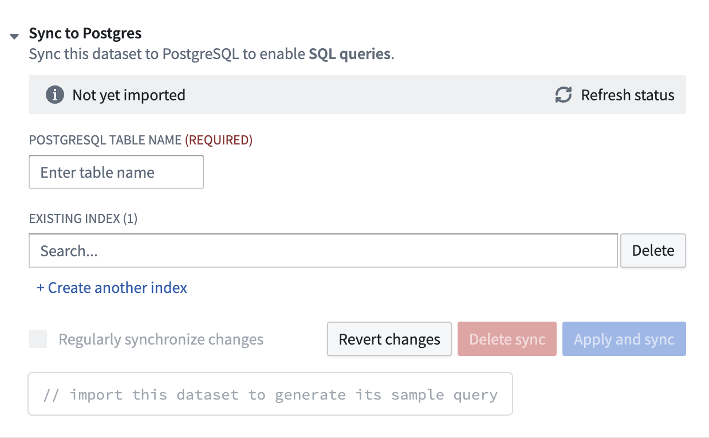

When the sync has completed, the **Sync to Postgres** section in the **Dataset sync** tab will contain a sample SQL query that can be pasted into the **Queries** tab.

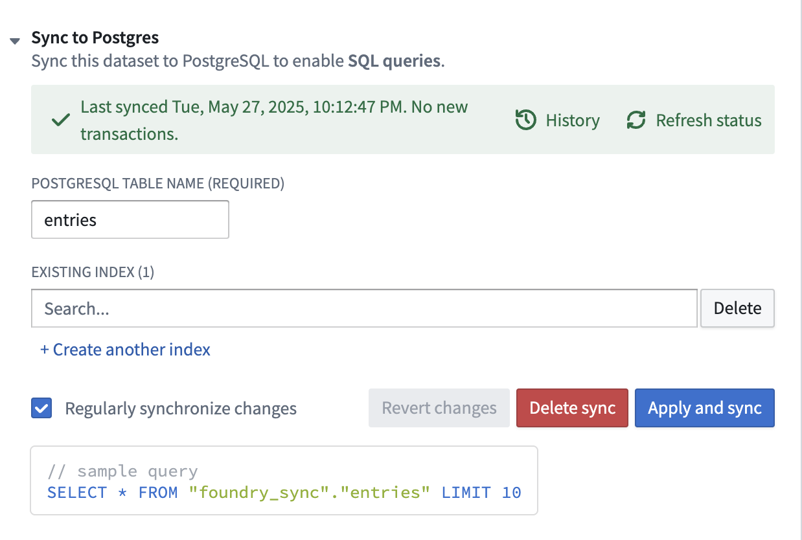

## SQL queries

### Security considerations

All handlebars templates in SQL queries (with the exception of those using Foundry datasources) must be enclosed by SQL security helpers or [Handlebars Built-In Helpers ↗](https://handlebarsjs.com/guide/builtin-helpers.html). You can find the full details for how and when to use each SQL security helper in [SQL Helpers](/docs/foundry/slate/references-helpers/#sql-helpers).

There are five helpers, which are [schema](/docs/foundry/slate/references-helpers/#schema), [table](/docs/foundry/slate/references-helpers/#table), [column](/docs/foundry/slate/references-helpers/#column), [alias](/docs/foundry/slate/references-helpers/#alias) and [param](/docs/foundry/slate/references-helpers/#param).

* `schema`, `table`: The `schema` and `table` helpers work very similarly. Given a name and a list of allowed names, the helpers check to make sure the name exists in the list of allowed names and in the corresponding information schema table. For example, the table helper checks if the table name exists in the list of allowed names and in `information_schema.tables` or the corresponding schema table in your database. Specifying the list of allowed names prevents the query from accessing any schema/table that it should not access. You cannot template the allowed names, because this would defeat the purpose of the validation.

```sql
SELECT column1 FROM {{schema someSchemaName 'allowedSchemaName1' 'allowedSchemaName2'}}.{{table someTableName 'allowedTableName1'}};
```

* `column`: The `column` helper checks to make sure the name exists in `information_schema.columns` or the corresponding schema table in your database.

```sql
SELECT {{column someColumnName}} FROM table1;
```

* `alias`: The `alias` helper is used when you want to template an aliased schema, table or column name. Because the aliased name is not in the information schema, you must register it with Slate using the `alias` helper; otherwise, the name cannot be validated. You could only use the `alias` helper with constant strings and not references, i.e. `{{alias 'someConstantString'}}` is allowed and `{{alias someReference}}` is not. Templating it defeats the purpose of validating it in `schema`, `table` or `column` because they could reference the same thing.

```sql
SELECT
column1 as {{alias 'aliasedColumnName'}}
FROM table1
ORDER BY {{column someColumnName}}

where someColumnName is 'aliasedColumnName' and 'aliasedColumnName' is not a valid column name in the database's schema.
```

* `param`: The `param` helper replaces the template with a ‘?’ such that the values can be set later using a `preparedStatement`. PreparedStatement is one of the safest way to protect against SQL injections. Notice that all values coming from the front end are numbers or strings, so to use a value with a type other than number or string in the query, you must cast the value to that type.

```sql
SELECT column1 FROM table1 WHERE column1 > {{param value1}} and dateColumn1 < {{param value2}}::date
```

### When should I use which helper?

* When you want to template a schema/table/column name, you should use one of the corresponding `schema`, `table` or `column` helpers.
* When you want to template an aliased table/column, you should register the alias with the `alias` helper.
* When you want to template a parameter value, i.e. the value in a comparison in the where clause, you should use the `param` helper.

### Writing SQL queries

When querying a SQL data source, the editor accepts any SQL command. Typically, you run a SELECT statement. For example:

```sql
SELECT name,diameter,period FROM allNamed;
```

Slate parses the resulting rows into JSON, a key for each column, so that they are accessible via handlebars.

```json
{
    "name": ["Undina", "Hekate"],
    "diameter": [126.42, 88.66],
    "period": [5.68801089633658, 5.42957878301233]
}
```

You can perform data transformations, such as basic string and math operations, by using [SQL’s built-in functions ↗](https://www.postgresql.org/docs/9.3/functions.html).

## HTTP JSON queries

### Security considerations

All HTTP JSON queries must conform to the following:

* All Handlebars templates must be wrapped in a [jsonStringify](/docs/foundry/slate/references-helpers/#jsonstringify) helper. The `jsonStringify` helper ensures that the value of the template could not escape its current scope. For example, it could not close the block and add extra properties to the request.<br>
  An example to use it to template a property:

```json
{
    "path": "path/to/api",
    "method": "POST",
    "bodyJson": {
        "filter": {{jsonStringify w1.text}}
    },
    "extractors": {
        "result": "$"
    },
    "headers": {
        "Custom_Header": "my custom header value"
    }
}
```

```
An example to use it to template as part of a property:
```

```json
{
    "path": "path/to/api",
    "method": "POST",
    "bodyJson": {
        "filter": {{#jsonStringify}}some text plus {{w1.text}}{{/jsonStringify}}
    },
    "extractors": {
        "result": "$"
    },
    "headers": {
        "Custom_Header": "my custom header value"
    }
}
```

* `..` is not allowed in the path. This ensures that the query path does not index to any parent scope and does not access information that should not be accessed.

### Writing HTTP JSON queries

The query for a HTTP JSON data source is an object that contains the following properties: `path`, `method`, `bodyJson`, `extractors`.

* `path`: the URL path to the data source
* `queryParams`: (optional) the map of key-value pairs to append to the URL when building the request (ie. “query”: “something” would append ?query=something to the `path`). Note that when this map is not empty, query params should not be specified in the `path`.
* `method`: the HTTP method used to make the request. Supported methods are GET, POST, DELETE, and PUT.
* `bodyJson`: (optional) the JSON that is sent as data to the API endpoint (e.g., how to format and aggregate the data). This field is not required if your data source endpoint does not expect JSON.
* `extractors`: the results the query returns. Uses [JSONPath ↗](https://github.com/jayway/JsonPath) to determine what to extract. For example, to see the whole result, use `"result": "$"`. For help writing JSONPath, consult the following [tester ↗](https://jsonpath.curiousconcept.com/). For more information on JSONPath, see [JSONPath examples ↗](https://goessner.net/articles/JsonPath/).
* `headers`: (optional) A map of headers to set on the request. Authentication headers will be added on top of this list if present.<br>
  For example:

```json
{
    "path": "astronomy/_comets",
    "queryParams": {
        "limit": 5,
        "text": "searchabc"
    },
    "method": "GET",
    "bodyJson": {
        "fields": ["name", "type", "date"],
        "query": {
            "type": "dust"
        }
    },
    "extractors": {
        "name": "$.results[*].fields.name"
    },
    "headers": {
        "Custom_Header": "my custom header value"
    }
}
```

### Elasticsearch

The following is an example using Elasticsearch.

```json
{
    "path": "geologist/_search",
    "method": "POST",
    "bodyJson": {
        "query": {
            "prefix": {
                "request": "/daily/api/permalinks/"
            }
        },
        "aggs": {
            "views": {
                "terms": {
                    "field": "auth",
                    "size": 0
                }
            }
        }
    },
    "extractors": {
        "Users": "$.aggregations.views.buckets[*].key",
        "Views": "$.aggregations.views.buckets[*].doc_count"
    }
}
```

For more information on Elasticsearch, see the [Query DSL documentation ↗](https://www.elastic.co/guide/en/elasticsearch/reference/current/query-dsl.html).

## Query partials

Query partials allow you to write query code that can be reused in multiple queries in your document. To create a partial, click the **+ New Partial** button in the Queries panel.

You can insert a partial into a query by writing `{{>partialName}}`. For example, say you have a partial named `columnFilter` with the contents `WHERE column={{param w8.selectedValue}}`. You can create another query with the code `SELECT * from table {{>columnFilter}}`. This renders to the query `SELECT * from table WHERE column={{param w8.selectedValue}}`.

You can also pass arguments to partials, with the syntax `{{>partialName` `arg1=value1 arg2=value2 arg3=value3}}`. The value of the arguments in the partial’s context will be replaced with the values you provide in a particular query. Values can be static values (such as strings or numbers), or Handlebars references (such as `w8.selectedValue`). In the example above, if you had two queries that were exactly the same, except were filtered by two different selected values, you could redefine `columnFilter` to be `WHERE column={{param columnValue}}`, and the query to be `SELECT * from table {{>columnFilter columnValue=w8.selectedValue}}`, which renders as `SELECT * from table WHERE column={{param w8.selectedValue}}`, as before.

You can also nest partials, allowing for code-reuse inside code-reuse.

To rename a partial, open the partial in the editor panel and update its name directly. When a partial is renamed, any Handlebars references to that partial in your queries are automatically updated to reflect the new name.

Partials are a Handlebars concept and the Slate implementation uses the Handlebars syntax. See the [Handlebars partials documentation ↗](https://handlebarsjs.com/guide/partials.html#partials) to learn more.

## Conditional queries

The **Triggers & interactions** tab will allow you to control the circumstances under which your query runs. There are two options for running the query conditionally, you can choose `All dependencies are not null`, which means that every single handlebars reference in the query must not be `null` in order for it to run, or you can choose `The handlebar input returns true` which will allow you to specify a handlebars condition. This condition can be a reference to a function, widget property, or anything you would like to control the logic for when your query should be able to run. The query will only run if this handlebars reference evaluates to true – if not, the query will not be run.

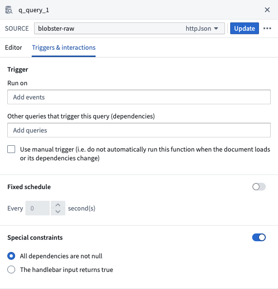

### Example 1: all dependencies are not null

The following query requires at least one value from `w_visits_bar.selection.data` in order run.

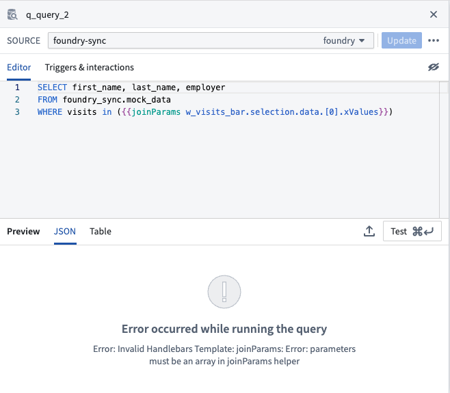

If no values are present, the request to Postgres will fail with a syntax error.

Adding the condition to only run when all dependencies are not null will prevent known bad requests from being sent to Postgres, which otherwise consume connections and resources.

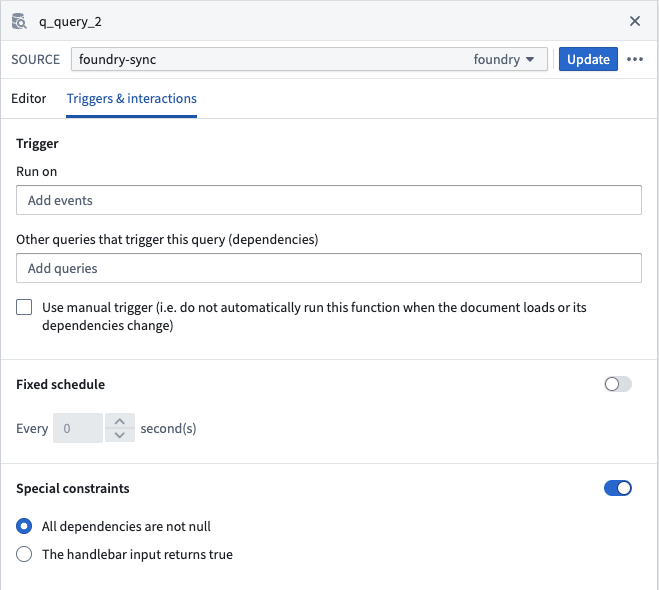

### Example 2: only run when this returns true

The following query fetches data used to populate a widget in a tabbed container. Suppose that the widget is not visible on page load but has dependencies on a set of page level filters. In this particular case, you might consider adding a condition to the query to only run when the widget is visible. This can be done using the `The handlebar input returns true` option in the query settings.

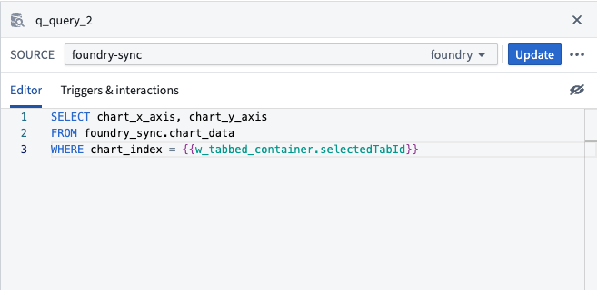

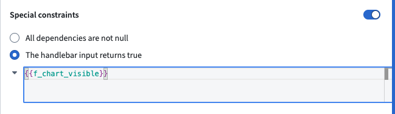

## Troubleshoot API Gateway queries

When an [API Gateway query](#api-gateway-queries) fails, the error shown in the preview panel is not always the true source of the problem. A generic message such as a bare `400`, `500`, or `An error occurred` often wraps a more specific error returned by the underlying service. Use the following steps to locate the actual cause.

### Inspect the request

Select **Preview rendered query** to view the request that Slate sends. Confirm that each parameter holds the value you expect, and that no Handlebars reference resolved to an empty value. Select **View query template** to return to the editor.

### Inspect the raw response

Select **< / >** in the preview panel to view the raw JSON response instead of the parsed result. Foundry API errors return a JSON body that names the specific problem, even when Slate shows only a status code:

```json
{
    "errorCode": "NOT_FOUND",
    "errorName": "DatasetNotFound",
    "errorInstanceId": "00813215-0844-4716-be7b-a3fe0fce9e42",
    "parameters": {
        "datasetRid": "ri.foundry.main.dataset.example"
    }
}
```

Read `errorName` first: it identifies the exact failure, and `parameters` names the resource that caused it. The [API errors reference](/docs/foundry/api/v2/general/overview/errors/) lists every `errorName` the platform returns, along with its meaning. Retain the `errorInstanceId` if you need to [file a support ticket](/docs/foundry/getting-help/file-support-ticket/), as it lets Palantir support locate the exact request.

Failed queries are also consolidated in the [health check dialog](/docs/foundry/slate/applications-debug-problems/#health-check-dialog), which lets you jump directly to the query that raised the issue.

### Common causes by error type

| Symptom | Likely cause | Resolution |
| --- | --- | --- |
| `ApiFeaturePreviewUsageOnly`, surfaced as a `400` | The endpoint is in public preview and the request did not opt in. | Set the `preview` parameter of the query to `true`. |
| An `invalid endpoint` error naming the method and path | The endpoint is not enabled for the data source. | Select the endpoint from the **Service** and **Method** dropdowns rather than reusing a query written against another data source, and contact your Palantir representative if the endpoint you need is unavailable. |
| `PERMISSION_DENIED` code with a `403`, such as `ApiUsageDenied` or an endpoint-specific error like `ReadTablePermissionDenied` | The acting user does not have access to the resource or the operation. | Confirm the resource is shared with the user and that the user has the required role on it. Note that `NOT_FOUND` errors are also returned when a resource exists but is not visible to the user. |
| `NOT_FOUND` code with a `404`, such as `DatasetNotFound` or `BranchNotFound` | The RID or branch does not exist, is not visible to the user, or a Handlebars reference resolved to an empty value when the query ran. | Check the `parameters` field of the response to see which value was rejected. Use a [conditional query](#conditional-queries) to prevent the query from running before its dependencies are set. |
| `INVALID_ARGUMENT` code with a `400`, such as `Conjure:InvalidArgument` or `InvalidPageSize` | A parameter or the request body is malformed, out of range, or missing. | Select **Show description** next to each parameter to review its expected type, and compare the request against the parameter list in the endpoint documentation. |
| `INTERNAL` code with a `500`, or a `503` | A transient service error. | Retry the request. If the problem persists, [file a support ticket](/docs/foundry/getting-help/file-support-ticket/) with the `errorInstanceId`. |

### Isolate the failing input

If the cause is still unclear after inspecting the raw response, temporarily replace each Handlebars reference in the query with a static value and run it again. If the query then succeeds, the problem is in how a referenced widget, variable, or function resolves rather than in the endpoint or request itself. The [debugger](/docs/foundry/slate/applications-debug-problems/#debugger) can help you trace the value each dependency produces at runtime.

## Tutorial: Make data available for Slate

:::callout{theme="warning"}
You should only load data using the Object Set Builder in the **Platform** tab of Slate where possible. The Object Set Builder allows you to easily query the Ontology and will return data in a tabular format similar to the example shown below. The Postgres workflow explained below is retained as a reference for legacy usage.
:::

:::callout{theme="warning"}
Before proceeding with the tutorial below, you must make the `last-mile-flights` and `airports` datasets you uploaded to Foundry available for use in Slate. Open the **Variables** panel and select **+Add** to open the Foundry resource selector.
:::

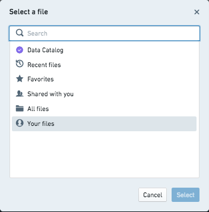

Navigate to the `last-mile-flights` dataset by selecting **All Files > Getting started data**, or use the search box in resource selector. Once you locate the dataset, choose the **Select last-mile-flights** option to begin import configuration.

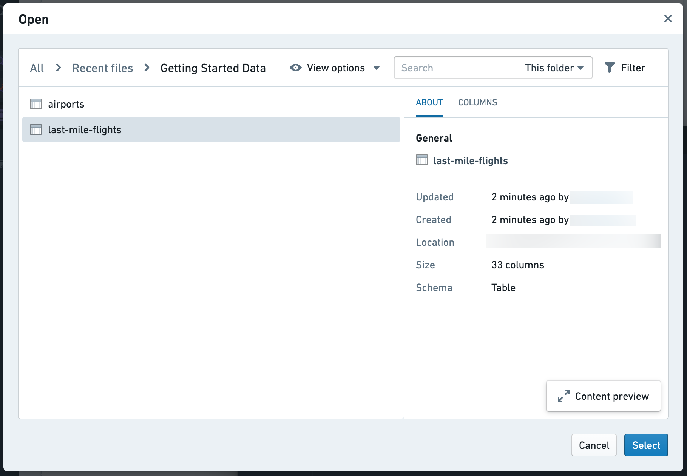

To view configuration options, select the arrow next to **Sync to Postgres**.

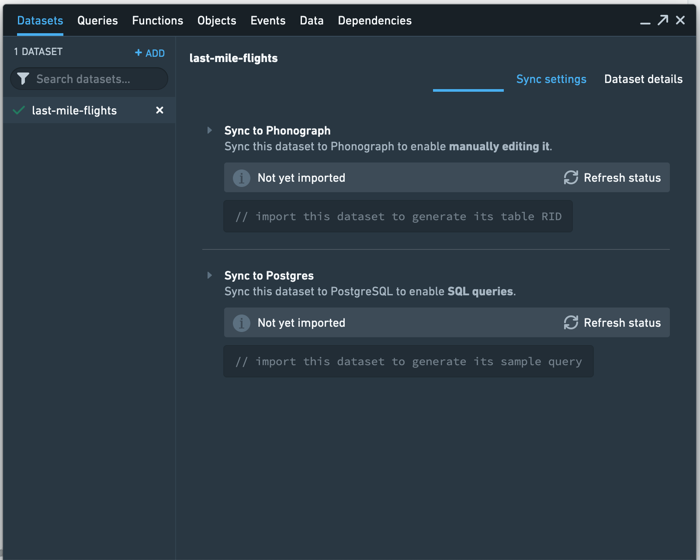

:::callout{theme="neutral"}
The default table name in Postgres will include the file path and mixed-case dataset name. To handle the special character `/`, uppercase letters, and spaces, Postgres will treat the table name as a quoted identifier. This means that whenever the table is referenced in a query, you must include double quotes or Postgres will throw a syntax error. We recommend the inclusion of a `Postgresql table name` in the setup that is snake case, lower case letters and `_` to avoid the need for double quote usage.
:::

Since the data access patterns have not yet been defined and the `last-mile-flights` dataset is relatively small, we will not create any indexes on the table. You can always add these later. Select **Apply and sync** to start the sync. You can use the **Check Status** button to monitor the sync.

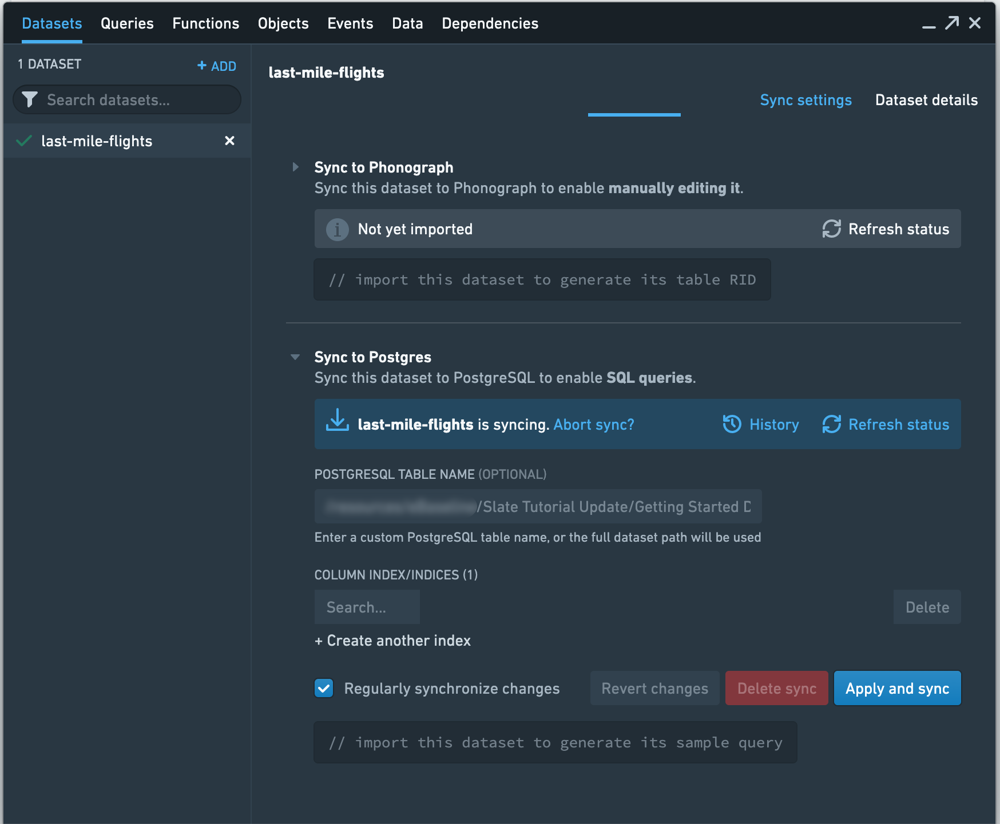

Once the sync is complete, you should see a sample query to use in Slate that looks similar to the following, though the number appended to your dataset name will be different:

```sql
SELECT * FROM "foundry_sync"."Getting Started Data/last-mile-flights-master-9406" LIMIT 10
```

Copy the query for later use as you build the application. Now, sync the `airports` dataset to Slate.

### Create a query

First, create an SQL query to pull the required data from our synced dataset.

Select **Queries** to open the panel.

You should see a **Queries** list, a **Partials** list, and an editor. The lists will be empty as no queries have been created yet.
Select **+ New query**. The editor should now display a toolbar, a text editor, and a preview panel for query results.

In the **Name** textbox, enter `q_allFlights` as the query name. Select the datasource that has the `FOUNDRY` type as the data source from the **Source** dropdown to point Slate to our database. Note that this datasource may be called `foundry-sync`, `foundry-postgate`, `foundry`, or a similar name, but will always have the `FOUNDRY` type displayed to the right of the datasource name.

:::callout{theme="neutral"}
We recommend naming your queries to start with a query identifier like `q_`, to make them easily identifiable. This best practice can be especially useful when building out larger, complex applications.
:::

For this query, we want to pull in a few rows of data from the `last-mile-flights` table in our database. To do this, we can use the sample query we copied earlier in the editor:

```sql
SELECT * FROM "foundry_sync"."Getting Started Data/last-mile-flights-master-9406" LIMIT 10
```

:::callout{theme="warning"}
The queries we use as examples below will use "variable" as a stand-in for the specific table name. For example, rather than `"foundry_sync"."Getting started data/last-mile-flights-master-9406"`, you will see `"foundry_sync"."{{v_flightTable}}"`.
:::

We can test whether the query works by selecting **Test**, or by using `Ctrl+Enter` on Windows or `Cmd+Enter` on macOS. This populates the **Preview** panel with the results of the query.

If you get an error, make sure that you made `last-mile-flights` available in Slate and that you are using the correct path.

Select **Update Query** to save the query.

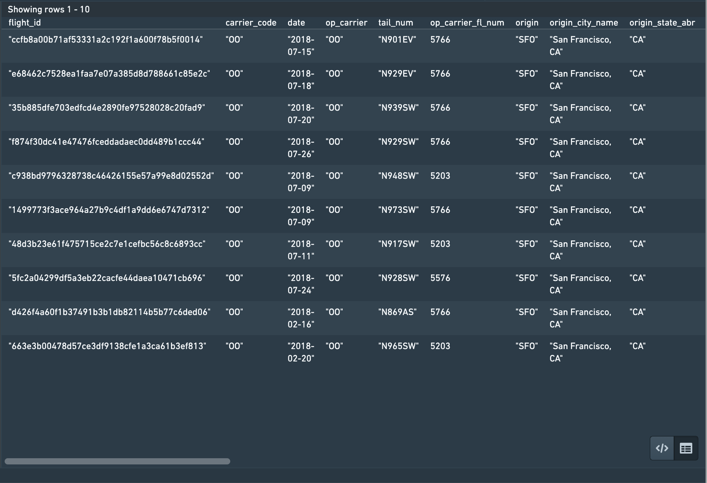

:::callout{theme="neutral"}
You can view the results in the raw JSON response structure by selecting **< / >**.
:::

Since our dataset has a lot of columns, refine the query to only pull in a few columns of interest:

```sql
SELECT
    flight_id,
    carrier_code,
    tail_num,
    origin,
    dest,
    dep_ts_utc,
    arr_ts_utc,
    distance,
    actual_elapsed_time
FROM "foundry_sync"."{{v_flightTable}}"
LIMIT 10
```
