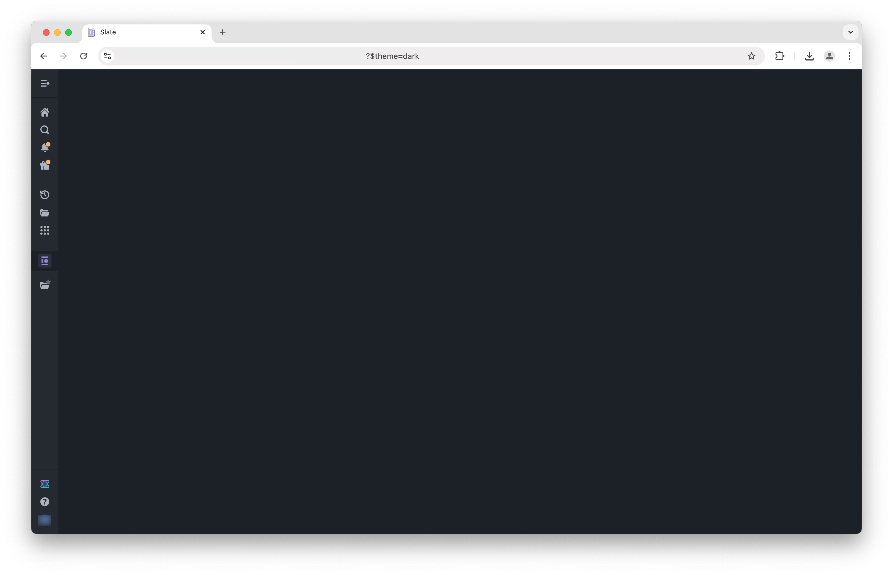

<!-- source: https://palantir.com/docs/foundry/slate/concepts-styles/ · mirrored 2026-08-18 from Palantir Foundry docs -->

# Configure and apply styles

Slate is built on top of the Palantir open source Blueprint framework and, like any other website, styles the DOM using CSS. This provides a consistent look and feel to widgets and a built-in toggle to “Dark Mode”. These are not “skins” or “templates”, but rather built in to each Slate widget.

This means if your application design calls for a specific UI, your development effort will focus on providing a set of style overrides that provide new rules. This adds a level of complexity because you must understand where the Slate default styles are applied and then generate a CSS selector with the correct level of specificity to override it.

Your best friend when developing styles in your app will be the Chrome Developer Tools - specifically the “Inspector” - which lets you view the rendered HTML and CSS for any element in a web page. Right-click → “Inspect” will open the Inspector with the clicked-on element highlighted. This is key for identifying which classes are applied to which element, and therefore which classes need to be extended or over-written.

:::callout{title="A note on LESS"}
Technically the CSS you write inside of a Slate app is pre-compiler dialect called [Less ↗](https://lesscss.org/). Less provides syntax for streamlining verbose CSS and is a powerful tool for writing complex styles while maintaining legibility. On page load, all LESS is compiled to CSS, so when you inspect the rendered page, you may see differences if you've been leveraging LESS functionality. Read the LESS docs for more information on common patterns and helpful functionality.
:::

## Widget styles

In the **Styles** input area on the **Display** configuration for each individual widget, you can define different styles and classes on the widget level. These styles are only available on the selected widget. If the widget is a container, the styles will also be available by all of its nested children.

Styles written in widgets may be difficult to manage or keep track of, versus storing styles in a central location. For larger projects, you should avoid putting styles into individual widgets and instead manage styles through the styles panel.

## Stylesheets

The cleanest pattern is to define new classes in the **Styles** panel and apply them to individual widgets using the **Additional Classes** configuration. There are two different types on stylesheets available to support more complex styles.

### Local stylesheets

Local stylesheets define styles and classes on the application level. Each Slate application has exactly one local stylesheet which can be referenced from across the application.

## Blueprint styles

Slate uses style provided by [Blueprint ↗](https://blueprintjs.com/docs/), which is a Palantir-created open source framework.

You can use many Blueprint classes and icons in your application to build common UI elements in HTML and help your application more seamlessly match the rest of the platform and achieve a professional, production look and feel.

### Colors

Blueprint provides a range of [core and extended color names ↗](https://blueprintjs.com/docs/#core/colors) that have been chosen with WCAG 2.0 compliance in mind (for accessible application design).

These can be referenced directly in Slate styles using LESS variables.

### Components

There are many components in Blueprint that are useful for creating dynamic user interaction elements or bringing a level of polish to your application, from [**Buttons** ↗](https://blueprintjs.com/docs/#core/components/button) to [**Progress Bars** ↗](https://blueprintjs.com/docs/#core/components/progress-bar) to [**Tags** ↗](https://blueprintjs.com/docs/#core/components/tag).

To use these in Slate, pay attention to the **CSS API** (rather than the JavaScript API) section for each component to understand if you can use the relevant `pt-x` class and HTML elements to create a similar component in Slate.

### Icons

Blueprint also includes a comprehensive set of [icons ↗](https://blueprintjs.com/docs/#icons) that are easy to integrate into your application as badges or even as small UI elements.

The method for referencing Blueprint icons varies by version. To reference Blueprint icons, follow the Icon CSS API instructions for your specific version.

For example, the following is how you would reference an icon in Blueprint v6:

```html
<span class="bp6-icon-standard bp6-icon-clean"></span>
```

## Patterns for dynamic styles

Since Slate's styling needs to be determined at page load, all CSS styles must be static. This means, for example, that you can't put a Handlebars statement into your CSS class to attempt to make a widget change color or change any other property. There are, however, several different patterns available to achieve dynamic styling.

### Dynamic "Additional Classes"

Though you can't *generate* or *modify* classes on the fly, you can use Handlebars to template the **Additional Classes** configuration for each widget. The common pattern is to pre-define a number of different classes and then use a function to determine which classes should be applied in a certain circumstance. If you're building a large, stateful application - see section above - then you might want to have a central function that determines all the correct classes to apply to all the different widgets for any given condition and then return a more complex map between a widget and the correct classes to apply.

In this manner, you can easily build an app that responds by changing colors, icons, or other display properties, or even resizes itself by showing and hiding entire widgets. See: Responsive Layouts section above for more on this specific pattern.

### `Style` attribute

While the *CSS* for your application must be pre-compiled, the style property on an HTML widget can be templated using Handlebars. This only applies for HTML widgets or tables where you provide the HTML to be displayed in a cell; in these circumstances, you can dynamically generate CSS and put it in the [`style` attribute ↗](https://www.w3schools.com/tags/tag_style.asp) for that element.

### Dark mode loading screen

During the initial page load, you will typically see a dark sidebar loading a white screen. To load a fully dark screen, you can use the query parameter `?$theme=dark` to load the entire page in a dark theme aligned with the sidebar.

Note that this is a one-time load and will not persist across page refreshes without the query parameter added. Also note that this is only applicable once the Slate application starts to load, not while the browser is still routing to the application.



## Custom fonts

Slate supports the use of custom fonts to further tailor the appearance of applications to your organization. To use a custom font, the font must first be uploaded to Foundry as an otf file. Once uploaded, fonts can now be imported via the Styles sheet and assigned to a family using the font file's rid.

```css
@font-face {
    font-family: alliance1;
    src: url("https://developer.palantir.com/blobster/api/salt/ri.blobster.main.blob.a3dd73c4-d300-4194-b977-fc176410cdf6")
        format("opentype");
}
```
