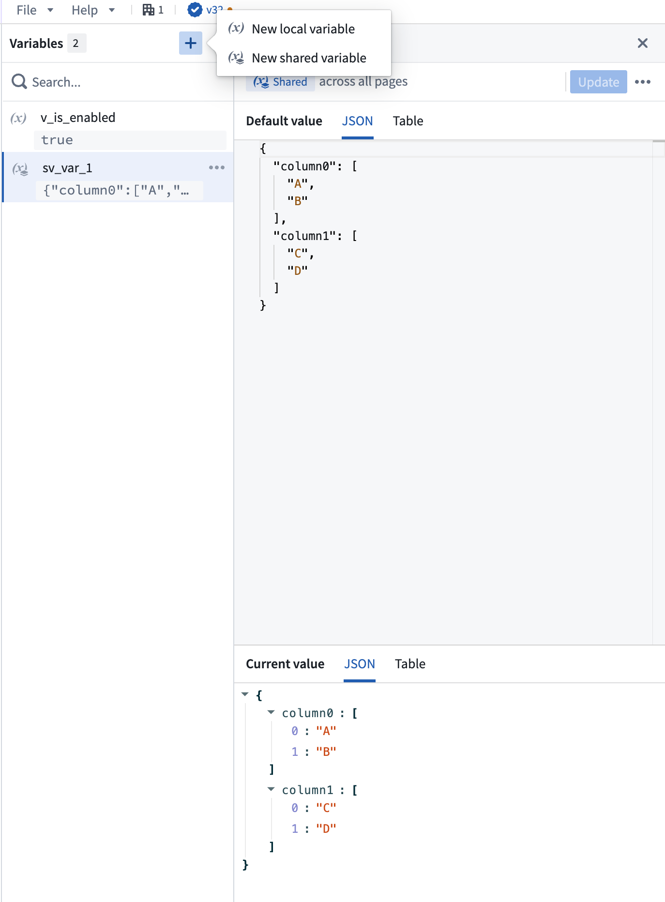
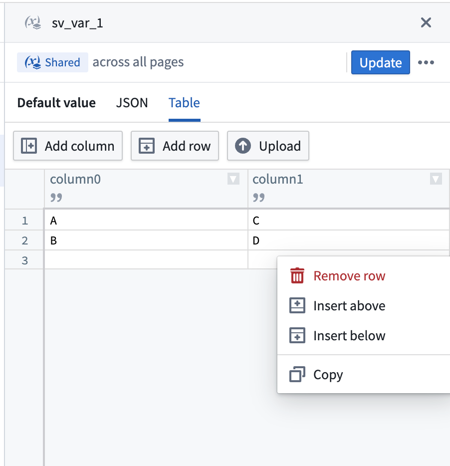
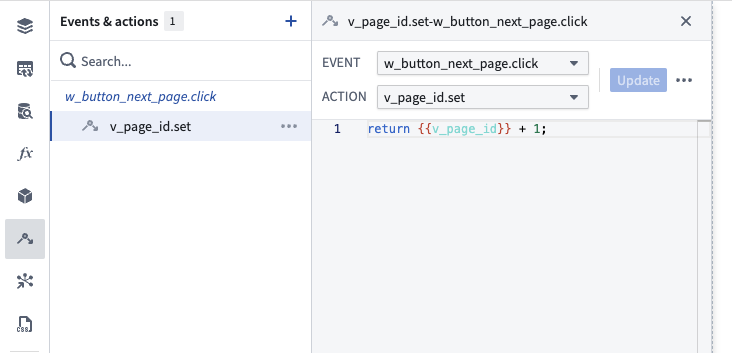
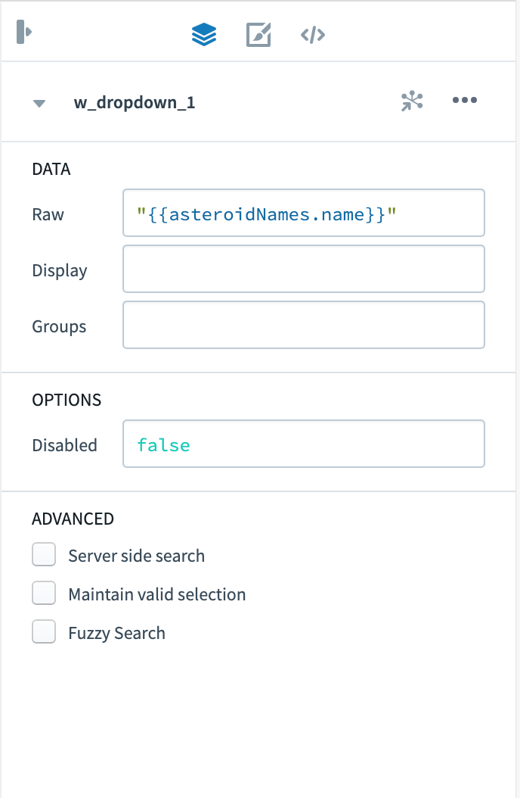
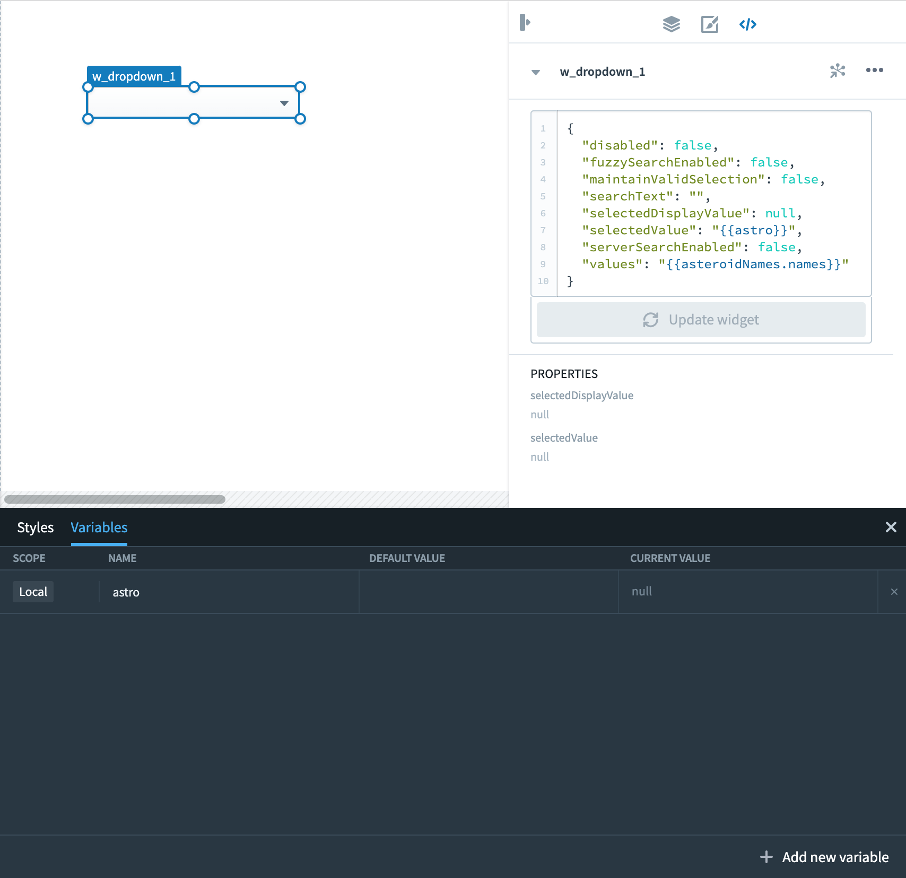
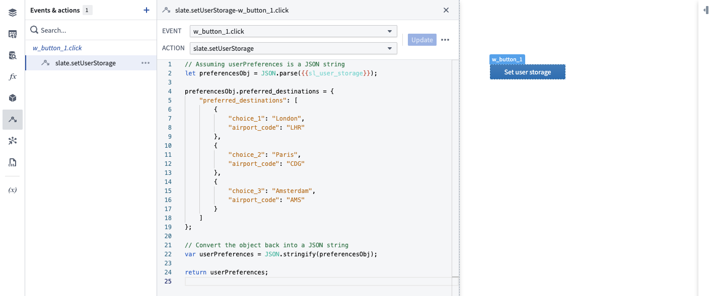

<!-- source: https://palantir.com/docs/foundry/slate/concepts-variables/ · mirrored 2026-08-22 from Palantir Foundry docs -->

# Store values in variables

Variables that you define in the **Variables editor** are accessible throughout an entire Slate application. You can reference them in queries and widgets, and even set their values through events or URLs.

The valid types for variables are `Number`, `String`, `Boolean`, `Array`, `Object`, and `Null`.

## Creating a variable

To create a variable, follow the instructions below:

1. On the left sidebar, select the ***(x)*** icon to open the Variables editor. Hovering over the ***(x)*** icon will display the word **Variables**.
2. Select **+ Add new variable**.
3. Select the variable page scope - shared (accessible on every page), or local (accessible only on the page edited when creating the variable).
4. Select the text in the **Name** column and enter a new name for the variable.

:::callout{theme="neutral"}
Slate will detect when variable name clashes exist and will prevent users from saving the variable until a valid name is entered.
Shared variable names must be unique across all pages, widgets, events, queries, and functions.
Local variables names must be unique within the page and cannot name clash with an [environment variable](/docs/foundry/slate/concepts-variables/#environment-variable).
:::

5. Enter a default value for the variable. Slate will infer the variable type based on value entered.

:::callout{theme="neutral"}
The values of variables do not persist across page loads. When the Slate application is reloaded, it will use the default variable values.
To persist variable values across page loads, use the [user storage](#user-storage-variable) variable.
:::



The variable editor not only displays the page scope, name, and default value of every variable, but also provides a read-only view of the variable's current value, in case it was changed using events or right from the URL.

## Tabular variables

:::callout{theme="neutral"}
The **Datasets** panel has been migrated to the **Variables** panel. Datasets are now stored as shared variables, but their functionality remains the same.
:::

The **Variables** panel supports storing tabular data as variables. You can enter data directly using the spreadsheet editor or upload a CSV file.

### Create a tabular variable

Follow the instructions below to create a tabular variable:

1. On the left sidebar, select the **X** icon to open the variables editor.
2. Select **+ Add new variable**.
3. Select the variable page scope (shared or local).
4. Enter a name for the variable.
5. In the default value field, enter column-oriented JSON to initialize the table structure, for example: `{"column1": ["row1", "row2"], "column2": ["row1", "row2"]}`, or select the **Table** tab directly if the value is empty.

The **Table** tab provides a spreadsheet editor allowing you to edit the data directly.

:::callout{theme="note"}
The **Table** tab is enabled when the variable value is empty, `{}`, or contains column-oriented JSON in the format `{ columnName: [value1, value2, ...], ... }`. All columns must have arrays of equal length. If your variable contains a different format (such as row-oriented JSON like `[{...}, {...}]`), the **Table** tab will be disabled.
:::



### Upload CSV files

You can upload a CSV file to populate a tabular variable with the following steps:

1. Select an existing tabular variable or create a new one.
2. Open the **Table** tab.
3. Use the upload option to select a CSV file from your computer.
4. The CSV data will be parsed and displayed in the spreadsheet editor.

The spreadsheet editor supports the following features:

* Editing cell values directly
* Right-clicking context menus for additional options
* Adding and deleting rows and columns

:::callout{theme="warning"}
Slate applications have a default size limit of 2 MB. Avoid uploading large CSV files, as they count toward this limit. If your application exceeds the size limit, you will not be able to save changes. For large datasets, consider using [queries](/docs/foundry/slate/concepts-queries/) or the [OSDK](/docs/foundry/slate/concepts-osdk/) to fetch data.
:::

## Updating a variable through events

[Events](/docs/foundry/slate/concepts-events/) can be used to set a new value of a variable. Every variable automatically provides a `.set` event. To update the value of a variable, simply return a new, legal value in the event content. The event logic can also use the current value of the variable as an input. You can also change the type of the variable value when updating it (e.g. from a String to a Number); however, this might break the variable's dependencies.

In the example below, the `v_page_number` variable is updated every time the user clicks the `w_button_next_page` button:


## Variables in URLs

You can use variables in URL query parameters (additional information added to a URL to help set the state of the Slate page). URL parameters always override default parameters.

In general, use the following syntax to add variables to the URL:

* Single variable: `?variableName=value`
* Multiple variables: `?variableName=value&otherVariableName=otherValue`

Note that query parameters are case sensitive. Additionally, variable values retrieved from URL query parameters will be strings even if the passed value is a number, boolean, or object. These values can be converted to the desired type using [Handlebar helpers](/docs/foundry/slate/references-helpers/), or through [Functions](/docs/foundry/slate/concepts-functions/).

## Example: Using variables in a widget

The following example uses variables in a dropdown widget and assumes a notional dataset about asteroids.

1. Create a new application called `Dropdown variables example`.
2. Create a new query called `asteroidNames`, set the data source to `asteroids`, and enter the following query statement:

```sql
SELECT name FROM allnamed;
```

3. Select **Update** to save the query.
4. Open the **Variables** editor and add a new variable. Name it `astro` and give it the default variable `"` `"` (an empty string).
5. Add a Dropdown widget to your application.
6. Populate the dropdown by pulling the name of the asteroid from the query you just wrote:

 

7. Change to the **Raw** tab by selecting the button `</>` and update the value of `selectedValue` from `null` to `"{{astro}}"`. Notice that the dropdown menu initially does not present a value because `selectedValue` is assigned to the astro variable, which is an empty string at the moment.

 

8. Save the application.
9. To specify a `selectedValue` for the dropdown to start with, we can set a value for the variable `astro` in the URL. Append `?astro=Flora` to the URL and use the Enter key. Note that the asteroid name is case-sensitive. The URL now looks like `https://<HOSTNAME>:<PORT>/edit/documents/dropdown-global-variables?astro=Flora` and the dropdown now displays “Flora” initially.

## Slate system variables

Slate offers two types of system variables:

1. The [environment](#environment-variable) variable.
2. The [user storage](#user-storage-variable) variable.

:::callout{theme="neutral"}
System variables have special behaviors and cannot be set via the URL.
:::

### Environment variable

The `$global` variable gives access to environment specific information.

| Attribute       | Description                                                                              |
| --------------- | ---------------------------------------------------------------------------------------- |
| locale          | Returns the language locale of the user's session.                                       |
| app.isEditMode  | Returns `true` if the app is in **Edit** mode or `false` if the app is in **View** mode. |
| app.rid         | Returns the RID of the Slate document.                                                   |
| user.domain     | Returns the user’s authentication domain.                                                |
| user.email      | Returns the user’s email address.                                                        |
| user.familyName | Returns the user’s last name.                                                            |
| user.firstName  | Returns the user’s first name.                                                           |
| user.groups     | Returns a list of all the auth groups to which the user belongs.                         |
| user.id         | Returns the user’s unique identifier.                                                    |
| user.username   | Returns the user’s username.                                                             |
| window.origin   | Returns the origin of the current URL.                                                   |

#### Example: Using the environment variable in a function

The following example uses different attributes of the `$global` variable to greet the user in the appropriate language:

```
// 'de' represents the German locale
// English is the default language
if ({{$global.locale}} == 'de') {
    return "Willkommen " + {{$global.user.firstName}}
} else {
    return "Welcome " + {{$global.user.firstName}}
}
```

### User storage variable

The `sl_user_storage` variable in Slate maintains its value for each user across application loads, unlike other variables that reset to default upon page loading.

The user storage variable allows application builders to store information in the application context for individual users, such as user preferences on a specific application.

Using events, values can be stored in the user storage which can be accessed across sessions in the application. The user storage is limited to 10 kB and can be set via the `slate.setUserStorage` action. `slate.refreshUserStorage` can be called when users are working on an application across multiple browser tabs or windows. When setting the storage to a new value in one tab or window, this value can be pulled into the other window by calling the refresh action.

#### Initialize variables from user storage on page load

`sl_user_storage` may not be fully loaded when the `slate.ready` event fires. To initialize local variables from user storage after it loads, use the `slate.userStorageChanged` event. This event fires when `sl_user_storage` is updated and provides the new value through `{{slEventValue}}`.

#### Example: Updating user preferences in the user storage variable

In the example below, user-preferred destinations are written into a `userPreferences` JSON object. The user preferences are then loaded during application load to present users with their personal preferred destinations on the application landing page.



## Marketplace parameter variables

Local variables on the home document page can be marked as Marketplace parameters, allowing users to customize their values when installing a Slate application through [Marketplace](/docs/foundry/slate/marketplace-slate/#package-slate-applications-with-marketplace-parameter-variables).

To mark a variable as a Marketplace parameter:

1. Open the **Variables** panel in your Slate application.
2. Select the local variable to configure.
3. Select the menu for the variable and enable the **Marketplace parameter** option.

The **Variables** panel displays an indicator for variables configured as Marketplace parameters. Slate keeps the configuration synchronized when you rename or delete a Marketplace parameter variable.

:::callout{theme="neutral"}
Shared variables and local variables on other pages in a multipage application are not supported as Marketplace parameters.
:::
