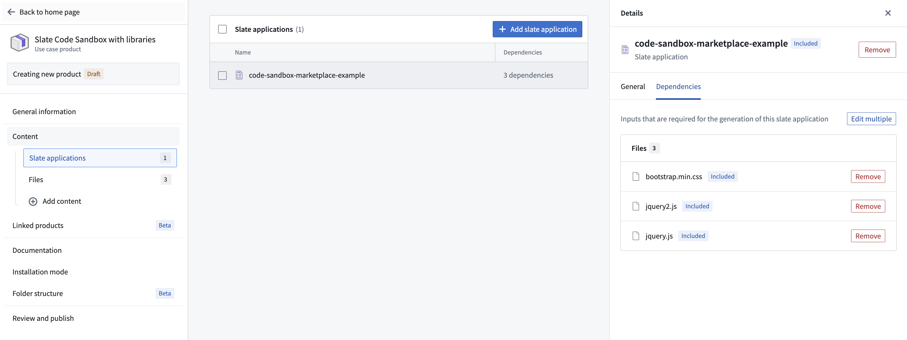
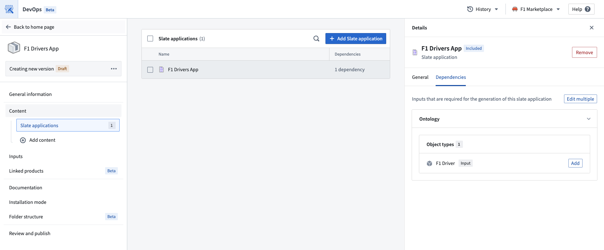

<!-- source: https://palantir.com/docs/foundry/slate/marketplace-slate/ · mirrored 2026-08-18 from Palantir Foundry docs -->

# Add Slate application to a Marketplace product

Use [Foundry DevOps](/docs/foundry/devops/overview/) to include your Slate applications in [Marketplace products](/docs/foundry/devops/core-concepts/#product) for other users to install and reuse. Marketplace supports single-page and multipage Slate applications, including static applications with no data loading. All pages, routes, and page structure are preserved during packaging and installation. [Learn how to create your first product.](/docs/foundry/foundry-devops/create-products/)

:::callout{theme="neutral"}
This page covers Slate application packaging. For Developer Console applications, see [Install a Developer Console application with Marketplace](/docs/foundry/developer-console/marketplace-installation/).
:::

## Add Slate applications to products

To add a Slate application to a product, first [create a product](/docs/foundry/foundry-devops/create-products/), then [add outputs](/docs/foundry/foundry-devops/create-products/#add-outputs). Choose the **Add files** option to navigate to the Slate application from within the [Compass](/docs/foundry/compass/overview/) filesystem and add it to your product.

## Package Slate applications with Marketplace parameter variables

You can mark [local variables](/docs/foundry/slate/concepts-variables/) as Marketplace parameters, allowing users to customize their values during product installation. This is useful for configuring per-installation settings and default values without modifying the Slate application code after installation.

To mark a variable as a Marketplace parameter:

1. Open the **Variables** panel in your Slate application.
2. Select the local variable that you want to make configurable.
3. Select the menu for the variable and enable the **Marketplace parameter** option and choose a type (string or boolean).

Variables marked as Marketplace parameters will display a visual indicator in the **Variables** panel. When users install the product, they can provide custom values for these parameters during the installation process.

:::callout{theme="neutral"}
Only local variables on the home document page can be marked as Marketplace parameters. Shared variables and variables on other pages in a multipage application are not currently supported as Marketplace parameters.
:::

## Package Slate applications that use the Code Sandbox widget

Slate applications which have dependencies on external libraries for the Code Sandbox widget can be packaged with Marketplace.

If you want to generate copies of the library files upon installation, ensure that you include the files for the libraries in the **Files** tab under the **Content** tab when creating your product. When a user installs the product, they will get a copy of those files in their project. The Code Sandbox widget will then reference their copy of the library files.

Slate also supports providing libraries via a CDN link (for example, `https://unpkg.com/browse/chart.js@2.7.1/`). The CDN links are untouched, so the installed Slate application will have the same CDN links. This may mean that the user will need to have configured their CSP to allow the CDN links.

For more information about using libraries with the Code Sandbox widget, see the [Code Sandbox widget documentation](/docs/foundry/slate/widgets-advanced/#example).

## Package Slate applications that use the Ontology SDK

Slate applications that use the [Ontology SDK](/docs/foundry/slate/concepts-osdk/) (OSDK) can be packaged with Marketplace. Foundry DevOps automatically handles OSDK Ontology dependencies during packaging, so no manual dependency configuration is required.

### How OSDK packaging works

When you publish a Slate application that uses the OSDK, the pre-built OSDK bundle is automatically included in the Marketplace package. This means that during installation, the bundle is copied directly rather than regenerated from scratch, which significantly reduces installation time.

### Repackage existing applications for faster installation

Slate applications packaged before the pre-built bundle optimization was available will still regenerate the OSDK bundle during installation. To take advantage of faster installation times, publish a new version of your existing Marketplace product. The new version will automatically include the pre-built OSDK bundle.

To repackage your application:

1. Open the product in [Foundry DevOps](/docs/foundry/devops/overview/).
2. Create a new version of your product.
3. Publish the new version.

No changes to the Slate application itself are required. The pre-built bundle is included automatically during publishing.

### OSDK requirements

All Ontology resources must use the same API names as the source application. You can achieve this by installing without prefixes or by mapping inputs to existing Ontology resources with matching API names.

If API names do not match, the Slate function code will be mismatched with the Ontology entities in the target environment. Mismatches can be resolved manually by updating the Slate function code after installation.

API name conflicts can occur during installation in the following situations:

* When the target environment has Ontology entities with identical API names. For example, if both environments have an object type named `flights`.
* When an object's API name does not match its display name. For example, if an object type with the display name `flights` has an API name of `flightsXYZ`, it will be given the default API name of `flights` on installation. In this case, Slate function code will no longer match the API name, and a naming conflict could occur if an object type with the API name `flights` already exists.

This applies to all Ontology entities, including object types, link types, action types, and Functions.

To prevent API name conflicts:

* Use descriptive display names so that the generated API names are unlikely to conflict with existing names.
* Check existing object types in target environments.
* Be prepared to update Slate function code if API names change during installation.

Only the latest version of a Function is supported. Versioned Functions are not supported when using the OSDK with Marketplace. If your application references an older version of a Function, update it to the latest version and repackage your application.

## Unsupported features

The following features are not supported when packaging Slate applications with Marketplace:

* Custom data sources (including Postgres queries) are not supported. `API Gateway` is the only supported data source. For more information, see [API Gateway queries](/docs/foundry/slate/concepts-queries/#api-gateway-queries).
* Global stylesheets are not supported.
* `Foundry Form` and `Time Series` widgets are not supported.
