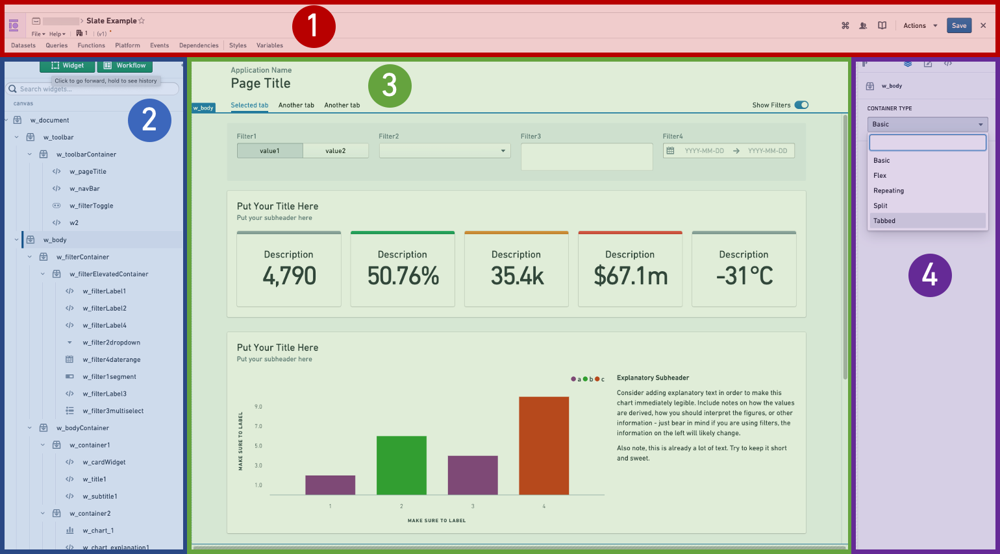
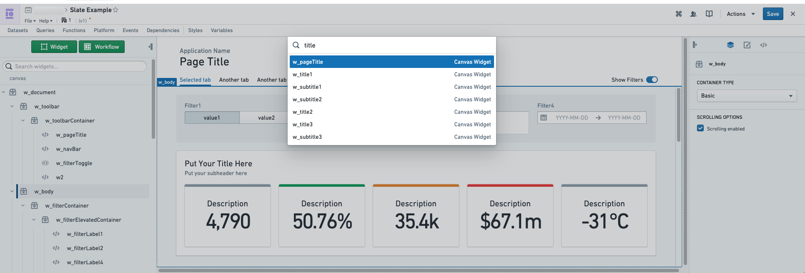
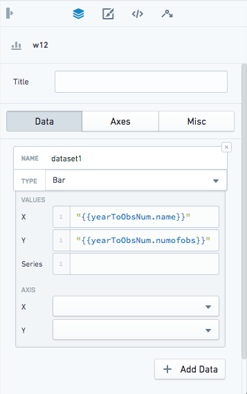
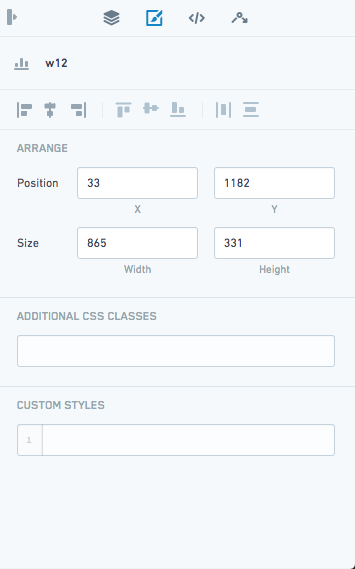
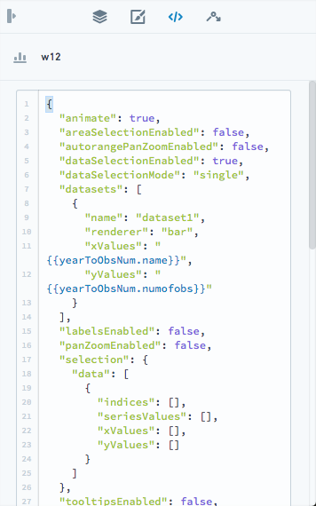
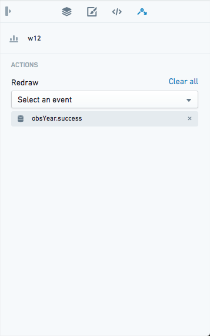

<!-- source: https://palantir.com/docs/foundry/slate/navigation/ · mirrored 2026-08-22 from Palantir Foundry docs -->

# Navigation

There are four main areas of Slate in edit mode:

1. **Action bar:** This is where you will find the application name, the **Actions** dropdown, exit to view mode, and buttons to open various editing panels.
2. **Widget List:** The Widget List is where all the widgets in your application are listed. If you have a toolbar in your application, the list is divided into toolbar widgets and canvas widgets.
3. **Canvas:** This is the workspace for your application. Here you can rearrange widgets and test layout options. You can change the screen size using the dropdown at the top right to preview how your application will look on different screens.
4. **Widget Editor:** When you select a widget, either from the list or from the canvas, the [Widget Editor](#widget-editor) lets you configure that widget.

Additionally, there are panels that pop out in front of the canvas:

* [Queries editor](/docs/foundry/slate/concepts-queries/)
* [Functions editor](/docs/foundry/slate/concepts-functions/)
* Platform editor
  * [Object sets](/docs/foundry/slate/concepts-object-sets/)
  * [Object context](/docs/foundry/slate/concepts-object-context/)
  * [Foundry Functions](/docs/foundry/slate/concepts-foundry-functions/)
* [Events editor](/docs/foundry/slate/concepts-events/)
* [Dependency graph](/docs/foundry/slate/applications-dependencies/)
* [Styles editor](/docs/foundry/slate/concepts-styles/)
* [Variables editor](/docs/foundry/slate/concepts-variables/)

The **global search** in editor mode, accessed with the keyboard shortcut `Cmd+K` (macOS) or `Ctrl+K` (Windows), allows you to search and go to Slate queries, functions, objects, variables and widgets. Slate's global search will also keep a history of your searches to prioritize recent results. Selecting the result will open up the appropriate Slate editor panel.

## Undo support

Slate supports undoing deletions for all resource types, including widgets, folders, dataset syncs, functions, object sets, object contexts, variables, queries, partials, event-actions, and container tabs. To undo a deletion, select the undo button in the toast that appears after the deletion, or use the keyboard shortcut `Cmd+Z` (macOS) or `Ctrl+Z` (Windows).

Undoing a widget deletion restores its event and action wirings, including cases where a surviving widget's event was wired to the deleted widget's action. Only one undo toast is displayed at a time: a new deletion replaces the previous toast, and any document edit dismisses the pending toast.

## Widget Editor

The Widget Editor has three tabs with editing options for the selected widget.

**Property tab:** This is the main editing tab. Use this tab to change the widget’s properties. The options available vary by type of widget.

**Layout tab:** Set the position and size of your widget, and apply custom styling.

**JSON tab:** If the **Property** tab does not provide the setting you need, edit the widget's raw JSON configuration in this tab. Each widget starts with template code containing the most commonly used attributes, and fields changed in the **Property** tab also appear in the **JSON** tab. The editor displays JSON errors and enables **Update** only after you make a valid change. For interaction properties with long values, select **Show more** to expand or collapse the full content.

:::callout{theme="warning"}
State that is not exposed through the **Property** tab is managed internally by Slate, so you should closely review any modifications you make to Slate's default values in the **JSON** tab to avoid unexpected behavior.
:::

**Events tab:** Some widgets have associated events, which you can configure here.

