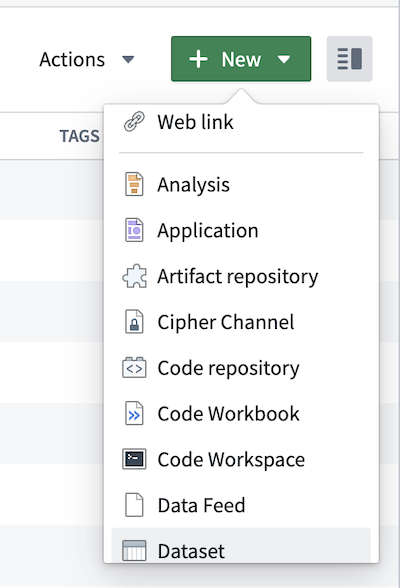

<!-- source: https://palantir.com/docs/foundry/slate/public-applications-data-upload/ · mirrored 2026-08-18 from Palantir Foundry docs -->

# Upload data for public applications

:::callout{theme="neutral" title="Enabling data uploads"}
The ability to upload data via public applications requires two secure upload data sources to be available via queries:

1. A data source used for generating secure channels and tokens. It is one of:
   * A SERVICE API data source called `secure-upload`
   * A HTTP JSON data source called `secure-upload-raw-oauth`
2. A data source used for uploading JSON blobs using a generated secure token. It is most commonly named as `secure-upload-raw`.

You can check their availability by creating a public application and creating a new query. If secure upload sources are not available, contact Palantir Support.
:::

Public applications can be configured to enable users to upload data to Foundry. Users uploading data do not require access to Foundry. However, only Foundry users with appropriate resource permissions can access uploaded data.

To set up data upload in your public application, follow the instructions below:

## 1. Create an empty dataset

Create a new dataset resource in a Project or folder of your choice.



## 2. Create a channel

In your public Slate application, create a new query based on either the `secure-upload` or `secure-upload-raw-oauth` source. Set the query to only run manually by ticking the checkbox in the dropdown located next to **Test**.

Choose a unique ID for your channel, for example, `slate-app-name-data-upload`. The `channelId` must not contain spaces. The request body requires the RID of the empty dataset you previously created. You can obtain the dataset RID from the URL of the dataset, for example, `ri.foundry.main.dataset.abcd1234-1234-5678-9000-1234abcd1234`.

#### Create a channel using `secure-upload`

From **Available** services, select the **Channel Service**, then **Put channel** from the **Endpoints** dropdown.

In the `channelId` field, enter the unique ID for your channel.

Enter the following JSON in the body of the request:

```json
{
  "configuration": {
    "dataset": "<your_dataset_rid_here>",
    "maxBlobSize": <optional size limit for individual blob size (in bytes)>,
    "options": {
      "type": "json",
      "json": {}
    }
  }
}
```

#### Create a channel using `secure-upload-raw-oauth`

Enter the following JSON in the query editor:

```json
{
    "path": "channels/{channelId}",
    "method": "PUT",
    "extractors": {
        "result": "$"
    },
    "pathParams": {
        "channelId": "<your_channel_name_here>"
    },
    "queryParams": {},
    "bodyJson": {
        "configuration": {
            "dataset": "<your_dataset_rid_here>",
            "maxBlobSize": <optional size limit for individual blob size (in bytes)>,
            "options": {
                "type": "json",
                "json": {}
            }
        }
    }
}
```

After creating the query based on the `secure-upload` or `secure-upload-raw-oauth` source, select **Test**. The response will return a `channelId` matching the one you entered in the field. Store the `channelId` as it will be needed in the following step.

This query will not be needed again for users to upload data, unless you want to create more channels. The query can be safely deleted.

## 3. Create a token

After creating the channel, you need to create a token. This token is required to submit a secure upload query and upload data into the dataset. You will need to specify an expiry date. The maximum expiration date depends on your enrollment's secure upload configuration. Create a new query based on the `secure-upload` or `secure-upload-raw-oauth` source. Set the query to only run manually.

#### Create a token using `secure-upload`

From the available services, select the **Token Service**, then select **Create Token** from the **Endpoints** dropdown.

The body in the request is in the following format:

```json
{
  "type": "blobUploadToDataset",
  "blobUploadToDataset": {
    "channel": "<channelId defined in step 2>",
    "expiry":"<expiration date in ISO-8601: e.g. 2021-06-30T00:00:00Z>",
    "count": 1
  }
}
```

#### Create a token using `secure-upload-raw-oauth`

Enter the following JSON in the query editor:

```json
{
    "path": "tokens",
    "method": "POST",
    "extractors": {
        "result": "$"
    },
    "pathParams": {},
    "queryParams": {},
    "bodyJson": {
        "type": "blobUploadToDataset",
        "blobUploadToDataset": {
            "channel": "<channelId defined in step 2>",
            "expiry":"<expiration date in ISO-8601: e.g. 2021-06-30T00:00:00Z>",
            "count": 1
        }
    }
}
```

After creating the query based on the `secure-upload` or `secure-upload-raw-oauth` source, select **Test** to submit the query. The response includes a token that you need to save as it will only be shown once. Rerun the query to get another token if necessary. This query will not be needed again for users to upload data, unless you want to create more tokens. The query can be safely deleted.

## 4. Create query for data upload

To allow users to submit queries, you need to create one more query:

1. Select **secure-upload-raw** as a source.
2. Open the dropdown near **Test** and select when you want the data to be submitted (on button click or another criteria, just as a regular query). The body of the request defines the fields which are captured and uploaded into the previously-created dataset. You can edit the fields even after initial submissions. Entries made prior to the modification will show no value under the newly-added fields.

Every field needs to map to a value. The values need to be strings. You can either use the jsonStringify handlebar helper or cast the values into strings using a function.

An example of the request body follows:

```json
{
    "path": "blobs",
    "method": "POST",
    "extractors": {
        "result": "$"
    },
    "headers": {
        "authorization": "Bearer <token_from_step_3>"
    },
    "bodyJson": {
        "content": {
            // whatever json-shaped content you want here
            // for example:
            "field1": "value1",
            "field2": {{jsonStringify w_input1.text}},
            "field3": [
                "item1",
                {{jsonStringify w_input2.text}},
                {{jsonStringify f_function1}}
            ]
        }
    }
}
```

When this query is run, the data will land in a dataset with the suffix `_buffer_v2` appended, and be located alongside the original dataset. The data will be shaped exactly as defined in this step. For example, a query with the body from the examples above will result in the following data entry in the "content" column (the dataset will contain additional metadata in other columns):

```
{
  content: {
    "field1": "value1",
    "field2": "<<value of jsonStringify w_input1.text>>",
    "field3": ["item1", "<<value of jsonStringify w_input2.text>>", "<<value of jsonStringify f_function1>>"]
  }
}
```

## Stop data uploads

To stop new entries from being uploaded to the dataset, you will need to both [unpublish the application](/docs/foundry/slate/applications-create/#unpublish-a-public-application) and delete the token being used as the authentication header in the last query.

:::callout{theme="neutral"}
Though unpublishing hides the application from unauthenticated users, unauthenticated users could still call the public secure-upload data source. Deleting the token is important to maintain application security.
:::

:::callout{theme="neutral"}
Remember to store your generated tokens in a safe location as there is no recovery option.
:::

To delete a token, follow these steps:

1. From Slate, create a query with **secure-upload** or **secure-upload-raw-oauth** as source.
2. Open the dropdown near **Test** and tick the **manually** checkbox to run this query manually.
3. Configure and run the query:
   * If using **secure-upload**:
     1. Select **Token Service** from **Available Services**.
     2. Select **Delete Token** from **Endpoints**.
     3. Enter the token you want to delete as a string, for example, `1abcdefgha2bcdef3ghabcdefg`.
   * If using **secure-upload-raw-oauth**:
     1. Use the token you want to delete, for example, `1abcdefgha2bcdef3ghabcdefg`, and enter the following JSON in the query editor:
     ```json
     {
         "path": "tokens/{token}",
         "method": "DELETE",
         "extractors": {
             "result": "$"
         },
         "headers": {},
         "pathParams": {
             "token": "1abcdefgha2bcdef3ghabcdefg"
         },
         "queryParams": {}
     }
     ```
4. To verify that the token was deleted, check by submitting data. You should get the following `InvalidToken` response:

```
{
  "errorCode":"PERMISSION_DENIED",
  "errorName":"TokenSecurity:InvalidToken",
  "errorInstanceId":"13abec1b-3c0f-467d-ad14-6ae702b52b33",
  "parameters":{}
 }
```
