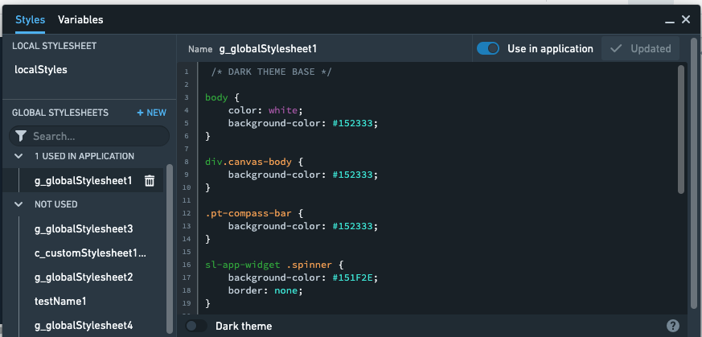

<!-- source: https://palantir.com/docs/foundry/slate/styles-global-stylesheet/ · mirrored 2026-08-05 from Palantir Foundry docs -->

# Global stylesheets \[Experimental]

:::callout{theme="warning" title="Experimental"}
Global stylesheets are in the [experimental](/docs/foundry/platform-overview/development-life-cycle/) phase of development and may not be available on your enrollment. Functionality may change during active development. Contact Palantir Support to request access to this feature.
:::

In addition to allowing you to apply styles to your Slate application at the application level, the Styles Editor also allows you to create and add global stylesheets to your Slate application. Global stylesheets are stylesheets that exist at the [space](/docs/foundry/security/orgs-and-spaces/#spaces) level of Foundry and can be shared across other Slate applications in the same space, enabling you to create a unified look for all Slate applications.

Global stylesheets are not available for applications stored outside a space for example in a private folder. The user requires the `slate:edit-stylesheet` role on the space to create or update global stylesheets and `slate:view-stylesheet` on the space to use global stylesheets.

Enabling global stylesheets in your Slate application applies the stylesheets to the application, just as if they were added to the local styles of the Styles Editor. This allows these styles to be reused across projects in the same organization in order to maintain a consistent look-and-feel across some or all applications in a given organization or project. Changes made to these global stylesheets apply to all Slate applications that use them, which means that editors won't need to change all of their applications if the underlying style guide is changed.

If you have the correct permissions on the space the Styles Editor will look like the following:

:::callout{theme="neutral"}
The global stylesheets support only CSS and do not support Less.
:::

By default, a stylesheet is not automatically added to a Slate application. The **Use in application** toggle at the upper right applies the stylesheet to the current Slate application; you will need to save when the toggle is on for the change to be saved to the application.

Once a stylesheet has been enabled in an application, edits to the stylesheet will be immediately be reflected and visible in the page. However, edits will not be saved to the global stylesheet until you select the **Update** button in the upper right. This allows you to test changes to the stylesheet without automatically affecting other Slate applications that may be using this stylesheet.

:::callout{theme="warning"}
Global stylesheets may be used by multiple Slate applications. Be careful when editing or deleting global stylesheets to ensure that any changes are intended to apply to all Slate applications, not just the currently viewed application.
:::
