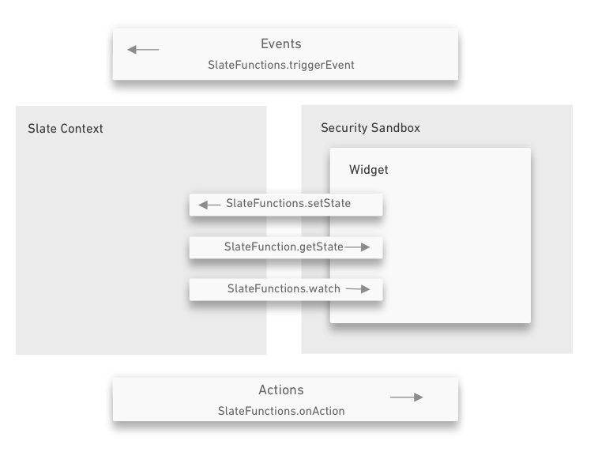
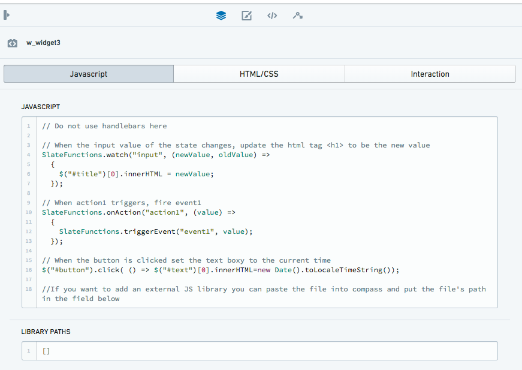
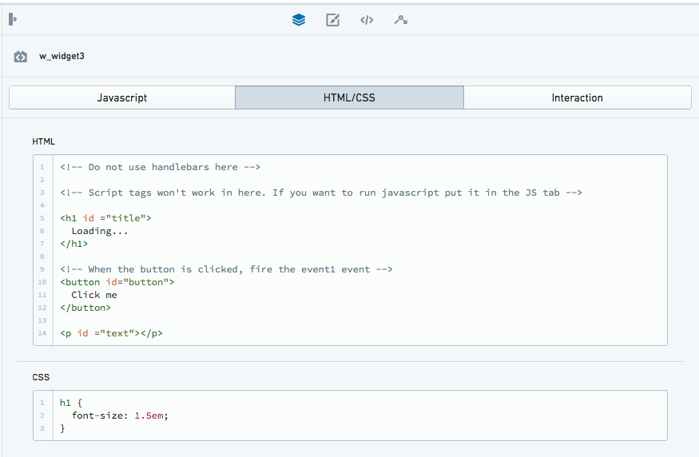
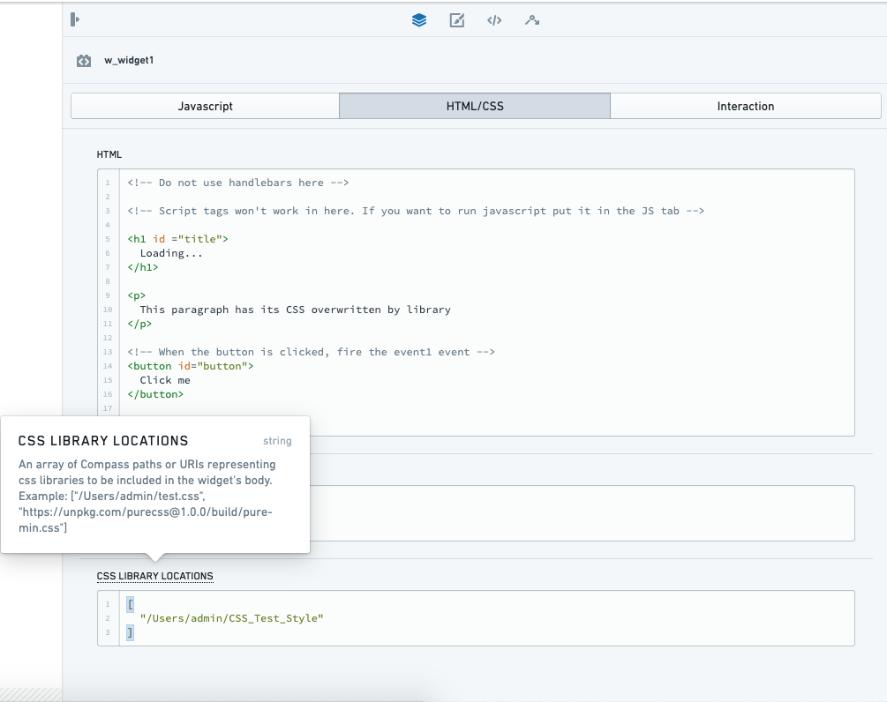
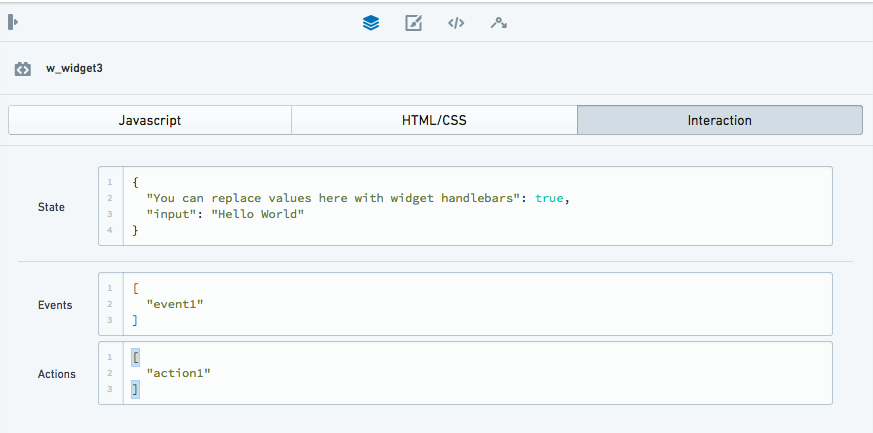
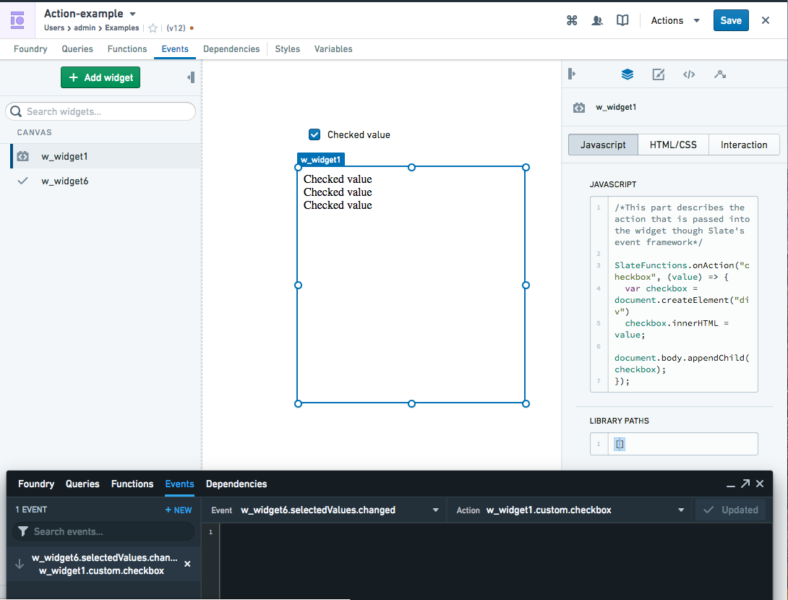
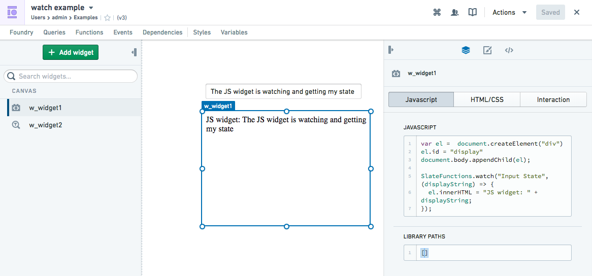
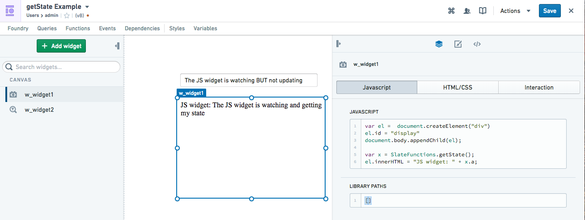
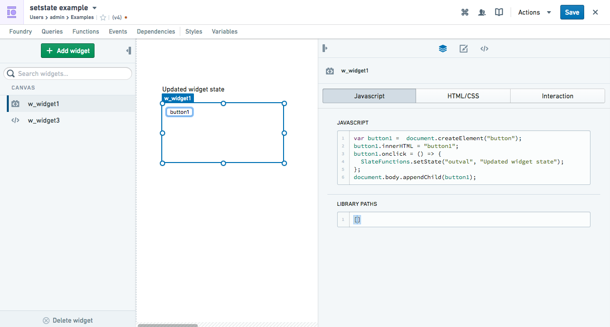
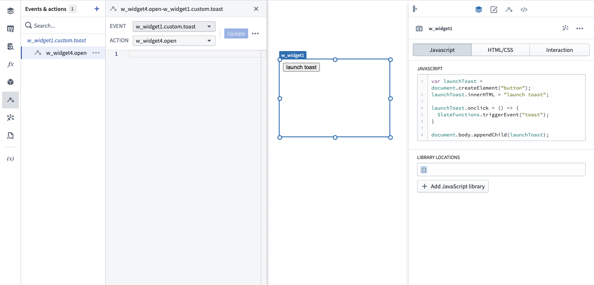

<!-- source: https://palantir.com/docs/foundry/slate/widgets-advanced/ · mirrored 2026-08-22 from Palantir Foundry docs -->

# Advanced

The advanced widget category consists of the following widgets:

* [Code Sandbox](#code-sandbox)
* [File Import](#file-import)
* [Iframe](#iframe)

## Code Sandbox

The Code Sandbox widget is a secure sandbox for you to implement your
own custom widget to extend the functionality of Slate. You are able to
build your own custom visualizations, take advantage of third-party
JavaScript libraries, or build advanced workflow interactions. You can
define the rendering, the widget model, and the event interactions so
that your widget integrates with the rest of your application. External
JavaScript libraries can be loaded into a folder in your Project and
referenced in your widget.

:::callout{theme="warning" title="Warning"}
The Code Sandbox widget unlocks advanced, custom development capabilities within your Slate application. Implementing custom functionality through the Code Sandbox widget should be done with a clear understanding of the technical complexity involved and long-term maintenance required for successful development. Widget development is at your own discretion and risk; support is not provided for debugging custom code.
:::

### Summary of interaction

A summary of interaction with Slate and functions that can be used can be found below:



### JavaScript tab

This tab has the fields for the JavaScript, as well as any JavaScript
libraries you might wish to load.



#### JavaScript

This is a string of JavaScript that will get executed when the widget
loads. Making any change to this JavaScript will cause the entire widget
to reload. The JavaScript in this field will be executed after the
JavaScript from the libraries field. See the [JavaScript libraries](#javascript-libraries) section for instructions on loading third party libraries.

:::callout{theme="neutral"}
Do not use Handlebars here. We recommend that you pass in data using <code>SlateFunctions</code> through the Javascript tab to interact with <a href="#state">state</a> in the interaction tab.
:::

:::callout{theme="warning" title="Warning"}
Network requests and references (for example, the usage of `fetch`) are not supported in the Code Sandbox for JavaScript, [JavaScript libraries](#javascript-libraries), or [HTML](#html). Any network requests must be proxied to configured [Queries](/docs/foundry/slate/concepts-queries/) via `SlateFunctions`.
:::

**Available functions**

The following native functions can be invoked to interact with Slate
specific functionality. These functions allow you to interact with the
rest of the Slate application through the use of events, actions, and
state changes. The functions are exposed to the JavaScript running
within the widget. More information and examples can be found below.

* [SlateFunctions.onAction](#onaction)
* [SlateFunctions.watch](#watch)
* [SlateFunctions.getState](#getstate)
* [SlateFunctions.setState](#setstate)
* [SlateFunctions.triggerEvent](#triggerevent)

#### JavaScript libraries

This is an array of Project paths which will be downloaded and then
executed in order within the widget, or an array of URLs that is allowed
by both CORS and CSP policy (where you can mix and match).

Downloading will use the browser, so the URL must be allowed by
the CORS and CSP policy. If you wish to host libraries within Foundry,
you can either host them in Blobster and use the cookie-authenticated APIs or put the script in the asset server. Making changes to this field will cause the entire widget to reload and refresh. (The libraries can themselves invoke the `SlateFunctions` to allow them to interact with the Slate-specific functionality).

:::callout{theme="neutral"}
Imported JavaScript libraries must assign their functionality to a globally available scope to be referenced via the JavaScript tab (such as being bundled as a UMD module, or explicitly assigning functionality to the `window`).
:::

##### Example

To use the d3.min.js library, downloaded it from
`https://d3js.org/d3.v5.min.js` and save it to a Foundry directory by
dragging-and-dropping the file. Once the file is uploaded, copy its
Project path and paste it into the library array.

`["/Users/admin/d3.min.js"]`

You can alternatively use the RID for the resource. For example:

`["ri.blobster.main.code.7a4a12a8-e9f5-46ef-8008-5c3f4bbd4abc"]`

You can obtain the Project path/RID for a resource by looking at its file's
directory. Alternatively, you can right-click on the file once while in
its folder and copying the Location / RID.

### HTML/CSS tab



#### HTML

This is a string of HTML that will get rendered when the widget loads.

:::callout{theme="neutral"}
Do not use Handlebars here. The HTML tag `<script>` will not
function, and you need to extract any JavaScript into the
JavaScript tab.
:::

#### CSS

This is a string of CSS that will get rendered when the widget loads.

:::callout{theme="neutral"}
Do not use Handlebars here. The specified CSS will allow you
to overwrite CSS rendered in the border of the iframe and not in the
frame. The same border styling can also be applied via the **Additional CSS
Classes** and **Custom Styles** in the widget's top-level **Styling** tab.
:::

#### CSS libraries

The CSS libraries feature allows you to load CSS so you can use CSS styles (e.g. Blueprint) to create your custom widget. You can access it in the HTML/CSS tab of the widget.

CSS libraries works like Code Sandbox’s JavaScript libraries. The CSS library takes an array of Project paths which will be downloaded and then rendered in order within the widget, or an array of URLs that is allowed by both CORS and CSP policy (where you can mix and match). Downloading will use the browser, so the URL must be allowed by the CORS and CSP policy. If you wish to host CSS libraries within Foundry, you can either host them in Blobster and use the cookie authenticated APIs or put the script in the asset server. Making changes to this field will cause the entire widget to reload and refresh.

:::callout{theme="neutral"}
Plain CSS is sufficient for the contents of the CSS library file; ensure that you do not have the HTML `<style>` tag surrounding the CSS style.
:::



### Interactions tab

This is the control that lets the widget interact with the Slate
paradigm. All the interactions between the Code Sandbox widget and the
rest of Slate should be passed through one of the state, events, or
actions.

:::callout{theme="neutral"}
We recommend that you pass in the Handlebars through this interaction tab only. Using the Handlebars directly in the JavaScript box will still work (e.g. to pass in some state without using the `SlateFunctions.watch` or `SlateFunctions.getState`), but this is not recommended since the entire widget will reload and refresh each time.
:::



#### State

This is a JSON blob that represents the current configuration of the
widget. This is similar to the state that other widgets in Slate use
except that it is nested under this field to allow the other
meta-fields. The state can be modified from either inside the widget or
from the usual practice of putting Handlebars in the state.

To modify the state from the widget, use `SlateFunctions.setState`
within the JavaScript. The other Slate functions passing state to the
widget are `SlateFunctions.watch` and `SlateFunctions.getState` (see the example below).

:::callout{theme="neutral"}
There are certain ways to use this field to load additional runtime code into the Code Sandbox widget (e.g. pass in JavaScript into the state and load it in later). However, these ways are not recommended as the purpose of the field is to represent the state of the widget.
:::

#### Events

This is an array of strings that are the names of the events that this
widget will be able to trigger. These triggers must be explicitly
invoked from the JavaScript within the widget using the functions
provided below. Events will be named `custom.{event_name}` when
displayed in the events tab. The event name does not need to be separately typed in the triggerEvent parameter.

To trigger an event, use `SlateFunctions.triggerEvent(“event”)` within
your JavaScript, as shown in the example below.

#### Actions

This is an array of strings that are the names of Actions that this
widget will allow to be triggered by other widgets. The JavaScript within the widget should be listening for the Action using the functions provided below. Actions will be named `custom.{action_name}` when displayed in the events tab. The Action name does not need to be separately typed in the onAction parameter.

To have a widget respond to an Action created in the Slate context, use
`SlateFunctions.onAction(“action_name”,(value)=>{put JavaScript here})`
within your JavaScript, as shown in the example below.

### Slate functions

These native functions allow you to interact with Slate-specific
functionality and are exposed to the JavaScript running within the
widget. These functions will allow you to interact with the rest of the
Slate application through the use of events, Actions, and state changes.

#### onAction

*Data direction: Slate context → widget*

`SlateFunctions.onAction` allows you to register a callback for when an
Action gets invoked on your widget. Its arguments are the name of the
Action and the function to be invoked when the Action is received. The
function will be invoked with the sole argument being the 'body'
passed along with the Action.

You then need to list your Action in the Interaction tab below.

*Example*



This example uses the Slate Checkbox widget which causes the Code
Sandbox widget to update when clicked:

* An event emanates from the Checkbox widget when the Checkbox widget is clicked.
* In Slate's event panel, this Slate event has been registered to trigger an Action (custom.checkbox) in the Code Sandbox widget.
* The event panel is able to detect this Action because the Action has been registered in the Code Sandbox widget's Interaction **Action** box.

JavaScript:

```js
SlateFunctions.onAction("checkbox", (value) => {
    var checkbox = document.createElement("div")
    checkbox.innerHTML = value;
    document.body.appendChild(checkbox);
});
```

Interaction Action:

```json
[
    "checkbox"
]
```

New event-Action pair registered:

> Event: Slate\_widget.selectedValues.changed
>
> Action: Code\_Sandbox\_widget.custom.checkbox

#### watch

*Data direction: Slate context → widget (continuous watching)*

`SlateFunctions.watch` is meant to help you detect changes to the state
field in a way similar to watching in AngularJS. `SlateFunctions.watch` takes in a string and a function as its arguments. When the portion of the state
represented by the string changes, the function provided will be invoked
with the new state and the old state provided as arguments. This is
possibly the most useful function and is how you can pass data into the
widget by using Handlebars passed into the Interaction tab (e.g.`"First
Argument": "{{handlebars}}"`).

For example, if your state has two fields - height and width - and you want
to invoke a function when the height changes, you would call
`SlateFunctions.watch("height", <insert function here>)`. If the
initial string is blank, then the function will be invoked on any state
changes.

*Example*



This example uses Slate's Input widget which passes the state to
the Code Sandbox widget and displays it:

* The Slate Input widget generates text state as a data output `{{w_widget2.text}}`
* This state has been fed into the Code Sandbox widget's Interaction **state** box, so now you can use the state in the Code Sandbox widget. You use `SlateFunctions.watch("State Name", (data) =>...` to use the state/data in the widget.

JavaScript:

```js
var el =  document.createElement("div")
el.id = "display"
document.body.appendChild(el);

SlateFunctions.watch("Input State", (data) => {
    el.innerHTML = "Code Sandbox widget: " + data;
});
```

Interaction Action:

```json
{
  "Input State": "{{w_widget2.text}}"
}
```

#### getState

*Data direction: Slate context → widget (non-continuous, once-off
'get')*

This function returns the current state of the widget that is initially
populated by the state field.

`SlateFunctions.getState` returns a JSON object of the current state of the widget that is initially populated by the state field. You can access different properties of the object (i.e. the different 'states').

`SlateFunctions.getState` will return a JSON object of your state field,
and you can access different properties of the object (i.e. the different
'states').

`SlateFunctions.getState` will only get the state once called. In contrast,
`SlateFunctions.watch` will constantly "watch" for updates to the state field.
You can use this `SlateFunctions.getState` function in a `SlateFunctions.watch` to get particular attributes of the full state object.

For example, if your state is:

```json
{
  "a": "cat",
  "b": "hat"
}
```

`SlateFunctions.getState().a` will return `cat`.

*Example*



This example uses Slate's Input widget which passes the state to
the Code Sandbox widget. The entire state is called through the use of
the `getState` function (assigned to x), a particular attribute in this
"entire state" object is then displayed: "a" in this case.

JavaScript:

```js
var el =  document.createElement("div")
el.id = "display"
document.body.appendChild(el);
var x = SlateFunctions.getState();
el.innerHTML = "Code Sandbox widget: " + x.a;
```

Interaction Action:

```json
  "a": "{{w_widget2.text}}",
  "b": "random_state"
}
```

#### setState

*Data direction: Widget → Slate context.*

`SlateFunctions.setState` modifies the state of the widget both for
external widgets that reference the state of this widget using Handlebars and for future `getState` calls. It takes two arguments: the string
representing the portion of the state to modify and a JSON blob
representing the new value of that portion.

For example, if you wish to set the view's height of your widget to 4
but leave all other properties, you would call
`SlateFunctions.setState("view.height", 4)`. If you want to overwrite
the whole state (as opposed to only height), you can pass in "" to the
first argument instead of `"view.height"`.

*Example*



This example uses a generated button in the Code Sandbox widget
to update the state of a Slate "HTML widget" from "Initial widget state"
to "Updated widget state".

* An interaction with the Code Sandbox widget when the button is
  clicked triggers the `SlateFunctions.setState`. This updates the state
  of "outval" from "Initial widget state" to "Changed widget state".
* This updated state is able to be detected in Slate because the state has been registered in the Code Sandbox widget's Interaction "state".

JavaScript:

```js
var button1 =  document.createElement("button");
button1.innerHTML = "button1";

button1.onclick = () => {
    SlateFunctions.setState("outval", "Updated widget state");
};

document.body.appendChild(button1);
```

Interaction state:

```json
{
  "outval": "Initial Widget State"
}
```

#### triggerEvent

*Data direction: Widget → Slate context.*

`SlateFunctions.triggerEvent` triggers an event. The two arguments are
the name of the event to trigger and the message to be passed as the
body of the event.

*Example*



In this example, when the Code Sandbox widget is interacted with by a
click of the button, a Slate Toast widget is launched in the Slate
context.

* When the button is clicked, the function `launchToast.onclick` runs which triggers the `SlateFunctions.triggerEvent`.
* An event emanates from the Code Sandbox widget because this event has been further registered in the Code Sandbox widget's Interaction "event".
* In Slate's event panel, this Code Sandbox widget event has been registered to trigger an Action (Slate\_widget.open) in the Slate widget.

JavaScript

```js
var launchToast =  document.createElement("button");
launchToast.innerHTML = "launch toast";

launchToast.onclick = () => {
    SlateFunctions.triggerEvent("toast");
};

document.body.appendChild(launchToast);
```

Interaction event:

```json
[
  "toast"
]
```

New event registered:

> Event: Code\_Sandbox\_widget.custom.toast
>
> Action: Slate\_widget.open

### Load order

The Code Sandbox widget loads in the following order:

1. Slate (the parent frame context containing the widget) loads, then the widget iframe loads.
2. Slate sends the widget "state" to the widget (see Interactions below for more details), followed by CSS, HTML, libraries, and JavaScript.
3. The iframe receives and sets up the following:
   * The CSS and HTML are appended.
   * The libraries are executed
   * The JavaScript is executed
   * The appropriate "SlateFunctions" are triggered (input).
4. The user interacts with the widget frame (updating the state, triggering events, creating actions, etc.). These, in turn, can modify or produce "SlateFunctions" which are sent from the widget to the parent Slate frame. These widget outputs can then be used in the rest of Slate if they are specified as Interactions (output).

### Security

The security model for this widget is very similar to that of Slate
functions. The code will be executed in a sandboxed iframe with inputs
and outputs being transferred using postMessage. This allows us to
safely execute untrusted JavaScript code. The only modification is that
the iframe is visible on the page, which does not change the security
model.

### Debugging tips

When in the Chrome console, you can select the dropdown that defaults to the
top and select codeSandboxIframe.html. This will cause any JavaScript
you type into the console to be executed in the environment of the
widget. This can be useful when you are trying to figure out how to get
your widget to work since changes to the JavaScript field will force a
reload of the widget.

### Third party code

We recommend following this general approach when using third party code:

* Check the license to ensure that you can use it.
* Minimize the code complexity by finding examples with as few
  separate chunks of JavaScript as possible.
* If the JavaScript uses any libraries, proceed to download the
  .js file from the source and put the Foundry Project path of the
  uploaded file into the library section. You can also link the URL directly and test it after to ensure that it does not conflict with CSP or CORS policy.
* Ensure that all JavaScript in the HTML \<script> \</script> tags
  are refactored out and placed into the JavaScript section.
* Use Slate functions for your interactions:
  * Pass any data you need into the custom Code Sandbox from Slate using `SlateFunctions.getState`.
  * To convey an interaction within the widget to the rest of Slate, you can tag `SlateFunctions.triggerEvent` to the function.
  * To have the widget respond to an Action emanating from the rest of Slate, you can tag `SlateFunctions.onAction` to the function.

***

## File Import

The File Import widget enables users to upload files which can then be referenced and processed in the Slate application. This allows applications to incorporate file-based data and functionality directly within Slate.

### Properties

|Attribute	|Description	|Type	|Required	|Changed By	|
|---	|---	|---	|---	|---	|
|buttonCssClasses	|CSS classes to apply to the browse button	|string\[]	|Yes	|Direct Edit	|
|buttonText	|The text of the browse button	|string	|Yes	|Direct Edit	|
|message	|The message to display in the upload pane	|string	|Yes	|Direct Edit	|
|fileNames	|The names of the files that the user imported	|string\[]	|Yes	|User Interaction	|
|fileTypes	|The MIME types of the files that the user imported	|string\[]	|Yes	|User Interaction	|
|fileContents	|The user's imported files as binary strings	|string\[]	|Yes	|User Interaction	|
|fileDataUrls	|The user's imported files as base64-encoded data URLs	|string\[]	|Yes	|User Interaction	|

***

## Iframe

The following tables offer usage details about the properties available to iframe widgets. Several examples follow the tables.

:::callout{theme="neutral"}
If you are embedding something that is loaded via workspace, you need to add `?embedded=true` to the end of the URL
:::

### Properties

|Attribute	|Description	|Type	|Required	|Changed By	|
|---	|---	|---	|---	|---	|
|uri	|The iframe src URI	|string	|No	|Direct Edit	|

**Actions**

| Action Name | Description |
| - | - |
| sendMessage | Triggering this Action causes the widget to send a message to the inner iframe in the format of `{ source: ‘slate-iframe-action’, message: {…}}`. |
| reload | Triggering this Action reloads the iframe. |

**Events**

| Event Name | Description |
| - | - |
| getMessage | This event is triggered when the widget’s inner iframe post message to Slate is in the format of `{ target: ‘slate-iframe-event’, message: {…}}`. |
