<!-- source: https://palantir.com/docs/foundry/slate/widgets-chart/ · mirrored 2026-08-22 from Palantir Foundry docs -->

# Chart

The Chart Widget category comprises the following widgets:

* Bar chart
  * [Bar chart with legend](#bar-chart-with-legend)
  * [Stacked bar chart](#stacked-bar-chart)
  * [Horizontal bar chart](#stacked-bar-chart)
  * [Multiple series chart](#stacked-bar-chart)
* [Gantt chart](#gantt-chart)
* [Heat grid](#heat-grid)
* [Line Chart](#line-chart-with-x-and-y-range)
* [Pie chart](#pie-chart)
* [Scatter plot](#scatter-plot)
* [Tree map](#tree-map)

This page contains information on the [properties](#chart-widget-properties) available to Chart widgets, as well as [examples](#chart-widget-examples) of widgets and [common CSS](#common-css).

## Chart widget properties

The following tables offer usage details about the properties available to Chart widgets.

|Attribute	|Description	|Type	|Required	|Changed By	|
|---	|---	|---	|---	|---	|
|dataSelectionEnabled	|Specifies whether the user can select bars and scatter points. Legend selection is also available in “Multiple” mode. Selected data is exposed through the chart’s selection.data property.(Disabled if Pan/Zoom is enabled)	|boolean	|Yes	|Direct Edit	|
|dataSelectionMode	|Specifies data selection behavior. “Single” mode allows only single click interactions. “Multiple” mode allows rectangular box selection and cmd/ctrl+click interactions.(Disabled if Pan/Zoom is enabled)	|string	|No	|Direct Edit	|
|animate	|Specifies whether the chart data will animate upon load, change, and refresh.	|boolean	|Yes	|Direct Edit	|
|areaSelectionEnabled	|Specifies whether the user can draw an area selection on the chart. (Disabled if axis type is ‘Category’, Data Selection is ‘Multiple’, there are multiple axes, or if Pan/Zoom is enabled)	|boolean	|Yes	|Direct Edit	|
|autorangePanZoomEnabled	|When Pan and Zoom is enabled for a single axis, autorange can be applied to dynamically scale the second axis to fit the data.	|boolean	|Yes	|Direct Edit	|
|datasets	|See IDatasetModel and its subtypes below.	|IDatasetModel\[]	|Yes	|Direct Edit	|
|zeroBoundYAxisEnabled	|Allows quantitative charts with datasets that do not span across a Y-value of 0 to have a Y-axis bound by 0. Warning: disabling this option could lead to visually misleading charts.	|boolean	|Yes	|Direct Edit	|
|hover	|When tooltipsEnabled = true, this property determines the value you are hovering over. In order to link to this variable elsewhere, you must first declare it through the template “hover”: { “xValue”: null, “yValue”: null }. For more information, see IHover. Note that hover works for all charts except stackedArea. Also note that hover defaults to the yValue.	|IHover	|No	|User Interaction	|
|labelsEnabled	|Enables static labels. Available for bar charts only. Options include “start”, “middle”, “end”, or “outside”.	|boolean	|Yes	|Direct Edit	|
|labelsPosition	|Specifies the position of the bar chart labels. Options include “start”, “middle”, “end”, or “outside”.	|string	|No	|Direct Edit	|
|legendEnabled	|Enables displaying a legend. Available options for the position include “top”, “bottom”, “left”, or “right”.	|boolean	|Yes	|Direct Edit	|
|legendPosition	|Position of the legend. Available options include “top”, “bottom”, “left”, or “right”.	|string	|No	|Direct Edit	|
|panZoomEnabled	|Specifies whether the chart should allow panning and zooming. Available for numerical axes only. Disabling this option will reset the scales. Scales are not persistent across saves. (Disabled if Data Selection is enabled, Area Selection is enabled, or if all axes types are ‘Category’)	|boolean	|Yes	|Direct Edit	|
|panZoomAxes	|The axes for which panning and zooming are enabled. Available options are “X and Y”, “X Only”, or “Y Only”.	|string	|No	|Direct Edit	|
|selection.area	|The current area selection. This is relevant only if Area Selection is enabled. See IAreaSelection below.	|IAreaSelection	|No	|User Interaction	|
|selection.data	|The currently selected chart data. This is relevant only if Data Selection is enabled. See IDataSelection below.	|IDataSelection	|No	|User Interaction	|
|tooltipsEnabled	|Specifies whether tooltips are enabled. Tooltips will display the data value set by hover (with the y-value as the default).	|boolean	|Yes	|Direct Edit	|
|tooltipText	|The text displayed in tooltips (tooltipsEnabled must be true). This is commonly used to display hover values. If tooltipText is omitted or an empty string, then the tooltip will display the yValue in all charts except horizontal bar charts (where it will show the xValue).	|string	|No	|Direct Edit	|
|xAxes	|Array of x-axes.	|IAxis\[]	|Yes	|Direct Edit	|
|yAxes	|Array of y-axes.	|IAxis\[]	|Yes	|Direct Edit	|
|title	|The title of the chart.	|string	|No	|Direct Edit	|

### IAxis

|Attribute	|Description	|Type	|Required	|Changed By	|
|---	|---	|---	|---	|---	|
|formatter	|Format axis ticks. Format string depends on the type of axis: For linear/log see the [Numeral.js documentation ↗](http://numeraljs.com/); For time series see the [moment.js documentation ↗](https://momentjs.com/docs/#/displaying/format/); Not available for category; decimal precision is limited to 20 digits.	|string	|No	|Direct Edit	|
|gridlinesEnabled	|Specifies whether gridlines should be shown for an axis. Currently available for non-category axes only	|boolean	|Yes	|Direct Edit	|
|betweenTicks	|Specifies whether the alignment of the gridlines for the axis is between the ticks and defaults to false and renders the gridlines on the ticks	|boolean	|Yes	|Direct Edit	|
|name	|Name of the axis, referred to by xAxisName and yAxisName in ISeries.	|string	|Yes	|Direct Edit	|
|position	|Position of the axis. For x-axes, position can be top or bottom. For y-axes, left or right.	|string	|Yes	|Direct Edit	|
|label	|Label associated with the axis.	|string	|No	|Direct Edit	|
|scale	|Axis type. For y-axes (position left and right), scale can be linear, modifiedlog, or category. For x-axes (position top and bottom), scale can also be timeseries. Note: Currently timeseries scale expects dates as integers representing ms after the epoch. SQL date format often arrives in Slate as a string, so if a time chart is not working try casting as an integer as follows: MySQL: `SELECT UNIX_TIMESTAMP(date_column)*1000 AS date_number` or Postgres: `SELECT EXTRACT(epoch FROM date_column)*1000 AS date_number`. Remember to update xValues to the newly created number column in the above examples, “{{query1.date\_number}}}”	|string	|No	|Direct Edit	|
|scaleMax	|Maximum value for axis (if unspecified, the axis will autorange).	|number	|No	|Direct Edit	|
|scaleMin	|Minimum value for axis (if unspecified, the axis will autorange).	|number	|No	|Direct Edit	|
|tickInterval	|Interval between tick values. Available for axes with a linear scale only.	|number	|No	|Direct Edit	|
|tickLabelAngle	|Rotates the tick label for Category Axis: 90, 0 and 90. Available for axes with a category scale only.	|number	|No	|Direct Edit	|
|visible	|Specifies whether the axis should be shown.	|boolean	|Yes	|Direct Edit	|
|maxZoomSpan	|Maximum span of values the axis will display when zooming out. Zoom-out not possible beyond this value.	|number	|No	|Direct Edit	|
|minZoomSpan	|Minimum span of values the axis will display when zooming in. Zoom-in not possible beyond this value.	|number	|No	|Direct Edit	|

### IAreaSelection

|Attribute	|Description	|Type	|Required	|Changed By	|
|---	|---	|---	|---	|---	|
|selected	|Whether or not area is selected.	|boolean	|Yes	|User Interaction	|
|xMax	|The maximum x-value of area selection.	|number	|Yes	|User Interaction	|
|xMin	|The minimum x-value of area selection.	|number	|Yes	|User Interaction	|
|yMax	|The maximum y-value of area selection.	|number	|Yes	|User Interaction	|
|yMin	|The minimum y-value of area selection.	|number	|Yes	|User Interaction	|

### IDatasetModel

|Attribute	|Description	|Type	|Required	|Changed By	|
|---	|---	|---	|---	|---	|
|name	|The name of the dataset. Used as a legend label if no series values are specified. Plot visuals are CSS-classed with this name.	|string	|Yes	|Direct Edit	|
|renderer	|The renderer used to draw the dataset.	|string	|Yes	|Direct Edit	|
|seriesColors	|An array of color values which maps to the array of series names specified in the “Series Names” field. Colors can be specified either as hex (e.g. “#FF0000”) or as CSS color names (e.g. “red”). If no series names are specified in the “Series Names” array, the first color specified in the color array will color the entire chart. If no color values are specified the chart will use the default Blueprint color scheme	|string\[]	|No	|Direct Edit	|
|seriesNames	|An array of unique series names which the array of colors specified in the “Colors” field maps onto.	|any\[]	|No	|Direct Edit	|
|seriesValues	|An array of labels (numbers or strings) that group data into “series.” A stacked bar dataset with x = \[1, 1], y = \[1, 2], and series = \[“series1”, “series2”] will generate one stack at x=1 with the “series2” bar on top of the “series1” bar. A line dataset with multiple series will generate multiple lines.	|any\[]	|No	|Direct Edit	|

### ILabelsModel

|Attribute	|Description	|Type	|Required	|Changed By	|
|---	|---	|---	|---	|---	|
|labels	|An array of labels that correspond to the chart values.	|any\[]	|Yes	|Direct Edit	|

### IRangeDatasetModel

|Attribute	|Description	|Type	|Required	|Changed By	|
|---	|---	|---	|---	|---	|
|endValues	|The data that is used for the end values.	|any\[]	|Yes	|Direct Edit	|
|startValues	|The data that is used for the start values.	|any\[]	|Yes	|Direct Edit	|

### IXYDatasetModel

|Attribute	|Description	|Type	|Required	|Changed By	|
|---	|---	|---	|---	|---	|
|radiusValues	|For scatter renderer, the data that determines the radius of the scatter point.	|number\[]	|No	|Direct Edit	|
|xAxisName	|The name of the x-axis associated with this series. Defaults to first x-axis if not specified.	|string	|No	|Direct Edit	|
|xValues	|The data that is used for the x-values.	|any\[]	|Yes	|Direct Edit	|
|yAxisName	|The name of the y-axis associated with this series. Defaults to the first y-axis if not specified.	|string	|No	|Direct Edit	|
|yValues	|The data that is used for the y-values.	|any\[]	|Yes	|Direct Edit	|
|symbolValues	|For scatter renderer, the shape of each scatter point. Valid values are “circle”, “square”, “diamond”, “cross”, “triangle”, “wye” and “star”. If using a legend, the last symbol of a series will be used as the symbol of the legend. If the last symbol is not valid or undefined, then the legend will default to a circle.	|string\[]	|No	|Direct Edit	|

### IHover

|Attribute	|Description	|Type	|Required	|Changed By	|
|---	|---	|---	|---	|---	|
|index	|The index in the associated dataset currently hovered over in a chart.	|number	|Yes	|User Interaction	|
|xValue	|The x-value currently hovered over in a chart.	|any	|Yes	|User Interaction	|
|yValue	|The y-value currently hovered over in a chart.	|any	|Yes	|User Interaction	|

### IDataSelection

|Attribute	|Description	|Type	|Required	|Changed By	|
|---	|---	|---	|---	|---	|
|indices	|The indices of values selected in the data provided.	|number\[]	|Yes	|User Interaction	|
|xValues	|The discrete x-values selected by clicking.	|any\[]	|Yes	|User Interaction	|
|yValues	|The discrete y-values selected by clicking.	|any\[]	|Yes	|User Interaction	|

### Actions

|Action Name	|Description	|
|---	|---	|
|redraw	|Triggering this action causes the chart to redraw	|

## Chart Widget Examples

### Defaults

```json
{
  "animate": true,
  "areaSelectionEnabled": false,
  "dataSelectionEnabled": false,
  "datasets": [
    {
      "name": "dataset1",
      "renderer": "line",
      "xValues": [],
      "yValues": []
    }
  ],
  "labelsEnabled": false,
  "panZoomEnabled": false,
  "tooltipsEnabled": false,
  "xAxes": [
    {
      "gridlinesEnabled": false,
      "name": "x1",
      "position": "bottom",
      "scale": "linear"
    }
  ],
  "yAxes": [
    {
      "gridlinesEnabled": false,
      "name": "y1",
      "scale": "linear",
      "position": "left"
    }
  ]
}
```

### Bar Chart with Legend

```json
{
  "animate": true,
  "areaSelectionEnabled": false,
  "dataSelectionEnabled": false,
  "datasets": [
    {
      "name": "dataset1",
      "renderer": "bar",
      "xValues": "{{query1.state}}",
      "yValues": "{{query1.avgIncome}}"
    }
  ],
  "labelsEnabled": false,
  "legendPosition": "top",
  "panZoomEnabled": false,
  "tooltipsEnabled": false,
  "xAxes": [
    {
      "gridlinesEnabled": false,
      "name": "x1",
      "position": "bottom",
      "label": "State",
      "scale": "category"
    }
  ],
  "yAxes": [
    {
      "gridlinesEnabled": false,
      "name": "y1",
      "formatter": "$0,0.00",
      "position": "left",
      "label": "Average Income ($)",
      "scale": "linear",
      "scaleMax": 1000000,
      "scaleMin": 10000
    }
  ]
}
```

### Stacked Bar Chart

```json
{
  "animate": true,
  "areaSelectionEnabled": false,
  "dataSelectionEnabled": false,
  "datasets": [
    {
      "name": "dataset1",
      "renderer": "stackedBar",
      "seriesValues": "{{query1.gender}}",
      "xValues": "{{query1.state}}",
      "yValues": "{{query1.avgIncome}}"
    }
  ],
  "labelsEnabled": false,
  "panZoomEnabled": false,
  "tooltipsEnabled": false,
  "xAxes": [
    {
      "gridlinesEnabled": false,
      "name": "x1",
      "position": "bottom",
      "label": "State",
      "scale": "category"
    }
  ],
  "yAxes": [
    {
      "gridlinesEnabled": false,
      "name": "y1",
      "formatter": "$0,0.00",
      "position": "left",
      "label": "Average Income ($)",
      "scale": "linear",
      "scaleMax": 1000000,
      "scaleMin": 10000
    }
  ]
}
```

### Horizontal Bar Chart

```json
{
  "animate": true,
  "areaSelectionEnabled": false,
  "dataSelectionEnabled": false,
  "datasets": [
    {
      "name": "dataset1",
      "renderer": "horizontalBar",
      "xValues": "{{query1.avgIncome}}",
      "yValues": "{{query1.state}}"
    }
  ],
  "labelsEnabled": false,
  "panZoomEnabled": false,
  "tooltipsEnabled": false,
  "xAxes": [
    {
      "gridlinesEnabled": false,
      "name": "x1",
      "position": "bottom",
      "label": "Average Income ($)",
      "scale": "linear",
    }
  ],
  "yAxes": [
    {
      "gridlinesEnabled": false,
      "name": "y1",
      "position": "left",
      "label": "State",
      "scale": "category"
    }
  ]
}
```

### Multiple Series Chart

```json
{
  "areaSelectionEnabled": false,
  "dataSelectionEnabled": false,
  "datasets": [
    {
      "name": "dataset1",
      "renderer": "line",
      "seriesValues": "{{query1.series}}",
      "xValues": "{{query1.key}}",
      "yValues": "{{query1.doc_count}}"
    }
  ],
  "labelsEnabled": false,
  "panZoomEnabled": false,
  "tooltipsEnabled": false,
  "xAxes": [
    {
      "gridlinesEnabled": false,
      "name": "x1",
      "position": "bottom",
      "scale": "linear"
    }
  ],
  "yAxes": [
    {
      "gridlinesEnabled": false,
      "name": "y1",
      "scale": "linear",
      "position": "left"
    }
  ]
}
```

### Scatter Plot

```json
{
  "animate": true,
  "areaSelectionEnabled": false,
  "dataSelectionEnabled": false,
  "datasets": [
    {
      "name": "dataset1",
      "radiusValues": "{{query1.pop}}",
      "renderer": "scatter",
      "xValues": "{{query1.gdp}}",
      "yValues": "{{query1.cpi}}"
    }
  ],
  "labelsEnabled": false,
  "panZoomEnabled": false,
  "tooltipsEnabled": false,
  "xAxes": [
    {
      "gridlinesEnabled": false,
      "name": "x1",
      "position": "bottom",
      "scale": "linear"
    }
  ],
  "yAxes": [
    {
      "gridlinesEnabled": false,
      "name": "y1",
      "scale": "linear",
      "position": "left"
    }
  ]
}
```

#### Tutorial: Add a scatter plot widget

Say that you want to create a scatter plot widget to display route metrics that show distance and time values. Select the **Widget** button in the upper left corner, then choose **Chart > Scatter Plot** to add a Scatter Plot widget to your application. It will be pre-populated with some example data that you can clear from the right editor panel before continuing.

First, rename the Chart widget to something easy to identify, like `w_routeMetrics`.

We want to plot the average distance of the routes along the x-axis. This means that you must set **X Values** to `"{{q_routeMetrics.avg_distance}}"`.

Next, plot the routes duration along the y-axis. Set **Y Values** to `"{{q_routeMetrics.avg_time}}"` in the **Data** tab.

To make the scatter plot easier to read, add labels to your axes. Select the **Axes** tab and change the **Name** of the first **X Axes** object from `x1` to `Distance`, and add a label such as `Distance (miles)` to describe the plotted information. You can also turn on gridlines to help identify where each point lies on the chart.

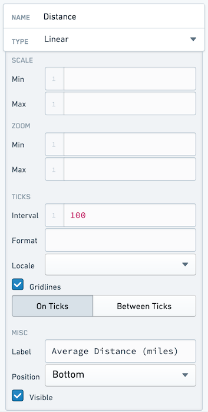

Name your **Y Axis** `Duration`, and configure it as follows:

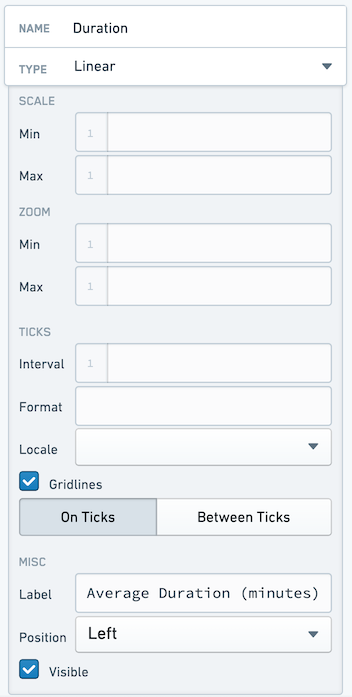

Finally, give your points different sizes. We want the points to vary by how busy the route is. To do this, switch back to the **Data** tab and set **Radius** to `"{{q_routeMetrics.num_flights}}"`.

Exame the chart again. Something seems wrong, since the chart is now filled. This is because the **Radius** value is drawing 1:1 between the value provided and the number of pixels for the radius, and some of our routes have over 150 flights. You must scale your radius values. You can do this by calculating a "display" value in you query. You could hardcode this, but using a **Variable** allows you easy to make later changes without editing the query.

Select the **Variables** tab across the top bar to open the **Variables** window. Create a new variable in the bottom right. Name the new variable `v_routeCountDisplayScale` and set a value of `100`.

Return to the `q_routeMetrics` widget and add a new column:

`COUNT(flight_id)/{{v_routeCountDisplayScale}} as num_flights_disp`

While here, generate a display label for each row:

`CONCAT(origin, ' -> ', dest) as route_name`

Your entire query now looks like:

```sql
SELECT
    origin,
    dest,
    AVG(distance) as avg_distance,
    AVG(actual_elapsed_time) as avg_time,
    COUNT(flight_id) as num_flights,
    COUNT(flight_id)/{{v_routeCountDisplayScale}} as num_flights_disp,
    CONCAT(origin, ' -> ', dest) as route_name
FROM "foundry_sync"."{{v_flightTable}}"
GROUP BY
    origin,
    dest
ORDER BY
    COUNT(flight_id) DESC
LIMIT 50
```

Return to the `w_routeMetrics` widget and adjust the **Radius** configuration to reference the `num_flights_disp` column instead of `num_flights`.

To finalize the chart, add the title `Route Metrics` to the **Title** input at the top of the `w_routeMetrics` configuration panel.

You should end with an application that looks like the following:

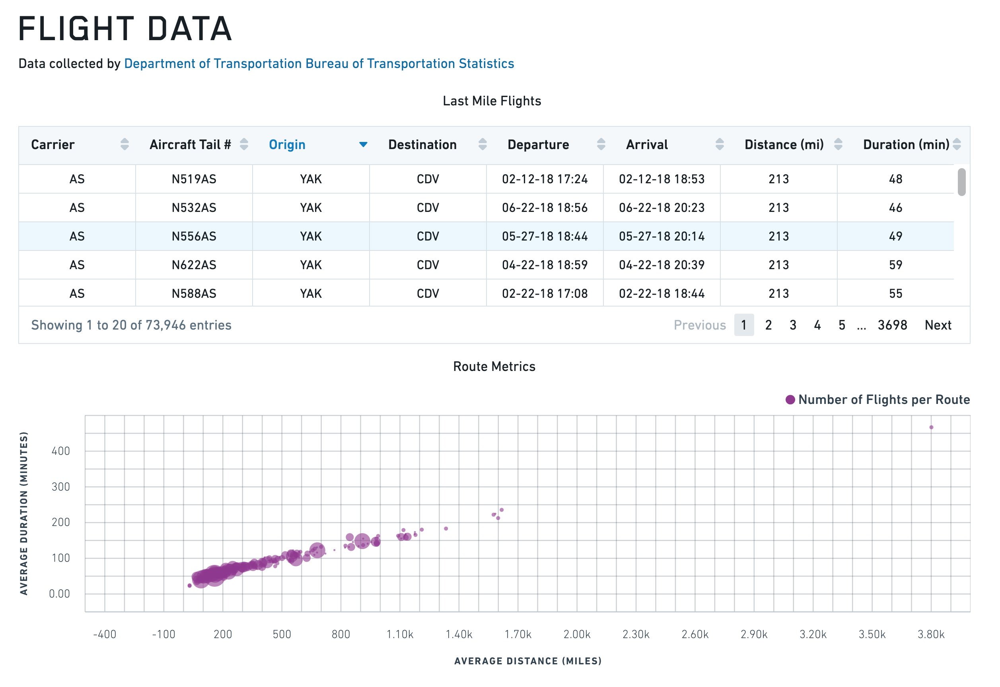

### Line Chart with X and Y Range

```json
{
  "animate": true,
  "areaSelectionEnabled": false,
  "dataSelectionEnabled": false,
  "datasets": [
    {
      "name": "dataset1",
      "renderer": "line",
      "xValues": [1,2,3,4,5,6,7,8,9],
      "yValues": [3,4,1,4,5,4,2,4,1],
      "seriesValues": null,
      "xAxisName": "x1",
      "yAxisName": "y1"
    },
    {
      "endValues": [3],
      "name": "dataset2",
      "renderer": "yRange",
      "startValues": [2]
    },
    {
      "endValues": [3.5,8],
      "name": "dataset3",
      "renderer": "xRange",
      "startValues": [2.5,6],
      "seriesValues": ["Range A","Range B"]
    }
  ],
  "labelsEnabled": false,
  "panZoomEnabled": false,
  "tooltipsEnabled": false,
  "xAxes": [
    {
      "gridlinesEnabled": true,
      "name": "x1",
      "position": "bottom",
      "scale": "linear",
      "label": "",
      "formatter": "\"0\""
    }
  ],
  "yAxes": [
    {
      "gridlinesEnabled": false,
      "name": "y1",
      "position": "left",
      "scale": "linear",
      "formatter": "\"0\""
    }
  ]
}
```

***

## Gantt chart

Gantt charts display time-based data as horizontal bars along a categorical y-axis. You can use Gantt charts to visualize schedules, project timelines, event durations, and any dataset where items span a start and end time. Gantt charts share the [chart widget properties](#chart-widget-properties) documented above.

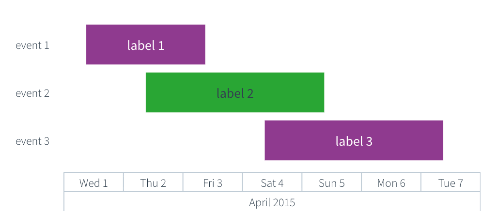

### Properties

#### IGanttDatasetModel

The Gantt dataset model extends `IRangeDatasetModel` and `ILabelsModel`. The `startValues`, `endValues`, and `labels` properties are documented in the [IRangeDatasetModel](#irangedatasetmodel) and [ILabelsModel](#ilabelsmodel) tables above. The shared `name`, `renderer`, `seriesColors`, `seriesNames`, and `seriesValues` properties are documented in the [IDatasetModel](#idatasetmodel) table.

|Attribute	|Description	|Type	|Required	|Changed By	|
|---	|---	|---	|---	|---	|
|yValues	|An array of categorical values that determine the y-position of each bar. Each value corresponds to a row on the y-axis. The length of this array must match the length of `startValues` and `endValues`.	|any\[]	|Yes	|Direct edit	|

The x-axis must use the `timeseries` scale, the y-axis must use the `category` scale, and the dataset `renderer` must be set to `"gantt"`. The `startValues`, `endValues`, and `yValues` arrays must all be the same length. If `labels` is provided, its length must also match `yValues`.

#### Actions

|Action Name	|Description	|
|---	|---	|
|redraw	|Triggering this actions causes chart to redraw	|

### Defaults

```json
{
  "animate": true,
  "areaSelectionEnabled": false,
  "autorangePanZoomEnabled": false,
  "dataSelectionEnabled": false,
  "datasets": [
    {
      "endValues": ["4/3/2015 9:00", "4/5/2015 9:00", "4/7/2015 9:00"],
      "labels": ["Label 1", "Label 2", "Label 3"],
      "name": "dataset1",
      "renderer": "gantt",
      "seriesValues": ["a", "b", "a"],
      "startValues": ["4/1/2015 9:00", "4/2/2015 9:00", "4/4/2015 9:00"],
      "yValues": ["Event 1", "Event 2", "Event 3"]
    }
  ],
  "labelsEnabled": false,
  "legendEnabled": false,
  "panZoomEnabled": false,
  "tooltipsEnabled": false,
  "xAxes": [
    {
      "betweenTicks": false,
      "gridlinesEnabled": false,
      "name": "x1",
      "position": "bottom",
      "scale": "timeseries",
      "visible": true
    }
  ],
  "yAxes": [
    {
      "betweenTicks": false,
      "gridlinesEnabled": false,
      "name": "y1",
      "position": "left",
      "scale": "category",
      "visible": true
    }
  ],
  "zeroBoundYAxisEnabled": true
}
```

### Examples

#### Basic Gantt chart

```json
{
  "animate": true,
  "areaSelectionEnabled": false,
  "dataSelectionEnabled": false,
  "datasets": [
    {
      "endValues": "{{query1.endDate}}",
      "labels": "{{query1.taskName}}",
      "name": "dataset1",
      "renderer": "gantt",
      "seriesValues": "{{query1.phase}}",
      "startValues": "{{query1.startDate}}",
      "yValues": "{{query1.taskName}}"
    }
  ],
  "labelsEnabled": false,
  "legendEnabled": true,
  "legendPosition": "top",
  "panZoomEnabled": false,
  "tooltipsEnabled": true,
  "tooltipText": "{{w_ganttChart.hover.yValue}}",
  "xAxes": [
    {
      "gridlinesEnabled": true,
      "name": "x1",
      "position": "bottom",
      "scale": "timeseries",
      "label": "Date"
    }
  ],
  "yAxes": [
    {
      "gridlinesEnabled": false,
      "name": "y1",
      "position": "left",
      "scale": "category",
      "label": "Task"
    }
  ]
}
```

#### Gantt chart with series colors

```json
{
  "animate": true,
  "areaSelectionEnabled": false,
  "dataSelectionEnabled": false,
  "datasets": [
    {
      "endValues": ["4/5/2015 9:00", "4/8/2015 9:00", "4/12/2015 9:00", "4/15/2015 9:00"],
      "labels": ["Design", "Develop", "Test", "Deploy"],
      "name": "dataset1",
      "renderer": "gantt",
      "seriesColors": ["#2965CC", "#29A634", "#D99E0B", "#D13913"],
      "seriesNames": ["Planning", "Engineering", "QA", "Operations"],
      "seriesValues": ["Planning", "Engineering", "QA", "Operations"],
      "startValues": ["4/1/2015 9:00", "4/4/2015 9:00", "4/8/2015 9:00", "4/11/2015 9:00"],
      "yValues": ["Design", "Develop", "Test", "Deploy"]
    }
  ],
  "labelsEnabled": false,
  "legendEnabled": true,
  "legendPosition": "right",
  "panZoomEnabled": false,
  "tooltipsEnabled": true,
  "tooltipText": "{{w_ganttChart.hover.yValue}}",
  "xAxes": [
    {
      "gridlinesEnabled": true,
      "name": "x1",
      "position": "bottom",
      "scale": "timeseries",
      "label": "Timeline"
    }
  ],
  "yAxes": [
    {
      "gridlinesEnabled": false,
      "name": "y1",
      "position": "left",
      "scale": "category",
      "label": "Phase"
    }
  ]
}
```

***

## Heat Grid

The following tables offer usage details about the properties available to Heat Grid chart widgets. Several examples follow the tables.

### Properties

#### IAxis

|Attribute	|Description	|Type	|Required	|Changed By	|
|---	|---	|---	|---	|---	|
|label	|Label associated with the axis.	|string	|No	|Direct Edit	|
|position	|Position of the axis. For x-axes, position can be top or bottom. For y-axes, left or right.	|string	|Yes	|Direct Edit	|
|visible	|Specifies whether the axis should be shown.	|boolean	|Yes	|Direct Edit	|

#### IHeatGridModel

|Attribute	|Description	|Type	|Required	|Changed By	|
|---	|---	|---	|---	|---	|
|cellValues	|The data that is used to determine the value of each cell	|number\[]	|Yes	|Direct Edit	|
|colorScale	|An array of two or more colors used to create a linear gradient to color the heat grid cells. Example: with cellValues = \[0, 5, 10] and a color array of \[“red”, “blue”] the resulting colors will be: red, purple, blue. Colors can be specified either as hex (e.g. “#FF0000”) or as CSS color names (e.g. “red”). If unspecified or less than two colors, the default color range used is 50% opacity of Blueprint’s @blue5 (#B9D7EA) to @blue1 (#1f6b9a)	|string\[]	|Yes	|Direct Edit	|
|labelFormat	|Label format on heat grid cells. Uses the [Numeral.js ↗](http://numeraljs.com/) format string. Ex. $0.00 will format 1000.23 as $1000.23. Decimal precision is limited to 20 digits.	|string	|No	|Direct Edit	|
|labelsEnabled	|Enables static labels using the value of each cell as the default text.	|boolean	|Yes	|Direct Edit	|
|legendLabel	|Text to use in legend label	|string	|No	|Direct Edit	|
|legendPosition	|Position of the legend. Available options include “top”, “bottom”, “left”, or “right”. If not specified, the legend will not display.	|string	|No	|Direct Edit	|
|selection	|The values for the selected heat grid cells. This is relevant only if selection is enabled and the user has made a selection. See IHeatGridSelection below.	|IHeatGridSelection	|No	|User Interaction	|
|selectionEnabled	|Specifies whether the user can select cells on the heat grid.	|boolean	|Yes	|Direct Edit	|
|selectionMode	|Specifies selection behavior. “Single” mode allows only single click interactions. “Multiple” mode allows cmd/ctrl+click interactions.	|string	|No	|Direct Edit	|
|xAxis	|Category scale x-axis (see IAxis)	|IAxis	|Yes	|Direct Edit	|
|xValues	|The data associated with the x-coordinate of each cell.	|any\[]	|Yes	|Direct Edit	|
|yAxis	|Category scale y-axis (see IAxis).	|IAxis	|Yes	|Direct Edit	|
|yValues	|The data associated with the y-coordinate of each cell.	|any\[]	|Yes	|Direct Edit	|
|title	|The title of the chart.	|string	|No	|Direct Edit	|

#### IHeatGridSelection

|Attribute	|Description	|Type	|Required	|Changed By	|
|---	|---	|---	|---	|---	|
|cellValues	|The discrete cellValues selected by clicking.	|number\[]	|Yes	|User Interaction	|
|indices	|The indices of values selected in the data provided.	|number\[]	|Yes	|User Interaction	|
|xValues	|The discrete x-values selected by clicking.	|any\[]	|Yes	|User Interaction	|
|yValues	|The discrete y-values selected by clicking.	|any\[]	|Yes	|User Interaction	|

#### Actions

|Action Name	|Description	|
|---	|---	|
|redraw	|Triggering this actions causes chart to redraw	|

### Defaults

```json
{
    "cellValues": [],
    "colorScale": ["#B9D7EA", "#1F6B9A"],
    "labelsEnabled": false,
    "xAxis": {
        "gridlinesEnabled": false,
        "name": "x1",
        "position": "bottom",
        "scale": "category",
        "visible": true
    },
    "xValues": [],
    "yAxis": {
        "gridlinesEnabled": false,
        "name": "y1",
        "position": "bottom",
        "scale": "category",
        "visible": true
    },
    "yValues": []
}
```

***

## Pie Chart

The following tables offer usage details about the properties available to Pie Chart widgets. Several examples follow the tables.

### Properties

|Attribute	|Description	|Type	|Required	|Changed By	|
|---	|---	|---	|---	|---	|
|colors	|An array of color values which maps to the array of key values specified in the “Keys” field. Colors can be specified either as hex (e.g. “#FF0000”) or as CSS color names (e.g. “red”). If no color values are specified the chart will use the default Blueprint color scheme	|string\[]	|No	|Direct Edit	|
|hover	|When tooltipsEnabled = true, this property contains data associated with the pie slice being hovered over. For more information, see IPieHover.	|IPieHover	|No	|User Interaction	|
|innerPadding	|The fraction of the radius used to create a doughnut hole.	|number	|No	|Direct Edit	|
|keys	|The keys displayed in the legend.	|any\[]	|Yes	|Direct Edit	|
|labelFormat	|Label format on pie chart slices. Uses the [Numeral.js ↗](http://numeraljs.com/) format string. Ex. $0.00 will format 1000.23 as $1000.23. Decimal precision is limited to 20 digits.	|string	|No	|Direct Edit	|
|labelsEnabled	|Enables static labels on pie slices	|boolean	|Yes	|Direct Edit	|
|legendPosition	|The position of the legend.	|string	|Yes	|Direct Edit	|
|selection	|The values for the selected pie slices. This is relevant only if selection is enabled and the user has made a selection. See IPieSelection below.	|IPieSelection	|No	|User Interaction	|
|selectionEnabled	|Specifies whether the user can select pie slices and legend entries.	|boolean	|Yes	|Direct Edit	|
|selectionMode	|Specifies selection behavior. “Single” mode allows only single click interactions. “Multiple” mode allows cmd/ctrl+click interactions.	|string	|No	|Direct Edit	|
|tooltipsEnabled	|Specifies whether tooltips are enabled. By default, the text of the tooltip will be the value of the pie slice being hovered on	|boolean	|Yes	|Direct Edit	|
|tooltipText	|The text displayed in tooltips (tooltipsEnabled must be true). This is commonly used to display hover values. If tooltipText is omitted or an empty string, then the tooltip will display the valueassociated with the pie slice	|string	|No	|Direct Edit	|
|values	|The values that determine the size of each slice.	|number\[]	|Yes	|Direct Edit	|
|title	|The title of the chart.	|string	|No	|Direct Edit	|

#### IPieHover

|Attribute	|Description	|Type	|Required	|Changed By	|
|---	|---	|---	|---	|---	|
|index	|The index of the pie slice being hovered over.	|number	|Yes	|User Interaction	|
|key	|The key of the pie slice being hovered over.	|any	|Yes	|User Interaction	|
|value	|The value of the pie slice being hovered over.	|number	|Yes	|User Interaction	|

#### IPieSelection

|Attribute	|Description	|Type	|Required	|Changed By	|
|---	|---	|---	|---	|---	|
|indices	|The indices of values selected in the data provided.	|number\[]	|Yes	|User Interaction	|
|keys	|The associated keys selected by clicking.	|any\[]	|Yes	|User Interaction	|
|values	|The discrete values selected by clicking.	|number\[]	|Yes	|User Interaction	|

#### Actions

|Action Name	|Description	|
|---	|---	|
|redraw	|Triggering this actions causes chart to redraw	|

### Examples

#### Pie Plot

```json
{
  "keys": "{{query1.teamName}}",
  "labelsEnabled": false,
  "legendPosition": "right",
  "selectionEnabled": false,
  "tooltipsEnabled": false,
  "values": "{{query1.headCount}}"
}
```

#### Doughnut Plot

```json
{
  "innerPadding": 0.6,
  "keys": "{{query1.teamName}}",
  "labelsEnabled": false,
  "legendPosition": "right",
  "selectionEnabled": false,
  "tooltipsEnabled": false,
  "values": "{{query1.headCount}}"
}
```

### Defaults

```json
{
  "keys": [],
  "labelsEnabled": false,
  "legendPosition": "right",
  "selectionEnabled": false,
  "tooltipsEnabled": false,
  "values": []
}
```

***

## Tree map

The tree map widget provides a flexible way to visualize hierarchical data in a set of nested rectangles. It is useful for spotting patterns otherwise hard to uncover in other visualizations.

A tree map is used to visualize an absolute quantity (`size`) for a given entity (`label`), which may be part of some (optional) `category` with some (optional) relative quantity (`density`).
Each cell’s rectangle has: an area proportional to the `size`; a color defined by the `density` and `category`; and a name given by `label`.

Some examples of datasets which could be visualized with this chart:

* Stocks (`label`) part of an industry (`category`) that have some share of the market (`size`) and have had some percentage price change (`density`)

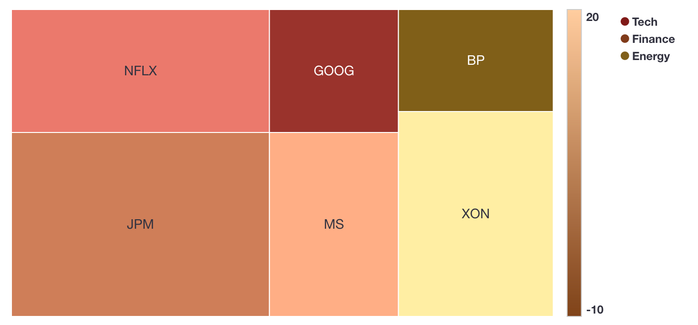

* Factory locations (`label`) by region (`category`) that produce some quantity of goods (`size`) with a false positive ratio (`density`)

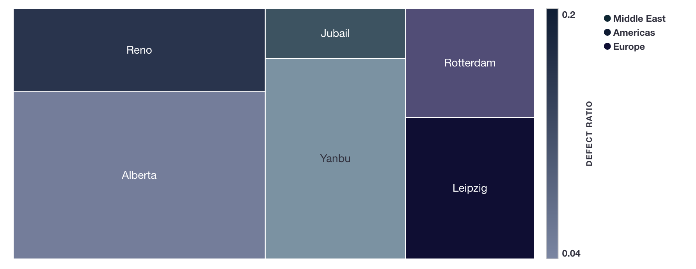

* Nodes of a cluster (`label`) with storage space (`size`) and some percentage storage space utilization (`density`)

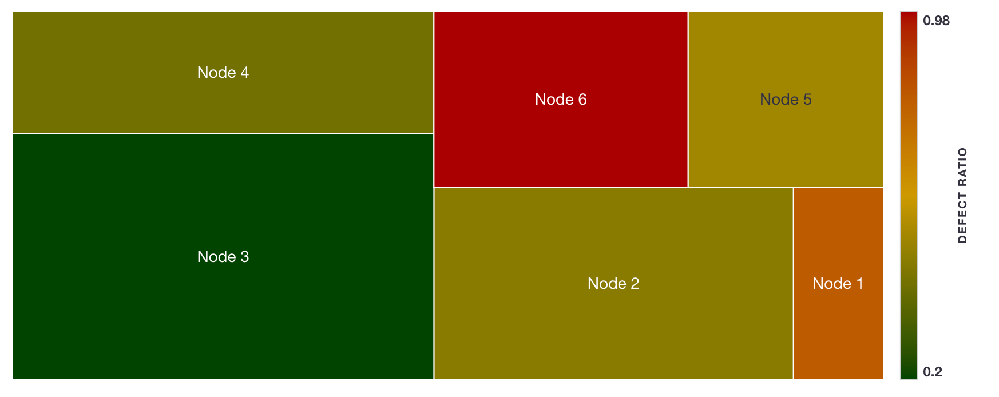

* Population sizes (`size`) of countries (`label`) belonging to some world region (`category`)

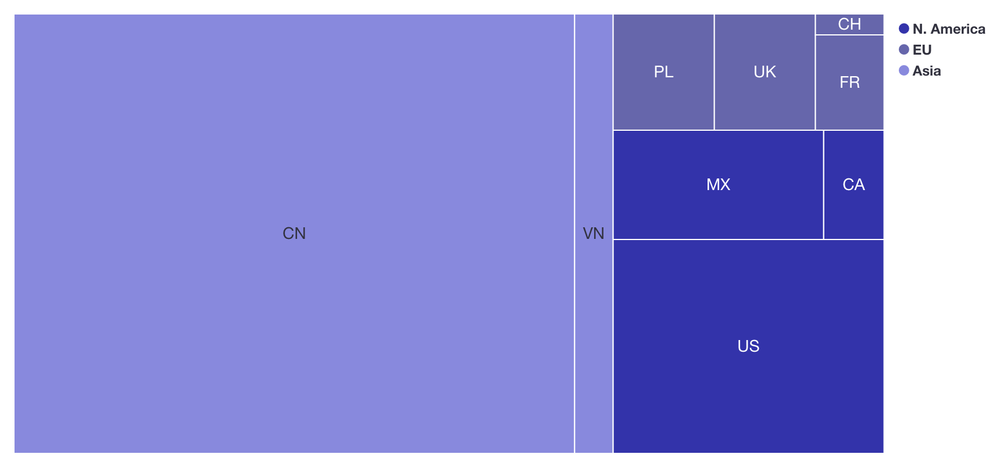

### Data Configuration

* `label` (optional): the name displayed on each cell
* `size`: determines the size of the cell rectangle
* `density` (optional): determines the shading of the cell’s color
* `category` (optional): determines the grouping of cells, which decides the cell’s color

In the default example, the cell rectangles corresponds to the cell `size`. There are two categories, `I` and `II`. Notice that `H` has the largest size (45), and is therefore the biggest rectangle. `H` also has the smallest density (3), so it is the darkest color (the gradient can be flipped with a checkbox under color panels).


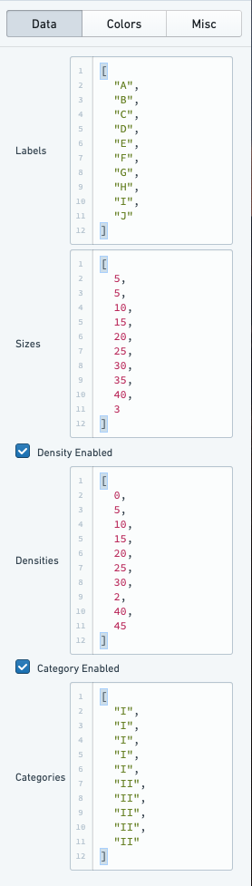

### Color Configuration

There are different coloring configurations available based on if `categories` and/or `densities` are enabled.

#### Category enabled and density enabled

When both `categories` and `densities` are enabled, colors of cells are defined according to gradients in the [Hue-Saturation-Value (HSV) ↗](https://en.wikipedia.org/wiki/HSL_and_HSV) color space. For each category a hue is defined. A list of hues (number between 0 and 360) or a dictionary mapping category names to hues can be provided. All categories' gradients then uses the same defined starting saturation and value. The gradient is defined using gradient type (brighten, darken, saturate, desaturate) and the strength of the gradient.

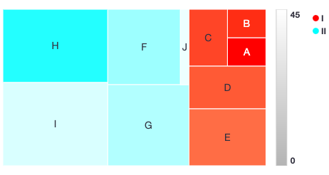

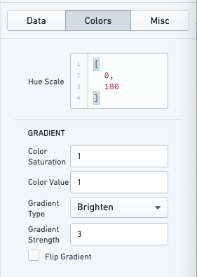

#### Only category enabled

With only `categories` enabled, you can specify a list of colors or a dictionary mapping category name to color for the categories.

The colors can be hex (#FF0000, #00FF00) or canonical (e.g. red, green).

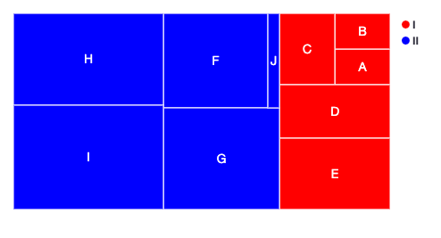

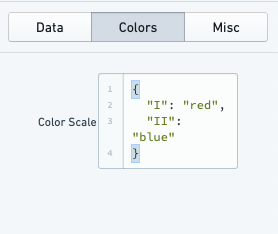

#### Only density Enabled

With only `densities` enabled, you can define a list of colors which will be applied as range with gradient. You must provide two colors at a minimum to define the color gradient, though more can be provided to more finely define this color gradient.

The colors can be hex (#FF0000, #00FF00) or canonical (e.g. red, green).

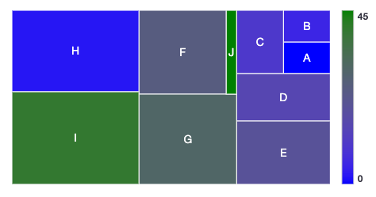

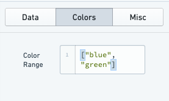

#### Category disabled and density disabled

With both `categories` and `densities` disabled, you can define a list of colors which is the color palette. It must be a list of colors of same length as number of data points.

The colors can be hex (#FF0000, #00FF00) or canonical (e.g. red, green).

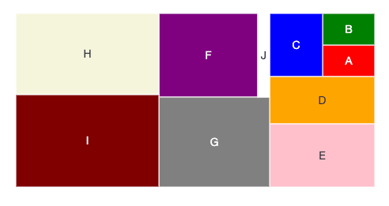

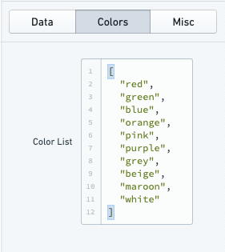

### Miscellaneous Configuration

Optional miscellaneous configurations are possible:

* Cell styling
  * Border width of each cell
  * Border color
  * Labels for the cell
  * Tooltips for the cell

* Legends
  * Legend position (top, bottom, left, right)
  * Legend label (for title of the legend)

* Tiling strategy for how the cells are generated. Tiling strategies are defined by [d3 ↗](https://d3js.org/d3-hierarchy/treemap): Binary, Dice, Resquarify, Slice, Slice Dice, Squarify.

* Selection (multiple or single)

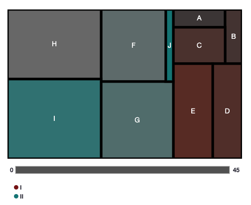

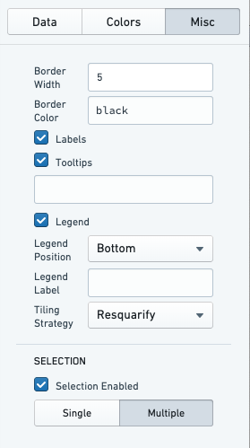

### Examples

In these series of examples, an investor wants to visualize the holdings of their portfolio. The data has several dimensions: the name of the stock (`label`), the amount invested in each stock (`size`), the percentage change in the stock price (`density`), and the industry of the stock (`category`).

We load this data into the Tree Map chart widget:

```json
labels: ["MSFT", "AAPL", "NFLX", "AMZN", "GS", "MS", "BLK", "JPM", "XOM", "BP"]

sizes: [10, 20, 5, 25, 8, 15, 18, 30, 10, 40]

densities: [8, 15, -10, 10, 3, -5, -3, 4, 20, 8]

categories: ["Tech", "Tech", "Tech", "Tech", "Finance", "Finance", "Finance", "Finance", "Energy", "Energy"]
```

#### Example 1 with category and density enabled

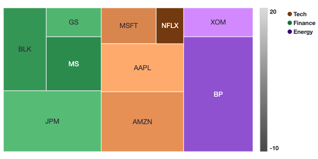

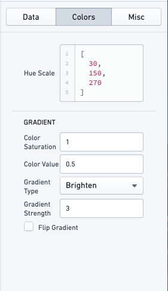

#### Example 2 with only density enabled

In this configuration the portfolio analyst can look at which equities have had the largest changes in price.

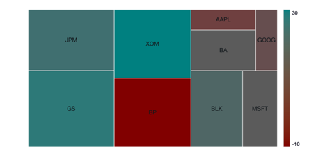

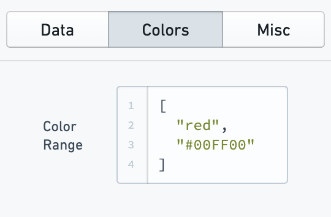

#### Example 3 with only category enabled

In this configuration the portfolio analyst can look at which industry is most represented with in the portfolio and which equities represent the largest holdings within those industries.

It is worth noting that you can use the configuration to offer a more granular representation of the data. For example, one could visualize the size of equities within the portfolio and color them according to Red, Amber, Green risk ratings.

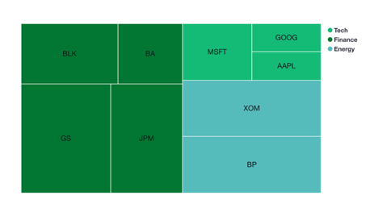

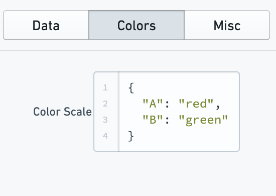

#### Example 4 with category and density disabled

In this configuration, the portfolio analyst would simply see how large a share of the portfolio each equity represents. This is by default effectively the same as a pie chart.

It is worth noting that if a custom color strategy is required (beyond what is by default configurable), this configuration could be used by providing the color for each square individually.

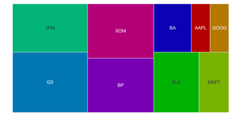

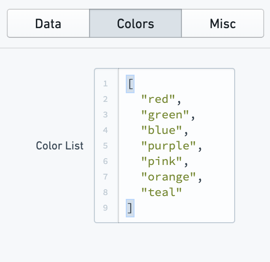

***

## Common CSS

### Line charts

Series colors:

```css
.line-plot .render-area g:nth-of-type(1) path {stroke: #6a2d9f;}.line-plot .render-area g:nth-of-type(2) path {stroke:#c993f1;}
```

Legend colors:

```css
.legend .legend-row .legend-entry:nth-of-type(1) path {fill: #6a2d9f;}
```

Alternatively,

```css
.legend .legend-row .legend-entry:nth-of-type(2) path,.legend .content .legend-row:nth-of-type(2) path {fill: #c993f1;}
```

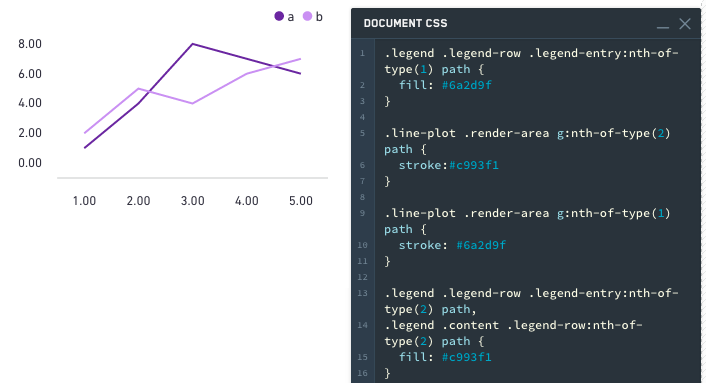

### Bar charts

The following applies to stacked, clustered, and regular bar charts.

Bar colors:

```css
.bar-plot .render-area g:nth-of-type(1) rect,.bar-plot:nth-of-type(1) .render-area rect {fill: #6a2d9f;}.bar-plot .render-area g:nth-of-type(2) rect,.bar-plot:nth-of-type(2) .render-area rect {fill: #c993f1;}
```

Legend colors:

```css
.legend .legend-row .legend-entry:nth-of-type(1) path {
  fill: #6a2d9f;
}

.legend .legend-row .legend-entry:nth-of-type(2) path,
.legend .content .legend-row:nth-of-type(2) path {
  fill: #c993f1;
}
```

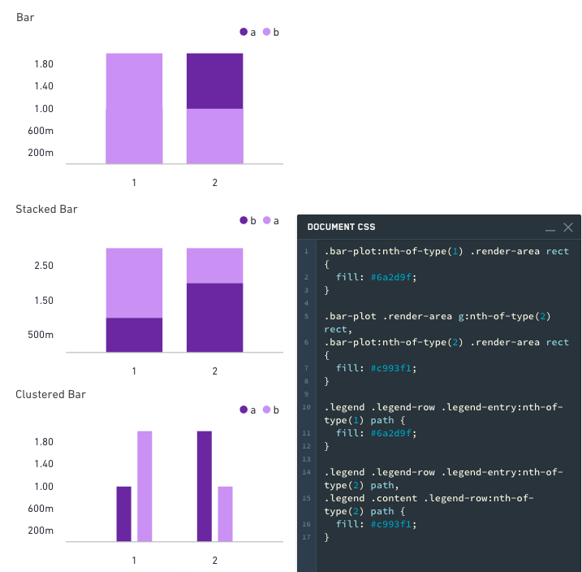

### Area charts

The following applies to stacked and regular area charts.

Area colors:

```css
.area-plot .render-area  g:nth-of-type(1) path,.area-plot:nth-of-type(1) path {fill: #009900;}.area-plot .render-area  g:nth-of-type(2) path,.area-plot:nth-of-type(2) path {fill: #99CC00;}
```

Line colors:

```css
.area-plot:nth-of-type(1) .area,.line-plot .render-area g:nth-of-type(1) path {stroke: #009900;}.area-plot:nth-of-type(1) .area,.line-plot .render-area g:nth-of-type(2) path {stroke: #99CC00;}
```

Legend colors:

```css
.legend .legend-row .legend-entry:nth-of-type(1) path {fill: #009900;}
```

Alternatively:

```css
.legend .legend-row .legend-entry:nth-of-type(2) path,.legend .content .legend-row:nth-of-type(2) path {fill: #99CC00;}
```

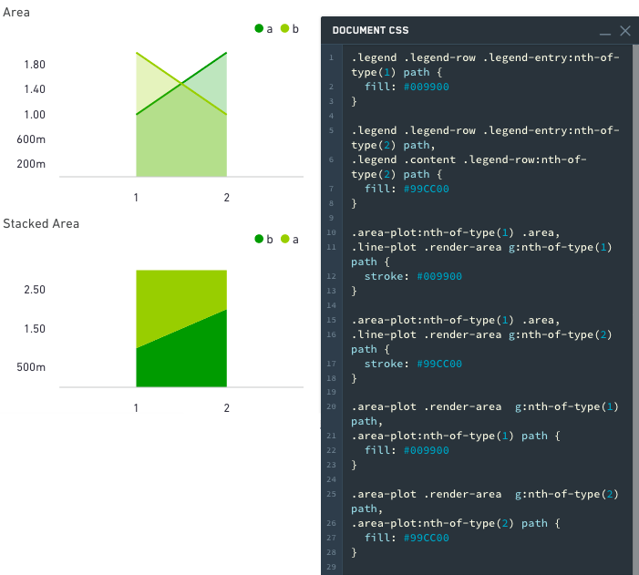

### Pie charts

A slice can be selected by index or CSS classname (sanitized label name is used as CSS classname)

**Styling by Index:**

Pie slice colors:

```css
.pie-plot .render-area .arc:nth-of-type(1) {fill: #009900;}
```

Alternatively:

```css
.arc:nth-of-type(2) { fill: #99CC00; }
```

Legend colors:

```css
sl-pie .legend .legend-row:nth-of-type(1) path { fill: #009900; }
sl-pie .legend .legend-row:nth-of-type(2) path { fill: #99CC00; }
```

**Styling by Name:**

Pie slice colors:

```css
.pie-plot .render-area .arc._A {fill: #009900;}
```

Alternatively:

```css
.arc._B { fill: #99CC00; }
```

Legend colors:

```css
sl-pie .legend .legend-row ._A path { fill: #009900; }
sl-pie .legend .legend-row ._B path { fill: #99CC00; }
```

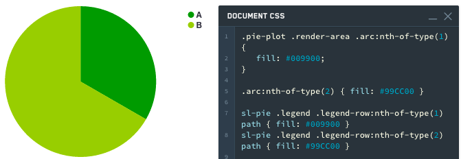
