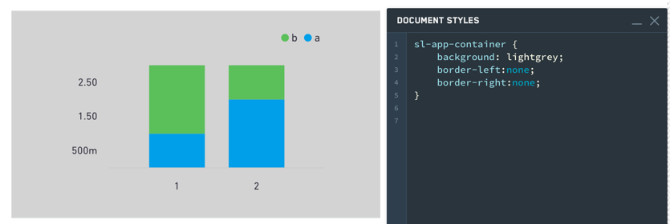
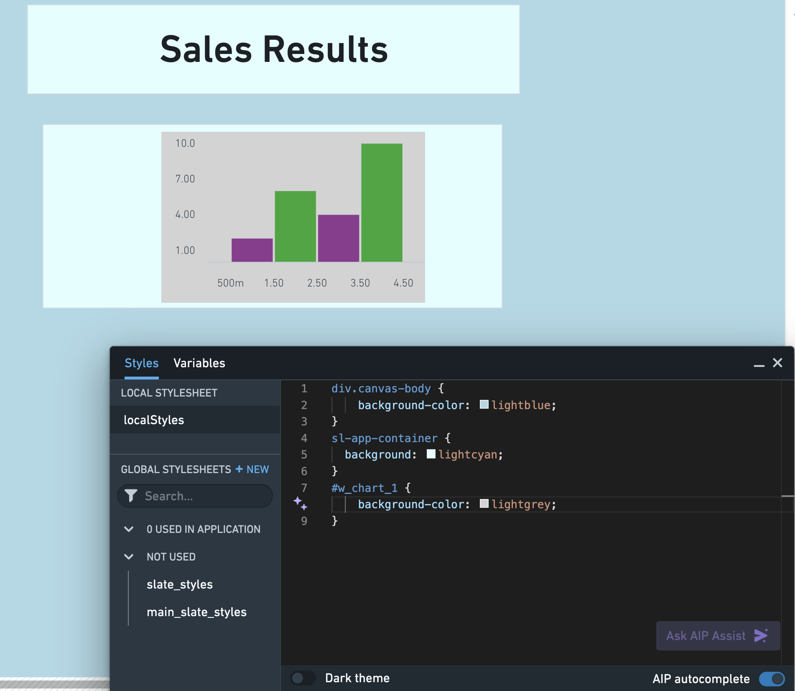
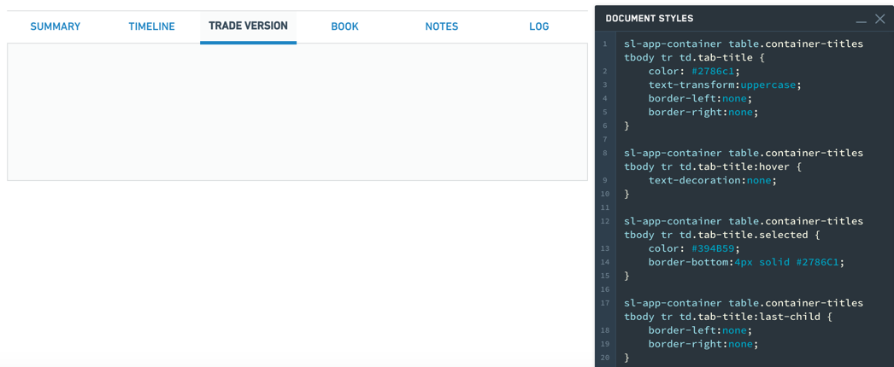

<!-- source: https://palantir.com/docs/foundry/slate/widgets-container/ · mirrored 2026-08-22 from Palantir Foundry docs -->

# Container

The Container Widget category consist of the following widgets:

* Basic
* [Dialog](#dialog-widget)
* Flex
* Repeating
* Split horizontally
* Split vertically
* Tabbed

The following tables offer usage details about the properties available to Container widgets. Several examples follow the tables.

### Properties

|Attribute	|Description	|Type	|Required	|Changed By	|
|---	|---	|---	|---	|---	|
|flex	|Specifies whether the container should automatically align and distribute space among child widgets.	|boolean	|Yes	|Direct Edit	|
|flexOptions	|The options to configure how child widgets should be aligned.	|boolean	|No	|Direct Edit	|
|lazyRenderingEnabled	|Specifies whether only visible child widgets should be rendered.	|boolean	|Yes	|Direct Edit	|
|selectedTabIndex	|The index of the currently shown tab.	|number	|Yes	|Direct Edit	|
|tabContents	|An internal array storing the widgets in each tab.	|{children: IWidgetModel\[]}\[]	|Yes	|User Interaction	|
|tabTitles	|The titles for each tab.	|ITabTitle\[]	|Yes	|Direct Edit	|
|titlesEnabled	|Specifies whether to show the clickable tab titles at the top of the container.	|boolean	|Yes	|Direct Edit	|
|scrollingEnabled	|Specifies whether overflowing content may be scrolled.	|boolean	|Yes	|Direct Edit	|
|splitDirection	|Specifies direction in which container is split.	|number	|Yes	|Direct Edit	|
|splitMovableInConsumerMode	|Specifies whether split container is resizable in consumer mode	|boolean	|Yes	|Direct Edit	|
|splitPanel	|An internal value that says whether a container is a panel in a split container.	|boolean	|Yes	|User Interaction	|
|repeat	|Specifies number of times to repeat content	|number	|No	|Direct Edit	|
|repeating	|Specifies whether container is a repeating container or not.	|boolean	|Yes	|Direct Edit	|
|previewRepeating	|Specifies whether to preview repeating container or not.	|boolean	|No	|Direct Edit	|

#### ITabTitle

|Attribute	|Description	|Type	|Required	|Changed By	|
|---	|---	|---	|---	|---	|
|title	|The title of this tab.	|string	|Yes	|Direct Edit	|

#### IFlexOptions

|Attribute	|Description	|Type	|Required	|Changed By	|
|---	|---	|---	|---	|---	|
|justifyContent	|Specifies how child widgets should be laid out on the main-axis. Default value is Left for horizontally flexed containers and Top for vertically-flexed containers.	|string	|Yes	|Direct Edit	|
|flexDirection	|Specifies the main-axis on which child widgets are aligned. Default value is Horizontally.	|string	|Yes	|Direct Edit	|
|flexWrap	|Specifies whether child widgets can overflow onto multiple lines. Default value is unchecked.	|string	|Yes	|Direct Edit	|

### Usage

Drag widgets into and out of containers to add and remove them from the currently selected tab. The tabContents property is unsupposed in the raw tab and should not be edited manually, nor will it respond to changes from user interaction.

### Examples

#### Simple Container

```json
{
  "selectedTabIndex": 0,
  "tabContents": [
    {
      "children": []
    }
  ],
  "tabTitles": [
    {
      "title": "Title"
    }
  ],
  "titlesEnabled": false
}
```

#### Tabbed Container

```json
{
  "selectedTabIndex": 1,
  "tabContents": [
    {
      "children": []
    },
    {
      "children": []
    },
    {
      "children": []
    }
  ],
  "tabTitles": [
    {
      "title": "Title 1"
    },
    {
      "title": "Title 2"
    },
    {
      "title": "Title 3"
    }
  ],
  "titlesEnabled": true
}
```

#### Driving the selected tab from another widget

```json
{
  "selectedTabIndex": "{{w8.selectedValue}}",
  "tabContents": [
    {
      "children": []
    },
    {
      "children": []
    },
    {
      "children": []
    }
  ],
  "tabTitles": [
    {
      "title": "Title 1"
    },
    {
      "title": "Title 2"
    },
    {
      "title": "Title 3"
    }
  ],
  "titlesEnabled": false
}
```

### Defaults

```json
{
  "selectedTabIndex": 0,
  "tabContents": [
    {
      "children": []
    }
  ],
  "tabTitles": [
    {
      "title": "Title"
    }
  ],
  "titlesEnabled": false
}
```

***

## Dialog widget

The following tables offer usage details about the properties available to dialog widgets. Several examples follow the tables.

### Properties

|Attribute	|Description	|Type	|Required	|Changed By	|
|---	|---	|---	|---	|---	|
|title	|The title of the dialog.	|string	|No	|Direct Edit	|
|canEscapeKeyClose	|Closes the dialog when the Escape key is used.	|boolean	|Yes	|Direct Edit	|
|canOutsideClickClose	|Closes the dialog when the user clicks on the overlay backdrop.	|boolean	|Yes	|Direct Edit	|

#### Actions

|Action Name	|Description	|
|---	|---	|
|close	|Triggering this action causes the dialog to close.	|
|open	|Triggering this action causes the dialog to open.	|

#### Events

|Event Name	|Description	|
|---	|---	|
|closed	|This event is fired when dialog has fully closed.	|
|opened	|This event is fired when dialog has fully opened.	|

***

## Common CSS

You can use the below CSS to set the background color and borders of a container:

```css
sl-app-container {
  background: lightgrey;
  border-left:none;
  border-right:none;
}
```



Though the `sl-app-container` selector and `background` property will correctly set the background color and borders of a container widget, use the `div.canvas-body` selector and `background-color` property in your local stylesheet to adjust the colors and borders of the Slate application canvas. In the example below, we customized the Slate canvas, container widget, and bar chart colors using the Styles editor:



### Tabbed containers

Tabs styling:

```css
sl-app-container table.container-titles tbody tr td.tab-title {
  color: #2786c1;
  text-transform:uppercase;
  border-left:none;
  border-right:none;
}
```

Hover styling:

```css
sl-app-container table.container-titles tbody tr td.tab-title:hover {text-decoration:none;}
```

Selection styling:

```css
sl-app-container table.container-titles tbody tr td.tab-title.selected {
  color: #394B59;
  border-bottom:4px solid #2786C1;
}
```

Individual tab styling:

```css
sl-app-container table.container-titles tbody tr td.tab-title:last-child {
  border-left:none;
  border-right:none;
}
```


