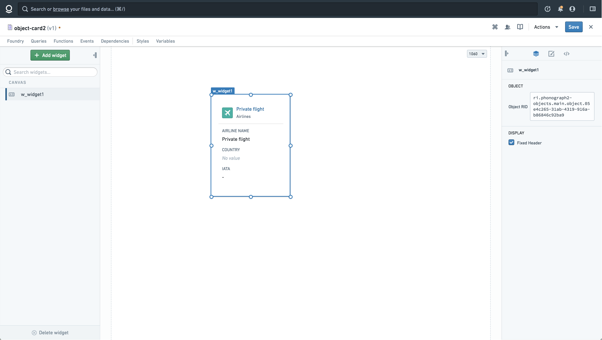
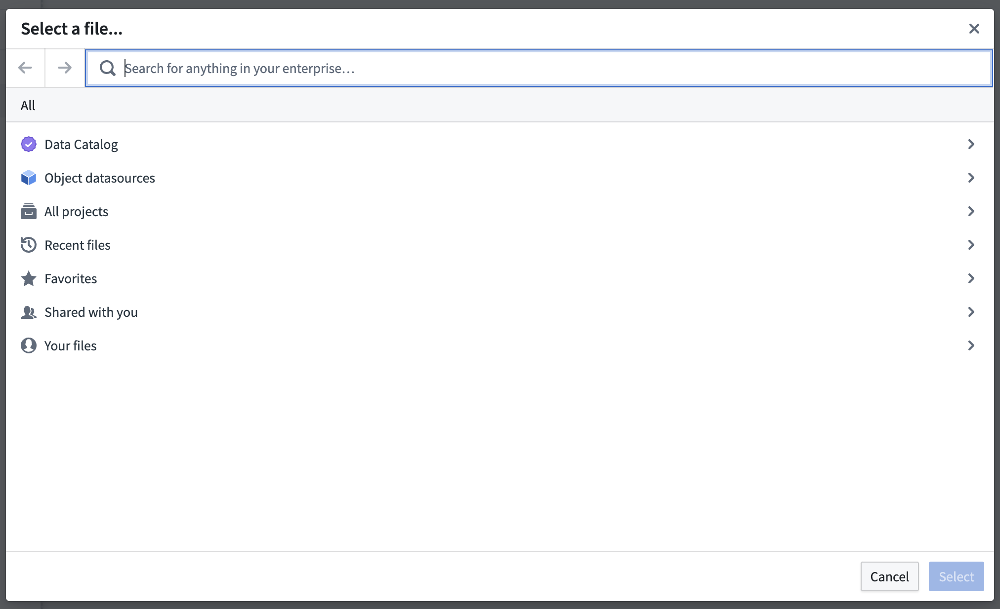
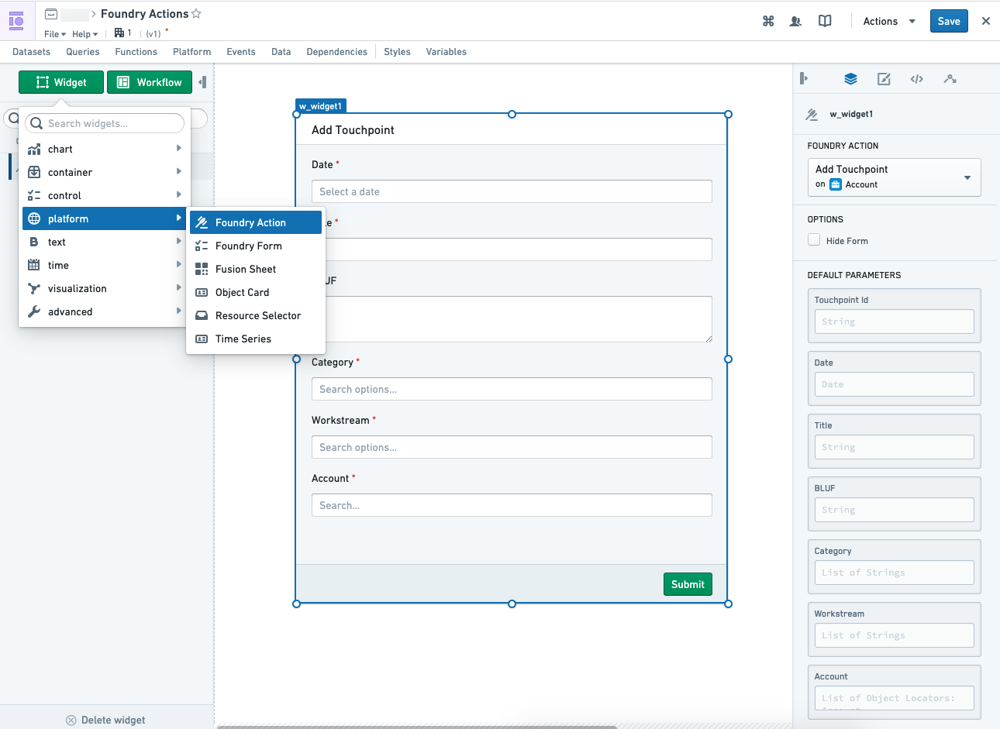

<!-- source: https://palantir.com/docs/foundry/slate/widgets-platform/ · mirrored 2026-08-18 from Palantir Foundry docs -->

# Platform

The Platform Widget category consists of the following widgets:

* [Object Card](#object-card)
* [Resource Selector](#resource-selector)
* [Time Series](#time-series)
* [Action](#action)

***

## Object Card

The object card widget takes ObjectRID as its input. It will render the mini object-views (cards) as they have been defined in the Ontology app. The object cards will be linked to their Object Explorer object view.



### Table Format

It is possible to populate a table of object views using this widget in conjunction with repeatable containers.

For example, assume that you have a Slate function that returns an array of RIDs. You can insert the object card widget into the repeating container to create a "table view". You need to index the Object Widget with the repeatable container’s index so in the “Object RID” you will specify: `{{lookup f_function1 w_repeating_container.index}}`.

This sets up a list of cards based on the RID from your function and the index of the repeatable container using the lookup built-in function.

#### Get Object RID

To obtain the ObjectRID input, you have a few options:

Option 1: Slate provides a point-and-click UI, the [Object Set panel](/docs/foundry/slate/concepts-object-sets/), where you can make object queries without having to construct the queries manually.

Option 2: You can obtain the ObjectRid of a specific object by navigating to its Object View and selecting the Actions dropdown. In the clipboard, it will allow you to copy a URL link. Copy the last section of the URL link, that is, the portion after `?objectId={ObjectRID}` (for example if the URL is `...?objectId=ri.phonograph2-objects.main.object.09d2e0e9-dd3c-49b2-8b96-0cb1bf005c1d` your ObjectRID = `ri.phonograph2-objects.main.object.09d2e0e9-dd3c-49b2-8b96-0cb1bf005c1d`).

Option 3: To obtain the ObjectRID from the ObjectTypeId and ObjectPrimaryKey, you will need to use the `Get Object by Locator` endpoint. While ObjectTypeId and ObjectPrimaryKey can be use in other places to parameterize Object Explorer URL links, they need to be resolved into ObjectRIDs in Slate. You can make dynamic combinations of ObjectTypeId and ObjectPrimaryKey and pass this into a Slate query to retrieve the ObjectRID (provided the endpoints are exposed on your instance and you have set it up as a data source).

<div class="table"><table class="colwidths-given docutils pt-table pt-striped">
<colgroup>
<col style="width: 10%"/>
<col style="width: 64%"/>
<col style="width: 8%"/>
<col style="width: 6%"/>
<col style="width: 12%"/>
</colgroup>
<thead>
<tr class="row-odd"><th class="head"><p>Attribute</p></th>
<th class="head"><p>Description</p></th>
<th class="head"><p>Type</p></th>
<th class="head"><p>Required</p></th>
<th class="head"><p>Changed By</p></th>
</tr>
</thead>
<tbody>
<tr class="row-even"><td><p>cardStyles</p></td>
<td><p>Indicates if the Object Card should appear with card styles (e.g. shadow and hover styles)</p></td>
<td><p>boolean</p></td>
<td><p>Yes</p></td>
<td><p>Direct Edit</p></td>
</tr>
<tr class="row-odd"><td><p>objectRid</p></td>
<td><p>The object’s RID (Resource ID) for looking up properties and rendering an object card view. An RID is an identifier for an object stored on the Foundry Platform (for example: ri.phonograph2-objects.main.object.f32b778d-b789-49e8-8041-ec14b4c5c5b9).</p></td>
<td><p>string</p></td>
<td><p>Yes</p></td>
<td><p>Direct Edit</p></td>
</tr>
<tr class="row-even"><td><p>fixedHeader</p></td>
<td><p>Indicates if the Object Card’s header should remain frozen when the content overflows the container size.</p></td>
<td><p>boolean</p></td>
<td><p>Yes</p></td>
<td><p>Direct Edit</p></td>
</tr>
</tbody>
</table></div>

***

## Resource Selector

The Resource Selector widget allows you to select a file in Compass.

This widget does not create a visual element on your page. Instead, it exposes an Action to open the resource selector, and some events to handle the selected resource.

### Events

* **w\_resource\_selector\_1.didClose:** This event is triggered when the resource selector is closed.
* **w\_resource\_selector\_1.selectedRid.changed:** This event is triggered when a resource is selected in the resource selector. `{{sl_event_value}}` is set to the RID of the selected resource.

### Actions

|Action Name	|Description	|
|---	|---	|
| w\_resource\_selector\_1.open | Triggering this action opens the resource selector dialog. |



***

## Time Series

Slate’s Time Series widget provides a convenient way to visualize time series graphs. You can add multiple series into the same chart using the Series ID. You can also configure the visualization by:

* Specifying the Title, Unit and Color, or by disabling the Crosshairs or Legends.
* Dynamically defining the Time Range to specify the view window.
* Turning on “streaming mode” for the data.

***

## Action

Slate's **Action Widget** allows Slate to execute business logic pre-configured in an Action. After adding the widget onto your page, you can:

* Select a Foundry Action you have access to,
* Pass in Default Parameters into your Action form directly or via Slate's handlebars, and
* Submit the Action form directly with the `Submit` button, or indirectly with the Slate event-action pair `w_widget.submit`.

Additionally, Slate provides the following Slate events in relation to the Action Forms:

* Submission (`w_widget.success`/`w_widget.failure`)
* Validation state (`w_widget.ValidationSuccess`/`w_widget.ValidationFailure`), and
* Rendered changes (`w_widget.transitioned` and `w_widget.cssClassesUpdated`).

Finally, you can also prevent the Action Form from displaying via a toggle control if you need abstract away the UI from the user and trigger submission via Slate events. Refer to the [Slate events](/docs/foundry/slate/concepts-events/) for more information.

The Foundry Action will need to be created before being used in Slate. Refer to the [Actions documentation](/docs/foundry/action-types/overview/) for more information.



## Default Parameters

The parameters for a Foundry Action can be provided directly by the user or programmatically by using default parameters, which can be set in the configuration of the widget.

### Object Locator Prefill

To provide an object reference, you can use the code snippet below. The values of `typeId` and `primaryKey` can be found in the Ontology Manager: `typeID` is the ID of the object and `primaryKey` is the Property ID of the object's primary key.

```json
{
  "typeId": "<object typeId here>",
  "primaryKey": {
    "<optional primary keys here>": "<values>"
  }
}
```

If the Object parameter for the relevant Action supports multiple inputs, provide a *list* of object locators as the default value.

```json
[{
  "typeId": "<object typeId here>",
  "primaryKey": {
    "<optional primary keys here>": "<values>"
  }
},{
  "typeId": "<object typeId here>",
  "primaryKey": {
    "<optional primary keys here>": "<values>"
  }
}]
```

### Date Prefill

Dates are expected to be in ISO 8601 format; for example, `YYYY-MM-DD` (e.g. 1990-01-12) is a valid date format.

### Timestamp Prefill

Timestamps are expected to follow ISO 8601 format: `YYYY-MM-DD[T]HH:mm:ss.SSS[Z]` (1990-01-12T23:00:00.000Z, for example).
