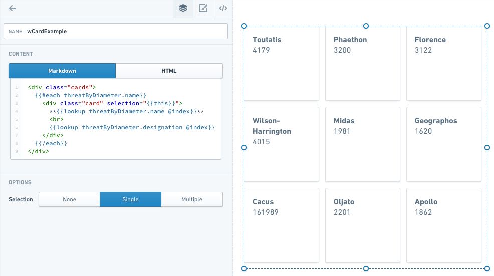
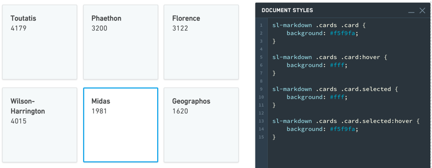
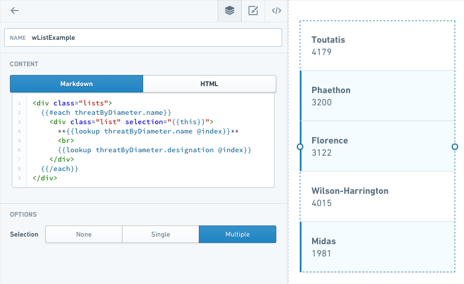
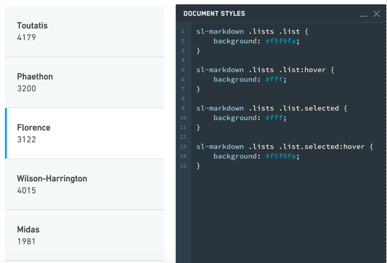
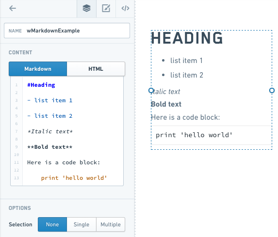
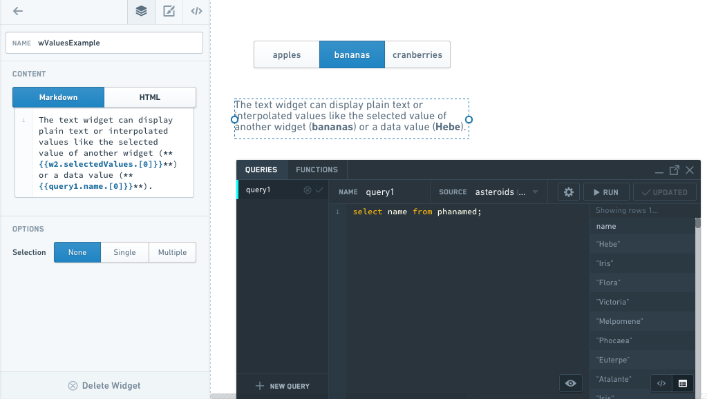
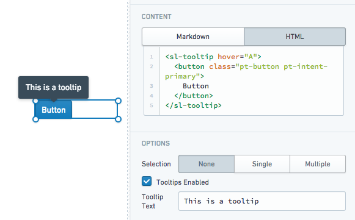
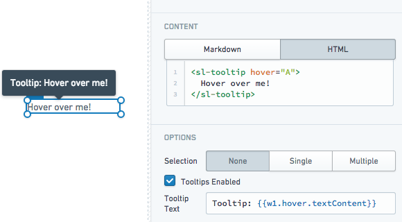
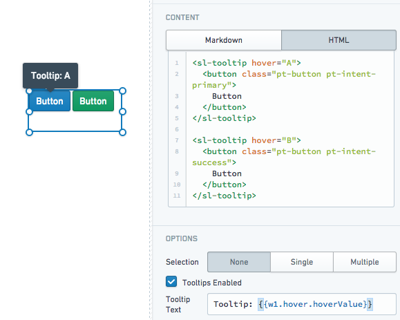

<!-- source: https://palantir.com/docs/foundry/slate/widgets-text/ · mirrored 2026-08-18 from Palantir Foundry docs -->

# Text

The Text Widget category consist of the following widgets:

* [Card](#card-widget)
* Clickable
* HTML
* [Image](#image-widget)
* Link
* [List](#list-widget)
* [Text](#text-widget)

***

## Image widget

The **Image** widget is a simple extension of the Text widget. This widget uses the HTML image tag to create an image. You will need to upload the image to Foundry or host it in some other place that is accessible from Slate first, then set the image tag `src` property to be the image URL. For images hosted in Foundry, the image URL is `https://<FOUNDRY_URL>/blobster/api/salt/<RID>`. You can access this URL by opening the image in Foundry, right-clicking on the image, and then copying the image address. Follow the example below in your image widget configuration:

`/blobster/api/salt/<RID>">`

## Card widget

The **Card** widget is an extension of the Text widget. This widget uses HTML divs to create the cards, and an **each** statement to populate them. When you add a Card widget to your application, the widget comes prefilled with some skeleton code that you can replace to customize your cards.

* **#each <collection of items>:** The collection is the list of objects to iterate through to create the number of cards. You will also need to uncomment the `/each` at the end of the text.
* **item key:** set to `this` in the double curly brackets to allow cards to be selected.
* **Header:** This is the text that appears as the header for each card. To select items from a query, you can use the syntax `lookup` `query.value` `@index` within the handlebars.
* **Content:** This is the text following the header on each card. It can be pulled from a query like the header.

A completed Card widget might look like this:



### Common CSS

Below are common CSS overrides that can be applied to Card widgets.

Card color:

```css
sl-text .cards .card {background: #f5f9fa;}
```

Selection color:

```css
sl-text .cards .card.selected {background: #fff;}
```

Hover color:

```css
sl-text .cards .card:hover {
   background: #fff;
}

sl-text .cards .card.selected:hover {
   background: #f5f9fa;
}
```



## List widget

The **List** widget is very similar to Card, but uses `divmclass=lists` instead of `div class=cards`.
In the example below, note that with **Selection** set to **Multiple**, you can select multiple items in the list at once.



### Common CSS

Below are common CSS overrides that can be applied to List widgets.

List color:

```css
sl-text .lists .lists {background: #f5f9fa;}
```

Selection color:

```css
sl-text .lists .lists.selected {background: #fff;}
```

Hover color:

```css
sl-text .lists .lists:hover {
   background: #fff;
}

sl-text .lists .lists.selected:hover {
   background: #f5f9fa;
}
```



## Text widget

The Text widget is among the most versatile Slate widgets. It is also the basis for many other widgets, such as HTML, Image, Card, and List. These widgets are simply Text widgets that start with some default code to give you the correct options.

The Text widget has two modes: **Markdown mode** and **HTML mode**. Markdown is a lightweight markup language that renders to HTML, so anything you can do in HTML mode, you can also do in Markdown mode. Markdown mode lets you take advantage of the simpler, very readable Markdown syntax. For example, to set some text as a heading (H1), simply add a `#` sign before it:



Refer to the [Markdown documentation ↗](https://daringfireball.net/projects/markdown/syntax) for other Markdown syntax.

### Examples

#### Handlebars in a Text Widget

You can use Handlebars within a Text widget to display dynamic text (for example, something selected in another widget or a query).



#### Tooltips

The Text widget supports user-defined tooltips. Tooltips will appear when users hover over `sl-tooltip` HTML elements within the widget content.

* Static tooltip:



* Tooltip using the inner text content of an `sl-tooltip` element:



* Multiple tooltips with custom values:



### Properties

|Attribute	|Description	|Type	|Required	|Changed By	|
|---	|---	|---	|---	|---	|
|markupLanguage	|Specifies the widget’s markup language, either [Markdown ↗](https://github.com/adam-p/markdown-here/wiki/Markdown-Cheatsheet) or HTML.	|string	|Yes	|Direct Edit	|
|selectedValues	|The selected values for all selected items if in selection mode	|string\[]	|Yes	|User Interaction	|
|selectionType	|Determines the type of selection - ‘none’, ‘single’ or ‘multiple’	|string	|Yes	|Direct Edit	|
|selectionRequired	|Specifies whether you can deselect all values. When enabled, this flag prevents the user from deselecting the final selected value in the widget. If the widget starts off with no values selected, prevents deselecting only after the user makes an initial selection.	|boolean	|Yes	|Direct Edit	|
|text	|The content to render and display to the user	|string	|Yes	|Direct Edit	|
|tooltipText	|The text displayed within the tooltips for \<sl-tooltip> elements. Supports HTML.	|string	|Yes	|Direct Edit	|
|tooltipsEnabled	|Specifies whether tooltips are enabled. Tooltips will be applied to the contents of a \<sl-tooltip> tag.	|boolean	|Yes	|Direct Edit	|
|clickEvents	|A list of names of click events exposed by this text widget.	|boolean	|Yes	|Direct Edit	|

### ITextHover

|Attribute	|Description	|Type	|Required	|Changed By	|
|---	|---	|---	|---	|---	|
|hoverValue	|User defined value to be associated with the tooltip. This value is defined by adding a hover attribute to the tooltip tag.	|string	|Yes	|User Interaction	|
|textContent	|Specifies the contents of the tooltip tag.	|string	|Yes	|User Interaction	|
