<!-- source: https://palantir.com/docs/foundry/slate/widgets-visualization/ · mirrored 2026-08-18 from Palantir Foundry docs -->

# Visualization

The Visualization Widget category consist of the following widgets:

* [Graph](#graph)
* [Image gallery](#image-gallery)
* [Map](#map)
* [Table](#table)
* [Toast](#toast)
* [Tree](#tree)

***

## Graph

The following tables offer usage details about the properties available to Graph widgets. Several examples follow the tables.

### Properties

|Attribute   |Description  |Type  |Required  |Changed By  |
|---  |---  |---  |---  |---  |
|defaultEdgeIcon |Default image URL or Blueprint icon for edges. |string |No |Direct Edit |
|defaultNodeIcon |Default image URL or Blueprint icon for nodes. |string |No |Direct Edit |
|directedEdgesEnabled |Determines whether edges will have an arrow at the end pointing to the target node. |boolean |No |Direct Edit |
|edgeArrowSize |Size of the arrow in a directed edge in pixels. |boolean |No |Direct Edit |
|edgeIconOffset |Edge’s icon offset from the center of the edge. The direction of the offset depends on whether or not the edge labels are horizontal |number |No |Direct Edit |
|edgeIconSize |Width and height of the edge icon in pixels. |number |No |Direct Edit |
|edgeLabelHorizontal |Determines whether edge labels stay horizontal instead of being parallel to the edge. |boolean |No |Direct Edit |
|edgeLabelOffset |Edge’s label offset from the center of the edge. The direction of the offset depends on whether or not the edge labels are horizontal |number |No |Direct Edit |
|edgeLength |The edge length value supplied to Flow and Force Directed layouts. |number |No |Direct Edit |
|edges |Values for the edges displayed in the graph. |IEdges |No |Direct Edit |
|hideLabelsScale |The zoom level at which the labels are hidden. Use this to hide labels that are too small to read. |number |No |Direct Edit |
|nodeColorScaleRange |An array of two or more colors used to create a linear gradient to color the nodes. Example: with node.colorScaleValues = \[0, 5, 10] and a color range array of \[“red”, “blue”] the resulting colors will be: red, purple, blue. Colors can be specified either as hex (e.g. “#FF0000”) or as CSS color names (e.g. “red”). If unspecified or fewer than 2 colors, the default color range used is composed of Blueprint colors @green4, @gold4, and @red4 (\[“#15B371”, “#F2B824”, “#F55656”]) |string\[] |No |Direct Edit |
|nodeLabelPosition |The position of a label relative to the node circle. |string |No |Direct Edit |
|layout |Type of layout the graph will use to arrange the nodes. “Force Directed”: The graph is laid out using a method that spreads out the nodes.“Flow Up/Down/Left/Right”: The nodes are arranged so that the edges generally point in a given direction. “Manual” Allows the user to drag the nodes to new positions and persists the locations upon save. Dragged node positions in other layouts won’t be saved. |string |No |Direct Edit |
|nodeDiameter |The diameter of the node circle in pixels. |number |No |Direct Edit |
|nodeLabelOffset |The label’s offset from the center of the node. The direction of the offset is determined by Label Position |number |No |Direct Edit |
|nodeMargin |The minimum distance between nodes, used by Flow and Force Directed layouts. |number |No |Direct Edit |
|nodeIconSize |The width and height of the node icon. |number |No |Direct Edit |
|nodes |Values for the nodes displayed in the graph. |INodes |Yes |Direct Edit |
|nodeSelectorDiameter |The diameter of the circle indicating that the node is selected. |number |No |Direct Edit |
|selectedNodeIds |Unique identifiers for the current user selected nodes. |string\[] |No |User Interaction |
|zoomScaleRange |Sets the allowed range of zoom of the graph. |number |No |Direct Edit |

#### IEdges

|Attribute |Description |Type |Required |Changed By |
|--- |--- |--- |--- |--- |
|cssClasses |The CSS class names for edges used to apply CSS styles. |string\[] |No |Direct Edit |
|icons |Image URLs or Blueprint icons for the edges. |string\[] |No |Direct Edit |
|labels |Labels associated with the edges. |string\[] |No |Direct Edit |
|sourceNodeIds |IDs of the source nodes needed to create the edges. |number\[] |Yes |Direct Edit |
|targetNodeIds |IDs of the target nodes needed to create the edges. |number\[] |Yes |Direct Edit |

#### INodes

|Attribute |Description |Type |Required |Changed By |
|--- |--- |--- |--- |--- |
|colorScaleValues |The numeric value used to color a node, interpolated using colors in Color Scale Range |number\[] |No |Direct Edit |
|cssClasses |The CSS class names for nodes used to apply CSS styles. |string\[] |No |Direct Edit |
|icons |Image URLs or Blueprint icons for the nodes. |string\[] |No |Direct Edit |
|ids |Unique identifiers for the nodes. |string\[] |Yes |Direct Edit |
|labels |Labels associated with the nodes. |string\[] |No |Direct Edit |
|xPositions |In Manual layout, this specifies the X positions of the nodes. Nodes with missing values will be arranged in a grid. |number\[] |Yes |User Interaction |
|yPositions |In Manual layout, this specifies the Y positions of the nodes. Nodes with missing values will be arranged in a grid. |number\[] |Yes |User Interaction |

### Examples

#### Dynamic Graph

```json
{
  "camera": {
    "ratio": null,
    "x": null,
    "y": null
  },
  "edges": {
    "sourceNodeIds": "{{graph.sourceNodeIds}}",
    "targetNodeIds": "{{graph.targetNodeIds}}"
  },
  "nodes": {
    "iconUrls": "{{graph.iconUrls}}",
    "ids": "{{graph.ids}}",
    "labels": "{{graph.ids}}",
    "xPositions": "{{graph.xPositions}}",
    "yPositions": "{{graph.yPositions}}"
  },
  "selectedNodeIds": [
    "n18"
  ]
}
```

#### Static Graph

```json
{
  "camera": {
    "ratio": null,
    "x": null,
    "y": null
  },
  "defaultIconUrl": "resources/map-people.svg",
  "edges": {
    "ids": [
      "e1",
      "e2",
      "e3",
      "e4",
      "e5"
    ],
    "labels": [
      "e1",
      "e2",
      "e3",
      "e4",
      "e5"
    ],
    "sourceNodeIds": [
      "n1",
      "n2",
      "n3",
      "n4",
      "n5"
    ],
    "targetNodeIds": [
      "n2",
      "n3",
      "n4",
      "n5",
      "n1"
    ]
  },
  "layout": {
    "type": "layered"
  },
  "nodes": {
    "ids": [
      "n1",
      "n2",
      "n3",
      "n4",
      "n5"
    ],
    "labels": [
      "n1",
      "n2",
      "n3",
      "n4",
      "n5"
    ],
    "xPositions": [
      100,
      30.9,
      -80.9,
      -80.9,
      30.9
    ],
    "yPositions": [
      0,
      95.1,
      58.78,
      -58.78,
      -95.1
    ]
  },
  "selectedNodeIds": [
    "n1"
  ]
}
```

### Defaults

```json
{
  "camera": {
    "ratio": null,
    "x": null,
    "y": null
  },
  "edges": {
    "sourceNodeIds": [],
    "targetNodeIds": []
  },
  "nodes": {
    "ids": [],
    "xPositions": [],
    "yPositions": []
  },
  "selectedNodeIds": []
}
```

***

## Image Gallery

The following tables offer usage details about the properties available to Image Gallery widgets.

### Properties

|Attribute |Description |Type |Required |Changed By |
|--- |--- |--- |--- |--- |
|imageUrls |The images for this gallery. |string\[] |Yes |Direct Edit |
|captions |The captions for each image. |string\[] |No |Direct Edit |

***

## Map

Slate’s Map widget is backed by [Leaflet ↗](https://leafletjs.com/).

The Map is composed of layers: a base layer (also called a tile layer; this is the background map imagery), and some number of overlay layers (also called feature layers; this is the data you are interested in). The Map widget supports both raster and vector tiles for feature layers.

See the [Mapbox documentation ↗](https://www.mapbox.com/help/how-web-maps-work/) for a helpful introduction to web map technology. Slate uses Mapbox as the source for its base map imagery.

## Terminology

* **Map tile:** the base layer of the Map widget, these tiles are simply images. They do not contain data. You can think of map tiles as the “background” of the map. Map tiles are configured in the **Misc** tab and apply to the entire Map widget, rather than just a single layer. Only one kind of map tile can be displayed at a time.
* **Feature:** a point or shape drawn on top of a map, associated with some kind of data.
* **Vector:** an alternative method of representing an image. A *raster* image describes the image pixel by pixel; essentially, as a grid of colored pixels. A *vector* image, by contrast, describes lines between points. This means that vector images can be displayed at different sizes cleanly.
* **Vector tile:** contains shape data as vectors.
* **Tile server:** dynamically serves shape data as tiles.
* **Map tile source:** serves base tiles for a map. It is technically also a tile server.

## Layer types

Slate has the following types of overlay layers:

* [Location](#location)
* [Heat map and heat grid](#heat-map-and-heat-grid)
* [Shape](#shape)
* [Vector](#vector)
* [Choropleth](#choropleth)
* [Raven](#raven)

### Location

Location layers simply contain *points* (Leaflet [markers ↗](https://leafletjs.com/reference.html#marker)), identified by latitude/longitude pairs. You can configure the Map widget to display these points as circles or icons.

### Heat map and heat grid

Heat map and heat grid layers also deal with point data, but rather than simply displaying the points on a map, they display an overlay with computations about the *distribution* of those points. Heat maps show the density of the points as a colored gradient, whereas heat grid groups points into buckets and displays the buckets as discrete color cells.

### Shape

Instead of just individual points, shape and vector layers can also have data in the form of *polygons* — information stored as a series of points and the lines between them. Shape layers provide these polygons in [GeoJSON ↗](https://geojson.org/) format. GeoJSON files can be served directly from your Slate server.

GeoJSON features are stored as JSON and translated into SVG (image) files. These images are all loaded at once when the Map widget is first loaded.

### Vector

Vector layers provide shape data in vector tiles. You must have an external tile server running to serve vector tiles.
Vector tiles are loaded dynamically (only as they come into view on the map). Vector tiles also draw features directly on the canvas, rather than rendering them as images, so a vector layer can have many more features than a shape layer

### Choropleth

Choropleth layers also deal with polygon data, but they add an additional value to each feature, and project these values onto a color scale. Each feature, then, is displayed on the map with a color corresponding to that value. This serves as a visualization of some specific statistic.

For example, you might have a map with states colored by population density, or zip codes colored by social vulnerability index.

### Raven

Contact your Palantir representative if you need to use a Raven map in your Slate applications.

## Base tiles

The Map widget comes with several options for the base tile layer. The options include a dark theme, a light theme, a satellite theme, a street map theme, and our default theme. There is also an **All** option, which lets you switch between themes on the map directly using the Layer Selector.

In the **Misc** tab of the Property Editor, choose from the **Tile Layer** dropdown:

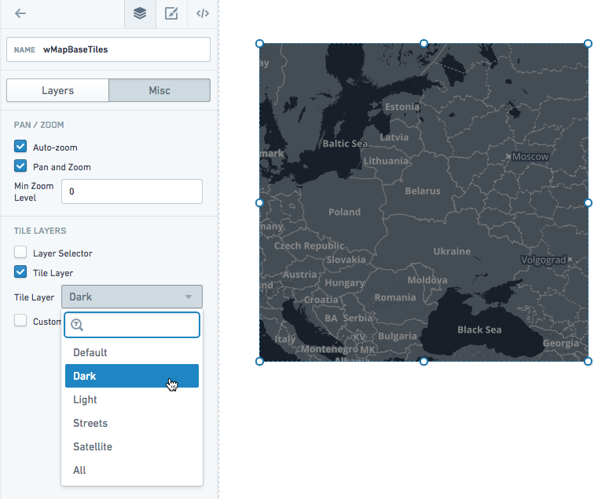

## Data scale on the map

Shape layers (GeoJSON) support the lowest data scale. At about 1,000 features, map performance slows down noticeably. For data larger than that, you should use vector layers instead. You may also try simplifying the geometry in your GeoJSON to increase performance.

Location layers slow down at about 5,000-10,000 points.

## Disabling interactivity

You can disable panning and zooming if you want to display a static map in your application. You can also remove the base layer if you simply want to show feature data (and not the base map tiles).

## Examples

### Location map layer

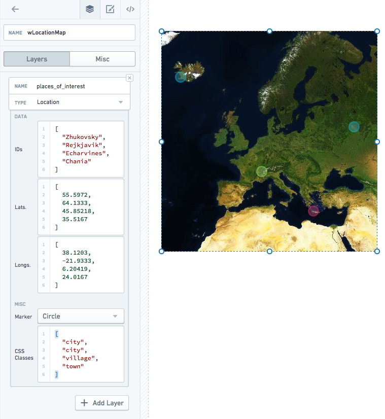

Includes custom styles:

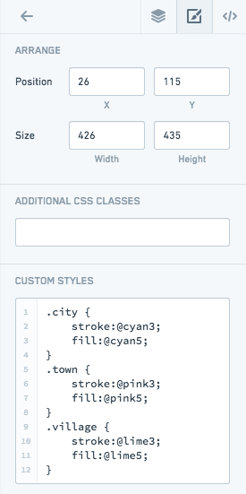

You can also style all markers/clusters in a layer using the layer name or `.layer${layerIndex}`. Only layer names that are valid CSS classes will be added:

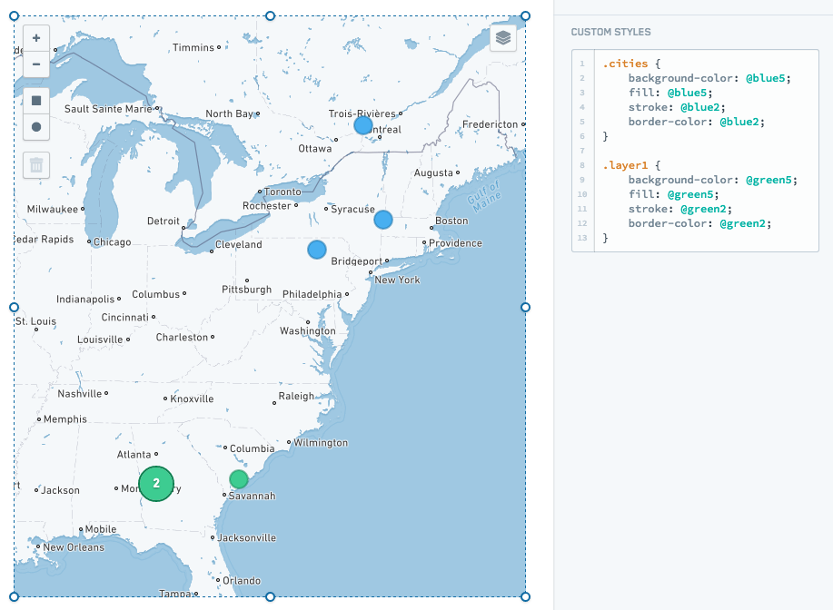

### Choropleth map layer

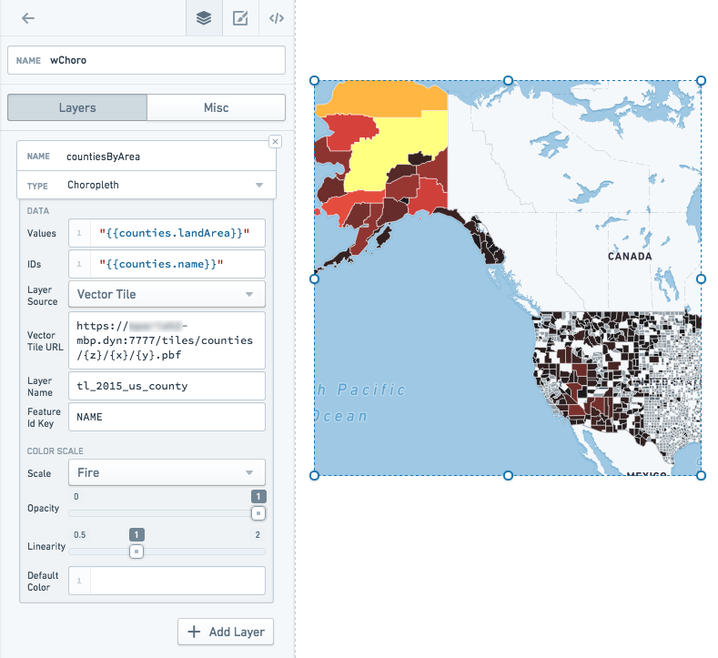

### Vector map layer

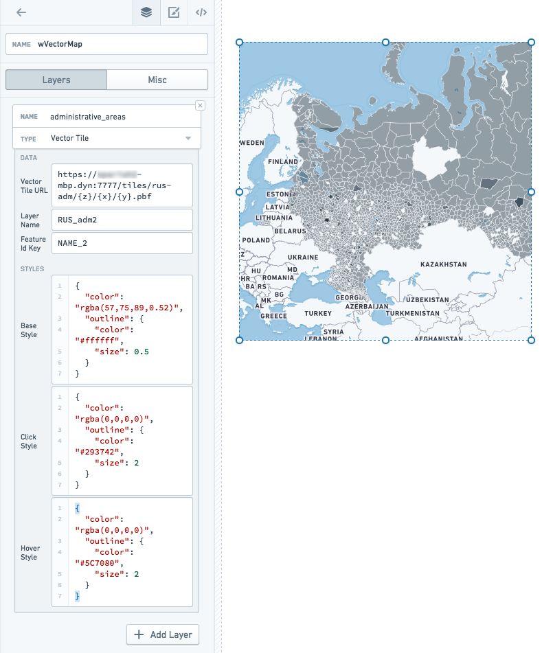

### Heat map layer

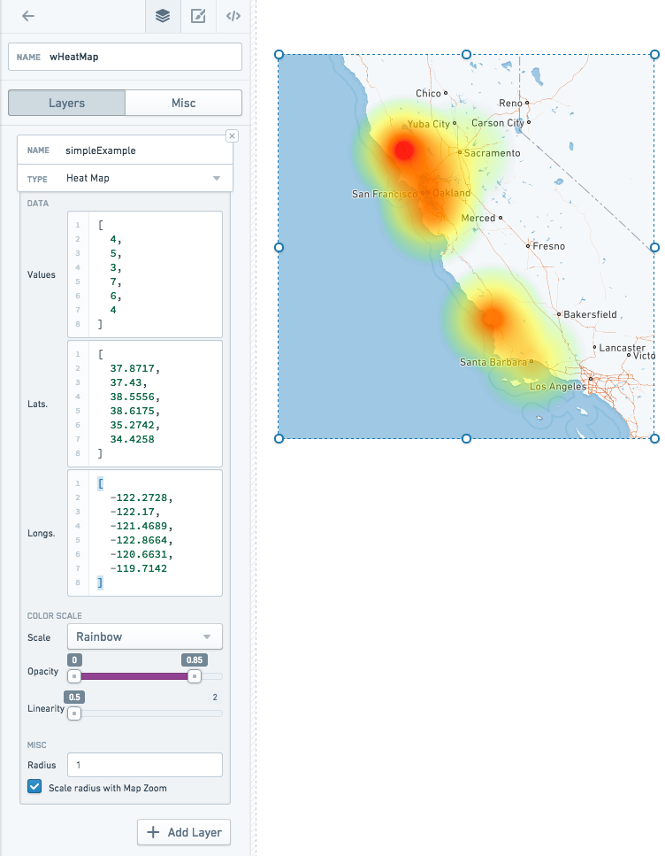

### Properties

|Attribute |Description |Type |Required |Changed By |
|--- |--- |--- |--- |--- |
|autoZoom |Specifies if the map will automatically zoom based on data in the map. |boolean |Yes |Direct Edit |
|bounds |Visible area based on users zooming and panning. See IBounds below. |IBounds |Yes |User Interaction or Direct Edit |
|crs |Coordinate reference system to use: EPSG3395 (Elliptical Mercator projection), EPSG3857 (Spherical Mercator projection) or EPSG4326 (Equirectangular projection). |string |No |Direct Edit |
|fixedBoundsEnabled |Specifies if the bounds of the map can be changed by zooming and dragging. |boolean |No |Direct Edit |
|zoomControlEnabled |Specifies whether the map will have a clickable zoom control displayed in the top left corner. |boolean |No |Direct Edit |
|layerSelectorEnabled |Specifies whether the map will have the layer control menu displayed in the top right corner. |boolean |No |Direct Edit |
|layers |See ILayerModel. |ILayerModel\[] |No |Direct Edit |
|maxBounds |Maximum visible area based available to users when zooming/panning. |IBounds |No |Direct Edit |
|minMaxZoomLevel |Sets the allowed range of zoom of the map. Zoom levels range from 0, representing the entire earth, to 18, about the scale of individual houses. |number |No |Direct Edit |
|zoomLevel |The current zoom level of the map. |number |Yes |User Interaction |
|selection |The selection object, which contains the selection shapes and selected IDs. |IMapSelection |Yes |User Interaction |
|tileLayerEnabled |Specifies whether the tile layer (e.g. Street Map) is enabled. |boolean |Yes |Direct Edit |
|tileUrlsEnabled |Enables the use of custom tile URLs for the tile layer. You must input the tile layer URLs and, optionally, their labels below. You must enable tile layers (above) for any custom tile layer to show. If you enable the tile layer selector, the tile URLs will be added to the selector. |boolean |Yes |Direct Edit |
|tileLayer |The base tile layer(s). |string |Yes |Direct Edit |
|tileUrlLabels |A JSON array of names for each of your custom tile layer URLs. If you provide no labels, default names such as “Custom”, “Custom (1)”, etc. will be used. |string |No |Direct Edit |
|tileUrls |A JSON array of custom tile layer URLs. Tile layer URLs should be in the standard form of “http:/{s}.example.com/blah/{z}/{x}/{y}.png”. Where {s} is an optional subdomain, {z} is the zoom level, and {x} and {y} are tile coordinates. This template URL will be used by the map to look up each tile image. |string |No |Direct Edit |
|shapeSelectionEnabled |Enables drag selection controls on the map. Hold down CMD or CTRL to use additive selection.Drag selection supports two modes: Area selection will create a persistent shape and will be available on the template as an array named selection.areas. Data selection further allows the user to directly select location markers, updating the value of selection.ids. |boolean |Yes |Direct Edit |
|selectionType |The mode of selection. Area selection will create a persistent shape and will be available on the template as an array named selection.areas. Data selection further allows the user to directly select location markers, updating the value of selection.ids. |string |No |Direct Edit |

#### IBaseLayerOptions

|Attribute |Description |Type |Required |Changed By |
|--- |--- |--- |--- |--- |
|name |The name of the layer to be displayed in the layer selector. Location and shape layers will default to CSS selectors if no name is provided. Raven layers provide their own names, so using this field will override all of the layer names provided by this Raven layer. |string |No |Direct Edit |

#### IBounds

|Attribute |Description |Type |Required |Changed By |
|--- |--- |--- |--- |--- |
|northEast |The northeast point of a rectangle map area. |ILatLng |Yes |User Interaction or Direct Edit |
|southWest |The southwest point of a rectangle map area. |ILatLng |Yes |User Interaction or Direct Edit |

#### IChoroplethLayerOptions

|Attribute |Description |Type |Required |Changed By |
|--- |--- |--- |--- |--- |
|colorScaleOptions |If present, will use the specified custom color scale to color the elements in the choropleth. |IColorScaleOptions |No |Direct Edit |
|ids |The data values that map back to the “ids” in the geoJson file. Also, the IDs returned by selection.ids based on user selection. |string\[] |Yes |Direct Edit |
|layerSource |The type of data that will be used to render features. The source can be either a GeoJSON file or a server that serves vector tiles. |string |Yes |Direct Edit |
|shapeGeoJson |The raw GeoJSON for the layer. Recommended value is a templatized function or query that returns a valid [GeoJSON ↗](https://geojson.org/) object. This value should only be set when “Shape Source” is set to “Raw”. |any |No |Direct Edit |
|shapeSource |Indicates how the shape GeoJSON is retrieved. Use “Server Resource” to point to a static GeoJSON shapefileon the Slate server. Use “Raw” to specify the GeoJSON directly. Due to Slate application size limitations, large GeoJSONs should be retrieved as a “Server Resource” or from a query. |any |No |Direct Edit |
|shapeUrl |The URL for the shape file. Example: “resources/map/us-states.geojson”. This value should only be set when “Shape Source” is set to “Server Resource”. |string |No |Direct Edit |
|values |The values of the data points. |number\[] |Yes |Direct Edit |
|vectorTileOptions |The options for configuring a vector tile layer. Only available if layerSource is set to “Vector Tile" |IVectorTileOptions |Yes |Direct Edit |

#### IColorScaleOptions

|Attribute |Description |Type |Required |Changed By |
|--- |--- |--- |--- |--- |
|colorScaleTypes |Color scales represent the values of data using interpolated colors. |string |Yes |Direct Edit |
|colors |An array of two or more colors used to create a linear gradient to color the elements. For example, given elements with values \[0, 25, 100] and a color array of \[“red”, “yellow”, “green”], the resulting colors will be: red, orange, green. Colors can be specified both as hex (e.g. “#FF0000”) or CSS color names (e.g. “red”) |string |Yes |Direct Edit |
|defaultColor |The default color to be used for elements whose value is null. Can be a hex color (e.g. “#FF0000”) or a CSS color name (e.g. “red”) |string |Yes |Direct Edit |
|opacity |The range of opacity for the color scale. A value of 0 is completely transparent, and a value of 1 is completely opaque. |string |Yes |Direct Edit |
|linearity |Adjust the linearity of the color scale. A low “linearity” value will show more color differentiation in the lower end of the scale. A value of 1 is a perfectly linear scale. |string |Yes |Direct Edit |

#### IHeatgridLayerOptions

|Attribute |Description |Type |Required |Changed By |
|--- |--- |--- |--- |--- |
|latitudes |The latitude values of the data points. |number\[] |Yes |Direct Edit |
|longitudes |The longitude values of the data points. |number\[] |Yes |Direct Edit |
|values |The values of the data points. |number\[] |Yes |Direct Edit |
|feature |Specify how to draw each grid cell. |string |No |Direct Edit |
|colorScale |The color scale used to draw the cells of the heat grid. |number |No |Direct Edit |
|granularity |Size of the heatgrid cells. |number |No |Direct Edit |
|opacityRange |The minimum and maximum opacity of the color scale |number\[] |No |Direct Edit |
|colorScaleLinearity |Determines how linear the color scale is. 1.0 is perfectly linear, 0.5 is square root. |number\[] |No |Direct Edit |
|radiusScale |Determines the range of the radius of the circle features. Setting the min/max of the range to the same value means all circles will be the same size. |number\[] |No |Direct Edit |

#### IHeatmapLayerOptions

|Attribute |Description |Type |Required |Changed By |
|--- |--- |--- |--- |--- |
|latitudes |The latitude values of the data points. |number\[] |Yes |Direct Edit |
|longitudes |The longitude values of the data points. |number\[] |Yes |Direct Edit |
|radius |The radius of each data point. When radius is scaled with map zoom, radius is measured in the scale of the map (default value: 2); otherwise radius is measured in pixels (default value: 20). |number |No |Direct Edit |
|scaleRadiusEnabled |Specifies whether the radius of the data points should be scaled according to the zoom level of the map (default value: true). |boolean |No |Direct Edit |
|values |The values of the data points. |number\[] |Yes |Direct Edit |

#### ILatLng

|Attribute |Description |Type |Required |Changed By |
|--- |--- |--- |--- |--- |
|latitude |A latitude value of a point on the map. |number |Yes |User Interaction or Direct Edit |
|longitude |A longitude value of a point on the map. |number |Yes |User Interaction or Direct Edit |

#### ILayerModel

|Attribute |Description |Type |Required |Changed By |
|--- |--- |--- |--- |--- |
|options |The options for a layer. See IChoroplethLayerOptions, IHeatmapLayerOptions, ILocationLayerOptions, IShapeLayerOptions and IRavenLayerOptions for details |IChoroplethLayerOptions | IHeatmapLayerOptions | ILocationLayerOptions | IShapeLayerOptions |Yes |Direct Edit |
|type |The type of the map layer: choropleth, location, heatmap, shape or raven. |string |Yes |Direct Edit |

#### ILocationLayerOptions

|Attribute |Description |Type |Required |Changed By |
|--- |--- |--- |--- |--- |
|clustering |When enabled, will cluster the points on the map. |boolean |Yes |Direct Edit |
|cssClasses |The CSS class names for markers used to overwrite default marker settings via CSS editor. |string\[] |No |Direct Edit |
|ids |The IDs returned by selection.ids based on user selection. |string\[] |Yes |Direct Edit |
|latitudes |The latitude values of the data points. |number\[] |Yes |Direct Edit |
|longitudes |The longitude values of the data points. |number\[] |Yes |Direct Edit |
|weights |The weight of the data points, aggregated for the cluster label (default value: 1). |number\[] |No |Direct Edit |
|markerType |The type of marker, “circle” or “icon”. |string |No |Direct Edit |
|markerRadius |The radius of the circle marker |number |No |Direct Edit |

#### IMapSelection

|Attribute |Description |Type |Required |Changed By |
|--- |--- |--- |--- |--- |
|areas |This array contains the selection shapes that the user creates when drag selection is enabled. The supported shapes are ‘rectangle’ which has latitude/longitude bounds, and ‘circle’ which has a latitude/longitude center and radius (in meters) |Array\<IRectangleShape | ICircleShape> |No |User Interaction |
|ids |This array contains the IDs of location markers that are selected on the map. |string\[] |Yes |User Interaction |

#### IRectangleShape

|Attribute |Description |Type |Required |Changed By |
|--- |--- |--- |--- |--- |
|bounds |The latitude/longitude bounds of the shape. |IBounds |Yes |User Interaction |
|type |The string ‘rectangle' |string |Yes |User Interaction |

#### ICircleShape

|Attribute |Description |Type |Required |Changed By |
|--- |--- |--- |--- |--- |
|bounds |The latitude/longitude bounds of the shape. The bounds is defined as the smallest rectangle that entirely contains the circle. |IBounds |Yes |User Interaction |
|center |The latitude/longitude center of the circle. |ILatLng |Yes |User Interaction |
|radius |The radius (in meters) of the circle. |number |Yes |User Interaction |
|type |The string ‘circle' |string |Yes |User Interaction |

#### IRavenLayerFilterOptions

|Attribute |Description |Type |Required |Changed By |
|--- |--- |--- |--- |--- |
|propertyName |The name of a property to filter on. Example: “City" |string |Yes |Direct Edit |
|propertyValue |The value of a property to filter on. Example: “Medford" |string |Yes |Direct Edit |

#### IRavenLayerOptions

|Attribute |Description |Type |Required |Changed By |
|--- |--- |--- |--- |--- |
|filter |If present, will filter the Raven features based on metadata in Raven |IRavenLayerFilterOptions |No |Direct Edit |
|serverUri |The URI to the Raven server. This domain must also be explicitly allowed in the content security policy for scripts and images in slate.yml. |string |Yes |Direct Edit |

#### IShapeLayerOptions

|Attribute |Description |Type |Required |Changed By |
|--- |--- |--- |--- |--- |
|cssClasses |The CSS class names for geojson shapes and markers used to overwrite default settings via CSS editor. |string\[] |No |Direct Edit |
|ids |The data values that map back to the “ids” in the geoJson file. These are mainly used to assign CSS classes to individual geoJson IDs. |string\[] |Yes |Direct Edit |
|markerType |The type of marker, “circle” or “icon”. |string |No |Direct Edit |
|markerRadius |The radius of the circle marker |number |No |Direct Edit |
|shapeGeoJson |The raw GeoJSON for the layer. Recommended value is a templatized function or query that returns a valid [GeoJSON ↗](https://geojson.org/) object. This value should only be set when “Shape Source” is set to “Raw”. |any |No |Direct Edit |
|shapeSource |Indicates how the shape GeoJSON is retrieved. Use “Server Resource” to point to a static GeoJSON shapefileon the Slate server. Use “Raw” to specify the GeoJSON directly. Due to Slate application size limitations, large GeoJSONs should be retrieved as a “Server Resource” or from a query. |any |No |Direct Edit |
|shapeUrl |The URL for the shape file. Example: “resources/map/us-states.geojson”. This value should only be set when “Shape Source” is set to “Server Resource”. |string |No |Direct Edit |

#### IVectorTileLayerOptions

|Attribute |Description |Type |Required |Changed By |
|--- |--- |--- |--- |--- |
|baseStyle |Options for styling the vector tile features. |IVectorTileStyleOptions |No |Direct Edit |
|clickStyle |Options for styling the vector tile features when selected. |IVectorTileStyleOptions |No |Direct Edit |
|hoverStyle |Options for styling the vector tile features when hovered. |IVectorTileStyleOptions |No |Direct Edit |
|vectorTileOptions |Options for configuring the vector tile server |IVectorTileOptions |Yes |Direct Edit |

#### IVectorTileOptions

|Attribute |Description |Type |Required |Changed By |
|--- |--- |--- |--- |--- |
|featureIdKey |The name of property on the features to be used as the id. Must be unique. Defaults to the string “id”. |string |No |Direct Edit |
|layerName |String name of the layer returned by the server. Vector Tile Servers can serve many layers per tile, so this is used to pick which of those layers to render. |string |Yes |Direct Edit |
|vectorTileUrl |The URL for the vector tile server that serves the tiles to be displayed. Tile should be retrieved by their x, y, and zoom (z) coordinates, so urls should contain {x}, {y}, and {z} as part of their structure. |string |Yes |Direct Edit |
|featureIdWhitelist |List of strings or regular expressions for filtering tile features. If this is a non-empty array, features whose featureIdKey does not match any of the strings or regular expressions will not be shown. |string\[] |No |Direct Edit |

#### IVectorTileStyleOptions

|Attribute |Description |Type |Required |Changed By |
|--- |--- |--- |--- |--- |
|color |CSS string representing the color to style the feature. Works on all feature types. Also used for outline color in the “outline” object. |string |No |Direct Edit |
|outline |JSON object representing the styles for the outline of a polygon feature. Accepts “color” and “size” attributes |object |No |Direct Edit |
|radius |Size of the radius for point features. |number |No |Direct Edit |
|size |Line thickness of a line feature. Also used for outline thickness in the “outline” object. |number |No |Direct Edit |

***

## Table

The following tables offer usage details about the properties available to Table widgets. Several examples follow the tables.

### Properties

|Attribute |Description |Type |Required |Changed By |
|--- |--- |--- |--- |--- |
|bodyTooltip |The text displayed in the table body tooltips. If bodyTooltip is omitted or null then no tooltip will be displayed. Supports HTML. |string |No |Direct Edit |
|columnData |Data to display in the table. This is commonly just the query associated with the table. See examples below. |{columnId: any\[]} (Note: the columnId is a string) |Yes |Direct Edit |
|columnOptions |Options that will be applied to specific columns. See IColumnOption below. |{columnId: IColumnOption} (Note: the columnId is a string) |Yes |Direct Edit |
|columnOrder |Indicates the order and subset of columns to be displayed. This should be an array of “columnId”s from columnData. If left as a blank array, the order may be non-deterministic. When column drag reordering is enabled, this value is updated based on user interactions. |string\[] |Yes |Direct Edit or User Interaction |
|gridOptions |See IGridOptions below. |IGridOptions |Yes |Direct Edit |
|selectedRowKeys |The selectedIdentityColumnId value for all user selected rows(s). |any\[] |Yes |User Interaction |
|selectionIdentityColumnId |The columnId from columnData used to determine the unique identity, or key, of a row. For a given row, the value in the “selectionIdentityColumnId” column provides the unique key. When a row is selected, the unique key is placed in “selectedRowKeys”. |string |No |Direct Edit |
|serverEnabled |Enables server-side paging and sorting. This is set to false by default. If left as false, table sorting and paging is performed client-side, resulting in fewer calls to the server and faster performance. However, because this requires all data to be loaded upfront, tables with client-side sorting require more memory. If set to true, the query must use the paging and/or sorting options to modify the returned query results. For example, if pageSize is 10, at most 10 rows can be returned. |boolean |Yes |Direct Edit |
|tooltipPosition |Specifies the position where tooltips will be rendered. |Blueprint.Position |No |Direct Edit |
|tooltipsEnabled |Specifies whether tooltips are enabled or not. |boolean |Yes |Direct Edit |
|headerTooltip |The text displayed in the column header tooltips. If headerTooltip is omitted or null then no tooltip will be displayed. Supports HTML. |string |No |Direct Edit |
|transpose |Indicates if the table’s rows and columns should be transposed. |boolean |No |Direct Edit |
|clickEvents |A list of names of click events exposed by this table widget. |boolean |Yes |Direct Edit |

#### IColumnOption

|Attribute |Description |Type |Required |Changed By |
|--- |--- |--- |--- |--- |
|horizontalAlignment |Horizontal alignment for the row: left, center, or right. |string |No |Direct Edit |
|name |The display name for the column. |string |No |Direct Edit |
|width |Override for the column width. |number |No |Direct Edit |

#### IGridOptions

|Attribute |Description |Type |Required |Changed By |
|--- |--- |--- |--- |--- |
|enableSelection |Indicates if the user can select rows on the table. |boolean |No |Direct Edit |
|enableSorting |Indicates if the user can sort the data in the table. (Values for sortOptions should also be set.) |boolean |No |Direct Edit |
|enableColumnReordering |Indicates if the user can reorder columns by dragging them. When enabled, checkbox columns remain fixed and cannot be reordered. |boolean |No |Direct Edit |
|pagingOptions |See ITablePagingOptions below. |ITablePagingOptions |No |Direct Edit |
|selectionOptions |See ISelectionOptions below (enableSelection must also be set to true). |ISelectionOptions |No |Direct Edit |
|sortOptions |See ISortOptions below (enableSorting must also be set to true). |ISortOptions |No |User Interaction |

#### ISelectionOptions

|Attribute |Description |Type |Required |Changed By |
|--- |--- |--- |--- |--- |
|checkbox |Indicates if a checkbox column should be displayed as a visual cue for row selection. |boolean |No |Direct Edit |
|multiSelect |Indicates if multiple rows can be selected. |boolean |No |Direct Edit |
|selectionRequired |Specifies whether you can deselect all values. When enabled, this flag prevents the user from deselecting the final selected value in the widget. If the widget starts off with no values selected, prevents deselecting only after the user makes an initial selection. |boolean |No |Direct Edit |

#### ISortOptions

|Attribute |Description |Type |Required |Changed By |
|--- |--- |--- |--- |--- |
|columnId |The data field by which the table is currently sorted. |string |Yes |User Interaction |
|isAscending |The direction of the current sort. |boolean |Yes |User Interaction |

#### ITableHover

|Attribute |Description |Type |Required |Changed By |
|--- |--- |--- |--- |--- |
|columnIndex |The column number of the hovered cell. Enumeration begins at 0. |number |Yes |User Interaction |
|displayValue |The display value of the hovered cell. |string |Yes |User Interaction |
|isHeader |Specifies whether the current cell is a header or not. |string |Yes |User Interaction |

#### ITablePagingOptions

|Attribute |Description |Type |Required |Changed By |
|--- |--- |--- |--- |--- |
|currentOffset |Current visible page (indexed from 0). |number |Yes |User Interaction |
|pageSize |Results displayed per page. |number |Yes |Direct Edit |
|totalServerItems |Total number of results available (used to calculate number of pages necessary). |number |No |Direct Edit |

### Examples

#### Dynamic Table

```json
{
  "columnData": "{{query1}}",
  "columnOptions": {
    "id": {
      "name": "ID",
      "width": 50
    },
    "name": {
      "name": "Full Name"
    },
    "address": {
      "name": "Home Address"
    },
    "phone_number": {
      "name": "Phone Number"
    },
    "score": {
      "name": "Score",
      "horizontalAlignment": "right"
    }
  },
  "columnOrder": [
    "id",
    "name",
    "address",
    "phone_number",
    "score"
  ],
  "gridOptions": {
    "enableSelection": true,
    "enableSorting": true,
    "pagingOptions": {
      "currentOffset": 0,
      "pageSize": 10,
      "totalServerItems": 100
    },
    "selectionOptions": {
      "checkbox": false,
      "multiSelect": true
    },
    "sortOptions": {
      "columnId": "score",
      "isAscending": false
    }
  },
  "selectedRowKeys": [],
  "selectionIdentityColumnId": "id",
  "serverEnabled": true,
  "tooltipsEnabled": false
}
```

#### Static Table

```json
{
  "columnData": {
    "staticOptions": [
      "option1",
      "option2",
      "option3"
    ]
  },
  "columnOptions": {},
  "columnOrder": [],
  "gridOptions": {
    "enableSelection": true,
    "selectionOptions": {
      "checkbox": true,
      "multiSelect": false
    }
  },
  "selectedRowKeys": [],
  "selectionIdentityColumnId": "staticOptions",
  "serverEnabled": false,
  "tooltipsEnabled": false
}
```

### Defaults

```json
{
  "columnOptions": {},
  "columnOrder": [],
  "gridOptions": {},
  "selectedRowKeys": [],
  "selectionIdentityColumnId": "Metric",
  "serverEnabled": false,
  "tooltipsEnabled": false
}
```

### Tutorial: Add a table widget

Say that you want to add a Table widget to display flight data. Select the **Widget** button in the upper left corner, then choose **Visualization > Table** to add a Table widget to your Slate application.

Rename the Table widget to something easier to identify. Select the name of the widget in the property editor and change it to `w_flightTable`.

Configure the table to use a `q_allFlights` query by entering `"{{q_allFlights}}"` in the **Data** field. You should see the table populate with data.

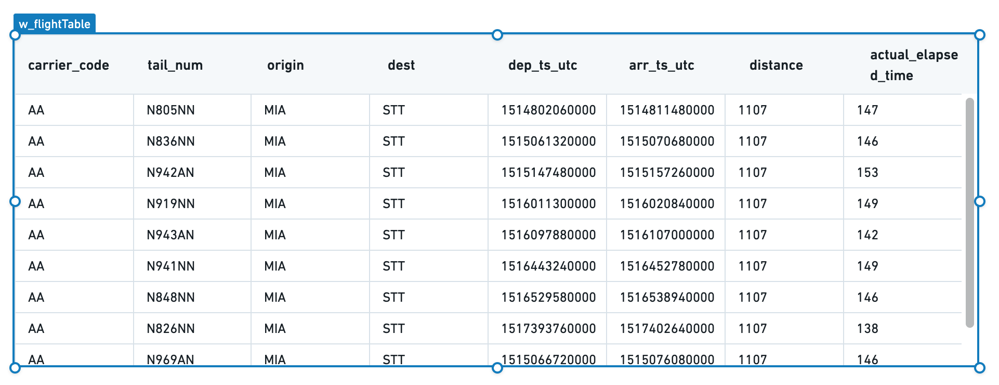

Note that `"{{q_allFlights}}"` is not pure JSON syntax. The brackets are Handlebars syntax, where each expression is represented as {{expression}}. See [Handlebars](/docs/foundry/slate/concepts-handlebars/) to learn more about its use in Slate.)

Your table now has the correct data, but the formatting could be improved. Select **Add all columns** to view formatting options for each column in the underlying data.

Since the `flight_id` column is not a human-readable column, hide that column for now. However, we will keep it in the table to refer to later when configuring the ability to select one or more rows.

For the rest of the columns, choose a display name as **Title** and add a format string to clean up the timestamps using formatting strings from [MomentJS ↗](https://momentjs.com/#format).

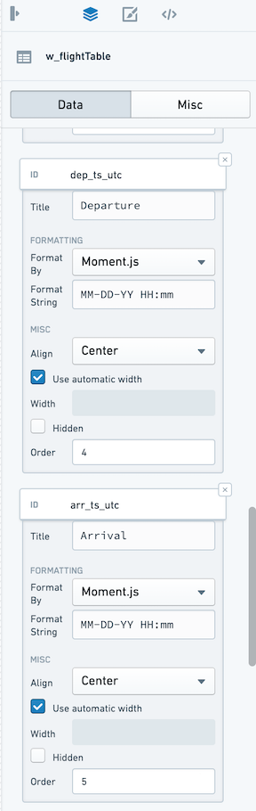

We now have a table that cleanly displays all of the data:

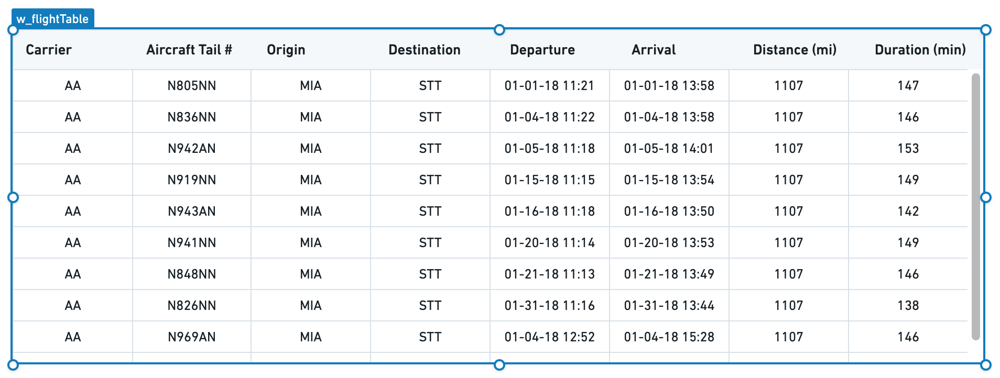

Next, set how a user can interact with the table through selection and sorting.

Switch to the **Misc** tab in the property editor, and check **Allow Selection** and **Enable Sorting**. A user can now select columns directly to see the table sorted in different ways and can click a specific row to select it.

Finally, decide what to use as the unique identifier for a given row in your table. In this case, use the name of the flight. In the dropdown labeled **Key column ID**, select **flight\_id**.

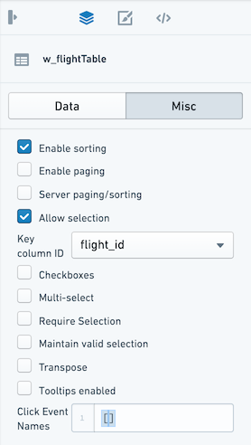

:::callout{theme="neutral"}
If the **Server Paging/Sorting** option is unchecked, the table will only sort and page the data that already loaded, which in our example so far is only the first 10 rows of the table. In Slate, you can reliably load 5-10k rows into browser memory, but this will be constrained by the resources available to the browser tab for your user.

In most situations, it is best practice to configure server-side paging and sorting. Since there are approximately 75k flights in the `last-mile-flights` table and several million flights in the underlying `flights` table, it is not feasible to return all the results client-side at the same time.
:::

#### Configure paging and sorting

Check the box for **Enable Paging** and **Server Paging/Sorting**. Choose a number for `Page Size` to set the number of rows to display to the user at a single time.

With these options enabled, your table will now keep track of the current page; we can use this information in our query to bring back just the relevant rows to display.

Open the query editor and return to `q_allFlights`. We will now update the `LIMIT` statement to reflect the page size configured in the table and add an `OFFSET` statement to ask Postgres to give us the correct page of results.

Use the same Handlebars syntax that we used to include data from our query into the Table widget to reference the Table widget state from inside our query:

```sql
SELECT
    flight_id,
    carrier_code,
    tail_num,
    origin,
    dest,
    dep_ts_utc,
    arr_ts_utc,
    distance,
    actual_elapsed_time
FROM "foundry_sync"."{{v_flightTable}}"
LIMIT {{w_flightTable.gridOptions.pagingOptions.pageSize}}
OFFSET {{w_flightTable.gridOptions.pagingOptions.currentOffset}}
```

Now, your table displays 20 rows at a time and you can select the next buttons or jump to a specific page. Now, let the table widget know the total number of rows so it can correctly display the "total entries".

To do this, create a new query called `q_flightCount` and count the number of rows:

```sql
SELECT
    COUNT(flight_id) as num_flights
FROM "foundry_sync"."{{v_flightTable}}"
```

Select **Update** to save the query and return to the table widget **Misc** tab. In the `Server Total` input, use Handlebars to reference the count in our query:

```
{{q_flightCount.num_flights.[0]}}
```

Now, our table knows that we are showing a particular set of rows out of the total entries (either 4.2M for the `flights` dataset or 73,946 for `last-mile-flights`).

This takes care of the paging and will let us iterate through large datasets without weighing down user browsers or timing out our queries. We still must turn on the server-side sorting so that our query responds to the user's interaction with the table.

Return to `q_allFlights` and add an `ORDER BY` clause to our query. Just as you referred to the `pagingOptions.pageSize` and `pagingOptions.currentOffset`, refer to the `.sortOptions.columnId` and `.sortOptions.isAscending` to create the right SQL statement:

```sql
ORDER BY {{w_flightTable.gridOptions.sortOptions.columnId}}
    {{#if w_flightTable.gridOptions.sortOptions.isAscending}}
        ASC
    {{else}}
        DESC
    {{/if}}
```

You should see a newly available conditional Handlebars block statement. This statement allows you to inject logic into text interpolation. In this case, we can choose either `ASC` or `DESC` based on the user's selection in the table.

:::callout{theme="warning"}
Though Handlebars are easy to use to inject simple logic into your Slate application, we generally recommend using functions to add more complex logic to large applications.
:::

Now, your full query should look like this:

```sql
SELECT
    flight_id,
    carrier_code,
    tail_num,
    origin,
    dest,
    dep_ts_utc,
    arr_ts_utc,
    distance,
    actual_elapsed_time
FROM "foundry_sync"."{{v_flightTable}}"
ORDER BY {{w_flightTable.gridOptions.sortOptions.columnId}}
    {{#if w_flightTable.gridOptions.sortOptions.isAscending}}
        ASC
    {{else}}
        DESC
    {{/if}}
LIMIT {{w_flightTable.gridOptions.pagingOptions.pageSize}}
OFFSET {{w_flightTable.gridOptions.pagingOptions.currentOffset}}
```

Give the table a title that explains the information it displays at a glance.

Select the **Widget** button, select a plain **Text** widget from the options.

Fill in the Text widget with the title of the table: `All Flights` or `Last Mile Flights` as appropriate.

Move the Text widget to sit at the top left corner of the table, using the gridlines to ensure everything is aligned.

Now, properly line up the table beneath the title and subtitle. Select both the table and its title by holding the `Cmd` key and selecting (or drag-selecting) both widgets, then move both widgets so they are properly aligned under the application title.

Your application should now look like the following, with the finished Table widget. Notice that you can now select a row and sort the table.

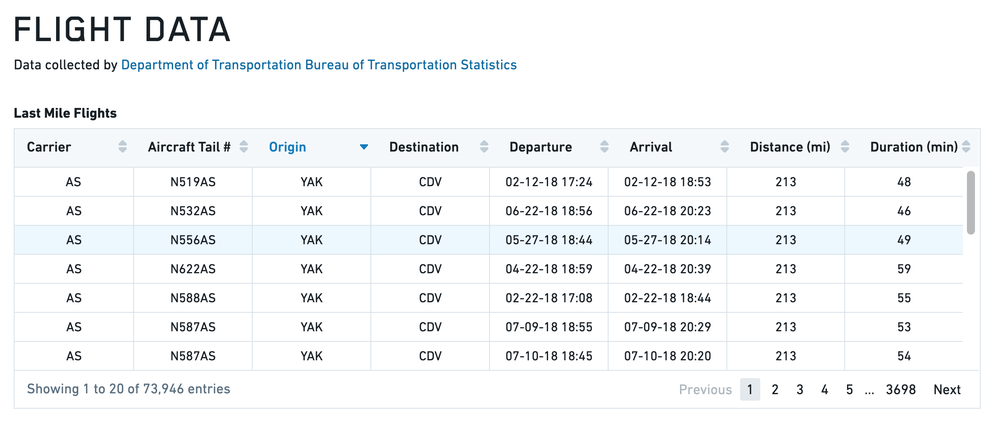

***

## Toast

The following tables offer usage details about the properties available to Toast widgets. Several examples follow the tables.

### Properties

|Attribute |Description |Type |Required |Changed By |
|--- |--- |--- |--- |--- |
|actionText |The text to display in action button |string |Yes |Direct Edit |
|hasAction |Specifies whether the toast has an action button. |boolean |Yes |Direct Edit |
|intent |Visual intent color of the toast. |string |Yes |Direct Edit |
|message |The message of the toast. |string |Yes |Direct Edit |
|timeout |Milliseconds to wait before toast is automatically dismissed. Providing a value <= 0 will disable the timeout. |number |Yes |Direct Edit |

#### Actions

|Action Name |Description |
|--- |--- |
|close |Triggering this action causes toast to close. |
|open |Triggering this action causes toast to open. |

#### Events

|Event Name |Description |
|--- |--- |
|didClose |This event is fired when toast has fully closed. |
|didOpen |This event is fired when toast has fully opened. |
|click |This event is fired when toast action button is clicked. |

### Examples

#### Toast

```json
{
  "actionText": "Toast Example",
  "hasAction": false,
  "intent": -1,
  "message": "Toast Message",
  "timeout": 600
}
```

### Defaults

```json
{
  "actionText": "Action!",
  "hasAction": false,
  "intent": -1,
  "message": "Message",
  "timeout": 3000
}
```

***

## Tree

The following tables offer usage details about the properties available to Tree widgets.

### Properties

|Attribute |Description |Type |Required |Changed By |
|--- |--- |--- |--- |--- |
|contents |Contains the hierarchy of the data in JSON, using the structure from Blueprint’s `ITreeNode` component. |json |Yes |Direct Edit |
|selected |The IDs of the nodes that are selected |json |Yes |Direct Edit |
|selectionType |Determines the type of selection - ‘none,’ ‘single’ or ‘multiple.' |string |Yes |Direct Edit |

### Defaults

```json
{
  "contents": [
                {
                  "childNodes": [
                      {id: 3, label: "bar 1"},
                      {id: 4, label: "bar 2"}
                  ],
                  "iconName": "folder-close",
                  "id": 1,
                  "label": "bars",
                },
                {
                  "id": 2,
                  "label": "foo"
                }
              ],
  "searchText": "",
  "selectedNodes": [],
  "selectionType": SelectionType.SINGLE
}
```
